#  نصب و راه‌اندازی اولیه FortiGate


# فهرست مطالب

* معرفی لابراتوار
* سناریوی پروژه
* اهداف آموزشی
* پیش‌نیازها
* معرفی تجهیزات
* توپولوژی
* ساختار شبکه
* برنامه آدرس‌دهی (IP Plan)
* قوانین این لابراتوار
* تسک اول - بررسی و آماده‌سازی محیط
* تسک دوم  - اولین Boot دستگاه
* و ... 


# معرفی لابراتوار

این اولین لابراتوار مجموعه **FortiGate Enterprise Security Labs** است.

هدف این مجموعه صرفاً آموزش دستورات FortiGate یا آمادگی برای آزمون NSE4 نیست، بلکه طراحی، پیاده‌سازی، مستندسازی و عیب‌یابی یک شبکه واقعی سازمانی است.

تمام سناریوهای بعدی بر پایه همین لابراتوار ساخته خواهند شد؛ بنابراین هر تنظیمی که در این مرحله انجام می‌شود باید کاملاً اصولی، مستند و قابل توسعه باشد.

در پایان این لابراتوار، FortiGate آماده خواهد بود تا در سناریوهای بعدی نقش فایروال اصلی شرکت را بر عهده بگیرد.


# سناریوی پروژه

شرکت فرضی **FESL Company** به‌تازگی دفتر مرکزی (Head Office) خود را راه‌اندازی کرده است.

مدیریت شرکت تصمیم گرفته است برای افزایش امنیت، کنترل دسترسی کاربران، انتشار سرویس‌ها، ایجاد VPN و مدیریت ارتباطات شبکه از FortiGate استفاده کند.

در حال حاضر زیرساخت شرکت هنوز کامل نیست و فقط تجهیزات اولیه آماده شده‌اند.

وظیفه ما این است که از صفر، این زیرساخت را طراحی و پیاده‌سازی کنیم.

در این لابراتوار فقط زیرساخت اولیه آماده می‌شود.

در لابراتوارهای بعدی به ترتیب سرویس‌های مختلف به شبکه اضافه خواهند شد.


# اهداف آموزشی

پس از پایان این لابراتوار باید بتوانید:

* ساختار کلی پروژه را درک کنید.
* توپولوژی اولیه شبکه را بشناسید.
* فورتی گیت را برای اولین بار راه‌اندازی کنید.
* با محیط GUI و CLI آشنا شوید.
* وضعیت اولیه سیستم را بررسی کنید.
* اولین نسخه Backup از تنظیمات تهیه کنید.
* اولین Snapshot از ماشین مجازی ایجاد کنید.
* برای ادامه پروژه یک بستر پایدار آماده کنید.


# پیش‌نیازها

قبل از شروع این لابراتوار باید موارد زیر آماده باشند.

## نرم‌افزارها

* VMware Workstation 17
* EVE-NG Community 6.2.0
* FortiGate VM 6.4.1

## ماشین‌های مجازی

* FortiGate VM
* Windows Server
* Windows Client
* Ubuntu Server
* Kali Linux

## دسترسی‌ها

* اینترنت از طریق VMware NAT
* دسترسی به Console دستگاه‌ها


# معرفی تجهیزات

| تجهیز          | نام         |
| -------------- | ----------- |
| FortiGate      | FGT-HQ-01   |
| Windows Server | SRV-DC-01   |
| Windows Client | PC-01       |
| Ubuntu Server  | SRV-WEB-01  |
| Kali Linux     | SEC-KALI-01 |


# توپولوژی اولیه

```text
                    Internet
                        │
                  VMware NAT
                        │
                     Cloud
                        │
                        │
                       Port1
                        │
                    FortiGate
                        │
                      Port2
                        │     
                        Switch
                          ├──── Windows Server
                          └──── Windows Client
```


# ساختار شبکه

در طول این پروژه از شبکه‌های مجزا برای هر بخش استفاده خواهیم کرد.

| شبکه   | کاربرد                  |
| ------ | ----------------------- |
| WAN    | اتصال به اینترنت        |
| LAN    | کاربران داخلی           |
| SERVER | سرورها                  |
| DMZ    | سرویس‌های عمومی         |
| GUEST  | کاربران مهمان           |
| VPN    | کاربران راه دور         |
| HA     | ارتباط بین دو FortiGate |

در این لابراتوار فقط شبکه WAN و LAN مورد استفاده قرار می‌گیرند.


# برنامه آدرس‌دهی

در این پروژه، شبکه‌های داخلی FortiGate از محدوده 10.10.x.x استفاده می‌کنند تا با شبکه VMware (192.168.253.0/24) تداخلی ایجاد نشود.

| Network | Subnet        | Gateway    |
| ------- | ------------- | ---------- |
| LAN     | 10.10.10.0/24 | 10.10.10.1 |
| SERVER  | 10.10.20.0/24 | 10.10.20.1 |
| DMZ     | 10.10.30.0/24 | 10.10.30.1 |
| GUEST   | 10.10.40.0/24 | 10.10.40.1 |
| VPN     | 10.10.50.0/24 | Dynamic    |
| HA      | 10.10.99.0/30 | HA Only    |

> **توضیح:** آدرس‌های فعلی Ubuntu و Kali (192.168.253.x) تغییر نمی‌کنند. این شبکه به عنوان شبکه مدیریت VMware باقی می‌ماند و از طریق Cloud به سناریو متصل خواهد شد.


# قوانین این لابراتوار

برای حفظ کیفیت پروژه، قوانین زیر در تمام سناریوها رعایت می‌شوند:

* هیچ Wizardی استفاده نمی‌شود مگر اینکه هدف آموزش همان Wizard باشد.
* تمام تنظیمات GUI معادل CLI نیز خواهند داشت.
* بعد از هر تغییر، نتیجه بررسی (Verification) انجام می‌شود.
* در پایان هر Task، نکات عیب‌یابی و بهترین روش‌ها بررسی می‌شوند.
* قبل از هر تغییر مهم، Backup و Snapshot تهیه می‌شود.


# تسک 1 - بررسی و آماده‌سازی محیط

## هدف

قبل از انجام هرگونه تنظیم، باید مطمئن شویم که محیط آزمایش آماده است و همه ماشین‌های مجازی بدون خطا اجرا می‌شوند.

در محیط‌های واقعی نیز مهندس شبکه قبل از تغییر پیکربندی، وضعیت تجهیزات را بررسی می‌کند.


## مراحل اجرا

* روشن بودن FortiGate
* روشن بودن Windows Server
* روشن بودن Windows Client
* اتصال صحیح Cloud به FortiGate
* اتصال Switch به Port2
* اطمینان از Boot کامل FortiGate


## بررسی اولیه

در Console دستگاه، وارد CLI شوید.

هیچ تنظیمی انجام ندهید.

فقط وضعیت سیستم را بررسی کنید.

دستورات:

```bash
get system status
```

```bash
get system interface
```

```bash
get router info routing-table all
```

```bash
show system interface
```
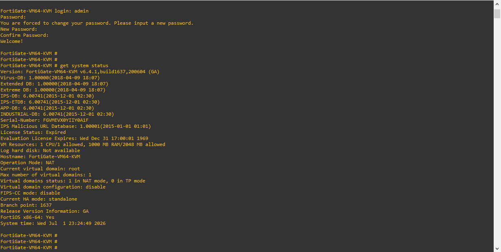


## چرا این کار مهم است؟

بسیاری از مهندسان تازه‌کار مستقیماً شروع به تغییر تنظیمات می‌کنند.

در محیط واقعی، اولین قدم همیشه شناخت وضعیت فعلی دستگاه است.

با استفاده از این دستورات می‌توان:

* نسخه سیستم‌عامل را بررسی کرد.
* وضعیت HA را مشاهده کرد.
* اینترفیس‌ها را شناخت.
* مسیرهای موجود را بررسی کرد.
* پیکربندی اولیه را مستند کرد.

این اطلاعات در زمان عیب‌یابی بسیار ارزشمند هستند.


## نتیجه مورد انتظار

در پایان این Task باید:

* فورتی گین بدون خطا Boot شده باشد.
*   کنسول CLI در دسترس باشد.
* خروجی دستورات بدون خطا نمایش داده شود.

<br><br>
<br><br>

# تسک  2 - اولین ورود به FortiGate و انجام تنظیمات اولیه


# هدف

در این بخش برای اولین بار وارد FortiGate می‌شویم و تنظیمات اولیه سیستم را انجام می‌دهیم.

این تنظیمات پایه‌ای هستند و تقریباً در تمام پروژه‌های واقعی اولین اقدام پس از نصب FortiGate محسوب می‌شوند.


# مفاهیم

قبل از انجام تنظیمات بهتر است بدانیم هر کدام چه کاربردی دارند.

## Hostname

نام دستگاه در شبکه.

در پروژه‌های واقعی ممکن است ده‌ها FortiGate وجود داشته باشد.

اگر نام مناسبی انتخاب نشود، هنگام مانیتورینگ و عیب‌یابی مشکلات زیادی ایجاد خواهد شد.


## Admin Password

اولین اقدام امنیتی پس از نصب.

هیچ‌گاه نباید FortiGate با رمز پیش‌فرض در شبکه باقی بماند.


## DNS

فورتی گیت برای موارد زیر به DNS نیاز دارد:

* Firmware Update
* FortiGuard
* NTP
* Web Filter
* Antivirus
* IPS
* License Verification

اگر DNS به درستی تنظیم نشود، بسیاری از قابلیت‌های امنیتی به درستی کار نخواهند کرد.


## NTP

زمان صحیح در تجهیزات امنیتی بسیار مهم است.

اگر ساعت دستگاه اشتباه باشد:

* لاگ ها معتبر نخواهند بود.
* ممکن استCertificateها  خطا بدهند.
*  یا VPN دچار مشکل شود.
* تحلیل رخدادها سخت شود.


# ورود به FortiGate

پس از Boot شدن دستگاه، از طریق Console وارد CLI شوید.

در اولین ورود، رمز عبور پیش‌فرض وجود ندارد.


# تغییر Hostname

## CLI

```bash
config system global

set hostname FGT-HQ-01

end
```

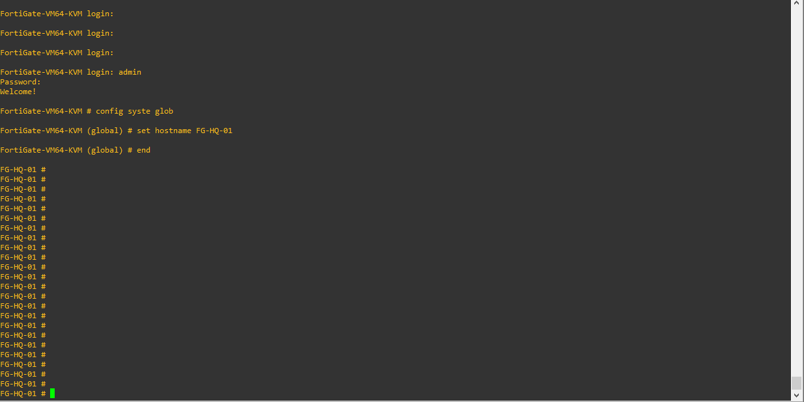

## بررسی

```bash
get system status
```

باید مقدار Hostname به شکل زیر باشد:

```text
Hostname: FGT-HQ-01
```


<br><br>
<br><br>


# تغییر رمز Administrator

## GUI

System

↓

Administrators

↓

admin

↓

Change Password


## CLI

```bash
config system admin

edit admin

set password YourStrongPassword

next

end
```

💡 Best Practice

از رمزهای ساده مانند:

```
123456
```

یا

```
admin
```

استفاده نکنید.

در محیط واقعی بهتر است از رمزهای طولانی همراه با MFA استفاده شود.


📸 Screenshot

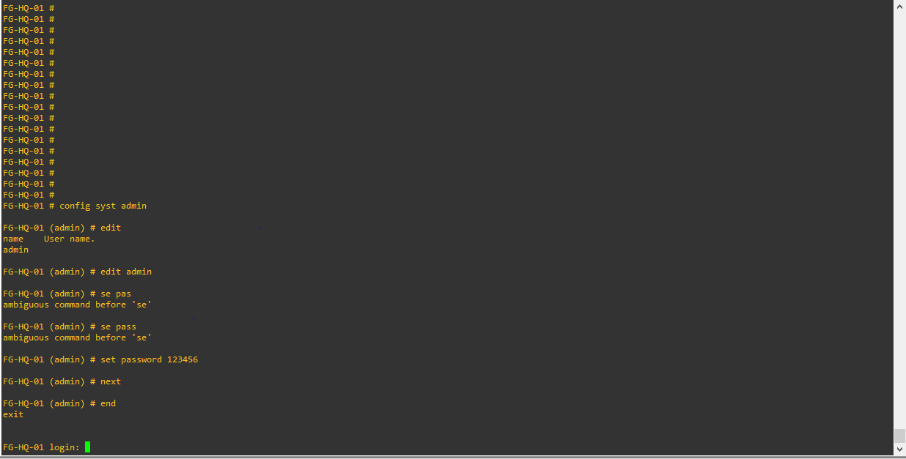


<br><br>

# تنظیم DNS

## DNS پیشنهادی

Primary

```
1.1.1.1
```

Secondary

```
8.8.8.8
```


## CLI

```bash
config system dns

set primary 1.1.1.1

set secondary 8.8.8.8

end
```


## GUI

Network

↓

DNS

↓

Primary DNS

↓

Secondary DNS

---

## بررسی

```bash
show system dns
```

---

📸 Screenshot

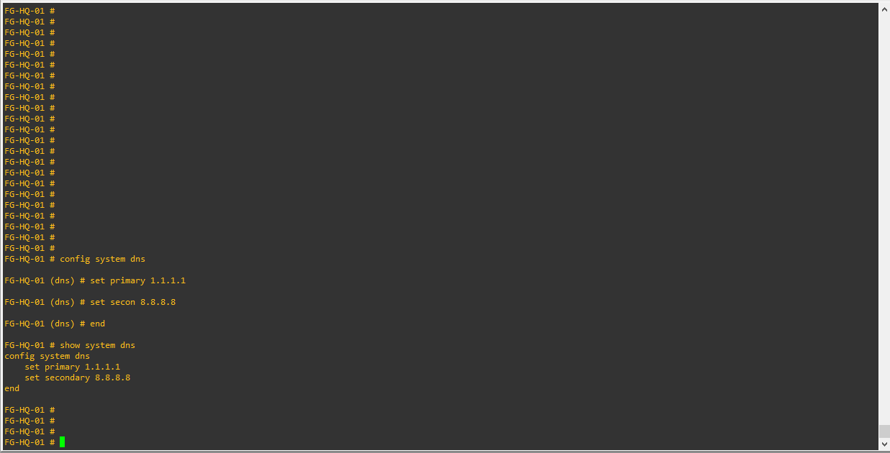

<br><br>
<br><br>

# تنظیم Time Zone

## GUI

System

↓

Settings

↓

Time Zone


برای ایران می‌توانی منطقه زمانی مناسب را انتخاب کنی.

اگر ترجیح می‌دهی ساعت را بر اساس UTC نگه داری (که در بسیاری از سازمان‌ها مرسوم است)، در ادامه پروژه هم همان را حفظ خواهیم کرد. مهم این است که در کل پروژه یک رویه ثابت داشته باشیم.


## CLI


```bash
config system global

set timezone 41

end
```

> **توجه:** شماره Time Zone بسته به نسخه FortiOS ممکن است متفاوت باشد. قبل از اعمال، مقدار مناسب را در GUI بررسی کن.


📸 Screenshot

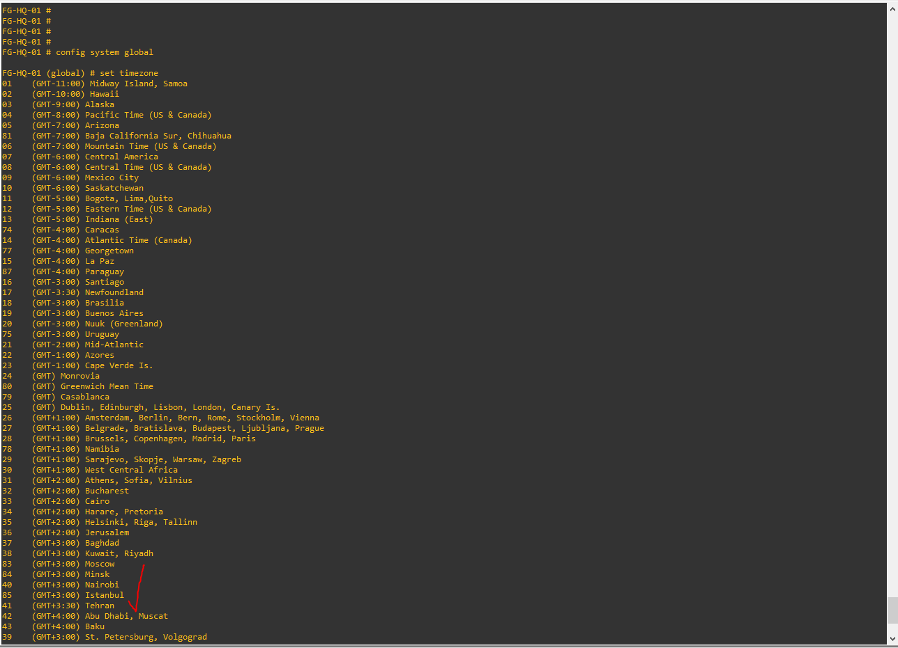


<br><br>
<br><br>

# تنظیم NTP

## GUI

System

↓

Settings

↓

System Time

↓

Synchronize with NTP Server


## NTP Server

```
pool.ntp.org
```


## CLI

```bash
config system ntp

set ntpsync enable

set type custom

config ntpserver

edit 1

set server "pool.ntp.org"

next

end
```

## بررسی

```bash
get system status
```

زمان سیستم باید صحیح نمایش داده شود.


📸 Screenshot

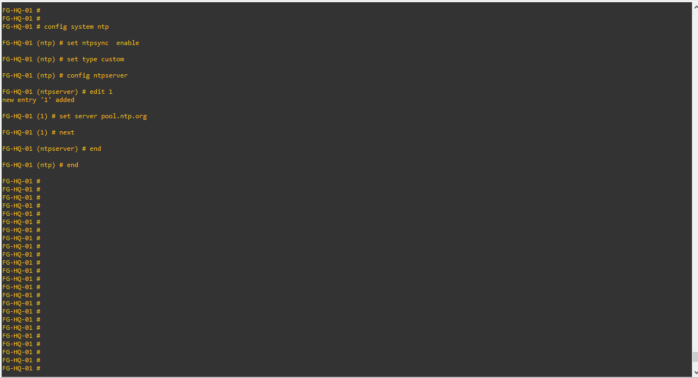


<br><br>
<br><br>


# بررسی نسخه سیستم عامل

دستور:

```bash
get system status
```

موارد زیر را بررسی کنید:

* Version
* Build
* Hostname
* Current Time
* Operation Mode


# Verification

در پایان این Task باید موارد زیر انجام شده باشند:

* Hostname تغییر کرده باشد.
* رمز Administrator تغییر کرده باشد.
* DNS تنظیم شده باشد.
* NTP فعال شده باشد.
* ساعت سیستم صحیح باشد.


# Troubleshooting

## DNS کار نمی‌کند

علائم:

* Firmware Update خطا می‌دهد.
* FortiGuard متصل نمی‌شود.

بررسی:

```bash
show system dns
```


## زمان دستگاه اشتباه است

بررسی:

```bash
diagnose sys ntp status
```

اگر وضعیت همگام‌سازی موفق نبود، ابتدا دسترسی اینترنت و سپس تنظیمات DNS را بررسی کنید.


# نکات آزمون NSE4

* تفاوت DNS محلی با DNS مورد استفاده خود FortiGate را بدانید.
* اهمیت NTP در Logها و VPNها را درک کنید.
* تغییر Hostname در پروژه‌های بزرگ صرفاً یک موضوع ظاهری نیست؛ در مانیتورینگ و مدیریت چندین FortiGate نقش مهمی دارد.


# نکات دنیای واقعی

در بسیاری از سازمان‌ها:

* از DNS داخلی سازمان استفاده می‌شود، نه DNS عمومی.
* و NTP از سرور داخلی دریافت می‌شود.
* دسترسی کاربر `admin` محدود یا غیرفعال شده و برای هر مدیر شبکه حساب جداگانه ایجاد می‌شود.


<br><br>
<br><br>


# تسک 3 - پیکربندی Interface ها، DHCP و Default Route


# هدف

در این بخش اولین ارتباط واقعی بین کاربران و FortiGate ایجاد می‌شود.

در پایان این Task:

*  لینک WAN به اینترنت متصل خواهد شد.
*  لینک LAN به کاربران داخلی سرویس خواهد داد.
* اسکوپ DHCP برای کاربران فعال خواهد شد.
* و Default Route تنظیم می‌شود.
* اولین Ping از FortiGate به اینترنت انجام خواهد شد.

این اولین مرحله‌ای است که FortiGate نقش یک Firewall واقعی را بر عهده می‌گیرد.


# مفاهیم

قبل از شروع تنظیمات بهتر است مفهوم هر بخش را بدانیم.

## WAN Interface

درگاه WAN مسیر ارتباط FortiGate با اینترنت یا ISP است.

در این پروژه، اینترنت از طریق VMware NAT در اختیار FortiGate قرار می‌گیرد.


## LAN Interface

 لینک LAN محل اتصال کاربران داخلی سازمان است.

در تمام سناریوهای بعدی کاربران از طریق این Interface به اینترنت، سرورها و سایر سرویس‌ها دسترسی خواهند داشت.


## DHCP

به جای اینکه روی هر کلاینت IP را به صورت دستی تنظیم کنیم، FortiGate به صورت خودکار IP، Gateway و DNS را در اختیار کاربران قرار می‌دهد.


## Default Route

اگر FortiGate نداند بسته‌ای را به کجا ارسال کند، از Default Route استفاده خواهد کرد.

بدون Default Route هیچ ارتباطی با اینترنت برقرار نخواهد شد.


# سناریوی این مرحله

در این مرحله شرکت هنوز فقط یک ارتباط اینترنتی دارد.

تمام کاربران از طریق Interface LAN به FortiGate متصل می‌شوند و از طریق WAN به اینترنت دسترسی خواهند داشت.


# تنظیم Interface WAN

## GUI

Network

↓

Interfaces

↓

Port1

تنظیمات:

| گزینه           | مقدار |
| --------------- | ----- |
| Alias           | WAN   |
| Role            | WAN   |
| Addressing Mode | DHCP  |

اگر VMware NAT به درستی تنظیم شده باشد، Interface باید به صورت خودکار IP دریافت کند.

---

## CLI

```bash
config system interface

edit port1

set alias "WAN"

set role wan

set mode dhcp

next

end
```

---

## بررسی

```bash
get system interface
```

باید Interface دارای IP معتبر باشد.


📸 Screenshot

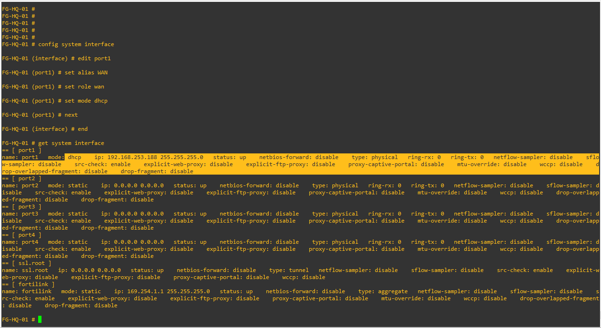

<br><br>

# تنظیم Interface LAN

## GUI

Network

↓

Interfaces

↓

Port2

تنظیمات:

| گزینه                 | مقدار              |
| --------------------- | ------------------ |
| Alias                 | LAN                |
| Role                  | LAN                |
| IP                    | 10.10.10.1/24      |
| Administrative Access | HTTPS - PING - SSH |

فعال بودن Ping برای مراحل عیب‌یابی ضروری است.


## CLI

```bash
config system interface

edit port2

set alias "LAN"

set role lan

set ip 10.10.10.1 255.255.255.0

set allowaccess ping https ssh

next

end
```

---

## بررسی

```bash
show system interface port2
```


📸 Screenshot

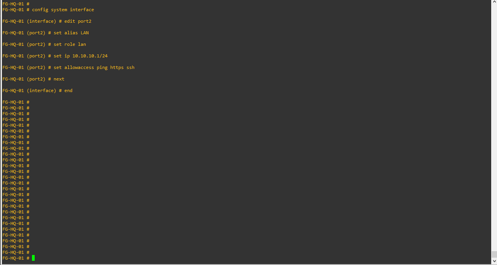

<br><br>

# فعال کردن DHCP روی LAN

## چرا DHCP؟

در محیط‌های واقعی ممکن است صدها کاربر در شبکه وجود داشته باشند.

تنظیم دستی IP علاوه بر زمان‌بر بودن، احتمال خطای انسانی را افزایش می‌دهد.


## تنظیمات

| گزینه       | مقدار              |
| ----------- | ------------------ |
| Interface   | port2              |
| Gateway     | 10.10.10.1         |
| Subnet      | 255.255.255.0      |
| Range Start | 10.10.10.100       |
| Range End   | 10.10.10.200       |
| DNS         | Same as System DNS |

---

## GUI

Network

↓

Interfaces

↓

Port2

↓

Enable DHCP Server

---

## CLI

```bash
config system dhcp server

edit 1

set interface port2

set default-gateway 10.10.10.1

set netmask 255.255.255.0

config ip-range

edit 1

set start-ip 10.10.10.100

set end-ip 10.10.10.200

next

end

next

end
```


## بررسی

```bash
show system dhcp server
```


# تنظیم Default Route

## GUI

Network

↓

Static Routes

↓

Create New

| گزینه       | مقدار                      |
| ----------- | -------------------------- |
| Destination | 0.0.0.0/0                  |
| Gateway     | IP Gateway دریافتی از DHCP |
| Device      | Port1                      |

> **نکته:** اگر Port1 از DHCP استفاده می‌کند، معمولاً Default Route به صورت خودکار ایجاد می‌شود. قبل از ساخت Route جدید، جدول Route را بررسی کنید.


## بررسی Route

```bash
get router info routing-table all
```

یا

```bash
get router info routing-table details
```

اگر Route پیش‌فرض وجود نداشت، آن را به صورت دستی ایجاد کنید.

---

## CLI (در صورت نیاز)

```bash
config router static

edit 1

set gateway <Gateway-IP>

set device port1

next

end
```


# تست ارتباط اینترنت

ابتدا از خود FortiGate ارتباط را بررسی کنید.

```bash
execute ping 8.8.8.8
```

اگر Ping موفق بود:

```bash
execute ping google.com
```

📸 Screenshot

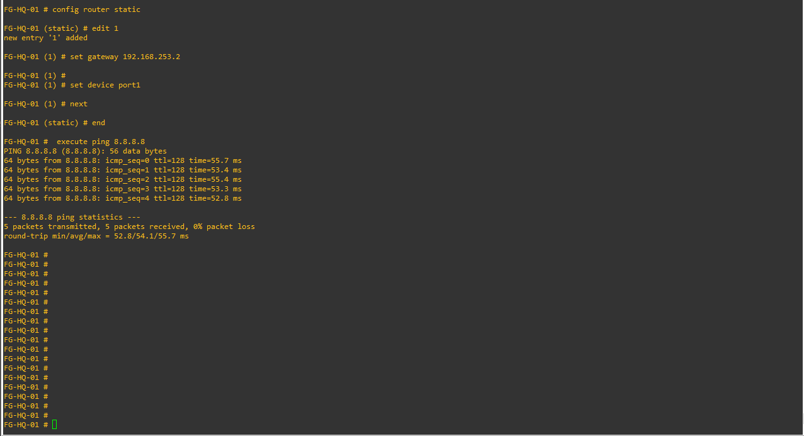

## نتیجه

اگر Ping به IP موفق ولی Ping به نام دامنه ناموفق بود:

مشکل از DNS است.

اگر هر دو ناموفق بودند:

ابتدا Interface WAN و سپس Route را بررسی کنید.


# Verification

در پایان این Task باید موارد زیر برقرار باشد:

* لینک WAN دارای IP معتبر باشد.
* لینک LAN روی 10.10.10.1/24 تنظیم شده باشد.
* اسکوپ DHCP فعال باشد.
* و Default Route وجود داشته باشد.
* و Ping به 8.8.8.8 موفق باشد.
* و Ping به google.com نیز موفق باشد.


# Troubleshooting

## یا  WAN IP دریافت نمی‌کند

بررسی کنید:

* VMware NAT فعال باشد.
* Cloud به Port1 متصل باشد.
* DHCP روی شبکه VMware فعال باشد.

دستور:

```bash
diagnose ip address list
```

---

## کلاینت IP دریافت نمی‌کند

بررسی کنید:

```bash
show system dhcp server
```

و همچنین از اتصال صحیح Switch و Client به Port2 اطمینان حاصل کنید.

---

## Ping اینترنت ناموفق است

ترتیب بررسی:

1. وضعیت WAN
2. جدول Route
3. تنظیمات DNS
4. دسترسی VMware به اینترنت

---

# نکات آزمون NSE4

* تفاوت Route استاتیک و Route دریافتی از DHCP را بدانید.
* مفهوم Administrative Access روی Interface را به خاطر بسپارید.
* DHCP Server داخلی FortiGate را با DHCP ویندوز مقایسه کنید.


# نکات دنیای واقعی

در بسیاری از سازمان‌ها:

* ا DHCP روی Windows Server اجرا می‌شود.
* ا FortiGate فقط نقش Gateway و Firewall را دارد.
* برای افزایش امنیت، دسترسی SSH و HTTPS فقط از شبکه مدیریت مجاز است و روی LAN عمومی فعال نمی‌شود.


<br><br>
<br><br>


# تسک 4 - ایجاد اولین Firewall Policy و برقراری دسترسی کاربران به اینترنت


# هدف

در این بخش اولین Firewall Policy ایجاد می‌شود تا کاربران شبکه داخلی بتوانند از طریق FortiGate به اینترنت دسترسی پیدا کنند.

در پایان این Task:

* با مفهوم Firewall Policy آشنا خواهید شد.
* اولین Policy را ایجاد خواهید کرد.
* ا NAT را فعال خواهید کرد.
* ارتباط Windows Client با اینترنت برقرار خواهد شد.
* اولین Log مربوط به عبور ترافیک را مشاهده خواهید کرد.

این بخش، یکی از مهم‌ترین مباحث آزمون NSE4 و پایه بسیاری از سناریوهای آینده است.


# مفاهیم

## ا Firewall Policy چیست؟

ا Firewall Policy مجموعه‌ای از قوانین است که مشخص می‌کند چه ترافیکی اجازه عبور از FortiGate را دارد و چه ترافیکی باید مسدود شود.

هر بسته‌ای که وارد FortiGate می‌شود، قبل از عبور از این قوانین بررسی خواهد شد.

اگر هیچ قانونی با آن تطابق نداشته باشد، FortiGate به صورت پیش‌فرض ترافیک را **رد (Implicit Deny)** می‌کند.


## ترتیب بررسی Policy ها

ا FortiGate قوانین را از **بالا به پایین** بررسی می‌کند.

به محض اینکه یک Policy با ترافیک تطابق پیدا کند، بررسی متوقف می‌شود و همان Policy اجرا خواهد شد.

به همین دلیل ترتیب قرارگیری Policy ها اهمیت بسیار زیادی دارد.


## ا NAT چیست؟

کاربران شبکه داخلی از آدرس‌های خصوصی (Private IP) استفاده می‌کنند و این آدرس‌ها در اینترنت قابل مسیریابی نیستند.

با فعال کردن NAT، FortiGate آدرس مبدأ بسته‌ها را به آدرس WAN خود تغییر می‌دهد تا امکان برقراری ارتباط با اینترنت فراهم شود.

---

# سناریوی این مرحله

در حال حاضر Windows Client در شبکه LAN قرار دارد و از طریق DHCP، آدرس IP دریافت کرده است.

اما هنوز هیچ Policy برای اجازه دسترسی به اینترنت وجود ندارد.

هدف ما این است که کاربران LAN بتوانند به اینترنت دسترسی داشته باشند.


# بررسی وضعیت قبل از ایجاد Policy

قبل از هر تغییری، از Windows Client موارد زیر را بررسی کنید:

```cmd
ipconfig
```

سپس:

```cmd
ping 10.10.10.1
```

اگر Ping موفق بود، ارتباط با FortiGate برقرار است.

اکنون:

```cmd
ping 8.8.8.8
```

احتمالاً این Ping ناموفق خواهد بود، زیرا هنوز هیچ Firewall Policy تعریف نشده است.


📸 Screenshot

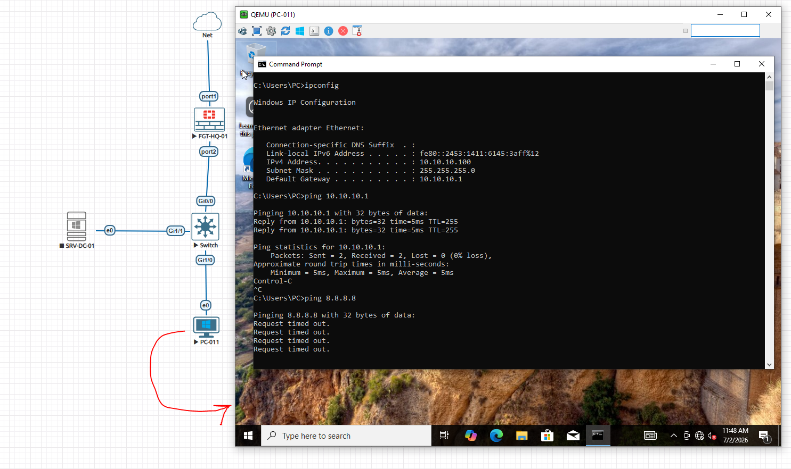

<br><br>

# ایجاد Firewall Policy

## GUI

Policy & Objects

↓

Firewall Policy

↓

Create New


📸 Screenshot

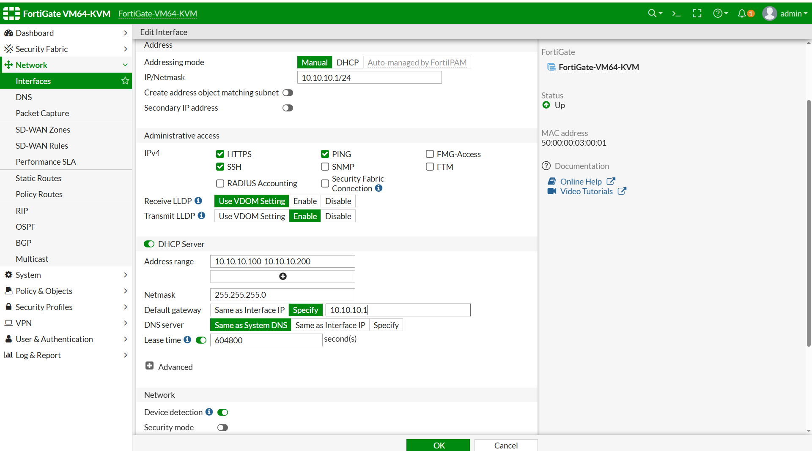

<br><br>
تنظیمات:

| گزینه               | مقدار           |
| ------------------- | --------------- |
| Name                | LAN_to_Internet |
| Incoming Interface  | port2 (LAN)     |
| Outgoing Interface  | port1 (WAN)     |
| Source              | all   (در محطی وافعی باید کنترل کامل باشد)          |
| Destination         | all  (در محطی وافعی باید کنترل کامل باشد)           |
| Service             | ALL  (در محطی وافعی باید کنترل کامل باشد)          |
| Action              | ACCEPT          |
| NAT                 | Enable          |
| Log Allowed Traffic | All Sessions    |


## توضیح گزینه‌ها

### Source

مشخص می‌کند چه کاربرانی اجازه استفاده از این Policy را دارند.

در این مرحله از **all** استفاده می‌کنیم.

در سناریوهای بعدی این مقدار محدود خواهد شد.


### Destination

مقصد ترافیک.

در این مرحله تمام مقصدها مجاز هستند.


### Service

نوع سرویس مجاز.

فعلاً تمام سرویس‌ها مجاز خواهند بود.

در سناریوهای امنیتی بعدی این مورد محدود می‌شود.


### NAT

حتماً باید فعال باشد.

در غیر این صورت کاربران با IP خصوصی وارد اینترنت خواهند شد و ارتباط برقرار نخواهد شد.


### Log Allowed Traffic

تمام Session های مجاز ثبت خواهند شد.

این Log ها در مراحل عیب‌یابی و بررسی امنیت بسیار ارزشمند هستند.


## CLI

```bash
config firewall policy

edit 1

set name "LAN_to_Internet"

set srcintf "port2"

set dstintf "port1"

set srcaddr "all"

set dstaddr "all"

set action accept

set schedule "always"

set service "ALL"

set nat enable

set logtraffic all

next

end
```


# بررسی Policy

```bash
show firewall policy
```

یا

```bash
show full-configuration firewall policy
```

بررسی کنید که NAT فعال باشد و Interfaceها به درستی انتخاب شده باشند.


# تست ارتباط

اکنون دوباره از Windows Client دستور زیر را اجرا کنید:

```cmd
ping 8.8.8.8
```

اگر موفق بود:

```cmd
ping google.com
```

در نهایت یک مرورگر باز کرده و یکی از وب‌سایت‌های عمومی را بررسی کنید.


📸 Screenshot


# بررسی Log ها

## GUI

Log & Report

↓

Forward Traffic 

در این قسمت باید بتوانید Session مربوط به Windows Client را مشاهده کنید.

موارد زیر را بررسی کنید:

* Source IP
* Destination IP
* Service
* Action
* Policy ID

<br><br>

📸 Screenshot

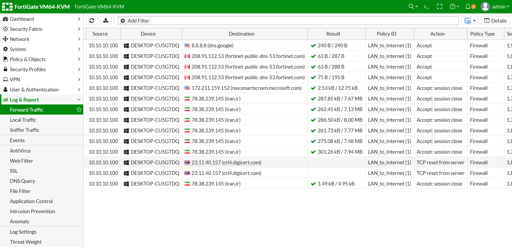


# مشاهده Session ها

FortiGate برای هر ارتباط مجاز، یک Session ایجاد می‌کند.

برای مشاهده Session های فعال:

```bash
diagnose sys session list
```

اگر خروجی زیاد بود:

```bash
diagnose sys session filter src 10.10.10.100
diagnose sys session list
```

(به جای 10.10.10.100 آدرس واقعی کلاینت را قرار دهید.)


# Verification

در پایان این Task باید:

* ا Windows Client از DHCP آدرس دریافت کرده باشد.
* ا Ping به Gateway موفق باشد.
* ا Ping به 8.8.8.8 موفق باشد.
* ا Ping به google.com موفق باشد.
* دسترسی به اینترنت برقرار باشد.
* ا Log مربوط به ترافیک ثبت شده باشد.
* ا Session مربوط به کلاینت قابل مشاهده باشد.


# Troubleshooting

## ا Ping به Gateway موفق ولی اینترنت قطع است

موارد زیر را بررسی کنید:

* ا Firewall Policy
* فعال بودن NAT
* ا Default Route
* وضعیت WAN


## ا Ping به IP موفق ولی Ping به Domain ناموفق است

احتمالاً DNS به درستی تنظیم نشده است.

دستورات زیر را بررسی کنید:

```bash
show system dns
```


## هیچ Logی ثبت نمی‌شود

بررسی کنید:

گزینه **Log Allowed Traffic** روی Policy فعال باشد.


# نکات آزمون NSE4

* ترتیب بررسی Policy ها را کاملاً درک کنید.
* مفهوم Implicit Deny بسیار مهم است.
* تفاوت NAT فعال و غیرفعال را بدانید.
* بدانید هر Session پس از تطبیق با یک Policy ایجاد می‌شود.


# نکات دنیای واقعی

در محیط‌های Enterprise:

* به جای استفاده از Object `all`، از Address Object و Service Object استفاده می‌شود.
* هر Policy نام‌گذاری استاندارد دارد.
* ثبت Log برای Policy های مهم همیشه فعال است.
* هیچ Policy بدون توضیح (Comment) ایجاد نمی‌شود.

در لابراتوارهای بعدی، ما نیز دقیقاً همین روش را پیاده‌سازی خواهیم کرد.


# جمع‌بندی

در این Task، FortiGate برای اولین بار به عنوان یک Firewall عملیاتی وارد مدار شد.

کاربران اکنون می‌توانند با عبور از Firewall Policy و انجام NAT به اینترنت متصل شوند و تمام ارتباطات آن‌ها در Log سیستم ثبت می‌شود.

این Policy پایه‌ای، مبنای بسیاری از سناریوهای آینده از جمله Security Profile، Web Filter، Application Control، IPS و VPN خواهد بود.


<br><br>
<br><br>

# تسک  5 - بررسی وضعیت سیستم، تهیه Backup 


# هدف

در این بخش آخرین اقدامات مورد نیاز برای تکمیل لابراتوار اول انجام می‌شود.

در پایان این Task:

* وضعیت کلی FortiGate بررسی خواهد شد.
* صحت تنظیمات انجام‌شده تأیید می‌شود.
* اولین Backup از تنظیمات تهیه می‌شود.
* اولین Baseline پروژه ثبت خواهد شد.
* لابراتوار اول به صورت رسمی پایان می‌یابد.

در محیط‌های Enterprise هیچ پروژه‌ای بدون Backup و مستندسازی تحویل داده نمی‌شود.


# مفاهیم

## ا Backup چیست؟

ا Backup فایل متنی شامل تنظیمات FortiGate است.

در صورت بروز مشکل می‌توان تنظیمات را مجدداً روی دستگاه Restore کرد.


##  ا Baseline چیست؟

ا Baseline اولین وضعیت پایدار و سالم سیستم است.

از این مرحله به بعد، تمام تغییرات پروژه بر اساس این نسخه انجام خواهد شد.

در پروژه‌های واقعی معمولاً بعد از هر تغییر بزرگ، یک Baseline جدید ثبت می‌شود.


# بررسی وضعیت سیستم

قبل از تهیه Backup باید مطمئن شویم که تمام تنظیمات به درستی اعمال شده‌اند.


## بررسی اطلاعات سیستم

CLI

```bash
get system status
```

موارد زیر را بررسی کنید:

* Hostname
* Version
* Build
* Current Time
* Operation Mode
* Uptime


## بررسی Interface ها

```bash
get system interface
```

اطمینان حاصل کنید:

* ا Port1 دارای IP معتبر باشد.
* ا Port2 دارای آدرس 10.10.10.1/24 باشد.
* ا Interface ها Up باشند.


## بررسی Route

```bash
get router info routing-table all
```

وجود Default Route را بررسی کنید.


## بررسی DHCP

```bash
show system dhcp server
```

موارد زیر را کنترل کنید:

* ا Interface صحیح
* ا Gateway
* ا DHCP Range

## بررسی Firewall Policy

```bash
show firewall policy
```

موارد زیر باید مشاهده شوند:

* ا Policy Name
* ا Source Interface
* ا Destination Interface
* ا NAT Enable
* ا Log Traffic Enable


# تست نهایی ارتباط

اکنون از Windows Client بررسی کنید.


## دریافت IP

```cmd
ipconfig
```

بررسی کنید:

* ا IP از DHCP دریافت شده باشد.
* ا Gateway برابر 10.10.10.1 باشد.


## Ping Gateway

```cmd
ping 10.10.10.1
```


## Ping Internet

```cmd
ping 8.8.8.8
```

---

## بررسی DNS

```cmd
ping google.com
```


## بررسی Web

مرورگر را باز کنید.

ورود به یکی از وب‌سایت‌های عمومی را بررسی نمایید.


<br><br>
<br><br>


# تهیه Backup

## GUI

Dashboard

↓

System Information

↓

Configuration

↓

Backup


📸 Screenshot

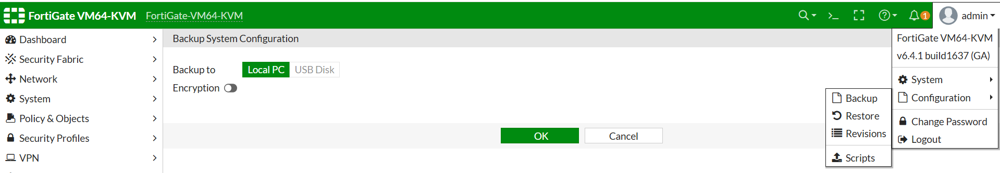


## CLI

نمایش کامل تنظیمات

```bash
show full-configuration
```

این دستور برای بررسی کامل تنظیمات بسیار مفید است اما جایگزین Backup نیست.


# Verification Checklist

در پایان لابراتوار، موارد زیر را بررسی کنید.

| مورد                          | وضعیت |
| ----------------------------- | ----- |
| Hostname تنظیم شده است        | ✅     |
| Password تغییر کرده است       | ✅     |
| DNS تنظیم شده است             | ✅     |
| NTP فعال است                  | ✅     |
| WAN فعال است                  | ✅     |
| LAN فعال است                  | ✅     |
| DHCP فعال است                 | ✅     |
| Default Route وجود دارد       | ✅     |
| Firewall Policy ایجاد شده است | ✅     |
| NAT فعال است                  | ✅     |
| Client اینترنت دارد           | ✅     |
| Backup تهیه شده است           | ✅     |


# Troubleshooting

## ا Client اینترنت ندارد

بررسی کنید:

* ا DHCP
* ا Gateway
* ا Firewall Policy
* ا NAT
* ا Default Route


## اینترنت روی FortiGate برقرار است ولی Client دسترسی ندارد

ابتدا Policy را بررسی کنید.

```bash
show firewall policy
```

---

## ا Ping به IP موفق است اما DNS کار نمی‌کند

```bash
show system dns
```


## ا DHCP IP اختصاص نمی‌دهد

```bash
show system dhcp server
```


# Best Practice

در پروژه‌های واقعی:

* همیشه قبل از هر تغییر Backup بگیرید.
* بعد از پایان هر Phase Snapshot ایجاد کنید.
* فایل Backup را روی سیستم دیگری نیز نگهداری کنید.
* روی Backupها Version قرار دهید.

نمونه:

```text
FGT-HQ-01_v1.conf

FGT-HQ-01_v2.conf

FGT-HQ-01_PreVPN.conf

FGT-HQ-01_PostVPN.conf
```


# نکات آزمون NSE4

در آزمون معمولاً از موارد زیر سؤال مطرح می‌شود:

* تفاوت Backup و Restore
* کاربرد Snapshot
* اهمیت Baseline
* بررسی وضعیت Interface
* تحلیل Routing Table
* بررسی Firewall Policy


# جمع‌بندی لابراتوار

در این لابراتوار زیرساخت اولیه پروژه آماده شد.

موارد انجام شده:

* راه‌اندازی اولیه FortiGate
* تغییر Hostname
* تغییر Password
* تنظیم DNS
* تنظیم NTP
* پیکربندی WAN
* پیکربندی LAN
* راه‌اندازی DHCP
* ایجاد Default Route
* ایجاد اولین Firewall Policy
* فعال‌سازی NAT
* تست ارتباط کاربران
* بررسی Logها
* تهیه Backup
* تهیه Snapshot

از این مرحله به بعد، FortiGate آماده ورود به سناریوهای پیشرفته‌تر خواهد بود.

# Challenge

بدون استفاده از این مستند، موارد زیر را از ابتدا انجام دهید:

* ایجاد Interface LAN
* فعال‌سازی DHCP
* ایجاد Firewall Policy
* فعال کردن NAT
* بررسی اینترنت
* تهیه Backup


# تسک  6 - ارتقاء Firmware FortiGate به  نسخه پایدار 6.4


# هدف

در این بخش Firmware دستگاه FortiGate را از نسخه فعلی به آخرین نسخه پایدار شاخه **FortiOS 6.4.x** ارتقاء می‌دهیم.

هدف از این عملیات، استفاده از آخرین Patchهای امنیتی، رفع باگ‌ها و افزایش پایداری سیستم است، بدون اینکه وارد شاخه جدید FortiOS (مانند 7.x) شویم.

در پایان این Task:

* نسخه فعلی Firmware بررسی خواهد شد.
* سازگاری نسخه مقصد تأیید می‌شود.
* از تنظیمات Backup تهیه خواهد شد.
* ا Firmware ارتقاء پیدا می‌کند.
* صحت عملکرد سیستم پس از Reboot بررسی می‌شود.

<br><br>

# مفاهیم

## ا Firmware چیست؟

ا Firmware سیستم‌عامل اصلی FortiGate است که تمام قابلیت‌های امنیتی، مدیریتی و شبکه‌ای دستگاه را فراهم می‌کند.

تمام ویژگی‌هایی مانند:

* Firewall
* IPS
* SSL VPN
* Routing
* NAT
* Logging
* Web Filter

توسط FortiOS ارائه می‌شوند.

---

## چرا Firmware را ارتقاء می‌دهیم؟

دلایل اصلی ارتقاء Firmware عبارت‌اند از:

* رفع آسیب‌پذیری‌های امنیتی
* رفع باگ‌های شناخته‌شده
* بهبود عملکرد
* افزایش سازگاری با سایر تجهیزات
* اضافه شدن قابلیت‌های جدید

---

## چرا مستقیماً به FortiOS 7 ارتقاء نمی‌دهیم؟

در این پروژه تمام سناریوها بر اساس FortiOS 6.4 طراحی شده‌اند.

همچنین:

* محیط EVE-NG با این نسخه پایدارتر است.
* ساختار GUI ثابت می‌ماند.
* تفاوت منوها باعث سردرگمی نمی‌شود.

---

# پیش‌نیازها

قبل از شروع عملیات ارتقاء، موارد زیر باید انجام شده باشند.

* ا Backup از تنظیمات تهیه شده باشد.
* فایل Firmware دانلود شده باشد.
* فضای کافی روی Disk وجود داشته باشد.


# بررسی نسخه فعلی

از طریق CLI دستور زیر را اجرا کنید.

```bash
get system status
```

نمونه خروجی:

```text
Version: FortiGate-VM64 v6.4.1
Build: 1637
Hostname: FGT-HQ-01
```

نسخه فعلی را یادداشت کنید.


# بررسی Release Notes

قبل از هر Upgrade باید Release Notes نسخه مقصد مطالعه شود.

در Release Notes معمولاً موارد زیر بررسی می‌شوند:

* Bug Fixes
* Security Fixes
* Upgrade Path
* Known Issues
* New Features

در محیط‌های Enterprise هیچ Firmware بدون مطالعه Release Notes نصب نمی‌شود.

---

# تهیه Backup

قبل از Upgrade یک Backup جدید تهیه کنید.

GUI

System

↓

Dashboard

↓

Configuration

↓

Backup

نام فایل پیشنهادی:

```text
FGT-HQ-01_PreUpgrade.conf
```


# ارتقاء Firmware

## GUI

System

↓

Firmware

↓

Upload Firmware

فایل Firmware دانلود شده را انتخاب کنید.

پس از انتخاب فایل، FortiGate نسخه مقصد را نمایش خواهد داد.

در صورت تأیید، گزینه **Backup configuration before upgrade** را فعال کنید.

سپس Upgrade را آغاز نمایید.

---

📸 Screenshot


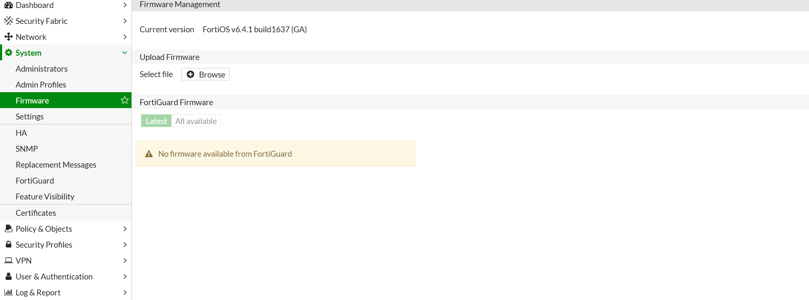

# فرآیند Upgrade

در طول Upgrade:

* فایل Firmware بررسی می‌شود.
* سیستم Reboot می‌شود.
* ا Firmware جدید نصب می‌شود.
* دستگاه مجدداً راه‌اندازی خواهد شد.

مدت زمان این فرآیند بسته به منابع ماشین مجازی معمولاً بین ۳ تا ۱۰ دقیقه است.


# بررسی نسخه جدید

پس از Boot کامل سیستم:

```bash
get system status
```

بررسی کنید:

* Version
* Build
* Hostname
* Current Time

نمونه:

```text
Version: FortiGate-VM64 v6.4.16
```


# بررسی سلامت سیستم

اجرای دستورات زیر:

```bash
get system status
```

```bash
get system performance status
```

```bash
get system interface
```

```bash
get router info routing-table all
```

اطمینان حاصل کنید که:

* ا Interfaceها بدون تغییر باقی مانده‌اند.
* ا Default Route حذف نشده است.
* تنظیمات DHCP برقرار است.
* ا Firewall Policyها حفظ شده‌اند.


# تست ارتباط

از Windows Client بررسی کنید:

```cmd
ping 10.10.10.1
```

```cmd
ping 8.8.8.8
```

```cmd
ping google.com
```

<br><br>

# Troubleshooting

## دستگاه پس از Upgrade بالا نمی‌آید
* از سازگاری نسخه Firmware اطمینان حاصل کنید.


## تنظیمات از بین رفته‌اند

در صورت نیاز فایل Backup را Restore کنید.


## نسخه جدید نصب نشده است

بررسی کنید:

* فایل Firmware صحیح باشد.
* ا Upgrade کامل شده باشد.
* دستگاه یک‌بار دیگر Restart شود.


# Best Practice

در پروژه‌های واقعی:

* همیشه ابتدا روی محیط آزمایش (Lab) ارتقاء انجام می‌شود.
* سپس روی یک شعبه کوچک.
* بعد از تأیید، روی سایر تجهیزات اعمال می‌شود.
* قبل از هر Upgrade، برنامه Rollback مشخص می‌شود.


# نکات آزمون NSE4

* اهمیت Backup قبل از Upgrade
* مفهوم Upgrade Path
* بررسی Release Notes
* تفاوت Firmware Upgrade و Configuration Restore


<br><br><br><br>
# پایان Lab 01