# تسک 1 - بررسی Firewall Policy، Packet Flow و ایجاد اولین Enterprise Policy


# هدف

در این Task با مهم‌ترین بخش FortiGate و آزمون NSE4 یعنی **Firewall Policy** آشنا می‌شویم.

قبل از ایجاد Address Object، Service Object و سایر قابلیت‌ها، ابتدا باید درک کنیم که FortiGate چگونه یک Packet را پردازش می‌کند و بر اساس چه قوانینی اجازه عبور یا عدم عبور به ترافیک را می‌دهد.

در پایان این Task:

* معماری Firewall Policy را درک خواهید کرد.
* مفهوم Packet Flow را خواهید آموخت.
* ا Policy ایجاد شده در Lab01 را بررسی خواهید کرد.
* اولین Enterprise Policy را ایجاد خواهید کرد.
* نحوه پردازش Packet توسط FortiGate را خواهید شناخت.
* با مفهوم Implicit Deny آشنا خواهید شد.


# مفاهیم

## ا Firewall Policy چیست؟

ا Firewall Policy مجموعه قوانینی است که مشخص می‌کند کدام ترافیک اجازه عبور از FortiGate را دارد و کدام ترافیک باید مسدود شود.

تمام Packetهایی که وارد FortiGate می‌شوند، قبل از هر چیز با Firewall Policy مقایسه خواهند شد.

اگر هیچ Policy با Packet مطابقت نداشته باشد، FortiGate به صورت پیش‌فرض Packet را Drop خواهد کرد.

این رفتار با نام **Implicit Deny** شناخته می‌شود.


## ا Packet Flow چیست؟

ا Packet Flow مسیر حرکت یک Packet از لحظه ورود به FortiGate تا خروج از آن را نشان می‌دهد.

درک این فرآیند برای عیب‌یابی و طراحی Policyها بسیار مهم است.

در FortiGate، Packet به صورت خلاصه مراحل زیر را طی می‌کند:

```text
Client

↓

Ingress Interface (LAN)

↓

Firewall Policy Lookup

↓

Source Address Check

↓

Destination Address Check

↓

Service Check

↓

Schedule Check

↓

Security Profiles

↓

NAT

↓

Routing

↓

Egress Interface (WAN)

↓

Internet
```

در لابراتوارهای آینده هر یک از این مراحل را به صورت عملی بررسی خواهیم کرد.


## ترتیب بررسی Firewall Policy

ا FortiGate قوانین را از بالا به پایین بررسی می‌کند.

به محض اینکه یک Policy با Packet مطابقت پیدا کند، پردازش متوقف شده و همان Policy اعمال می‌شود.

به همین دلیل ترتیب قرارگیری Policyها اهمیت بسیار زیادی دارد.

نمونه:

```text
Policy 1

↓

Policy 2

↓

Policy 3

↓

Implicit Deny
```

اگر Packet با Policy شماره 1 مطابقت داشته باشد، هرگز Policyهای بعدی بررسی نخواهند شد.


## ا Implicit Deny چیست؟

در انتهای تمام Firewall Policyها یک قانون مخفی وجود دارد که قابل مشاهده نیست.

این قانون به صورت پیش‌فرض تمام ترافیک‌هایی را که با هیچ Policy مطابقت ندارند، مسدود می‌کند.

به همین دلیل حتی اگر هیچ Ruleای ایجاد نکنید، کاربران به اینترنت دسترسی نخواهند داشت.


# سناریوی این مرحله

در پایان Lab01 یک Firewall Policy ایجاد شد که اجازه دسترسی کاربران LAN به اینترنت را می‌دهد.

اکنون می‌خواهیم همان Policy را بررسی کنیم و رفتار آن را تحلیل کنیم.

در مراحل بعدی همین Policy را به یک Enterprise Policy تبدیل خواهیم کرد.


# پیش‌نیازها

قبل از شروع این Task مطمئن شوید:

* ا Lab01 با موفقیت تکمیل شده باشد.
* ا Windows Client به اینترنت دسترسی داشته باشد.
* ا DHCP فعال باشد.
* ا Firewall Policy ایجاد شده باشد.
* ا NAT فعال باشد.


# بررسی Firewall Policy فعلی

## GUI

ا Policy & Objects

ا ↓

ا Firewall Policy

ا Policy ایجاد شده در Lab01 را انتخاب کنید.

موارد زیر را بررسی نمایید:

| گزینه              | مقدار           |
| ------------------ | --------------- |
| Name               | LAN_to_Internet |
| Incoming Interface | port2           |
| Outgoing Interface | port1           |
| Source             | all             |
| Destination        | all             |
| Service            | ALL             |
| NAT                | Enable          |
| Action             | ACCEPT          |


<br><br>

📸 Screenshot
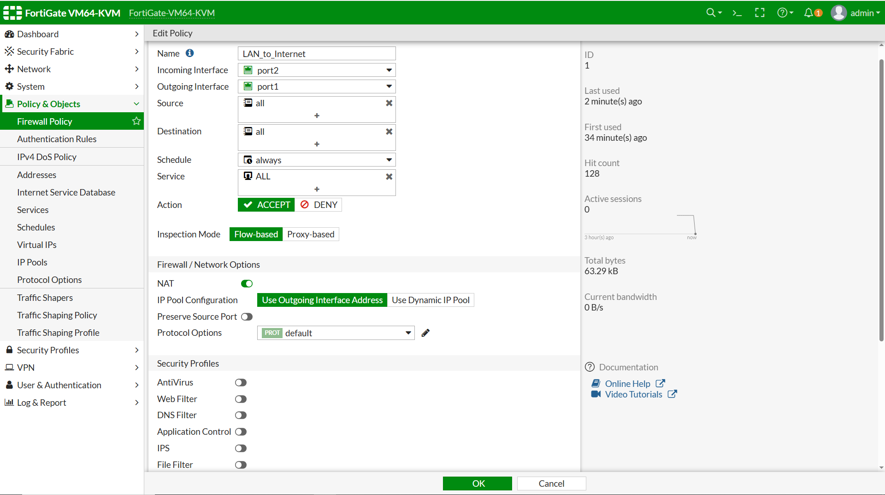

<br><br>

# بررسی Policy از طریق CLI

```bash
show firewall policy
```

خروجی باید مشابه زیر باشد:

```text
Policy Name : LAN_to_Internet

Source Interface : port2

Destination Interface : port1

Source Address : all

Destination Address : all

Service : ALL

Action : ACCEPT

NAT : Enable
```


# تحلیل اولین Policy

ا Policy فعلی کاملاً مناسب محیط آزمایش است.

اما در یک سازمان واقعی مشکلات زیر را دارد.

* همه کاربران مجاز هستند.
* تمام مقصدها مجاز هستند.
* تمام سرویس‌ها مجاز هستند.
* هیچ محدودیت زمانی وجود ندارد.
* هیچ Object اختصاصی استفاده نشده است.

در لابراتوارهای بعدی این Policy را به صورت کامل استانداردسازی خواهیم کرد.


# ایجاد اولین Enterprise Policy

برای حفظ استانداردهای سازمانی، ابتدا نام Policy را اصلاح می‌کنیم.

## GUI

Policy & Objects

↓

Firewall Policy

↓

Edit


تنظیمات جدید

| گزینه    | مقدار                          |
| -------- | ------------------------------ |
| Name     | HQ-LAN-to-WAN-Allow            |
| Comments | Initial Internet Access Policy |

سایر تنظیمات بدون تغییر باقی خواهند ماند.

---

## CLI

```bash
config firewall policy

edit 1

set name "HQ-LAN-to-WAN-Allow"

set comments "Initial Internet Access Policy"

next

end
```

<br><br>

📸 Screenshot

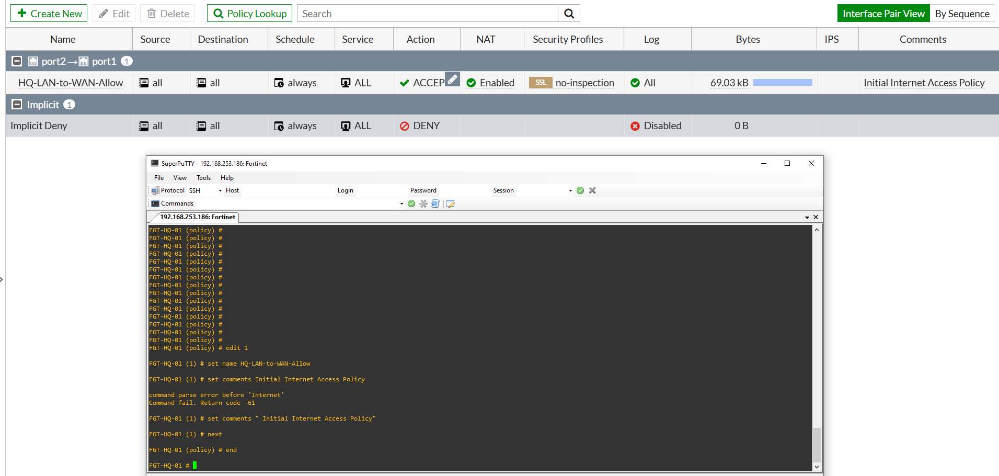


# بررسی ترتیب Policyها

در حال حاضر تنها یک Policy وجود دارد.

اما ترتیب نمایش آن را بررسی کنید.

GUI

Policy & Objects

↓

Firewall Policy

مشاهده کنید که Policy از بالا به پایین پردازش خواهد شد.

در سناریوهای آینده چندین Policy ایجاد خواهیم کرد و اهمیت ترتیب آن‌ها را به صورت عملی مشاهده خواهید نمود.


# تست ارتباط

از Windows Client بررسی کنید.

```cmd
ping 10.10.10.1
```

سپس

```cmd
ping 8.8.8.8
```

و در نهایت

```cmd
ping google.com
```

مرورگر را باز کرده و دسترسی به اینترنت را بررسی نمایید.

تغییر نام Policy نباید هیچ تأثیری بر عملکرد شبکه داشته باشد.


# Troubleshooting

## اینترنت پس از ویرایش Policy قطع شد

بررسی کنید:

* ا Interfaceها تغییر نکرده باشند.
* ا NAT همچنان فعال باشد.
* ا Action روی ACCEPT باشد.
* ا Policy غیرفعال نشده باشد.


## ا Policy در CLI نمایش داده نمی‌شود

```bash
show firewall policy
```

در صورت نیاز:

```bash
show full-configuration firewall policy
```


## تغییرات ذخیره نشده‌اند

بررسی کنید که پس از اعمال تغییرات گزینه **OK** را در GUI انتخاب کرده باشید.


# Best Practice

در محیط‌های Enterprise:

* تمام Policyها دارای نام استاندارد هستند.
* برای هر Policy توضیح (Comment) ثبت می‌شود.
* از نام‌های مبهم مانند Rule1 یا Policy2 استفاده نمی‌شود.
* تغییرات Policy مستندسازی می‌شوند.

نمونه نام‌گذاری مناسب:

```text
HQ-LAN-to-WAN-Allow

HQ-Guest-to-Internet

HQ-DMZ-to-WAN

HQ-Branch-to-HQ-VPN
```


# نکات آزمون NSE4

موارد زیر از مهم‌ترین مباحث آزمون هستند:

* ترتیب بررسی Firewall Policy
* مفهوم Implicit Deny
* تفاوت ACCEPT و DENY
* اهمیت NAT در Policy
* نقش Comment در مدیریت Policyها


# جمع‌بندی

در این Task با نحوه عملکرد Firewall Policy و Packet Flow آشنا شدیم.

همچنین اولین Policy ایجاد شده در Lab01 را بررسی و مطابق استانداردهای سازمانی بازنام‌گذاری کردیم.

در Task بعدی، به جای استفاده از Object `all`، اولین **Address Object** و **Address Group** را ایجاد خواهیم کرد تا ساختار Policyها حرفه‌ای‌تر و قابل مدیریت‌تر شود.

<br><br><br><br>


# تسک 2 - ایجاد Address Object و Address Group


# هدف

در این Task با یکی از مهم‌ترین قابلیت‌های FortiGate یعنی **Address Object** آشنا خواهیم شد.

در Lab01 و Task1 از Lab02 برای ساده نگه داشتن سناریو از Object پیش‌فرض **all** استفاده کردیم، اما در محیط‌های Enterprise تقریباً هیچ‌گاه از Object `all` در Firewall Policy استفاده نمی‌شود.

به جای آن، تمام شبکه‌ها، سرورها، کاربران و حتی IPهای اینترنتی به صورت Object تعریف می‌شوند و سپس در Policyها مورد استفاده قرار می‌گیرند.

در پایان این Task:

- مفهوم Address Object را خواهید آموخت.
- اولین Address Object را ایجاد خواهید کرد.
- اولین Address Group را خواهید ساخت.
- ا Firewall Policy را ویرایش خواهید کرد.
- ساختار Policy از حالت ساده به Enterprise ارتقاء پیدا خواهد کرد.
- اینترنت کاربران همچنان بدون مشکل برقرار خواهد بود.


# مفاهیم

## ا Address Object چیست؟

ا Address Object یک شیء منطقی است که یک آدرس IP، یک شبکه، یک Host، یک Range و یا حتی یک FQDN را نمایش می‌دهد.

به جای اینکه در هر Firewall Policy آدرس IP را به صورت دستی وارد کنیم، تنها کافی است Object مربوطه را انتخاب کنیم.

به عنوان مثال به جای وارد کردن:

```
10.10.10.0/24
```

از Object زیر استفاده می‌کنیم.

```
HQ_LAN_NET
```

اگر در آینده Subnet شبکه تغییر کند، تنها کافی است Address Object را ویرایش کنیم و دیگر نیازی به تغییر تمام Firewall Policyها نخواهد بود.


## مزایای استفاده از Address Object

استفاده از Address Object مزایای بسیار زیادی دارد.

- افزایش خوانایی Firewall Policy
- مدیریت ساده‌تر تغییرات
- استفاده مجدد در چندین Policy
- کاهش خطای انسانی
- استانداردسازی تنظیمات
- افزایش سرعت مدیریت شبکه

در سازمان‌هایی که صدها Firewall Policy وجود دارد، استفاده نکردن از Address Object تقریباً غیرممکن است.


## ا Address Group چیست؟

ا Address Group مجموعه‌ای از چندین Address Object است.

فرض کنید شرکت دارای شبکه‌های زیر باشد.

```
IT Network = 10.10.10.0/24

HR Network = 10.10.20.0/24

Finance Network = 10.10.30.0/24
```

به جای اینکه هر سه شبکه را در Firewall Policy وارد کنیم، آن‌ها را داخل یک Address Group قرار می‌دهیم.

نمونه:

```
HQ_Internal_Networks
```

و سپس تنها همین Group را در Firewall Policy انتخاب می‌کنیم.

این روش مدیریت Policyها را بسیار ساده‌تر می‌کند.

---

# سناریوی این مرحله

در پایان Task1، Firewall Policy ما به شکل زیر بود.

| گزینه | مقدار |
|--------|--------|
| Source | all |
| Destination | all |
| Service | ALL |

این ساختار برای آزمایش مناسب است اما در یک محیط واقعی استاندارد محسوب نمی‌شود.

در این Task قصد داریم:

- شبکه داخلی شرکت را به صورت Address Object تعریف کنیم.
- یک Address Group ایجاد کنیم.
- ا Firewall Policy را ویرایش کنیم.
- مقدار `all` را حذف کنیم.

در پایان عملکرد شبکه تغییری نخواهد کرد اما ساختار تنظیمات حرفه‌ای‌تر خواهد شد.
 
# پیش‌ نیازها

قبل از شروع این Task مطمئن شوید:

- ا Lab01 با موفقیت انجام شده باشد.
- ا Task1 از Lab02 تکمیل شده باشد.
- ا Windows Client از طریق DHCP آدرس IP دریافت کرده باشد.
- اینترنت روی Client برقرار باشد.
- ا Firewall Policy ایجاد شده باشد.
- ا NAT فعال باشد.


# بررسی Address Objectهای پیش‌فرض

قبل از ایجاد Object جدید، بهتر است Objectهای موجود را بررسی کنیم.

## GUI

```
Policy & Objects

↓

Addresses
```

در این قسمت تعدادی Object پیش‌فرض توسط FortiGate ایجاد شده‌اند.

نمونه‌هایی مانند:

- all
- SSLVPN_TUNNEL_ADDR1
- gmail.com (در برخی نسخه‌ها)
- سایر Objectهای سیستمی

فعلاً هیچ تغییری روی آن‌ها ایجاد نکنید.

📸 Screenshot


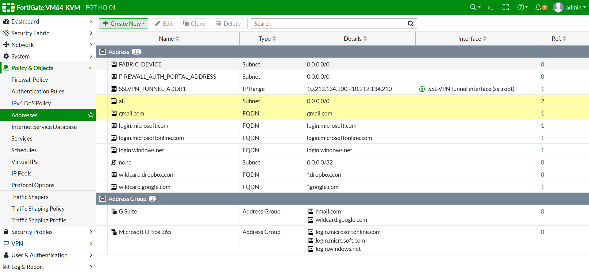

# بررسی Address Objectها از طریق CLI

دستور زیر را اجرا کنید.

```bash
show firewall address
```

در صورت نیاز خروجی کامل را مشاهده کنید.

```bash
show full-configuration firewall address
```

به Objectهای موجود دقت کنید.

در حال حاضر هنوز Object مربوط به شبکه داخلی ما وجود ندارد.


# ایجاد اولین Address Object

اکنون اولین Address Object مربوط به شبکه داخلی شرکت را ایجاد می‌کنیم.

## GUI

```
Policy & Objects

↓

Addresses

↓

Create New

↓

Address
```

---

تنظیمات زیر را وارد نمایید.

| گزینه | مقدار |
|--------|--------|
| Name | HQ_LAN_NET |
| Type | Subnet |
| Subnet | 10.10.10.0/24 |
| Interface | port2 |
| Color | Blue (اختیاری) |
| Visibility | Enable |
| Comments | Headquarters LAN Network |

---

## توضیح گزینه‌ها

### Name

نام Object باید استاندارد و قابل فهم باشد.

از نام‌هایی مانند

```
Network1

LAN

Object1
```

استفاده نکنید.

---

### Type

چون شبکه داخلی ما یک Subnet است، گزینه Subnet را انتخاب می‌کنیم.

در سناریوهای بعدی با Host، Range و FQDN نیز آشنا خواهیم شد.

---

### Interface

انتخاب Interface باعث می‌شود مشخص شود این شبکه متعلق به کدام Interface است.

در این سناریو:

```
port2
```

---

### Comments

همیشه برای Objectها توضیح بنویسید.

این موضوع در سازمان‌هایی با چندین Administrator اهمیت بسیار زیادی دارد.


## ایجاد Address Object از طریق CLI

```bash
config firewall address

edit "HQ_LAN_NET"

set subnet 10.10.10.0 255.255.255.0

set associated-interface "port2"

set comment "Headquarters LAN Network"

next

end
```


📸 Screenshot

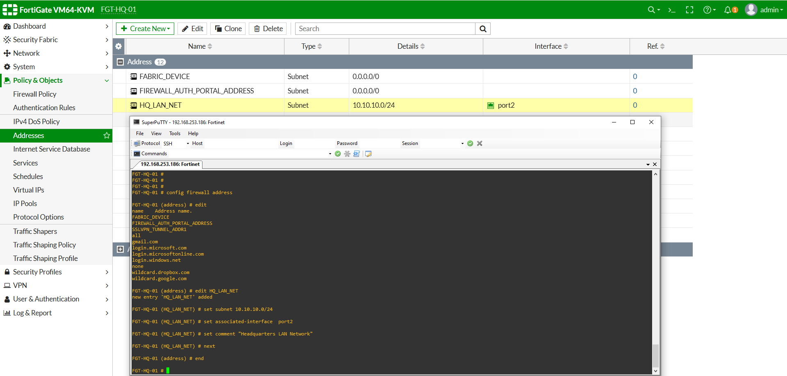

<br><br>

# بررسی صحت ایجاد Address Object

پس از ایجاد Object دستور زیر را اجرا کنید.

```bash
show firewall address
```

خروجی باید مشابه زیر باشد.

```text
HQ_LAN_NET

Subnet:

10.10.10.0/24

Interface:

port2

Comment:

Headquarters LAN Network
```

<br><br>

# ایجاد Address Group

اکنون که اولین Address Object مربوط به شبکه داخلی را ایجاد کرده‌ایم، زمان آن رسیده است که آن را داخل یک **Address Group** قرار دهیم.

ممکن است این سؤال پیش بیاید که چرا وقتی فقط یک شبکه داریم باید Group بسازیم؟

پاسخ این است که در طراحی شبکه‌های Enterprise همیشه باید به توسعه آینده فکر کرد.

امروز تنها یک شبکه داخلی داریم، اما در سناریوهای آینده شبکه‌های زیر نیز به پروژه اضافه خواهند شد.

```
HQ_LAN_NET

HQ_SERVER_NET

HQ_DMZ_NET

HQ_GUEST_NET

SSLVPN_POOL

Branch01_NET
```

اگر از همین ابتدا از Address Group استفاده کنیم، بعداً بدون تغییر Firewall Policy تنها کافی است اعضای Group را تغییر دهیم.

این یکی از مهم‌ترین Best Practiceهای FortiGate است.

---

# ایجاد Address Group از طریق GUI

مسیر زیر را باز کنید.

```
Policy & Objects

↓

Addresses

↓

Create New

↓

Address Group
```

---

تنظیمات زیر را وارد نمایید.

| گزینه | مقدار |
|--------|--------|
| Name | HQ_Internal_Networks |
| Members | HQ_LAN_NET |
| Comments | Headquarters Internal Networks |

پس از انتخاب Member روی **OK** کلیک نمایید.

---

## توضیح گزینه‌ها

### Name

نام Group باید نشان‌دهنده اعضای داخل آن باشد.

به عنوان مثال:

```
HQ_Internal_Networks
```

از نام‌هایی مانند

```
Group1

MyGroup

NetworkGroup
```

استفاده نکنید.

---

### Members

در حال حاضر تنها عضو این Group عبارت است از:

```
HQ_LAN_NET
```

در سناریوهای آینده اعضای بیشتری به این Group اضافه خواهیم کرد.

---

### Comments

توضیح کوتاهی درباره هدف Group وارد نمایید.

```
Headquarters Internal Networks
```


# ایجاد Address Group از طریق CLI

```bash
config firewall addrgrp

edit "HQ_Internal_Networks"

set member "HQ_LAN_NET"

set comment "Headquarters Internal Networks"

next

end
```


📸 Screenshot

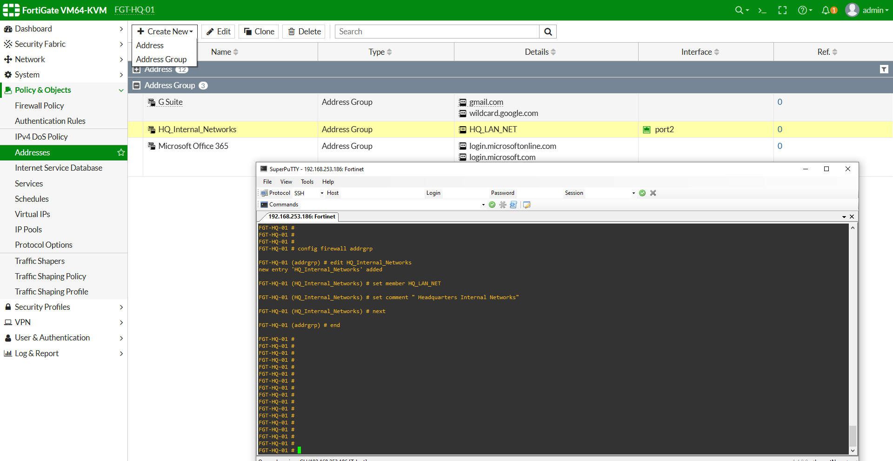

<br><br>

# بررسی Address Group

برای مشاهده Group ایجاد شده دستور زیر را اجرا کنید.

```bash
show firewall addrgrp
```

در صورت نیاز خروجی کامل را مشاهده نمایید.

```bash
show full-configuration firewall addrgrp
```

نمونه خروجی:

```text
HQ_Internal_Networks

Members

HQ_LAN_NET
```

---


# ویرایش Firewall Policy

اکنون مهم‌ترین بخش این Task آغاز می‌شود.

در حال حاضر Source Address در Firewall Policy برابر با:

```
all
```

است.

ما قصد داریم این مقدار را حذف کرده و به جای آن از Address Group استفاده کنیم.


## چرا Object `all` مناسب نیست؟

ا Object پیش‌فرض `all` به این معناست که هر مبدأیی اجازه استفاده از این Policy را خواهد داشت.

در یک محیط Enterprise این موضوع می‌تواند مشکلات امنیتی ایجاد کند.

به عنوان مثال:

- اتصال یک VLAN جدید
- اتصال یک شبکه Guest
- ایجاد VPN جدید

در تمام این موارد اگر از Object `all` استفاده شده باشد، کاربران جدید نیز به صورت ناخواسته اجازه عبور خواهند داشت.

به همین دلیل همیشه از Address Object یا Address Group استفاده می‌شود.


# ویرایش Policy از طریق GUI

مسیر زیر را باز کنید.

```
Policy & Objects

↓

Firewall Policy

↓

HQ-LAN-to-WAN-Allow

↓

Edit
```

---

تنظیمات زیر را تغییر دهید.

| گزینه | مقدار |
|--------|--------|
| Source | HQ_Internal_Networks |

سایر گزینه‌ها بدون تغییر باقی خواهند ماند.

روی **OK** کلیک کنید.

<br><br>

📸 Screenshot

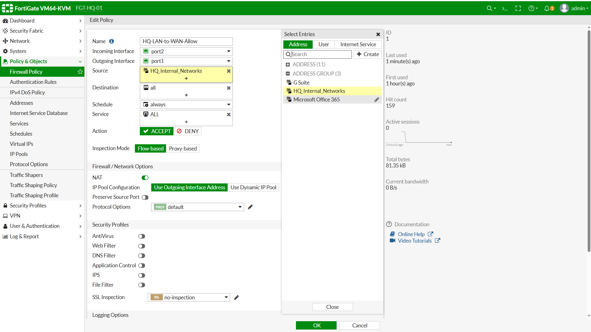

# ویرایش Policy از طریق CLI

```bash
config firewall policy

edit 1

set srcaddr "HQ_Internal_Networks"

next

end
```


# بررسی Firewall Policy

اکنون دستور زیر را اجرا نمایید.

```bash
show firewall policy
```

باید مقدار Source Address به شکل زیر نمایش داده شود.

```text
Source Address

HQ_Internal_Networks
```

اگر هنوز مقدار `all` نمایش داده می‌شود، تنظیمات به درستی ذخیره نشده‌اند.


# بررسی Packet Flow پس از تغییر Policy

پس از این تغییر، مسیر بررسی Packet به شکل زیر خواهد بود.

```text
Windows Client

↓

Port2

↓

Firewall Policy

↓

Source Address

↓

HQ_Internal_Networks

↓

Destination Address

↓

all

↓

Service

↓

ALL

↓

NAT

↓

Routing

↓

WAN

↓

Internet
```

دقت کنید که اکنون FortiGate قبل از هر چیز بررسی می‌کند که آیا مبدأ Packet عضو Address Group تعریف‌شده هست یا خیر.

اگر عضو Group نباشد، Packet به مرحله بعد نخواهد رسید و توسط Implicit Deny مسدود خواهد شد.

<br><br>


# بررسی عملکرد Firewall Policy

اکنون که Firewall Policy را ویرایش کرده‌ایم و به جای Object پیش‌فرض `all` از Address Group استفاده می‌کنیم، باید مطمئن شویم که کاربران همچنان بدون مشکل به اینترنت دسترسی دارند.

هدف این مرحله تنها تست اینترنت نیست.

بلکه می‌خواهیم مطمئن شویم Firewall Policy دقیقاً مطابق انتظار ما عمل می‌کند.

در این بخش چندین تست مختلف انجام خواهیم داد.


# بررسی تنظیمات Policy

قبل از تست ارتباط، یک بار دیگر تنظیمات Firewall Policy را بررسی نمایید.

## GUI

```
Policy & Objects

↓

Firewall Policy

↓

HQ-LAN-to-WAN-Allow
```

تنظیمات باید مشابه جدول زیر باشد.

| گزینه | مقدار |
|--------|--------|
| Incoming Interface | port2 |
| Outgoing Interface | port1 |
| Source | HQ_Internal_Networks |
| Destination | all |
| Service | ALL |
| Action | ACCEPT |
| NAT | Enable |
| Status | Enable |

در صورت مشاهده هرگونه مغایرت، ابتدا تنظیمات را اصلاح نمایید.


# بررسی Firewall Policy از طریق CLI

دستور زیر را اجرا نمایید.

```bash
show firewall policy
```

نمونه خروجی:

```text
Policy Name

HQ-LAN-to-WAN-Allow

Source

HQ_Internal_Networks

Destination

all

Service

ALL

Action

ACCEPT

NAT

Enable
```

اکنون مطمئن هستیم که Firewall Policy به درستی ویرایش شده است.


# تست ارتباط با FortiGate

ابتدا از Windows Client ارتباط با Gateway را بررسی کنید.

```cmd
ping 10.10.10.1
```

در صورت دریافت Reply ارتباط لایه سوم بین Client و FortiGate برقرار است.


# تست ارتباط با اینترنت

اکنون ارتباط با اینترنت را بررسی نمایید.

```cmd
ping 8.8.8.8
```

اگر پاسخ دریافت شد، مراحل زیر با موفقیت انجام شده‌اند.

- Firewall Policy
- NAT
- Routing
- WAN Interface


# تست DNS

اکنون بررسی می‌کنیم که DNS نیز به درستی کار می‌کند.

```cmd
ping google.com
```

در صورت مشاهده IP مربوط به Google و دریافت Reply، DNS نیز بدون مشکل کار می‌کند.


# تست مرورگر

مرورگر Windows Client را باز کنید.

آدرس زیر را وارد نمایید.

```
https://www.google.com
```

یا

```
https://www.iran.ir
```

صفحه باید بدون مشکل باز شود.

در حال حاضر هنوز Service محدود نشده است و تمامی سرویس‌ها مجاز هستند.

در Task بعدی این رفتار را تغییر خواهیم داد.


# بررسی Sessionهای ایجاد شده

یکی از مهم‌ترین قابلیت‌های FortiGate مشاهده Sessionهای فعال است.

هر ارتباطی که از Firewall عبور می‌کند، یک Session ایجاد می‌کند.

برای مشاهده Sessionها دستور زیر را اجرا نمایید.

```bash
diagnose sys session list
```

به دلیل طولانی بودن خروجی، می‌توانید از دستور زیر استفاده نمایید.

```bash
diagnose sys session filter src 10.10.10.10
```

سپس

```bash
diagnose sys session list
```

در خروجی، Session مربوط به Windows Client را مشاهده خواهید کرد.


# تحلیل Packet Flow

اکنون مسیر عبور Packet را یک بار دیگر بررسی می‌کنیم.

```text
Windows Client

↓

Port2

↓

Firewall Policy Lookup

↓

Source Address Match

↓

HQ_Internal_Networks

↓

Destination Match

↓

all

↓

Service Match

↓

ALL

↓

NAT

↓

Routing Table

↓

Port1

↓

Internet
```

در این مرحله مهم‌ترین تفاوت نسبت به Task1 این است که Source دیگر برابر با `all` نیست.

ابتدا FortiGate بررسی می‌کند که آیا آدرس IP مبدأ عضو Address Group تعریف شده است یا خیر.

اگر پاسخ مثبت باشد، Packet وارد مراحل بعدی خواهد شد.


# بررسی Logها

اکنون بررسی می‌کنیم که Firewall Policy واقعاً برای عبور Packet مورد استفاده قرار گرفته است.

## GUI

```
Log & Report

↓

Forward Traffic
```

آخرین ارتباط مربوط به Windows Client را انتخاب کنید.

اطمینان حاصل نمایید که Policy Name برابر باشد با:

```
HQ-LAN-to-WAN-Allow
```

همچنین موارد زیر را بررسی نمایید.

- Source IP
- Destination IP
- Service
- Action
- NAT


# تحلیل Log

در Log مشاهده خواهید کرد که هر Packet شامل اطلاعات زیر است.

- زمان برقراری ارتباط
- آدرس مبدأ
- آدرس مقصد
- شماره Policy
- ا Interface ورودی
- ا Interface خروجی
- ا Service
- حجم داده منتقل شده
- وضعیت Session

این اطلاعات در زمان Troubleshooting بسیار ارزشمند هستند.


# بررسی Hit Count

در Firewall Policy تعداد دفعات استفاده از هر Rule نمایش داده می‌شود.

هر بار که Packet از Policy عبور کند، مقدار Hit Count افزایش پیدا می‌کند.

برای مشاهده آن:

```
Policy & Objects

↓

Firewall Policy
```

ستون Hit Count را بررسی نمایید.

اگر وجود ندارد، از قسمت تنظیمات جدول آن را فعال کنید.


<br><br><br><br>


# تسک  3 - ایجاد Service Object و Service Group


# هدف

در این Task با یکی دیگر از مهم‌ترین قابلیت‌های FortiGate یعنی **Service Object** آشنا خواهیم شد.

تا این مرحله، Firewall Policy ما اجازه عبور تمام سرویس‌ها را صادر می‌کند، زیرا مقدار Service برابر با **ALL** است.

اگرچه این تنظیم برای محیط آزمایش مناسب است، اما در یک شبکه Enterprise از نظر امنیتی قابل قبول نیست.

در این Task یاد خواهیم گرفت چگونه تنها سرویس‌های مورد نیاز را مجاز کنیم و سایر سرویس‌ها را مسدود نماییم.

در پایان این Task:

- مفهوم Service Object را خواهید آموخت.
- تفاوت Service و Port را درک خواهید کرد.
- اولین Service Object اختصاصی را ایجاد خواهید کرد.
- اولین Service Group را خواهید ساخت.
- ا Firewall Policy را ویرایش خواهید کرد.
- تنها ترافیک HTTP اجازه عبور خواهد داشت.
- ا HTTPS توسط Firewall مسدود خواهد شد.

# مفاهیم

## ا Service Object چیست؟

ا Service Object مشخص می‌کند که یک Firewall Policy اجازه عبور چه نوع ترافیکی را دارد.

برخلاف Address Object که مبدأ یا مقصد را مشخص می‌کند، Service Object مشخص می‌کند کدام پروتکل و کدام پورت مجاز است.

به عنوان مثال:

```
HTTP
```

به معنی:

```
TCP Port 80
```

یا

```
HTTPS
```

به معنی:

```
TCP Port 443
```

بنابراین هنگام عبور هر Packet، FortiGate علاوه بر بررسی Source و Destination، شماره Port را نیز بررسی می‌کند.


## تفاوت Service و Port

بسیاری از افراد تصور می‌کنند Service همان Port است، اما این دو کاملاً یکسان نیستند.

ا Port تنها یک شماره است.

مانند:

```
80
443
22
3389
```

اما Service علاوه بر شماره Port، شامل نوع پروتکل نیز می‌شود.

به عنوان مثال:

```
HTTP

↓

TCP

↓

80
```

یا

```
DNS

↓

UDP

↓

53
```

در نتیجه Service در FortiGate ترکیبی از موارد زیر است.

- Protocol
- Source Port
- Destination Port


## ا   Serviceهای پیش‌فرض FortiGate

ا FortiGate به صورت پیش‌فرض صدها Service آماده در اختیار Administrator قرار می‌دهد.

نمونه‌هایی از آن‌ها عبارت‌اند از:

| Service | Protocol | Port |
|----------|----------|------|
| HTTP | TCP | 80 |
| HTTPS | TCP | 443 |
| SSH | TCP | 22 |
| FTP | TCP | 21 |
| DNS | UDP | 53 |
| RDP | TCP | 3389 |
| SMTP | TCP | 25 |
| POP3 | TCP | 110 |

در اکثر مواقع نیازی به ساخت Service جدید وجود ندارد.

اما در پروژه‌های واقعی معمولاً برای نرم‌افزارهای اختصاصی شرکت، Serviceهای سفارشی نیز ایجاد می‌شوند.


## چرا از ALL استفاده نمی‌کنیم؟

در حال حاضر Firewall Policy ما به شکل زیر است.

| گزینه | مقدار |
|--------|--------|
| Source | HQ_Internal_Networks |
| Destination | all |
| Service | ALL |

این یعنی:

```
تمام پورت‌ها

تمام پروتکل‌ها

تمام سرویس‌ها
```

برای کاربران مجاز هستند.

این موضوع از نظر امنیتی مناسب نیست.

در این سناریو می‌خواهیم تنها اجازه دسترسی به وب‌سایت‌های HTTP را صادر کنیم.


# ا  Packet Flow هنگام بررسی Service

بعد از بررسی Source و Destination، FortiGate وارد مرحله بررسی Service می‌شود.

```text
Client

↓

Ingress Interface

↓

Firewall Policy

↓

Source Address

↓

Destination Address

↓

Service Match

↓

NAT

↓

Routing

↓

Internet
```

اگر Service با Policy مطابقت نداشته باشد، Packet مستقیماً Drop خواهد شد.


# سناریوی این مرحله

در پایان Task2، کاربران به تمام سرویس‌های اینترنتی دسترسی داشتند.

اکنون قصد داریم Firewall Policy را محدود کنیم.

در پایان این Task:

 ا HTTP مجاز خواهد بود.✅

ا  HTTPS مسدود خواهد شد.❌

در Taskهای بعدی مجدداً HTTPS را اضافه خواهیم کرد تا با Service Group آشنا شویم.


# پیش‌نیازها

قبل از شروع این Task مطمئن شوید:

- اLab01 به پایان رسیده باشد.
- ا Task1 و Task2 از Lab02 تکمیل شده باشند.
- ا Address Group با نام `HQ_Internal_Networks` ایجاد شده باشد.
- اینترنت روی Windows Client برقرار باشد.
- ا Firewall Policy فعال باشد.


# بررسی Serviceهای پیش‌فرض

قبل از ایجاد هر Service، ابتدا Serviceهای موجود را بررسی می‌کنیم.

## GUI

```
Policy & Objects

↓

Services
```

در این قسمت تعداد زیادی Service آماده مشاهده خواهید کرد.

از جمله:

- HTTP
- HTTPS
- FTP
- SSH
- DNS
- RDP
- ALL
- ALL_TCP
- ALL_UDP

در این مرحله هیچ تغییری ایجاد نکنید.

<br><br>
📸 Screenshot

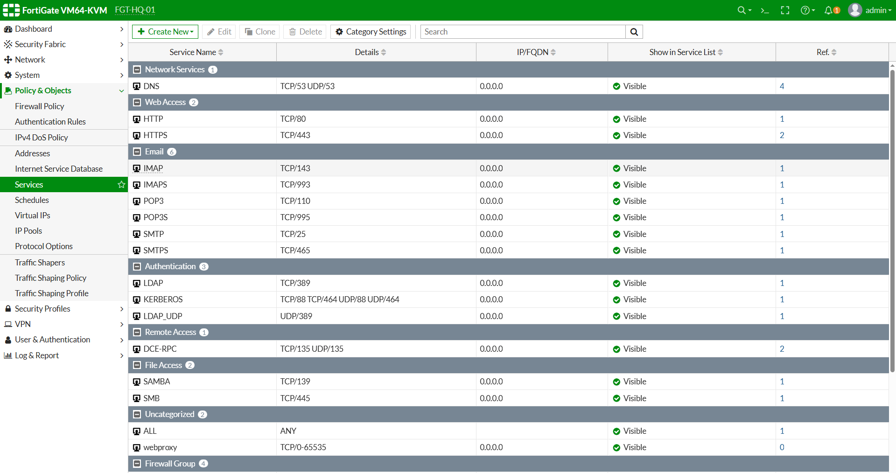


# بررسی Serviceها از طریق CLI

دستور زیر را اجرا نمایید.

```bash
show firewall service custom
```

سپس برای مشاهده کامل تنظیمات:

```bash
show full-configuration firewall service custom
```

توجه داشته باشید که Serviceهای سیستمی در بخش جداگانه‌ای نگهداری می‌شوند و همه آن‌ها در این خروجی نمایش داده نمی‌شوند.


# ایجاد اولین Service Object

اگرچه FortiGate از قبل Service مربوط به HTTP را در اختیار ما قرار داده است، اما در بسیاری از سازمان‌ها برای استانداردسازی از Service Objectهای اختصاصی استفاده می‌شود.

در این سناریو یک Service اختصاصی ایجاد خواهیم کرد.

---

## GUI

```
Policy & Objects

↓

Services

↓

Create New

↓

Service
```

---

تنظیمات زیر را وارد نمایید.

| گزینه | مقدار |
|--------|--------|
| Name | HTTP_ONLY |
| Protocol | TCP |
| Destination Port | 80 |
| Comments | HTTP Service Only |

---

## توضیح گزینه‌ها

### Name

نام Service باید هدف آن را مشخص کند.

نمونه مناسب:

```
HTTP_ONLY
```

از نام‌هایی مانند:

```
Service1

TCP80

MyService
```

استفاده نکنید.

---

### Protocol

از آنجایی که HTTP روی TCP اجرا می‌شود، Protocol برابر خواهد بود با:

```
TCP
```

---

### Destination Port

شماره پورت مقصد را وارد نمایید.

```
80
```

---

### Comments

برای تمام Serviceها توضیح ثبت کنید.

```
Allow HTTP Traffic Only
```


📸 Screenshot

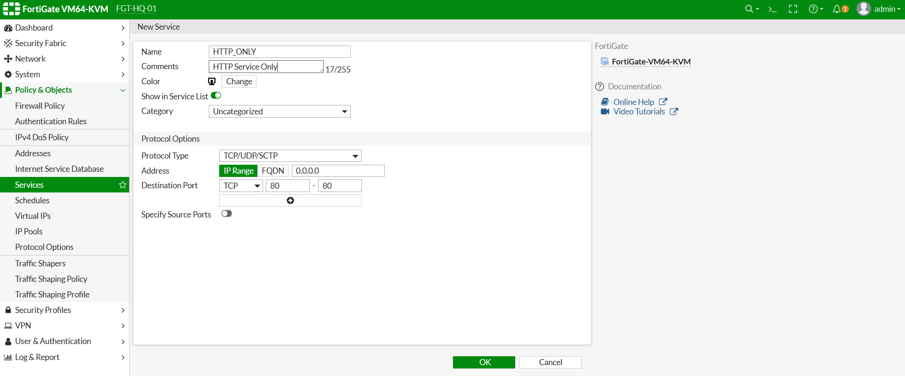

# ایجاد Service Object از طریق CLI

```bash
config firewall service custom

edit "HTTP_ONLY"

set tcp-portrange 80

set comment "Allow HTTP Traffic Only"

next

end
```

---

# بررسی Service ایجاد شده

اکنون دستور زیر را اجرا نمایید.

```bash
show firewall service custom
```

نمونه خروجی:

```text
HTTP_ONLY

Protocol

TCP

Port

80
```


<br><br>

# ایجاد Service Group

اکنون که اولین Service Object را ایجاد کرده‌ایم، زمان آن رسیده است که آن را داخل یک **Service Group** قرار دهیم.

ممکن است این سؤال پیش بیاید که وقتی تنها یک Service داریم، چرا باید Service Group ایجاد کنیم؟

دلیل آن، همانند Address Group، رعایت اصول طراحی شبکه‌های Enterprise است.

در حال حاضر تنها سرویس HTTP را مجاز خواهیم کرد، اما در سناریوهای آینده سرویس‌های دیگری نیز به کاربران اضافه خواهند شد.

به عنوان مثال:

```
HTTP_ONLY

HTTPS_ONLY

DNS_ONLY

NTP_ONLY

SSH_Admin

RDP_Admin
```

اگر از ابتدا Service Group ایجاد کنیم، در آینده بدون نیاز به تغییر Firewall Policy تنها کافی است اعضای Group را تغییر دهیم.

این روش مدیریت Policyها را بسیار ساده‌تر و استانداردتر می‌کند.


# ایجاد Service Group از طریق GUI

مسیر زیر را باز کنید.

```
Policy & Objects

↓

Services

↓

Create New

↓

Service Group
```


تنظیمات زیر را وارد نمایید.

| گزینه | مقدار |
|--------|--------|
| Name | WEB_SERVICES |
| Members | HTTP_ONLY |
| Comments | Allowed Web Services |

پس از انتخاب Member روی **OK** کلیک نمایید.

---

## توضیح گزینه‌ها

### Name

نام Group باید بیانگر نوع سرویس‌های موجود در آن باشد.

به عنوان مثال:

```
WEB_SERVICES
```

از نام‌هایی مانند:

```
Group1

Services

MyGroup
```

استفاده نکنید.


### Members

در حال حاضر تنها عضو Group عبارت است از:

```
HTTP_ONLY
```

در Taskهای آینده سرویس HTTPS نیز به همین Group اضافه خواهد شد.


### Comments

برای مستندسازی بهتر، توضیح مناسبی ثبت کنید.

```
Allowed Web Services
```


# ایجاد Service Group از طریق CLI

```bash
config firewall service group

edit "WEB_SERVICES"

set member "HTTP_ONLY"

set comment "Allowed Web Services"

next

end
```

---

# بررسی Service Group

برای بررسی Group ایجاد شده دستور زیر را اجرا نمایید.

```bash
show firewall service group
```

در صورت نیاز خروجی کامل را مشاهده کنید.

```bash
show full-configuration firewall service group
```

نمونه خروجی:

```text
WEB_SERVICES

Members

HTTP_ONLY
```

<br><br>


# ویرایش Firewall Policy

اکنون Firewall Policy را ویرایش می‌کنیم تا به جای استفاده از Service پیش‌فرض `ALL` تنها از Service Group ایجاد شده استفاده شود.


## چرا ALL مناسب نیست؟

ا Service پیش‌فرض `ALL` به معنی مجاز بودن تمام پروتکل‌ها و تمام پورت‌ها است.

به عنوان مثال:

- HTTP
- HTTPS
- SSH
- FTP
- RDP
- SMTP
- DNS
- Telnet

همگی اجازه عبور خواهند داشت.

در محیط‌های Enterprise این موضوع یک ریسک امنیتی محسوب می‌شود.

اصل **Least Privilege** بیان می‌کند که تنها سرویس‌هایی باید مجاز باشند که واقعاً مورد نیاز هستند.


# ویرایش Policy از طریق GUI

مسیر زیر را باز نمایید.

```
Policy & Objects

↓

Firewall Policy

↓

HQ-LAN-to-WAN-Allow

↓

Edit
```

---

تنظیمات زیر را تغییر دهید.

| گزینه | مقدار |
|--------|--------|
| Service | WEB_SERVICES |

سایر تنظیمات بدون تغییر باقی خواهند ماند.

روی **OK** کلیک نمایید.


📸 Screenshot

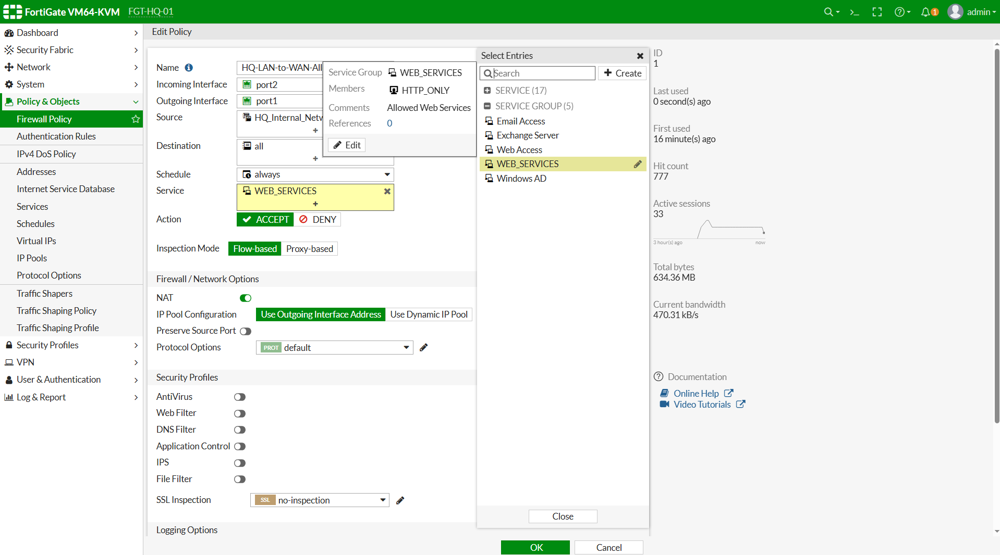

# ویرایش Policy از طریق CLI

```bash
config firewall policy

edit 1

set service "WEB_SERVICES"

next

end
```

---

# بررسی Firewall Policy

اکنون تنظیمات Policy را بررسی نمایید.

```bash
show firewall policy
```

نمونه خروجی:

```text
Policy Name

HQ-LAN-to-WAN-Allow

Service

WEB_SERVICES
```

اگر همچنان مقدار Service برابر ALL باشد، تغییرات ذخیره نشده‌اند.


# تحلیل Packet Flow پس از تغییر Service

اکنون مسیر پردازش Packet به شکل زیر خواهد بود.

```text
Windows Client

↓

Port2

↓

Firewall Policy Lookup

↓

Source Address Match

↓

HQ_Internal_Networks

↓

Destination Address Match

↓

all

↓

Service Match

↓

WEB_SERVICES

↓

HTTP_ONLY

↓

TCP Port 80

↓

NAT

↓

Routing

↓

WAN

↓

Internet
```

در این مرحله FortiGate شماره Port و Protocol هر Packet را بررسی می‌کند.

اگر Packet دارای ویژگی‌های زیر باشد:

```
TCP

Port 80
```

اجازه عبور صادر خواهد شد.

اما اگر Packet مربوط به:

```
TCP Port 443
```

باشد، با هیچ Service موجود در Group مطابقت نخواهد داشت و در نتیجه توسط **Implicit Deny** مسدود خواهد شد.


# بررسی تفاوت HTTP و HTTPS

در این سناریو تفاوت رفتار دو پروتکل را مشاهده خواهیم کرد.

| پروتکل | پورت | وضعیت |
|---------|------|--------|
| HTTP | TCP/80 | ✅ مجاز |
| HTTPS | TCP/443 | ❌ مسدود |

این تفاوت تنها به دلیل تغییر مقدار Service در Firewall Policy ایجاد شده است.

هیچ تغییری در Routing، NAT یا Interfaceها اعمال نشده است.


# بررسی Hit Count

پس از اعمال تغییرات، ستون Hit Count را بررسی نمایید.

```
Policy & Objects

↓

Firewall Policy
```

در صورت ارسال درخواست HTTP، مقدار Hit Count افزایش پیدا خواهد کرد.

درخواست‌های HTTPS با این Policy Match نخواهند شد.

<br><br>


# تسک  4 - ایجاد Time Schedule و اعمال آن روی Firewall Policy 


# هدف

در این Task با قابلیت **Firewall Schedule** در FortiGate آشنا خواهیم شد.

تا این مرحله Firewall Policy ما همیشه فعال بوده است و کاربران در هر ساعت از شبانه‌روز می‌توانند به اینترنت دسترسی داشته باشند.

اما در محیط‌های Enterprise معمولاً لازم است دسترسی کاربران تنها در بازه‌های زمانی مشخص مجاز باشد.

در پایان این Part:

- مفهوم Firewall Schedule را خواهید آموخت.
- انواع Schedule را خواهید شناخت.
- ا Scheduleهای پیش‌فرض FortiGate را بررسی خواهید کرد.
- اولین Enterprise Schedule را ایجاد خواهید کرد.
- نحوه ایجاد Schedule از طریق GUI و CLI را خواهید آموخت.


# مفاهیم

## ا Firewall Schedule چیست؟

ا Firewall Schedule قابلیتی است که به مدیر شبکه اجازه می‌دهد یک Firewall Policy تنها در زمان‌های مشخصی فعال باشد.

در واقع علاوه بر موارد زیر:

- Source
- Destination
- Service

شرط جدیدی نیز اضافه می‌شود.

```
Time
```

اگر زمان فعلی داخل بازه تعریف‌شده باشد، Packet اجازه عبور خواهد داشت.

در غیر این صورت حتی اگر تمام شرایط دیگر برقرار باشند، Firewall Packet را رد خواهد کرد.


## چرا از Schedule استفاده می‌کنیم؟

در بسیاری از سازمان‌ها نیازی نیست کاربران در تمام ساعات شبانه‌روز به اینترنت یا سرویس‌های داخلی دسترسی داشته باشند.

نمونه‌هایی از کاربرد Schedule:

- اینترنت فقط در ساعات اداری
- محدود کردن دسترسی کاربران مهمان
- فعال بودن VPN در زمان مشخص
- محدود کردن دسترسی پیمانکاران
- جلوگیری از دانلودهای شبانه
- محدود کردن دسترسی به سرورهای حساس

---

## انواع Schedule

ا FortiGate از دو نوع Schedule پشتیبانی می‌کند.

### One-Time Schedule

فقط یک بار و در یک تاریخ مشخص اجرا می‌شود.

نمونه:

```text
01/08/2026

08:00

↓

01/08/2026

17:00
```

این نوع معمولاً برای رویدادهای موقت استفاده می‌شود.

---

### Recurring Schedule

در روزهای مشخص هفته و ساعت‌های مشخص تکرار می‌شود.

نمونه:

```text
Saturday

↓

Wednesday

↓

08:00

↓

17:00
```

این نوع بیشترین استفاده را در محیط‌های Enterprise دارد.

در این سناریو نیز از همین نوع استفاده خواهیم کرد.

---

# سناریوی این مرحله

هدف این Task ایجاد یک Schedule برای ساعات کاری شرکت است.

مشخصات Schedule:

| روز | ساعت |
|------|-------|
| شنبه | 08:00 تا 17:00 |
| یکشنبه | 08:00 تا 17:00 |
| دوشنبه | 08:00 تا 17:00 |
| سه‌شنبه | 08:00 تا 17:00 |
| چهارشنبه | 08:00 تا 17:00 |

در Part بعدی این Schedule روی Firewall Policy اعمال خواهد شد.

---

# پیش‌نیازها

قبل از شروع این Task مطمئن شوید:

- ا Lab01 تکمیل شده باشد.
- ا Task1 تا Task3 از Lab02 انجام شده باشند.
- اینترنت برقرار باشد.
- ا Firewall Policy فعال باشد.
- ا Service Group ایجاد شده باشد.
-  تنظیمات NTP صحیح باشد.


# بررسی Scheduleهای پیش‌فرض

قبل از ایجاد Schedule جدید، بهتر است Scheduleهای موجود را بررسی کنیم.

## GUI

```
Policy & Objects

↓

Schedules
```

در این قسمت معمولاً چند Schedule پیش‌فرض مشاهده خواهید کرد.

مانند:

- always

ا Schedule **always** به معنی فعال بودن Policy در تمام ساعات شبانه‌روز است.

در حال حاضر Firewall Policy ما از همین Schedule استفاده می‌کند.


# بررسی Scheduleها از طریق CLI

دستور زیر را اجرا نمایید.

```bash
show firewall schedule recurring
```

همچنین برای مشاهده کامل تنظیمات:

```bash
show full-configuration firewall schedule recurring
```

در خروجی مشاهده خواهید کرد که Schedule پیش‌فرض always وجود دارد.


# ایجاد اولین Recurring Schedule

اکنون اولین Enterprise Schedule را ایجاد می‌کنیم.

## GUI

```
Policy & Objects

↓

Schedules

↓

Create New

↓

Recurring
```

---

تنظیمات زیر را وارد نمایید.

| گزینه | مقدار |
|--------|--------|
| Name | OFFICE_HOURS |
| Type | Recurring |
| Days | Saturday تا Wednesday |
| Start | 08:00 |
| End | 17:00 |
| Comments | Office Working Hours |

> **نکته:** با توجه به نسخه FortiOS 6.4.1 ممکن است نام روزها به صورت انگلیسی نمایش داده شوند. روزهای کاری را مطابق تقویم کاری آزمایشگاه خود انتخاب کنید.

---

## توضیح گزینه‌ها

### Name

نام Schedule باید نشان‌دهنده کاربرد آن باشد.

نمونه مناسب:

```
OFFICE_HOURS
```

از نام‌هایی مانند:

```
Schedule1

Time1

Work
```

استفاده نکنید.

---

### Days

روزهایی را انتخاب کنید که کاربران اجازه استفاده از اینترنت را دارند.

در این سناریو:

```
Saturday

Sunday

Monday

Tuesday

Wednesday
```

---

### Time

بازه زمانی مجاز:

```
08:00

↓

17:00
```

هر Packet خارج از این بازه زمانی توسط Firewall رد خواهد شد.

---

### Comments

همیشه توضیح کوتاهی برای Schedule ثبت نمایید.

```
Office Working Hours
```


# ایجاد Schedule از طریق CLI

```bash
config firewall schedule recurring

edit "OFFICE_HOURS"

set day saturday sunday monday tuesday wednesday

set start 08:00

set end 17:00

set comment "Office Working Hours"

next

end
```

---

# بررسی صحت ایجاد Schedule

برای بررسی Schedule ایجاد شده دستور زیر را اجرا نمایید.

```bash
show firewall schedule recurring
```

نمونه خروجی:

```text
OFFICE_HOURS

Saturday Sunday Monday Tuesday Wednesday

08:00

↓

17:00
```


📸 Screenshot

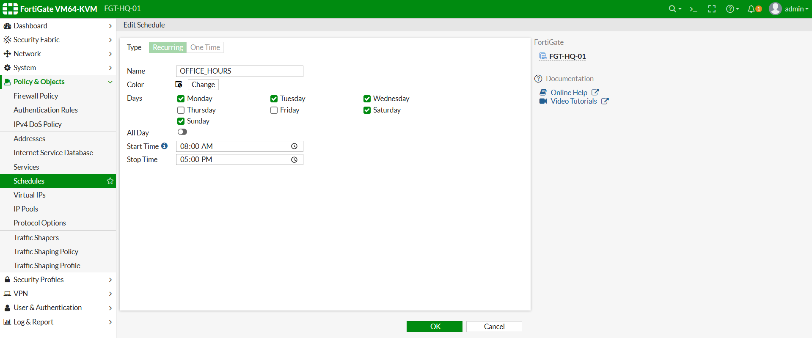


# تحلیل عملکرد Schedule

در حال حاضر Schedule ایجاد شده است اما هنوز روی هیچ Firewall Policy اعمال نشده است.

بنابراین:

- اینترنت همچنان برقرار است.
- ا Firewall Policy همچنان از Schedule پیش‌فرض **always** استفاده می‌کند.
- هنوز هیچ محدودیت زمانی اعمال نشده است.

<br><br>

# اعمال Schedule روی Firewall Policy

اکنون که Schedule سازمانی خود را ایجاد کرده‌ایم، زمان آن رسیده است که آن را روی Firewall Policy اعمال کنیم.

تا این لحظه Firewall Policy از Schedule پیش‌فرض:

```text
always
```

استفاده می‌کند.

این یعنی Policy در تمام ساعات شبانه‌روز فعال است.

در این بخش Schedule جدید را جایگزین خواهیم کرد.


# چرا Schedule روی Firewall Policy اعمال می‌شود؟

در FortiGate، Schedule به صورت مستقل هیچ تأثیری روی ترافیک ندارد.

تنها زمانی فعال می‌شود که داخل یک Firewall Policy مورد استفاده قرار گیرد.

به همین دلیل می‌توان یک Schedule را در چندین Policy مختلف استفاده کرد.

به عنوان مثال:

```
HQ-LAN-to-WAN-Allow

↓

OFFICE_HOURS
```

یا

```
Guest-to-Internet

↓

OFFICE_HOURS
```


# ویرایش Firewall Policy از طریق GUI

مسیر زیر را باز کنید.

```
Policy & Objects

↓

Firewall Policy

↓

HQ-LAN-to-WAN-Allow

↓

Edit
```


تنظیمات زیر را تغییر دهید.

| گزینه | مقدار |
|--------|--------|
| Schedule | OFFICE_HOURS |

سایر گزینه‌ها بدون تغییر باقی خواهند ماند.

روی **OK** کلیک نمایید.


📸 Screenshot

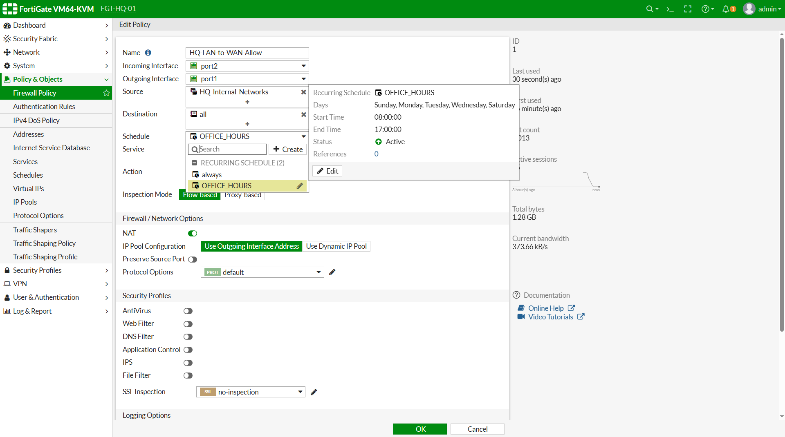


# ویرایش Firewall Policy از طریق CLI

```bash
config firewall policy

edit 1

set schedule "OFFICE_HOURS"

next

end
```

# بررسی Firewall Policy

اکنون Policy را بررسی نمایید.

```bash
show firewall policy
```

نمونه خروجی:

```text
Policy Name

HQ-LAN-to-WAN-Allow

Schedule

OFFICE_HOURS
```


# بررسی زمان سیستم

از آنجایی که عملکرد Schedule کاملاً وابسته به ساعت سیستم است، ابتدا باید زمان فعلی FortiGate را بررسی کنیم.

```bash
get system status
```

یا

```bash
diagnose sys ntp status
```

اطمینان حاصل کنید:

- ساعت صحیح باشد.
- ا Time Zone صحیح باشد.
- در صورت استفاده از NTP، وضعیت Synchronization برقرار باشد.


# تست در ساعات مجاز

اگر زمان فعلی داخل بازه:

```text
08:00

↓

17:00
```

باشد.

از Windows Client تست زیر را انجام دهید.

```cmd
ping 8.8.8.8
```

سپس

```cmd
ping google.com
```

در نهایت مرورگر را باز کنید.

```
http://10.10.10.20
```

یا هر Web Server آزمایشگاهی که در اختیار دارید.

در صورت صحیح بودن تنظیمات، ارتباط برقرار خواهد بود.


# تست خارج از ساعات اداری

برای مشاهده عملکرد واقعی Schedule، ساعت FortiGate را به صورت موقت تغییر دهید.

به عنوان مثال:

```text
22:00
```

یا

```text
23:30
```

اکنون همان تست‌ها را مجدداً انجام دهید.

```cmd
ping 8.8.8.8
```

و

```
http://10.10.10.20
```

در این حالت ارتباط باید قطع شده باشد.

زیرا Firewall Policy دیگر فعال نیست.


# چرا ارتباط قطع شد؟

در این سناریو:

- ا Source صحیح است.
- ا Destination صحیح است.
- ا Service صحیح است.
- ا NAT فعال است.
- ا Routing صحیح است.

اما شرط زمان برقرار نیست.

به همین دلیل FortiGate قبل از ایجاد Session، Firewall Policy را غیرفعال در نظر گرفته و Packet را رد می‌کند.


# تحلیل Packet Flow

در این مرحله مسیر پردازش Packet به شکل زیر خواهد بود.

```text
Windows Client

↓

Port2

↓

Firewall Policy Lookup

↓

Source Match

↓

Destination Match

↓

Service Match

↓

Schedule Match

↓

OFFICE_HOURS

↓

Time Check

↓

Allowed ؟

↓

YES

↓

NAT

↓

Routing

↓

WAN

↓

Internet
```

اگر پاسخ مرحله **Time Check** برابر **NO** باشد، Packet همان‌جا متوقف خواهد شد.


# بررسی Sessionهای فعال

در زمان مجاز:

```bash
diagnose sys session list
```

باید Session مربوط به Windows Client ایجاد شود.

اگر ساعت خارج از بازه کاری باشد، معمولاً Session جدیدی ایجاد نخواهد شد.


# بررسی Logهای Forward Traffic

اکنون وارد بخش Log شوید.

```
Log & Report

↓

Forward Traffic
```

در زمان مجاز باید ارتباط‌های مجاز ثبت شده باشند.

موارد زیر را بررسی نمایید.

- Policy Name
- Source IP
- Destination IP
- Service
- Action
- Time


# بررسی Logهای ترافیک مسدود شده

پس از قرار گرفتن خارج از ساعات کاری، مجدداً ارتباط برقرار کنید.

در صورت فعال بودن Logging، Log مربوط به رد شدن ارتباط نمایش داده خواهد شد.

موارد زیر را بررسی نمایید.

- Source
- Destination
- Service
- Policy
- Action
- Reason

در قسمت Reason معمولاً مشاهده خواهید کرد که ارتباط به دلیل عدم تطابق با Schedule مجاز نشده است.


# بررسی با Diagnose Debug Flow

برای مشاهده دقیق فرآیند تصمیم‌گیری FortiGate از ابزار Debug Flow استفاده نمایید.

ابتدا دستورات زیر را اجرا کنید.

```bash
diagnose debug reset

diagnose debug console timestamp enable

diagnose debug flow filter addr 10.10.10.10

diagnose debug enable

diagnose debug flow trace start 20
```

اکنون از Windows Client یک درخواست HTTP ارسال نمایید.

در خروجی Debug مشاهده خواهید کرد که FortiGate علاوه بر بررسی Source، Destination و Service، وضعیت Schedule را نیز کنترل می‌کند.

پس از پایان آزمایش، Debug را غیرفعال نمایید.

```bash
diagnose debug disable

diagnose debug reset
```

<br><br>


# تسک  5 - ایجاد Virtual IP (VIP) و Port Forwarding (Part 1)


# هدف

در این بخش، زیرساخت لازم برای انتشار اولین سرویس داخلی روی اینترنت را آماده می‌کنیم.

تا این لحظه تمام ارتباطات شبکه از داخل به خارج (LAN → WAN) بوده است. اکنون می‌خواهیم امکان دسترسی از خارج به یک سرویس داخلی را فراهم کنیم.

برای این منظور از قابلیت **Virtual IP (VIP)** در FortiGate استفاده خواهیم کرد.

در پایان این Part:

- مفهوم Virtual IP را درک خواهید کرد.
- تفاوت DNAT و SNAT را خواهید آموخت.
- وضعیت Apache Server را بررسی خواهید کرد.
- تنظیمات شبکه Ubuntu Server را آماده خواهید کرد.
- اولین VIP را ایجاد خواهید کرد.
- ا Port Forwarding را برای HTTP پیکربندی خواهید نمود.


# مفاهیم

## تفاوت SNAT و DNAT

در Taskهای قبلی، زمانی که کاربران داخلی به اینترنت متصل می‌شدند، FortiGate آدرس IP مبدأ را تغییر می‌داد.

به این فرآیند **Source NAT (SNAT)** گفته می‌شود.

نمونه:

```text
Windows Client

10.10.10.10

↓

FortiGate

↓

192.168.253.130

↓

Internet
```

اما زمانی که یک کاربر از اینترنت قصد دسترسی به یک سرور داخلی را داشته باشد، باید آدرس مقصد تغییر کند.

این فرآیند **Destination NAT (DNAT)** نام دارد.

نمونه:

```text
Internet Client

↓

192.168.253.130:80

↓

FortiGate

↓

10.10.10.20:80

Ubuntu Apache
```


## ا Virtual IP چیست؟

ا Virtual IP یا VIP یک شیء (Object) در FortiGate است که مشخص می‌کند درخواست‌هایی که به یک IP و پورت مشخص وارد می‌شوند، به کدام سرور داخلی ارسال شوند.

به زبان ساده:

```text
اگر Packet به:

192.168.253.130:80

رسید

↓

آن را به:

10.10.10.20:80

ارسال کن.
```

خود VIP به تنهایی اجازه عبور ترافیک را نمی‌دهد.

برای فعال شدن آن، باید در Task بعدی یک **Firewall Policy** نیز ایجاد شود.


## ا Port Forwarding چیست؟

گاهی لازم نیست تمام سرویس‌های یک سرور در دسترس باشند.

برای مثال، روی سرور Ubuntu ممکن است سرویس‌های زیر فعال باشند:

- SSH (22)
- HTTP (80)
- HTTPS (443)

اما فقط قصد داریم HTTP را منتشر کنیم.

در این حالت از قابلیت **Port Forwarding** استفاده می‌کنیم.

در این سناریو:

```text
External Port : 80

↓

Internal Port : 80
```


# سناریوی این مرحله

در این Task، سرور Ubuntu نقش Web Server شرکت را ایفا می‌کند.

مشخصات سرور:

| مورد | مقدار |
|------|--------|
| Server | Ubuntu Server |
| IP Address | 10.10.10.20 |
| Service | Apache2 |
| Port | TCP/80 |

در پایان این بخش، یک VIP ایجاد می‌کنیم تا درخواست‌های HTTP از سمت اینترنت به این سرور هدایت شوند.


# پیش‌نیازها

قبل از شروع این بخش، موارد زیر را بررسی کنید:

- ا Ubuntu Server روشن باشد.
- ا Apache نصب و فعال باشد.
- ا IP سرور به صورت Static تنظیم شده باشد.
- ا Gateway برابر با `10.10.10.1` باشد.
- ا Windows Client به اینترنت دسترسی داشته باشد.
- ا Kali Linux در سمت WAN قرار داشته باشد.
- ا Taskهای قبلی Lab02 تکمیل شده باشند.

# بررسی تنظیمات Ubuntu Server

ابتدا وارد Ubuntu شوید و وضعیت کارت شبکه را بررسی کنید.

```bash
ip addr
```


# بررسی Default Gateway

دستور زیر را اجرا کنید:

```bash
ip route
```


# بررسی وضعیت Apache

ابتدا مطمئن شوید سرویس Apache در حال اجرا است.

```bash
systemctl status apache2
```

در خروجی باید عبارت زیر مشاهده شود:

```text
active (running)
```


# تست Apache از داخل شبکه

از Windows Client مرورگر را باز کنید و آدرس زیر را وارد نمایید:

```text
http://10.10.10.20
```

باید صفحه پیش‌فرض Apache نمایش داده شود.

در صورتی که صفحه باز نشد، ابتدا مشکل Apache یا ارتباط شبکه را برطرف کنید و سپس ادامه دهید.


# ایجاد اولین Virtual IP

اکنون وارد FortiGate شوید.

مسیر زیر را باز کنید:

```
Policy & Objects

↓

Virtual IPs

↓

Create New
```

---

تنظیمات زیر را وارد نمایید.

| گزینه | مقدار |
|--------|--------|
| Name | VIP_HTTP_APACHE |
| Interface | port1 |
| External IP Address | 192.168.253.187 *(WAN IP FortiGate)* |
| Mapped IP Address | 10.10.10.20 |
| Port Forwarding | Enable |
| Protocol | TCP |
| External Service Port | 80 |
| Map to Port | 80 |
| Comments | Publish Apache Web Server |

> **نکته:** اگر IP اینترفیس WAN شما با `192.168.253.187` متفاوت است، همان IP واقعی Interface `port1` را وارد کنید.

---

📸 Screenshot

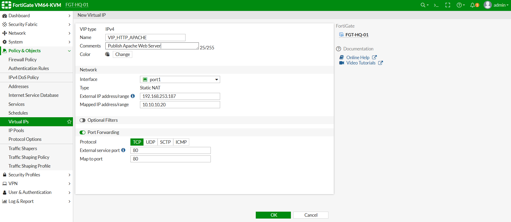

# ایجاد VIP از طریق CLI

```bash
config firewall vip

edit "VIP_HTTP_APACHE"

set extip 192.168.253.130

set mappedip "10.10.10.20"

set extintf "port1"

set portforward enable

set protocol tcp

set extport 80

set mappedport 80

set comment "Publish Apache Web Server"

next

end
```

---

# بررسی صحت ایجاد VIP

برای مشاهده تنظیمات ایجاد شده، دستور زیر را اجرا کنید:

```bash
show firewall vip
```

نمونه خروجی:

```text
VIP_HTTP_APACHE

External IP

192.168.253.130

Mapped IP

10.10.10.20

Port

80 → 80

Interface

port1
```


# تحلیل عملکرد VIP

در حال حاضر VIP ایجاد شده است، اما هنوز هیچ Firewall Policy برای آن وجود ندارد.

بنابراین اگر از Kali Linux آدرس زیر را باز کنید:

```text
http://192.168.253.130
```

هنوز ارتباط برقرار نخواهد شد.

دلیل این موضوع بسیار مهم است.

در FortiGate:

- ا VIP فقط عمل **Destination NAT** را انجام می‌دهد.
- اجازه عبور Packet همچنان توسط **Firewall Policy** صادر می‌شود.

<br><br>


در Part قبل اولین Virtual IP را ایجاد کردیم، اما همان‌طور که مشاهده شد، هنوز امکان دسترسی به Apache Server از سمت اینترنت وجود ندارد.

دلیل این موضوع آن است که VIP تنها عمل **Destination NAT (DNAT)** را انجام می‌دهد و اجازه عبور Packet همچنان توسط Firewall Policy صادر می‌شود.

در این بخش:

- اولین Firewall Policy از نوع WAN → LAN را ایجاد خواهیم کرد.
- ا VIP را داخل Policy استفاده می‌کنیم.
- دسترسی به Apache Server را از Kali Linux آزمایش خواهیم کرد.
- ا Logها، Sessionها و Packet Flow را بررسی خواهیم نمود.
- عملکرد کامل DNAT را تحلیل خواهیم کرد.

# مفاهیم

## چرا فقط ایجاد VIP کافی نیست؟

بسیاری از افراد تازه‌کار تصور می‌کنند که با ساخت VIP، سرویس داخلی در اینترنت منتشر می‌شود.

در حالی که این تصور اشتباه است.

ا VIP تنها مشخص می‌کند:

```
اگر Packet به این IP رسید

↓

ا Destination را تغییر بده.
```

اما هنوز مشخص نیست که Packet اجازه عبور دارد یا خیر.

تصمیم نهایی توسط Firewall Policy گرفته می‌شود.

به همین دلیل همیشه پس از ساخت VIP باید یک Firewall Policy نیز ایجاد شود.


## مسیر حرکت Packet

پس از ایجاد Policy، مسیر عبور Packet به شکل زیر خواهد بود.

```text
Kali Linux

↓

Port1 (WAN)

↓

Firewall Policy

↓

VIP Match

↓

Destination NAT

↓

10.10.10.20

↓

Apache

↓

Response

↓

FortiGate

↓

Source NAT (در صورت نیاز)

↓

Kali Linux
```

در این سناریو FortiGate ابتدا Firewall Policy را بررسی می‌کند و سپس عملیات DNAT را انجام می‌دهد.


# سناریوی این مرحله

هدف این بخش:

انتشار Web Server داخلی روی اینترنت.

در پایان این مرحله:

```
http://WAN-IP
```

باید صفحه پیش‌فرض Apache را نمایش دهد.


# ایجاد Firewall Policy

## GUI

```
Policy & Objects

↓

Firewall Policy

↓

Create New
```

---

تنظیمات زیر را وارد نمایید.

| گزینه | مقدار |
|--------|--------|
| Name | WAN_to_Apache |
| Incoming Interface | port1 |
| Outgoing Interface | port2 |
| Source | all |
| Destination | VIP_HTTP_APACHE |
| Schedule | always |
| Service | HTTP |
| Action | ACCEPT |
| NAT | Disable |
| Log Allowed Traffic | All Sessions |
| Comments | Publish Apache Server |


## چرا NAT را غیرفعال می‌کنیم؟

در Policyهای خروجی LAN → WAN گزینه NAT را فعال می‌کردیم.

اما در سناریوی VIP، عملیات NAT توسط خود Virtual IP انجام می‌شود.

بنابراین گزینه NAT در Firewall Policy باید غیرفعال باقی بماند.


📸 Screenshot

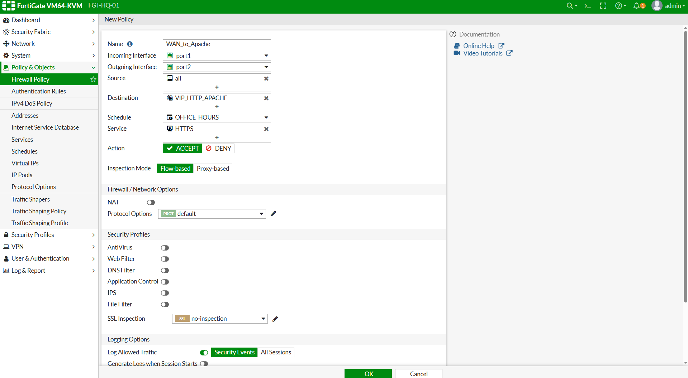


# ایجاد Policy از طریق CLI

```bash
config firewall policy

edit 2

set name "WAN_to_Apache"

set srcintf "port1"

set dstintf "port2"

set srcaddr "all"

set dstaddr "VIP_HTTP_APACHE"

set action accept

set schedule "always"

set service "HTTP"

set logtraffic all

set comments "Publish Apache Server"

next

end
```


# بررسی Firewall Policy

برای اطمینان از صحت تنظیمات دستور زیر را اجرا نمایید.

```bash
show firewall policy
```

نمونه خروجی:

```text
Policy Name

WAN_to_Apache

Incoming

port1

Outgoing

port2

Destination

VIP_HTTP_APACHE

Service

HTTP

Action

ACCEPT
```


# تست دسترسی از Kali Linux

اکنون وارد Kali شوید.

ابتدا ارتباط با IP عمومی FortiGate را بررسی نمایید.

```bash
ping 192.168.253.x(187)
```

در صورت پاسخ، ارتباط لایه سوم برقرار است.

سپس مرورگر Firefox را باز کنید.

یا از دستور زیر استفاده نمایید.

```bash
curl http://192.168.253.* (187)
```

در صورت موفقیت باید محتوای صفحه پیش‌فرض Apache نمایش داده شود.


# بررسی صفحه Apache

در مرورگر باید صفحه زیر نمایش داده شود.

```text
Apache2 Ubuntu Default Page
```

این صفحه نشان می‌دهد که درخواست اینترنت با موفقیت توسط FortiGate به Ubuntu Server منتقل شده است.


# بررسی Session

اکنون Session مربوط به ارتباط ایجاد شده را بررسی می‌کنیم.

```bash
diagnose sys session filter dport 80
```

سپس:

```bash
diagnose sys session list
```

در خروجی باید Session مربوط به ارتباط HTTP مشاهده شود.


# بررسی Logها

GUI

```
Log & Report

↓

Forward Traffic
```

آخرین ارتباط را انتخاب نمایید.

موارد زیر را بررسی کنید.

- Source IP
- Destination IP
- VIP Name
- Service
- Action
- Policy Name


# تحلیل Packet Flow

اکنون مسیر کامل Packet را بررسی می‌کنیم.

```text
Kali Linux

↓

Port1

↓

Firewall Policy

↓

VIP_HTTP_APACHE

↓

Destination NAT

↓

10.10.10.20

↓

Apache Server

↓

HTTP Response

↓

FortiGate

↓

Port1

↓

Kali Linux
```

در این فرآیند:

- ا Firewall Policy اجازه عبور Packet را صادر می‌کند.
- ا VIP آدرس مقصد را تغییر می‌دهد.
- ا Apache درخواست را دریافت می‌کند.
- پاسخ مجدداً از طریق FortiGate به کاربر اینترنت بازگردانده می‌شود.


# بررسی Debug Flow

برای مشاهده عملکرد داخلی FortiGate، Debug Flow را اجرا نمایید.

```bash
diagnose debug reset

diagnose debug flow filter dport 80

diagnose debug flow show console enable

diagnose debug enable

diagnose debug flow trace start 20
```

اکنون دوباره از Kali درخواست HTTP ارسال کنید.

پس از پایان آزمایش:

```bash
diagnose debug disable
```

در خروجی مشاهده خواهید کرد که:

- ا Packet وارد Port1 شده است.
- ا Firewall Policy پیدا شده است.
- ا VIP اعمال شده است.
- ا Destination IP تغییر کرده است.
- ا Packet به Port2 ارسال شده است.
