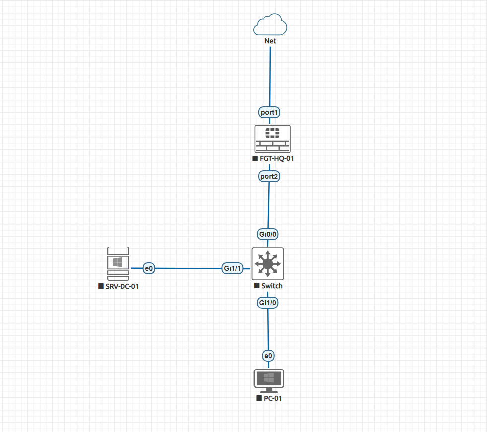
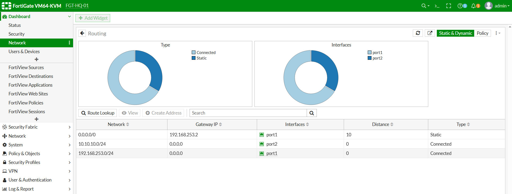
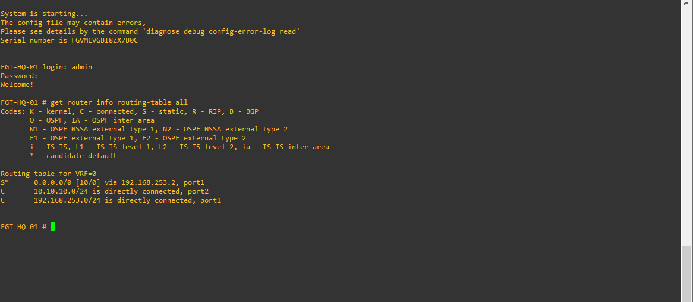
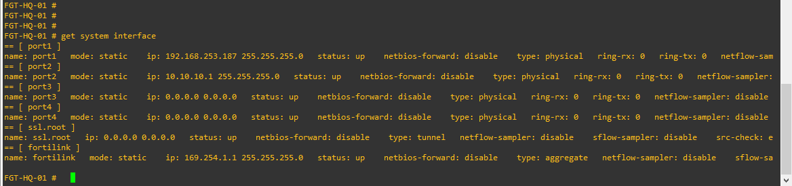

# Lab03 - Routing

# هدف

در این لابراتوار با مفاهیم Routing در FortiGate آشنا خواهیم شد.

تا این مرحله شبکه ما تنها دارای یک مسیر خروجی (Default Route) بوده است و تمامی ترافیک از همان مسیر به اینترنت ارسال می‌شد.

در محیط‌های Enterprise معمولاً چندین مسیر، چندین Gateway، چندین لینک اینترنت و حتی چندین شعبه وجود دارد. مدیر شبکه باید بتواند مسیر مناسب برای هر نوع ترافیک را طراحی، پیاده‌سازی و عیب‌یابی کند.

هدف این Lab، یادگیری Routing از پایه تا سطح Enterprise و آماده‌سازی زیرساخت برای سناریوهای VPN، SD-WAN و High Availability است.


# موارد آموزشی

در این Lab موارد زیر را به صورت عملی پیاده‌سازی خواهیم کرد.

- a شناخت معماری Routing در FortiGate
- Connected Route
- Static Route
- Default Route
- Administrative Distance
- Gateway
- Routing Table
- Route Lookup
- Policy Route
- Blackhole Route
- Floating Static Route
- ECMP (Equal Cost Multi Path)
- SD-WAN Basics
- Routing Diagnostics
- Packet Flow در فرآیند Routing
- Troubleshooting مسیرها


# توپولوژی

در این Lab از همان توپولوژی Lab02 استفاده می‌کنیم و آن را در مراحل بعدی گسترش خواهیم داد.



# Task های این لابراتوار

- Task 1 - آشنایی با Routing و Routing Table
- Task 2 - Static Route
- Task 3 - Policy Route
- Task 4 - Blackhole و Floating Route
- Task 5 - ECMP
- Task 6 - SD-WAN Basics
- Task 7 - Routing Troubleshooting


# در پایان باید بتوانید

- جدول Routing را تحلیل کنید.
- مسیر عبور Packet را تشخیص دهید.
- Static Route ایجاد و مدیریت کنید.
- Administrative Distance را درک کنید.
- Policy Route پیاده‌سازی کنید.
- Routeهای Backup ایجاد کنید.
- ECMP را راه‌اندازی کنید.
- مفاهیم اولیه SD-WAN را پیاده‌سازی کنید.
- مشکلات Routing را با استفاده از ابزارهای FortiGate عیب‌یابی کنید.


# پیش‌نیازها

قبل از شروع این Lab مطمئن شوید:

- Lab01 با موفقیت تکمیل شده باشد.
- Lab02 با موفقیت تکمیل شده باشد.
- Windows Client به اینترنت دسترسی داشته باشد.
- Ubuntu Server فعال باشد.
- Windows Server فعال باشد.
- FortiGate روی FortiOS 6.4.x اجرا شود.
- تنظیمات NTP و DNS صحیح باشند.
<br><br>
<br><br>

# تسک 1 - آشنایی با Routing، Routing Table و Connected Route 


# هدف

در این Task با یکی از اساسی‌ترین مفاهیم شبکه یعنی **Routing** آشنا خواهیم شد.

تا پایان Lab02، FortiGate تنها دارای یک مسیر خروجی (Default Route) بود و تمام ترافیک کاربران از همان مسیر به اینترنت ارسال می‌شد.

اما سؤال اصلی اینجاست:

ا **FortiGate از کجا تشخیص می‌دهد که هر Packet را از کدام Interface خارج کند؟**

پاسخ این سؤال در **Routing Table** قرار دارد.

در این Task با نحوه تصمیم‌گیری FortiGate برای ارسال Packet، مفهوم Connected Route، Routing Table و فرآیند Route Lookup آشنا خواهیم شد.

در پایان این Task:

- مفهوم Routing را درک خواهید کرد.
- با Routing Table آشنا خواهید شد.
- ا Connected Routeها را خواهید شناخت.
- فرآیند Route Lookup را خواهید آموخت.
- نحوه تصمیم‌گیری FortiGate برای ارسال Packet را تحلیل خواهید کرد.


# مفاهیم

## ا Routing چیست؟

ا Routing فرآیندی است که در آن یک Router یا Firewall تصمیم می‌گیرد یک Packet را از کدام مسیر به مقصد ارسال کند.

به بیان ساده:

ا **Routing یعنی انتخاب بهترین مسیر برای رسیدن Packet به مقصد.**

اگر مقصد داخل همان شبکه باشد، Packet مستقیماً ارسال می‌شود.

اگر مقصد در شبکه دیگری باشد، Packet باید به Gateway مناسب ارسال شود.


## چرا Routing اهمیت دارد؟

تقریباً تمام قابلیت‌های FortiGate بر پایه Routing کار می‌کنند.

به عنوان مثال:

- دسترسی کاربران به اینترنت
- ارتباط بین VLANها
- ارتباط شعب از طریق IPsec VPN
- ا SSL VPN
- ا SD-WAN
- ا High Availability
- ا Policy Route

همگی قبل از هر چیز به Routing صحیح وابسته هستند.

اگر Routing به درستی پیکربندی نشده باشد، حتی بهترین Firewall Policyها نیز کار نخواهند کرد.

## ا Routing Table چیست؟

ا Routing Table جدولی است که تمام مسیرهای شناخته‌شده توسط FortiGate را نگهداری می‌کند.

هر بار که Packet وارد FortiGate می‌شود، ابتدا مقصد آن بررسی شده و سپس Routing Table جستجو می‌شود.

نمونه ساده:

```text
Destination         Gateway          Interface

0.0.0.0/0           192.168.253.2    port1

10.10.10.0/24       Connected        port2

192.168.253.0/24    Connected        port1
```

ا FortiGate همیشه بر اساس این جدول تصمیم می‌گیرد.


## Packet Flow در Routing

به صورت ساده، مسیر پردازش یک Packet به شکل زیر است.

```text
Windows Client

↓

FortiGate

↓

Firewall Policy

↓

Routing Table Lookup

↓

Best Route Selection

↓

Outgoing Interface

↓

Internet
```

دقت کنید که حتی اگر Firewall Policy اجازه عبور Packet را صادر کند، در صورت نبود Route مناسب، Packet هرگز از FortiGate خارج نخواهد شد.


## ا Connected Route چیست؟

هر Interface که دارای IP Address باشد، به صورت خودکار یک Route برای همان شبکه ایجاد می‌کند.

فرض کنید:

```text
port1

192.168.253.100/24
```

ا FortiGate به صورت خودکار Route زیر را ایجاد می‌کند.

```text
192.168.253.0/24

↓

Connected

↓

port1
```

همین موضوع برای Interface داخلی نیز صادق است.

```text
port2

10.10.10.1/24
```

بنابراین Route زیر نیز به صورت خودکار ایجاد خواهد شد.

```text
10.10.10.0/24

↓

Connected

↓

port2
```

این Routeها توسط Administrator ایجاد نمی‌شوند.

بلکه FortiGate آن‌ها را به صورت خودکار می‌سازد.

## تفاوت Connected Route و Static Route

ا Connected Route به صورت خودکار ایجاد می‌شود.

اما Static Route باید توسط Administrator تعریف شود.

مقایسه:

| ویژگی | Connected Route | Static Route |
|--------|-----------------|--------------|
| ایجاد خودکار | ✅ | ❌ |
| نیاز به Gateway | ❌ | ✅ |
| وابسته به Interface | ✅ | ❌ |
| قابل حذف دستی | ❌ | ✅ |

در Task بعدی، Static Route را به صورت عملی ایجاد خواهیم کرد.


# سناریوی این مرحله

در حال حاضر توپولوژی ما به شکل زیر است.

```text
                     Internet

                         │

                  VMware NAT

                         │

               192.168.253.0/24

                         │

                  FortiGate port1

                         │

        --------------------------------

                  FortiGate

                         │

                  FortiGate port2

                  10.10.10.1/24

                         │

        -------------------------------

          Windows Client

            10.10.10.100


        Windows Server

           10.10.10.10
```

در این Task هنوز هیچ Route جدیدی ایجاد نخواهیم کرد.

تنها Routeهای خودکار ایجادشده توسط FortiGate را بررسی خواهیم نمود.


# پیش‌نیازها

قبل از شروع این Task مطمئن شوید:

- Lab01 تکمیل شده باشد.
- Lab02 تکمیل شده باشد.
- Windows Client به اینترنت دسترسی داشته باشد.
- Ubuntu Server روشن باشد.
- Windows Server روشن باشد.
- FortiGate بدون خطا اجرا شود.
- Interfaceهای port1 و port2 در وضعیت Up باشند.


# Enterprise Insight

در بسیاری از شبکه‌های سازمانی، مدیران شبکه تصور می‌کنند Firewall تنها بر اساس Firewall Policy تصمیم می‌گیرد.

در حالی که واقعیت این است:

1. ا Packet وارد FortiGate می‌شود.
2. ا Firewall Policy بررسی می‌شود.
3. ا Routing Table بررسی می‌شود.
4. بهترین Route انتخاب می‌شود.
5. ا Packet ارسال می‌شود.

اگر حتی یکی از این مراحل دچار مشکل باشد، ارتباط برقرار نخواهد شد.

به همین دلیل، هنگام عیب‌یابی در محیط‌های Enterprise، همیشه **Routing Table** یکی از اولین بخش‌هایی است که بررسی می‌شود.


# Security Note

وجود یک Firewall Policy بدون Route مناسب، امنیت را افزایش نمی‌دهد و ارتباط نیز برقرار نخواهد شد.

از طرف دیگر، وجود Route مناسب بدون Firewall Policy نیز باعث عبور Packet نمی‌شود.

در FortiGate، **Routing** و **Firewall Policy** دو بخش مکمل یکدیگر هستند و هر دو باید به‌درستی پیکربندی شوند.


<br><br>

# بررسی Routing Table در GUI

اکنون قصد داریم اولین Routing Table خود را مشاهده کنیم.

تا این لحظه هیچ Route جدیدی ایجاد نکرده‌ایم، بنابراین تنها Routeهای خودکار (Connected Route) و Default Route موجود خواهند بود.

## GUI

```
Network

↓

Static Routes
```

در FortiOS 6.4.x علاوه بر Static Routeها، اطلاعاتی از Default Route نیز در این بخش قابل مشاهده است.

دقت کنید که Routeهای Connected در این صفحه نمایش داده نمی‌شوند و برای مشاهده آن‌ها باید از CLI استفاده کنیم.


# بررسی Routing Monitor
ا FortiGate دارای بخشی برای مشاهده وضعیت Routing است.

## GUI

```
Dashboard

↓

Network

↓

Routing Monitor
```

در برخی نسخه‌های FortiOS ممکن است این بخش با نام **Routing** یا **Router Monitor** نمایش داده شود.

در این قسمت می‌توانید مسیرهای فعال، Gatewayها و Interfaceهای خروجی را مشاهده کنید.

---

📸 Screenshot




# بررسی Routing Table از طریق CLI

اکنون وارد CLI شوید.

اولین دستور مهم Routing را اجرا نمایید.

```bash
get router info routing-table all
```

نمونه خروجی:

```text
Routing table for VRF=0

S*      0.0.0.0/0
        via 192.168.253.2, port1
C       10.10.10.0/24
        is directly connected, port2

C       192.168.253.0/24
        is directly connected, port1
```


ممکن است بسته به تنظیمات VMware یا Cloud، Gateway شما متفاوت باشد.




# تحلیل خروجی Routing Table

اجازه دهید هر خط را بررسی کنیم.


## Default Route

```text
S*

0.0.0.0/0

↓

192.168.253.2

↓

port1
```

معنی این Route:

اگر مقصد Packet در هیچ Route دیگری پیدا نشد،

ا Packet از طریق Gateway زیر ارسال شود.

```
192.168.253.2
```

از طریق

```
port1
```

حرف

```
S
```

به معنی

```
Static Route
```

است.

علامت

```
*
```

نیز نشان‌دهنده Default Route است.


## Connected Route شماره ۱

```text
C

192.168.253.0/24

↓

port1
```

حرف

```
C
```

مخفف

```
Connected
```

است.

این Route به صورت خودکار پس از تنظیم IP روی Interface ایجاد شده است.

---

## Connected Route شماره ۲

```text
C

10.10.10.0/24

↓

port2
```

این Route نیز به صورت خودکار توسط FortiGate ایجاد شده است.

هر دستگاهی که داخل این Subnet باشد بدون نیاز به Static Route قابل دسترس خواهد بود.


# بررسی Kernel Routing Table

اکنون دستور زیر را اجرا نمایید.

```bash
get router info kernel
```


این جدول همان اطلاعات Routing را از دید Kernel سیستم‌عامل FortiOS نمایش می‌دهد.

در بسیاری از پروژه‌های Enterprise هنگام عیب‌یابی از این دستور استفاده می‌شود.


# بررسی Routing Database

اکنون دستور زیر را اجرا نمایید.

```bash
get router info routing-table database
```

نمونه خروجی:

```text
Routing table database

Connected

Static

Kernel

Default
```

در حال حاضر تنها سه نوع Route مشاهده خواهید کرد.

- Connected
- Static
- Default

در Labهای آینده انواع دیگری از Route نیز به این جدول اضافه خواهند شد.


# بررسی Interfaceهای فعال

برای اینکه متوجه شویم چرا Connected Route ایجاد شده است، Interfaceها را بررسی می‌کنیم.

```bash
get system interface
```

یا

```bash
show system interface
```


هر Interface که دارای IP معتبر و وضعیت Up باشد، یک Connected Route ایجاد خواهد کرد.


📸 Screenshot




# ارتباط بین Interface و Connected Route

به نمودار زیر دقت کنید.

```text
Interface

↓

IP Address

↓

Network Address

↓

Connected Route

↓

Routing Table
```

مثال:

```text
Port2

↓

10.10.10.1/24

↓

10.10.10.0/24

↓

Connected Route
```

به همین دلیل، هنگام تغییر IP یک Interface، Routing Table نیز به صورت خودکار تغییر خواهد کرد.

---

# بررسی Route از دید Packet

فرض کنید Windows Client دارای IP زیر باشد.

```text
10.10.10.100
```

و بخواهد به

```text
8.8.8.8
```

متصل شود.

FortiGate ابتدا بررسی می‌کند:

آیا Route مخصوص

```
8.8.8.8
```

وجود دارد؟

پاسخ:

```
خیر
```

پس از آن، Default Route انتخاب می‌شود.

```text
0.0.0.0/0

↓

192.168.253.2

↓

port1
```

در نتیجه Packet از Interface

```
port1
```

خارج خواهد شد.


# Enterprise Insight

در سازمان‌های بزرگ ممکن است صدها Route در جدول Routing وجود داشته باشد.

به عنوان مثال:

- شبکه داخلی
- دیتاسنتر
- ا VPN
- ا Branch Office
- ا DMZ
- ا Cloud
- ا Backup Link

در چنین شرایطی، توانایی تحلیل سریع Routing Table یکی از مهم‌ترین مهارت‌های یک Administrator محسوب می‌شود.

تقریباً تمام مشکلات مربوط به ارتباط بین سایت‌ها، VPNها و لینک‌های WAN با بررسی همین جدول قابل تشخیص هستند.


# Security Note

وجود یک Route در Routing Table به معنای مجاز بودن ترافیک نیست.

پس از انتخاب Route، Packet همچنان باید از Firewall Policy عبور کند.

به همین دلیل در FortiGate همیشه دو مرحله اصلی وجود دارد.

```text
Routing

↓

Firewall Policy
```

یا بسته به مسیر پردازش، Firewall Policy و سپس تصمیم نهایی Routing برای Interface خروجی اعمال می‌شود. در هر صورت، هر دو مؤلفه برای برقراری ارتباط ضروری هستند.


# انتخاب بهترین Route (Best Route Selection)

تا این مرحله یاد گرفتیم که تمام Routeها داخل Routing Table قرار می‌گیرند.

اما سؤال اصلی اینجاست.

اگر چندین Route برای رسیدن به یک مقصد وجود داشته باشد، FortiGate از کدام Route استفاده می‌کند؟

پاسخ این سؤال در فرآیندی به نام **Best Route Selection** قرار دارد.

هر Packet قبل از خروج از FortiGate وارد این فرآیند می‌شود.


# ا Route Lookup چیست؟

ا Route Lookup فرآیندی است که طی آن FortiGate مقصد Packet را با Routeهای موجود در Routing Table مقایسه می‌کند.

هدف این فرآیند پیدا کردن بهترین مسیر برای رسیدن به مقصد است.

به صورت ساده:

```text
ا Packet وارد FortiGate می‌شود.

↓
ا Destination IP استخراج می‌شود.

↓

ا Routing Table بررسی می‌شود.

↓

بهترین Route انتخاب می‌شود.

↓

ا Packet از Interface مناسب خارج می‌شود.
```

تمام این مراحل در چند میلی‌ثانیه انجام می‌شوند.


# ا Longest Prefix Match چیست؟

یکی از مهم‌ترین قوانین Routing در تمام تجهیزات شبکه، قانون **Longest Prefix Match** است.

اگر چند Route با مقصد Packet مطابقت داشته باشند، همیشه Route با Prefix طولانی‌تر انتخاب می‌شود.

به عبارت دیگر:

 هرچه Subnet دقیق‌تر باشد، اولویت بیشتری دارد.


# مثال اول

فرض کنید Routing Table شامل Routeهای زیر باشد.

```text
0.0.0.0/0

↓

Default Route

---------------------

10.10.0.0/16

↓

Network Route

---------------------

10.10.10.0/24

↓

LAN Route
```

اکنون مقصد Packet برابر است با:

```text
10.10.10.25
```

هر سه Route با این مقصد مطابقت دارند.

اما FortiGate مسیر زیر را انتخاب خواهد کرد.

```text
10.10.10.0/24
```

زیرا دقیق‌ترین Route است.


# مثال دوم

فرض کنید مقصد برابر باشد با:

```text
10.10.50.10
```

در این حالت:

```text
10.10.10.0/24
```

مطابقت ندارد.

اما

```text
10.10.0.0/16
```

مطابقت دارد.

بنابراین همین Route انتخاب خواهد شد.


# مثال سوم

اگر مقصد برابر باشد با:

```text
8.8.8.8
```

هیچ Route اختصاصی وجود ندارد.

در نتیجه:

```text
0.0.0.0/0
```

انتخاب خواهد شد.

یعنی همان Default Route.


# ترتیب انتخاب Route

ا FortiGate برای انتخاب بهترین مسیر معمولاً مراحل زیر را طی می‌کند.

```text
Packet

↓

Destination IP

↓

Longest Prefix Match

↓

Administrative Distance

↓

Priority

↓

Outgoing Interface
```


# بررسی عملی با مثال

فرض کنید Routing Table ما به شکل زیر باشد.

```text
Destination

0.0.0.0/0

↓

port1

--------------------

10.10.10.0/24

↓

port2

--------------------

192.168.253.0/24

↓

port1
```


## مثال اول

Windows Client

```text
10.10.10.100
```

می‌خواهد به Ubuntu Server متصل شود.

```text
10.10.10.20
```

FortiGate بررسی می‌کند.

آیا مقصد داخل

```text
10.10.10.0/24
```

قرار دارد؟

پاسخ:

```
بله
```

بنابراین Packet از

```text
port2
```

خارج می‌شود.


## مثال دوم

Windows Client

می‌خواهد به

```text
8.8.8.8
```

متصل شود.

هیچ Route اختصاصی وجود ندارد.

بنابراین:

```text
Default Route

↓

port1
```

انتخاب خواهد شد.


# بررسی مسیر حرکت Packet

ارتباط با اینترنت

```text
Windows Client

↓

port2

↓

Firewall Policy

↓

Routing Lookup

↓

0.0.0.0/0

↓

port1

↓

Internet
```

---

ارتباط با Ubuntu Server

```text
Windows Client

↓

port2

↓

Firewall Policy

↓

Routing Lookup

↓

10.10.10.0/24

↓

port2

↓

Ubuntu Server
```

دقت کنید که در ارتباط داخلی، Packet هرگز از Interface WAN عبور نمی‌کند.


# مشاهده Route Lookup در CLI

برای بررسی Route مربوط به یک مقصد خاص، دستور زیر را اجرا نمایید.

```bash
get router info routing-table details
```

در نسخه‌های جدید FortiOS ممکن است اطلاعات بیشتری نمایش داده شود.

برای مشاهده کامل جدول نیز می‌توانید از دستور زیر استفاده کنید.

```bash
get router info routing-table all
```

در ادامه Lab از دستورات Diagnose نیز استفاده خواهیم کرد تا تصمیم Routing را به صورت لحظه‌ای مشاهده کنیم.


# Behind the Scenes

در پشت پرده، FortiGate برای هر Packet تمام Routing Table را از ابتدا تا انتها بررسی نمی‌کند.

پس از ساخته شدن Routing Table، اطلاعات به ساختاری به نام **Forwarding Information Base (FIB)** منتقل می‌شوند.

Kernel سیستم‌عامل FortiOS از FIB برای یافتن سریع‌ترین مسیر استفاده می‌کند.

به همین دلیل حتی زمانی که صدها یا هزاران Route در جدول وجود داشته باشد، انتخاب مسیر در زمان بسیار کوتاهی انجام می‌شود.

این موضوع یکی از عوامل اصلی عملکرد بالای FortiGate در شبکه‌های بزرگ است.

---

# Enterprise Insight

در بسیاری از سازمان‌ها، مدیر شبکه تصور می‌کند مشکل از Firewall Policy است، در حالی که دلیل اصلی، انتخاب نادرست Route است.

به عنوان مثال:

- اشتباه بودن Default Route
- وجود Static Route با Prefix دقیق‌تر
- همپوشانی Routeها
- ارسال ترافیک از Gateway اشتباه

