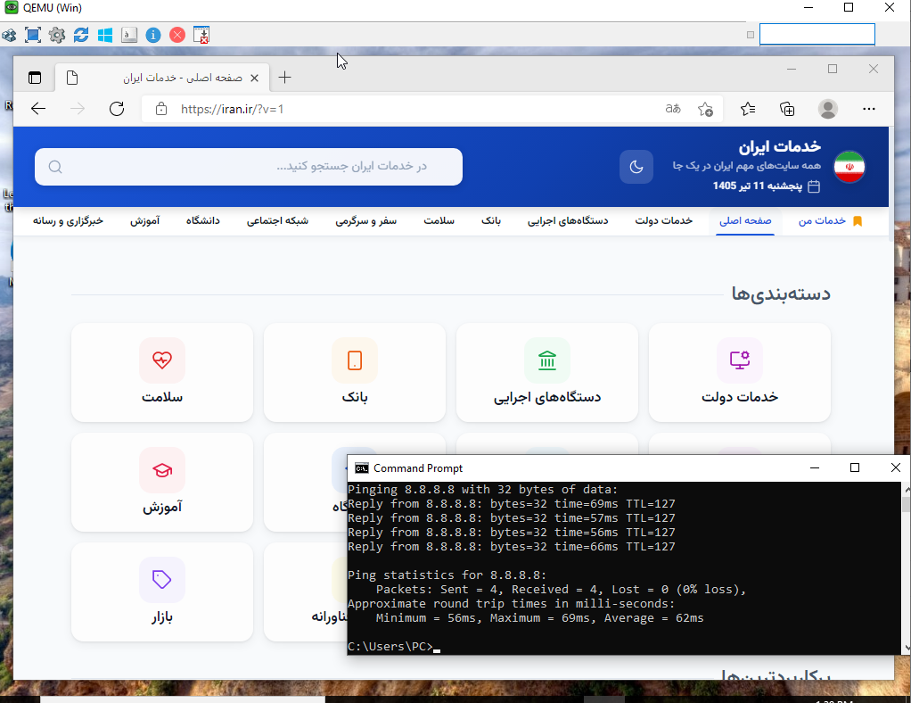
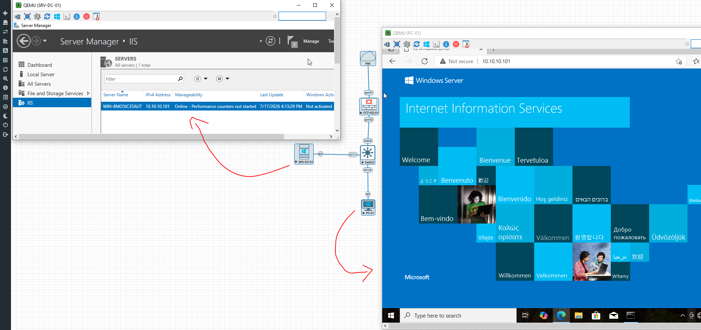
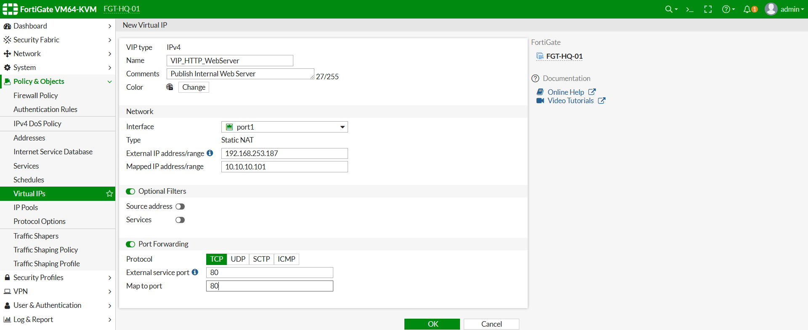
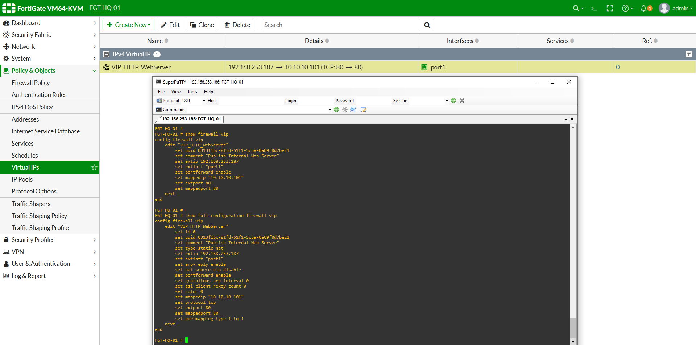
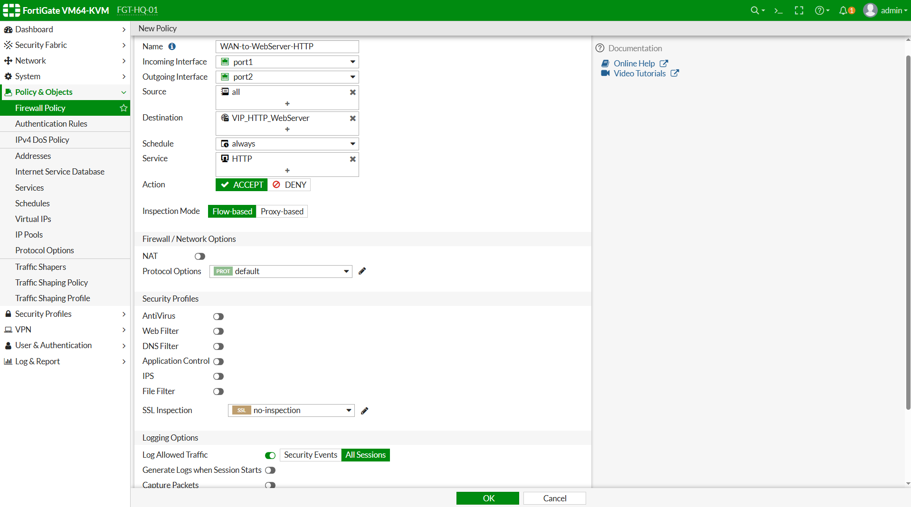
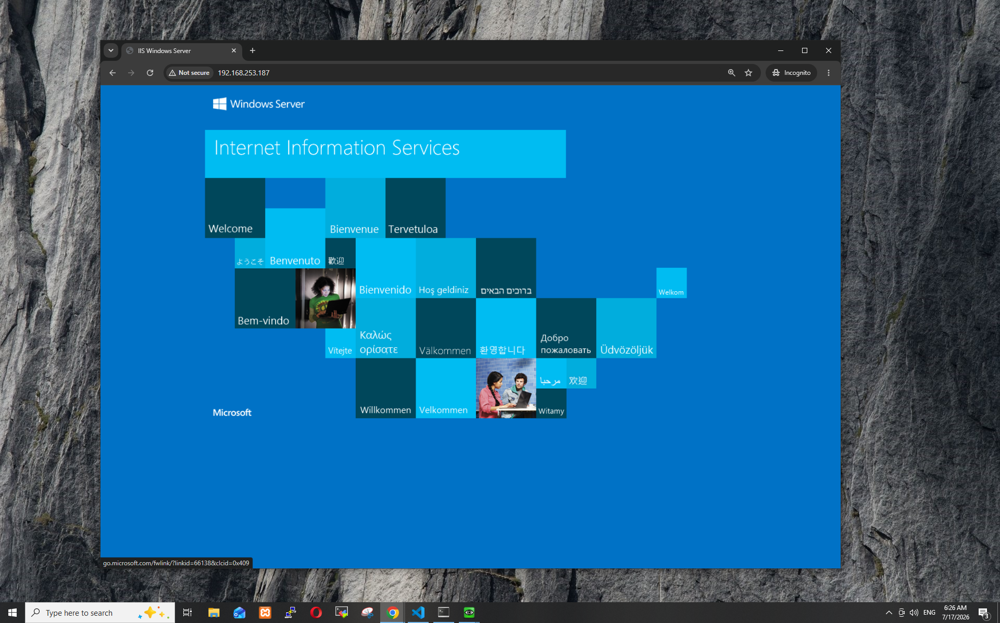
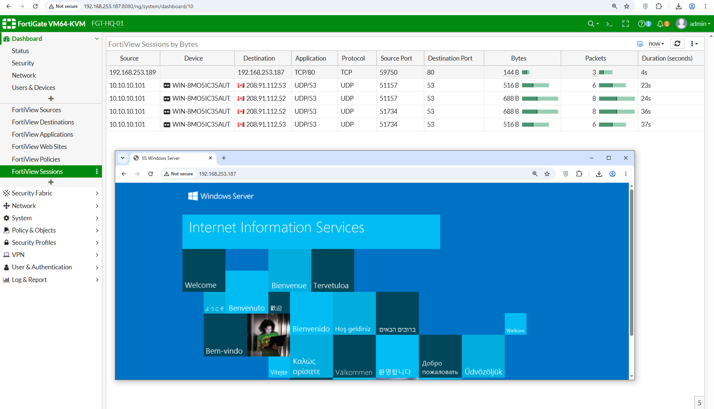
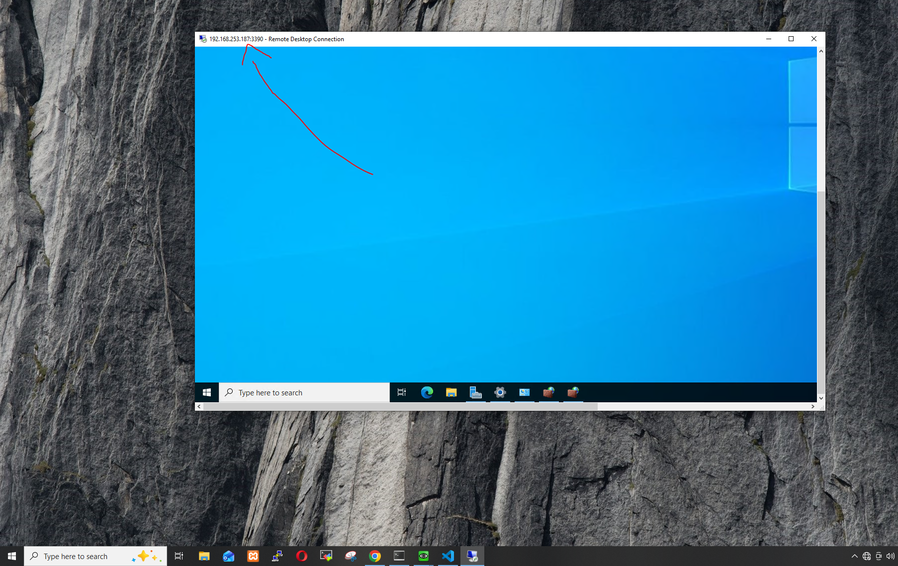
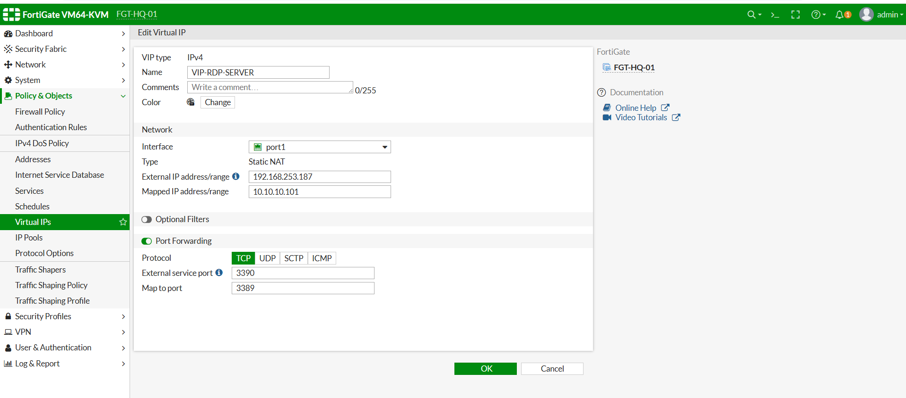
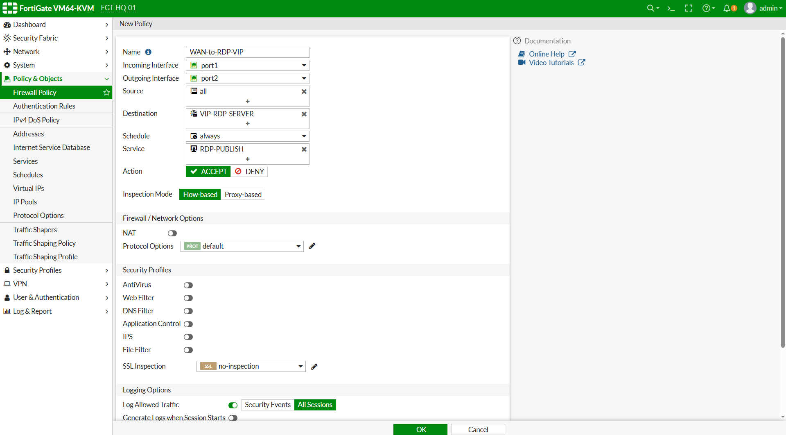

# تسک 1 - آشنایی با NAT، Packet Flow و انواع NAT


# هدف

در این Task با یکی از مهم‌ترین مفاهیم شبکه و همچنین یکی از اصلی‌ترین مباحث آزمون **NSE4** یعنی **Network Address Translation (NAT)** آشنا خواهیم شد.

تقریباً تمام سازمان‌هایی که از FortiGate استفاده می‌کنند، به نوعی از NAT استفاده می‌کنند؛ چه برای دسترسی کاربران داخلی به اینترنت و چه برای انتشار سرویس‌های داخلی مانند Web Server، Mail Server یا VPN.

در پایان این Part:

- مفهوم NAT را خواهید آموخت.
- دلیل ایجاد NAT را درک خواهید کرد.
- تفاوت Private IP و Public IP را خواهید شناخت.
- انواع NAT را خواهید شناخت.
- با مفاهیم Source NAT و Destination NAT آشنا خواهید شد.
- ا Packet Flow مربوط به NAT را به صورت تئوری بررسی خواهید کرد.

# مفاهیم

## ا NAT چیست؟

ا NAT مخفف عبارت **Network Address Translation** است.

ا NAT فرآیندی است که طی آن FortiGate آدرس IP مبدأ یا مقصد یک Packet را هنگام عبور از Firewall تغییر می‌دهد.

به زبان ساده:

```
قبل از خروج Packet

↓

تغییر IP

↓

ارسال Packet
```

یا

```
قبل از ورود Packet

↓

تغییر IP مقصد

↓

ارسال به سرور داخلی
```

به همین دلیل NAT یکی از مهم‌ترین قابلیت‌های هر Firewall محسوب می‌شود.


## چرا NAT ایجاد شد؟

مهم‌ترین دلیل ایجاد NAT کمبود آدرس‌های IPv4 بود.

تعداد آدرس‌های IPv4 محدود است و امکان اختصاص یک IP عمومی به تمام دستگاه‌های دنیا وجود ندارد.

به همین دلیل از آدرس‌های خصوصی (Private IP) در شبکه‌های داخلی استفاده می‌شود و هنگام ارتباط با اینترنت، این آدرس‌ها توسط NAT به یک Public IP تبدیل می‌شوند.


## ا Private IP چیست؟

آدرس‌های Private در اینترنت قابل مسیریابی نیستند و تنها در شبکه‌های داخلی استفاده می‌شوند.

رنج‌های استاندارد Private عبارت‌اند از:

| Range | توضیح |
|--------|-------|
| 10.0.0.0/8 | شبکه‌های بزرگ |
| 172.16.0.0/12 | شبکه‌های متوسط |
| 192.168.0.0/16 | شبکه‌های کوچک |

در آزمایشگاه ما از شبکه زیر استفاده می‌کنیم:

```
10.10.10.0/24
```

## ا Public IP چیست؟

ا Public IP آدرسی است که در اینترنت قابل دسترس و مسیریابی است.

در محیط آزمایشگاهی ما، Interface **port1** از طریق VMware Cloud یا NAT به اینترنت متصل است و نقش Public Network را ایفا می‌کند.

# سناریوی این Lab

در این آزمایشگاه قصد داریم یک Web Server داخلی را از طریق FortiGate در اختیار کاربران اینترنت قرار دهیم.

توپولوژی به صورت زیر خواهد بود.

```text
Internet

↓

FortiGate

↓

Web Server
```

در مراحل بعدی سرویس‌های زیر را منتشر خواهیم کرد:

- HTTP
- HTTPS
- SSH
- RDP


# انواع NAT

ا FortiGate از انواع مختلف NAT پشتیبانی می‌کند.

در این Lab مهم‌ترین آن‌ها را بررسی خواهیم کرد.


## Source NAT (SNAT)

در Source NAT، آدرس IP مبدأ تغییر می‌کند.

نمونه:

```
Windows Client

10.10.10.100

↓

FortiGate

↓

203.x.x.x

↓

Internet
```

کاربران اینترنت تنها Public IP را مشاهده می‌کنند و از آدرس داخلی کاربران اطلاعی ندارند.

در حال حاضر نیز اینترنت کاربران آزمایشگاه با همین روش برقرار است.


## Destination NAT (DNAT)

در Destination NAT، آدرس مقصد تغییر می‌کند.

نمونه:

```
Internet

↓

203.x.x.x

↓

FortiGate

↓

10.10.10.100
```

کاربر اینترنت Public IP را وارد می‌کند اما FortiGate ترافیک را به Web Server داخلی ارسال می‌کند.

در FortiGate این قابلیت با استفاده از **VIP (Virtual IP)** پیاده‌سازی می‌شود.


## Static NAT

در Static NAT یک Public IP به صورت دائمی به یک Private IP نگاشت می‌شود.

نمونه:

```
203.x.x.x

↓

10.10.10.100
```

در این حالت تمام پورت‌ها به سرور داخلی منتقل خواهند شد.


## Port Forward

در Port Forward تنها یک یا چند پورت مشخص به سرور داخلی هدایت می‌شوند.

نمونه:

```
203.x.x.x:80

↓

10.10.10.100:80
```

یا

```
203.x.x.x:22

↓

10.10.10.100:22
```

این روش نسبت به Static NAT امنیت بیشتری دارد، زیرا فقط سرویس‌های موردنیاز منتشر می‌شوند.


# Packet Flow در NAT

هنگام دسترسی یک Client داخلی به اینترنت، مسیر حرکت Packet به صورت زیر است.

```text
Windows Client

↓

Port2

↓

Firewall Policy

↓

Source NAT

↓

Routing

↓

Port1

↓

Internet
```


<br><br>


اکنون قصد داریم NAT را به صورت عملی در FortiGate بررسی کنیم.

نکته مهم اینجاست که حتی اگر تا این لحظه هیچ VIP یا Port Forwarding ایجاد نکرده باشید، FortiGate در حال حاضر نیز برای کاربران داخلی در حال انجام **Source NAT (SNAT)** است.

در پایان این Part:

- بررسی خواهیم کرد که NAT فعلی چگونه کار می‌کند.
- تنظیمات NAT موجود در Firewall Policy را مشاهده می‌کنیم.
- نحوه انجام SNAT را تحلیل می‌کنیم.
- ا Sessionهای ایجاد شده را بررسی خواهیم کرد.
- رفتار Packet قبل و بعد از NAT را درک خواهیم کرد.


# سناریوی این مرحله

در پایان Lab02 کاربران شبکه داخلی بدون مشکل به اینترنت دسترسی دارند.

توپولوژی فعلی به شکل زیر است.

```text
                 Internet
                     │
                     │
              VMware Cloud/NAT
                     │
              FortiGate (port1)
                     │
          +----------------------+
          |      FortiGate       |
          +----------------------+
                     │
              port2 (10.10.10.1)
                     │
      ┌──────────────┼──────────────┐
      │              │              │
Windows Client   Ubuntu Server   Windows Server
10.10.10.100      10.10.10.20     10.10.10.10
```

هنگامی که Windows Client سایتی مانند Google را باز می‌کند، FortiGate آدرس IP خصوصی را به آدرس WAN خود ترجمه می‌کند.


# بررسی Firewall Policy

ابتدا Firewall Policy فعلی را بررسی می‌کنیم.

## GUI

```
Policy & Objects

↓

Firewall Policy
```

Policy زیر را باز کنید.

```
HQ-LAN-to-WAN-Allow
```

---

موارد زیر را بررسی نمایید.

| گزینه | مقدار |
|--------|--------|
| Incoming Interface | port2 |
| Outgoing Interface | port1 |
| Source | HQ_Internal_Networks |
| Destination | all |
| Service | HTTP_ONLY |
| NAT | Enable |
| Action | ACCEPT |


# NAT در Firewall Policy

در پایین تنظیمات Firewall Policy گزینه زیر را مشاهده خواهید کرد.

```
NAT

☑ Enable
```

فعال بودن این گزینه به FortiGate دستور می‌دهد هنگام خروج Packet از این Policy عملیات Source NAT را انجام دهد.

اگر این گزینه غیرفعال شود:

- کاربران همچنان Packet ارسال می‌کنند.
- اما اینترنت برای آن‌ها کار نخواهد کرد.
- زیرا آدرس‌های Private در اینترنت قابل مسیریابی نیستند.


# بررسی NAT از طریق CLI

برای مشاهده Firewall Policy دستور زیر را اجرا نمایید.

```bash
show firewall policy
```

یا برای مشاهده تنظیمات کامل:

```bash
show full-configuration firewall policy
```

در خروجی باید گزینه زیر را مشاهده کنید.

```text
set nat enable
```

این گزینه نشان می‌دهد Source NAT برای این Policy فعال است.


# Packet قبل از NAT

فرض کنید Windows Client دارای IP زیر باشد.

```text
10.10.10.100
```

و قصد داشته باشد به Google متصل شود.

ا Packet اولیه به صورت زیر خواهد بود.

```text
Source IP

10.10.10.10

↓

Destination IP

8.8.8.8
```

اگر این Packet بدون NAT وارد اینترنت شود، Routerهای اینترنت آن را Drop خواهند کرد.


# Packet بعد از NAT

ا FortiGate قبل از خروج Packet آدرس مبدأ را تغییر می‌دهد.

```text
Source IP

192.168.253.186

↓

Destination IP

8.8.8.8
```

**نکته:** مقدار دقیق Source IP به آدرس Interface **port1** شما بستگی دارد و ممکن است با توجه به DHCP یا VMware متفاوت باشد.

در نتیجه پاسخ Google به FortiGate بازمی‌گردد و سپس FortiGate پاسخ را به Client داخلی ارسال می‌کند.


# مسیر حرکت Packet

```text
Windows Client

10.10.10.10

↓

Port2

↓

Firewall Policy

↓

Source NAT

↓

Source IP = WAN IP

↓

Routing

↓

Port1

↓

Internet
```


# بررسی Sessionها

اکنون یک مرورگر در Windows Client باز کنید و وارد یکی از سایت‌های زیر شوید.

```
https://www.google.com
```

یا

```
https://www.microsoft.com
```

پس از ایجاد ارتباط، وارد CLI شوید.


دستور زیر را اجرا نمایید.

```bash
diagnose sys session list
```

به دلیل طولانی بودن خروجی بهتر است از فیلتر استفاده کنید.

```bash
diagnose sys session filter src 10.10.10.10
```

سپس مجدداً:

```bash
diagnose sys session list
```


در خروجی اطلاعاتی مشابه موارد زیر مشاهده خواهید کرد.

- Source Address
- Destination Address
- NAT Information
- Interface
- Protocol
- State


# تحلیل Session

هر ارتباطی که از Firewall عبور می‌کند یک Session ایجاد می‌کند.

داخل این Session اطلاعات زیر نگهداری می‌شوند.

- آدرس IP واقعی Client
- آدرس ترجمه شده (NAT)
- شماره پورت
- پروتکل
- مدت زمان Session
- ا Interface ورودی
- ا Interface خروجی

به همین دلیل FortiGate می‌تواند پاسخ Packetهای اینترنت را دوباره به Client صحیح ارسال کند.


# بررسی ارتباط اینترنت

از Windows Client دستورات زیر را اجرا نمایید.

```cmd
ping 8.8.8.8
```

سپس

```cmd
ping google.com
```

در نهایت یک سایت اینترنتی را باز کنید.

اگر همه مراحل صحیح انجام شده باشند:

- اینترنت برقرار خواهد بود.
- ا NAT بدون مشکل کار می‌کند.
- ا Sessionها در FortiGate ایجاد می‌شوند.


📸 Screenshot



<br><br>

# تسک  2 - ایجاد اولین Virtual IP (VIP) و Port Forwarding


# هدف

در این Task با یکی از مهم‌ترین قابلیت‌های FortiGate یعنی **Virtual IP (VIP)** آشنا خواهیم شد.

تا این مرحله کاربران داخلی از طریق **Source NAT (SNAT)** به اینترنت دسترسی داشتند، اما هیچ کاربری از اینترنت نمی‌تواند به سرویس‌های داخل شبکه متصل شود.

اکنون قصد داریم اولین سرویس داخلی را از طریق اینترنت منتشر کنیم.

در پایان این Task:

- مفهوم Destination NAT (DNAT) را خواهید آموخت.
- با Virtual IP (VIP) آشنا خواهید شد.
- تفاوت SNAT و DNAT را درک خواهید کرد.
- اولین VIP را ایجاد خواهید کرد.
- ا Web Server داخلی را روی اینترنت Publish خواهید کرد.
- نحوه ایجاد VIP از طریق GUI و CLI را خواهید آموخت.


# مفاهیم

## ا Virtual IP (VIP) چیست؟

ا Virtual IP یا به اختصار **VIP** قابلیتی در FortiGate است که امکان انتشار (Publish) سرویس‌های داخلی روی اینترنت را فراهم می‌کند.

هنگامی که یک کاربر اینترنتی به IP عمومی FortiGate متصل می‌شود، FortiGate درخواست را دریافت کرده و آن را به سرور داخلی منتقل می‌کند.

در واقع FortiGate نقش یک واسطه را بین اینترنت و سرور داخلی ایفا می‌کند.


## ا Destination NAT (DNAT) چیست؟

ا Destination NAT یا **DNAT** فرآیندی است که در آن آدرس مقصد Packet تغییر داده می‌شود.

فرض کنید کاربری از اینترنت قصد دارد به آدرس زیر متصل شود.

```text
192.168.253.168:80
```

ا FortiGate پس از دریافت Packet، مقصد آن را به شکل زیر تغییر می‌دهد.

```text
10.10.10.200:80
```

در نتیجه Web Server داخلی درخواست را دریافت خواهد کرد.


## تفاوت SNAT و DNAT

در Task قبل با Source NAT آشنا شدیم.

در این Task با Destination NAT آشنا می‌شویم.

| SNAT | DNAT |
|------|------|
| تغییر Source IP | تغییر Destination IP |
| خروج کاربران به اینترنت | ورود کاربران از اینترنت |
| در Firewall Policy فعال می‌شود | با استفاده از VIP انجام می‌شود |


## تفاوت VIP و Static NAT

گاهی این دو مفهوم با یکدیگر اشتباه گرفته می‌شوند.

ا VIP تنها یک نوع ترجمه آدرس نیست.

ا VIP علاوه بر ترجمه IP می‌تواند:

- ا Port Forward انجام دهد.
- چندین سرویس مختلف را منتشر کند.
- ا Port Mapping انجام دهد.
- روی یک Public IP چندین سرویس مختلف ارائه دهد.

به همین دلیل در FortiGate تقریباً همیشه از VIP استفاده می‌شود.

---

## Packet Flow در VIP

پس از ایجاد VIP مسیر حرکت Packet به شکل زیر خواهد بود.

```text
Internet

↓

WAN Interface

↓

Virtual IP (DNAT)

↓

Firewall Policy

↓

Routing

↓

Web Server
```

در این مرحله FortiGate قبل از بررسی Firewall Policy، عملیات DNAT را انجام می‌دهد.

---

# سناریوی این مرحله

در این سناریو قصد داریم Web Server داخلی را روی اینترنت منتشر کنیم.

```text
               Internet
                   │
                   │
          Public IP (WAN)
                   │
             FortiGate
                   │
             VIP (TCP/80)
                   │
                   │
             Web Server
           
```

در پایان این Task هر کاربری که Public IP مربوط به FortiGate را در مرورگر وارد کند، صفحه IIS را مشاهده خواهد کرد.


# پیش‌نیازها

قبل از شروع این Task مطمئن شوید:

- ا Lab01 با موفقیت انجام شده باشد.
- ا Lab02 تکمیل شده باشد.
- ا Task1 از Lab04 انجام شده باشد.
- ا  Server روشن باشد.
- ا web server featuer  نصب شده باشد.
- ا Windows Client بتواند صفحه وب IIS را باز کند.
- ا Firewall داخلی WEB server اجازه HTTP را بدهد.


# بررسی عملکرد Web Server

قبل از ایجاد VIP ابتدا باید مطمئن شویم که خود Web Server بدون مشکل کار می‌کند.

اگر سرور داخلی مشکل داشته باشد، پس از ایجاد VIP عیب‌یابی بسیار دشوار خواهد شد.


## تست از Windows Client

مرورگر را باز کنید.

آدرس زیر را وارد نمایید.

```text
http://10.10.10.101
```

در صورت مشاهده صفحه پیش‌فرض IIS ارتباط داخلی صحیح است.


📸 Screenshot




# چرا قبل از ایجاد VIP این تست‌ها را انجام می‌دهیم؟

در محیط‌های Enterprise همیشه ابتدا سرویس داخلی بررسی می‌شود.

اگر Web Server از داخل شبکه نیز پاسخ ندهد، ایجاد VIP هیچ کمکی نخواهد کرد.

به همین دلیل قبل از هرگونه تنظیم روی Firewall باید مطمئن شویم:


- ا Port 80 باز است.
- صفحه وب نمایش داده می‌شود.
- ارتباط داخلی برقرار است.


<br><br>

#  ایجاد اولین Virtual IP (VIP) و Port Forwarding 


# هدف

در Part قبل با مفاهیم Virtual IP، Destination NAT و نحوه عملکرد VIP آشنا شدیم.

اکنون اولین VIP را روی FortiGate ایجاد خواهیم کرد تا درخواست‌های HTTP که از اینترنت وارد Interface WAN می‌شوند، به Web Server داخلی هدایت شوند.

در پایان این Part:

- اولین Virtual IP را ایجاد خواهید کرد.
- تنظیمات VIP را از طریق GUI انجام خواهید داد.
- همان تنظیمات را از طریق CLI نیز پیاده‌سازی خواهید کرد.
- صحت ایجاد VIP را بررسی خواهید نمود.
- با مفهوم Port Forwarding در FortiGate آشنا خواهید شد.


# سناریوی این مرحله

در این سناریو درخواست HTTP از اینترنت وارد FortiGate شده و به Web Server داخلی هدایت خواهد شد.

```text
Internet

↓

192.168.253.xxx

↓

FortiGate (port1)

↓

VIP

↓

10.10.10.101

↓

 Web Server
```

در این مرحله هنوز Firewall Policy مربوط به VIP ایجاد نشده است.

بنابراین حتی پس از ایجاد VIP نیز ارتباط برقرار نخواهد شد.

این موضوع کاملاً طبیعی است.


# بررسی IP Interface WAN

قبل از ایجاد VIP ابتدا IP مربوط به Interface WAN را بررسی نمایید.

## GUI

```
Network

↓

Interfaces

↓

port1
```

آدرس IP مربوط به Interface WAN را یادداشت نمایید.

نمونه:

```text
192.168.253.168
```

در صورتی که Interface از DHCP استفاده می‌کند، ممکن است این مقدار در محیط شما متفاوت باشد.


# بررسی IP از طریق CLI

```bash
get system interface
```

یا

```bash
show system interface
```

نمونه خروجی:

```text
edit "port1"

set ip 192.168.253.168 255.255.255.0
```


# ایجاد اولین Virtual IP

## GUI

```
Policy & Objects

↓

Virtual IPs

↓

Create New

↓

Virtual IP
```


تنظیمات زیر را وارد نمایید.

| گزینه | مقدار |
|--------|--------|
| Name | VIP_HTTP_WebServer |
| Interface | port1 |
| External IP Address | IP مربوط به WAN |
| Map to IPv4 Address | 10.10.10.101 |
| Port Forwarding | Enable |
| Protocol | TCP |
| External Service Port | 80 |
| Map to Port | 80 |
| Comments | Publish Internal Web Server |

سپس روی **OK** کلیک نمایید.


# توضیح گزینه‌ها

## Name

نام VIP باید کاملاً مشخص باشد.

نمونه مناسب:

```text
VIP_HTTP_WebServer
```

از نام‌هایی مانند:

```text
VIP1

HTTP

Rule1
```

استفاده نکنید.


## Interface

ا Interface ورودی کاربران اینترنتی.

در این سناریو:

```text
port1
```


## External IP

همان IP مربوط به Interface WAN است.

کاربران اینترنتی با این IP ارتباط برقرار خواهند کرد.


## Mapped IP

آدرس واقعی سرور داخلی.

```text
10.10.10.101
```


## Port Forwarding

این گزینه را فعال نمایید.

سپس مشخص کنید:

External Port

```text
80
```

↓

Mapped Port

```text
80
```

در آینده برای SSH و RDP نیز همین روش را استفاده خواهیم کرد.


## Comments

```text
Publish Internal Web Server
```

ثبت توضیح برای تمام Objectها یکی از Best Practiceهای FortiGate است.


📸 Screenshot




# ایجاد VIP از طریق CLI

```bash
config firewall vip

edit "VIP_HTTP_WebServer"

set extintf "port1"

set extip 192.168.253.187

set mappedip "10.10.10.101"

set portforward enable

set protocol tcp

set extport 80

set mappedport 80

set comment "Publish Internal Web Server"

next

end
```

 **نکته:** مقدار `extip` را با IP واقعی Interface `port1` در محیط خود جایگزین کنید.


# بررسی VIP

برای مشاهده Virtual IP ایجاد شده دستور زیر را اجرا نمایید.

```bash
show firewall vip
```

در صورت نیاز خروجی کامل:

```bash
show full-configuration firewall vip
```

نمونه خروجی:

```text
VIP_HTTP_WebServer

External IP

192.168.253.150

Mapped IP

10.10.10.20

TCP

80

↓

80
```


📸 Screenshot




# چرا هنوز ارتباط برقرار نمی‌شود؟

ممکن است تصور کنید که پس از ایجاد VIP باید صفحه وب نمایش داده شود.

اما هنوز یک مرحله مهم باقی مانده است.

در FortiGate ایجاد VIP به تنهایی اجازه عبور Packet را صادر نمی‌کند.

هنوز باید Firewall Policy مربوط به این VIP ایجاد شود.

تا زمانی که Firewall Policy وجود نداشته باشد، Packet توسط **Implicit Deny** رد خواهد شد.

این یکی از مهم‌ترین تفاوت‌های FortiGate با بسیاری از Firewallهای دیگر است.


# ا Packet Flow در این مرحله

اکنون Packet تا مرحله VIP پیش می‌رود.

```text
Internet

↓

WAN

↓

VIP

↓

Destination NAT

↓

Implicit Deny
```

زیرا هنوز Firewall Policy ایجاد نشده است.

در Part بعدی این Policy را ایجاد خواهیم کرد.


<br><br>


# هدف

در Part قبل اولین Virtual IP را ایجاد کردیم.

اما همان‌طور که مشاهده شد، ایجاد VIP به تنهایی باعث دسترسی کاربران اینترنت به Web Server نمی‌شود.

در این Part مهم‌ترین مرحله این Task را انجام خواهیم داد.

یک Firewall Policy ایجاد می‌کنیم تا Packetهای ورودی از اینترنت پس از انجام Destination NAT اجازه عبور به Web Server داخلی را داشته باشند.

در پایان این Part:

- اولین Firewall Policy مخصوص VIP ایجاد خواهد شد.
- ارتباط HTTP از اینترنت برقرار خواهد شد.
- عملکرد DNAT به صورت عملی بررسی می‌شود.
- اولین Port Forward پروژه تکمیل خواهد شد.
- ا Logها و Sessionهای مربوط به VIP بررسی خواهند شد.

# چرا VIP به تنهایی کافی نیست؟

یکی از رایج‌ترین اشتباهات مدیران تازه‌کار این است که تصور می‌کنند پس از ایجاد Virtual IP ارتباط برقرار خواهد شد.

اما در FortiGate ترتیب پردازش Packet به شکل زیر است.

```text
Internet

↓

WAN Interface

↓

VIP Lookup

↓

Destination NAT

↓

Firewall Policy

↓

Routing

↓

Internal Server
```

اگر Firewall Policy وجود نداشته باشد، Packet پس از انجام DNAT توسط قانون Implicit Deny رد خواهد شد.


# سناریوی این مرحله

```text
Internet

↓

192.168.253.xxx

↓

FortiGate

↓

VIP_HTTP_WebServer

↓

Firewall Policy

↓

Web Server

10.10.10.101
```


# ایجاد Firewall Policy

## GUI

```
Policy & Objects

↓

Firewall Policy

↓

Create New
```


تنظیمات زیر را وارد نمایید.

| گزینه | مقدار |
|--------|--------|
| Name | WAN-to-WebServer-HTTP |
| Incoming Interface | port1 |
| Outgoing Interface | port2 |
| Source | all |
| Destination | VIP_HTTP_WebServer |
| Schedule | always |
| Service | HTTP |
| Action | ACCEPT |
| NAT | Disable |
| Log Allowed Traffic | All Sessions |
| Comments | Allow HTTP to Internal Web Server |


## توضیح گزینه‌ها

### Incoming Interface

```text
port1
```

زیرا کاربران از اینترنت وارد می‌شوند.

---

### Outgoing Interface

```text
port2
```

زیرا مقصد Web Server داخل شبکه LAN قرار دارد.

---

### Source

در این سناریو:

```text
all
```

تمام کاربران اینترنت مجاز هستند.

در سناریوهای بعدی این مورد را محدود خواهیم کرد.

---

### Destination

به جای IP واقعی سرور باید VIP انتخاب شود.

```text
VIP_HTTP_WebServer
```

این یکی از مهم‌ترین نکات FortiGate است.

در Firewall Policy هیچ‌گاه IP داخلی سرور را قرار نمی‌دهیم.

---

### Service

```text
HTTP
```

فقط ترافیک HTTP مجاز خواهد بود.


### NAT

این گزینه باید غیرفعال باشد.

زیرا VIP خودش عملیات DNAT را انجام می‌دهد.

فعال بودن Source NAT در این Policy ضرورتی ندارد.


### Log Allowed Traffic

روی گزینه زیر قرار دهید.

```text
All Sessions
```

تا تمام ارتباط‌ها ثبت شوند.

-

📸 Screenshot




# ایجاد Firewall Policy از طریق CLI

```bash
config firewall policy

edit 1

set name "WAN-to-WebServer-HTTP"

set srcintf "port1"

set dstintf "port2"

set srcaddr "all"

set dstaddr "VIP_HTTP_WebServer"

set action accept

set schedule "always"

set service "HTTP"

set logtraffic all

next

end
```


# بررسی Firewall Policy

```bash
show firewall policy
```


# تست ارتباط از اینترنت

اکنون از سیستمی که در سمت WAN قرار دارد مرورگر را باز نمایید.

آدرس زیر را وارد کنید.

```text
http://192.168.253.xxx
```

به جای xxx مقدار واقعی IP مربوط به Interface WAN خود را وارد نمایید.

در صورت صحیح بودن تنظیمات باید صفحه پیش‌فرض IIS نمایش داده شود.


📸 Screenshot




<br><br>


# بررسی Forward Traffic Log

اکنون وارد مسیر زیر شوید.

```
Log & Report

↓

Forward Traffic
```

آخرین ارتباط مربوط به Web Server را انتخاب نمایید.

موارد زیر را بررسی کنید.

- Source IP
- Destination VIP
- Policy Name
- Service
- Action
- Bytes
- Session Duration


# بررسی Session

```bash
diagnose sys session filter clear
```

سپس

```bash
diagnose sys session filter dport 80
```

اکنون

```bash
diagnose sys session list
```

در خروجی Session مربوط به HTTP مشاهده خواهد شد.

📸 Screenshot




# تحلیل Packet Flow

اکنون مسیر واقعی Packet به شکل زیر خواهد بود.

```text
Internet Client

↓

Port1

↓

VIP Lookup

↓

Destination NAT

↓

Firewall Policy

↓

Routing

↓

Port2

↓

 Web Server


```

در پاسخ نیز مسیر برعکس طی می‌شود و FortiGate دوباره آدرس‌ها را ترجمه می‌کند تا کاربر اینترنتی هیچ اطلاعی از IP واقعی سرور داخلی نداشته باشد.


# بررسی Hit Count

وارد مسیر زیر شوید.

```
Policy & Objects

↓

Firewall Policy
```

ستون **Hit Count** مربوط به Policy جدید را بررسی نمایید.

با هر بار Refresh صفحه وب، مقدار Hit Count افزایش پیدا خواهد کرد.


# نتیجه‌گیری تست

در پایان این بخش باید موارد زیر برقرار باشند.

- Web Server از داخل LAN در دسترس است.
- Web Server از سمت WAN نیز در دسترس است.
- VIP بدون مشکل کار می‌کند.
- Firewall Policy Match می‌شود.
- Log ثبت می‌شود.
- Session ایجاد می‌شود.
- Hit Count افزایش پیدا می‌کند.
<br><br>
<br><br>


# تسک 3 - Publishing SSH and RDP Services using VIP 


# هدف

در این Task با نحوه انتشار سرویس‌های مدیریتی داخلی مانند **SSH** و **RDP** به سمت اینترنت توسط قابلیت **Virtual IP (VIP)** در FortiGate آشنا خواهیم شد.

در Task قبلی یک Web Server داخلی را با استفاده از قابلیت VIP و Port Forwarding منتشر کردیم.

اما در محیط‌های Enterprise تنها سرویس‌های Web نیاز به دسترسی از خارج شبکه ندارند.

سرویس‌هایی مانند:

* ا SSH برای مدیریت Linux Serverها
* ا RDP برای مدیریت Windows Serverها
* ا Remote Administration Services
* تجهیزات شبکه و سرویس‌های مدیریتی

ممکن است نیاز به دسترسی از خارج شبکه داشته باشند.

در این Task قصد داریم یک Windows Server و یک Linux Server داخلی را توسط FortiGate از طریق اینترنت قابل دسترسی کنیم.

در پایان این Task:

* مفهوم VIP برای سرویس‌های مختلف را درک خواهید کرد.
* ا Port Forwarding چند سرویس را پیاده‌سازی خواهید کرد.
* سرویس SSH را Publish خواهید کرد.
* سرویس RDP را Publish خواهید کرد.
* تفاوت External Port و Mapped Port را خواهید شناخت.
* ساختار استاندارد انتشار سرویس‌های مدیریتی در Enterprise را یاد خواهید گرفت.


# مفاهیم

## ا VIP چیست؟

ا VIP یا **Virtual IP** یکی از قابلیت‌های مهم FortiGate برای انجام **Destination NAT** است.

با استفاده از VIP می‌توان یک IP عمومی را به یک IP خصوصی داخل شبکه تبدیل کرد.


# عملکرد VIP در FortiGate

زمانی که یک Client از اینترنت به یک سرویس داخلی متصل می‌شود، Packet مراحل زیر را طی می‌کند:

```text
Internet Client

↓

WAN Interface

↓

VIP Lookup

↓

Destination NAT

↓

Firewall Policy Lookup

↓

Service Check

↓

Internal Server
```


# ا Port Forwarding چیست؟

ا Port Forwarding قابلیتی است که اجازه می‌دهد یک Port از سمت اینترنت به یک Port داخلی منتقل شود.

به عنوان مثال:

```text
External Port

2121


        ↓


Internal Port

22
```

در این حالت کاربر اینترنتی به شکل زیر متصل می‌شود:

```bash
ssh admin@192.168.253.187 -p 2121
```

اما FortiGate درخواست را به شکل زیر ارسال می‌کند:

```text
192.168.253.187:2121

        ↓

10.10.10.30:22
```


# تفاوت External Port و Mapped Port

در VIP دو Port مهم داریم.


## External Port

پورتی که کاربر از اینترنت به آن متصل می‌شود.

مثال:

```text
2121 , 80 , 443 , ...
```


## Mapped Port

پورتی که سرویس واقعی روی Server استفاده می‌کند.

مثال:

```text
22
```

---

مثال SSH:

```text
Internet Client

TCP 2121

        ↓

FortiGate VIP

        ↓

TCP 22

        ↓

Linux Server
```


# چرا از Port Mapping استفاده می‌کنیم؟

در محیط‌های واقعی معمولاً Port داخلی سرویس را مستقیماً Publish نمی‌کنیم.

به عنوان مثال:

به جای:

```text
Internet

3389

↓

RDP Server

3389
```

از Mapping استفاده می‌کنیم:

```text
Internet

3390

↓

FortiGate

↓

3389

↓

Windows Server
```

مزایا:

* کاهش اسکن‌های ساده اینترنتی
* مدیریت بهتر سرویس‌ها
* انعطاف‌پذیری بیشتر
* امکان استفاده از چند سرویس روی یک IP عمومی


# سناریوی این Task

توپولوژی:

```text
                    Internet

                        |

                        
                    port1
                        |

                  FortiGate


                        |

                    port2

                        |

        --------------------------------

        |                              |

 Linux SSH Server              Windows Server

 10.10.10.30                    10.10.10.101


 SSH Port 22                    RDP Port 3389
```

---

# اطلاعات Serverها

## Linux SSH Server

| گزینه         | مقدار       |
| ------------- | ----------- |
| IP Address    | 10.10.10.30 |
| Service       | SSH         |
| Internal Port | 22          |

---

## Windows RDP Server

| گزینه         | مقدار       |
| ------------- | ----------- |
| IP Address    | 10.10.10.101|
| Service       | RDP         |
| Internal Port | 3389        |


# طراحی Port Mapping

برای این سناریو از Portهای خارجی متفاوت استفاده می‌کنیم.


## SSH VIP

| گزینه         | مقدار           |
| ------------- | --------------- |
| Public IP     | 192.168.253.187 |
| External Port | 2222            |
| Internal IP   | 10.10.10.30     |
| Internal Port | 22              |


## RDP VIP

| گزینه         | مقدار           |
| ------------- | --------------- |
| Public IP     | 192.168.253.187 |
| External Port | 3390            |
| Internal IP   | 10.10.10.101   |
| Internal Port | 3389            |


# پیش‌نیازها

قبل از شروع این Task مطمئن شوید:

* Lab04 Task1 تکمیل شده باشد.
* Web Server VIP فعال باشد.
* FortiGate به اینترنت دسترسی داشته باشد.
* Linux Server روشن باشد.
* Windows Server روشن باشد.
* Remote Desktop فعال باشد.
* Routing داخلی صحیح باشد.


# آماده‌سازی Windows Server برای RDP

قبل از ایجاد VIP باید مطمئن شویم سرویس RDP روی Windows Server فعال است.


## فعال کردن Remote Desktop از طریق GUI

روی Windows Server:

مسیر:

```text
Settings

↓

System

↓

Remote Desktop
```

گزینه:

```text
Enable Remote Desktop
```


# فعال کردن Remote Desktop از طریق System Properties

کلید:

```text
Win + R
```

را فشار دهید.

دستور:

```text
sysdm.cpl
```

را اجرا کنید.

---

به تب:

```text
Remote
```

بروید.

گزینه زیر را فعال کنید:

```text
Allow remote connections to this computer
```


# فعال کردن Firewall Rule مربوط به RDP

روی Windows Server:

باز کنید:

```text
Windows Defender Firewall

↓

Advanced Settings

↓

Inbound Rules
```

قانون زیر را پیدا کنید:

```text
Remote Desktop - User Mode (TCP-In)
```

باید فعال باشد.


# بررسی Listening بودن پورت RDP

CMD را با Administrator باز کنید.

دستور:

```cmd
netstat -ano | find "3389"
```

خروجی مورد انتظار:

```text
TCP

0.0.0.0:3389

LISTENING
```


# تست داخلی RDP

قبل از Publish کردن سرویس روی اینترنت، ابتدا از شبکه داخلی تست می‌کنیم.

روی یک Client داخلی:

باز کنید:

```text
mstsc
```

---

Computer:

```text
10.10.10.101
```


پس از وارد کردن Username و Password باید اتصال برقرار شود.


📸 Screenshot




<br><br>
<br><br>


# ایجاد VIP مربوط به RDP


اکنون نوبت به انتشار سرویس **RDP** برای Windows Server می‌رسد.

ساختار مورد نظر:

```text
Internet

192.168.253.187:3390

        |

        |

FortiGate VIP

        |

        |

10.10.10.101:3389

        |

Windows Server
```


# ایجاد RDP VIP از طریق GUI

مسیر زیر را باز کنید:

```text
Policy & Objects

↓

Virtual IPs

↓

Create New

↓

Virtual IP
```

---

تنظیمات زیر را وارد نمایید:

| گزینه         | مقدار           |
| ------------- | --------------- |
| Name          | VIP-RDP-SERVER  |
| Interface     | port1           |
| External IP   | 192.168.253.187 |
| Mapped IP     | 10.10.10.101    |
| Port Forward  | Enable          |
| Protocol      | TCP             |
| External Port | 3390            |
| Map to Port   | 3389            |

---

## توضیح گزینه‌ها

### Name

نام VIP باید مشخص کند که این VIP مربوط به چه سرویس و چه سروری است.

نمونه استاندارد:

```text
VIP-RDP-SERVER
```

از نام‌های نامشخص مانند:

```text
VIP1

Server

Remote
```

استفاده نکنید.

---

### External IP

این همان IP عمومی FortiGate است که کاربران اینترنت به آن متصل می‌شوند.

در این سناریو:

```text
192.168.253.187
```

---

### Mapped IP

آدرس واقعی Server داخل شبکه است.

در این سناریو:

```text
10.10.10.101
```

---

### External Port

پورتی که کاربر از اینترنت استفاده می‌کند.

در این سناریو:

```text
3390
```

---

### Mapped Port

پورتی که سرویس RDP روی Windows Server گوش می‌دهد.

مقدار پیش‌فرض:

```text
3389
```

---

📸 Screenshot



# ایجاد RDP VIP از طریق CLI

دستور زیر را اجرا نمایید:

```bash
config firewall vip

edit "VIP-RDP-SERVER"

set extip 192.168.253.187

set mappedip "10.10.10.20"

set portforward enable

set protocol tcp

set extport 3390

set mappedport 3389

next

end
```


# ایجاد Service Object برای RDP

## GUI

مسیر:

```text
Policy & Objects

↓

Services

↓

Create New

↓

Service
```

---

تنظیمات:

| گزینه    | مقدار                 |
| -------- | --------------------- |
| Name     | RDP-PUBLISH           |
| Protocol | TCP                   |
| TCP Port | 3390                  |
| Comments | Published RDP Service |


## CLI

```bash
config firewall service custom

edit "RDP-PUBLISH"

set tcp-portrange 3390

set comment "Published RDP Service"

next

end
```


# ایجاد Firewall Policy برای RDP VIP

یک Policy جدید ایجاد کنید.

تنظیمات:

| گزینه               | مقدار          |
| ------------------- | -------------- |
| Name                | WAN-to-RDP-VIP |
| Incoming Interface  | port1          |
| Outgoing Interface  | port2          |
| Source              | all            |
| Destination         | VIP-RDP-SERVER |
| Service             | RDP-PUBLISH    |
| Action              | ACCEPT         |
| NAT                 | Disable        |
| Log Allowed Traffic | Enable         |


📸 Screenshot




# ایجاد Policy از طریق CLI


## RDP Policy

```bash
edit 11

set name "WAN-to-RDP-VIP"

set srcintf "port1"

set dstintf "port2"

set srcaddr "all"

set dstaddr "VIP-RDP-SERVER"

set action accept

set schedule "always"

set service "RDP-PUBLISH"

set logtraffic all

next

end
```


# تست RDP از اینترنت

روی Client خارجی:

باز کنید:

```text
mstsc
```

در قسمت Computer وارد کنید:

```text
192.168.253.187:3390
```

---

پس از وارد کردن Username و Password باید Desktop ویندوز نمایش داده شود.

---

📸 Screenshot


# بررسی Sessionهای VIP

بعد از تست‌ها، Session ایجاد شده را بررسی کنید.

دستور:

```bash
diagnose sys session list
```

برای SSH:

```bash
diagnose sys session filter dport 2222
```

برای RDP:

```bash
diagnose sys session filter dport 3390
```

سپس:

```bash
diagnose sys session list
```

---

موارد مهم:

```text
Source IP

Destination IP

Translated IP

Policy ID

Service

Interface
```


# بررسی Traffic Log

مسیر GUI:

```text
Log & Report

↓

Forward Traffic
```

آخرین ارتباط را باز کنید.

بررسی کنید:

| مورد        | مقدار                           |
| ----------- | ------------------------------- |
| Source      | External Client                 |
| Destination | VIP                             |
| Service     | SSH-PUBLISH / RDP-PUBLISH       |
| Action      | ACCEPT                          |
| Policy      | WAN-to-SSH-VIP / WAN-to-RDP-VIP |

