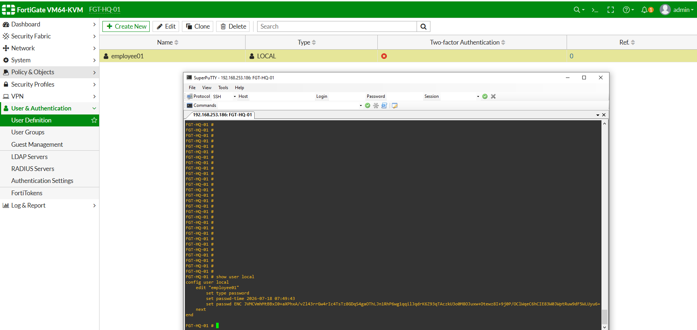
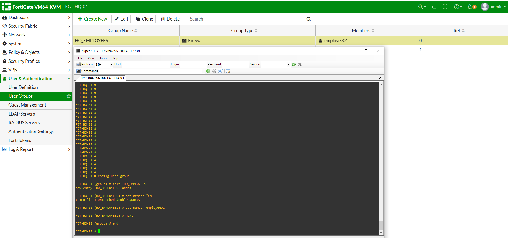
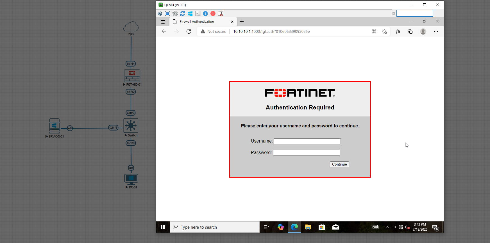
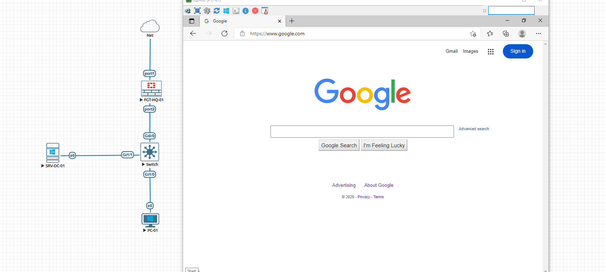
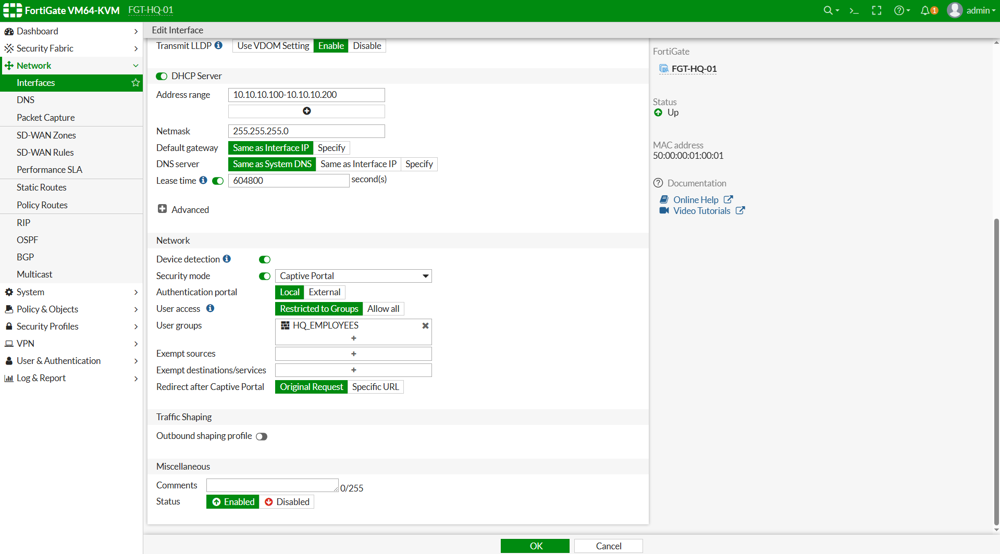

# تسک 1 - Creating Local Users and User Groups 


# هدف

در این Task با یکی از مهم‌ترین قابلیت‌های FortiGate یعنی **User Authentication** آشنا خواهیم شد.

تا این مرحله تمامی Firewall Policyهایی که ایجاد کرده‌ایم تنها بر اساس موارد زیر تصمیم‌گیری می‌کردند:

- Source Address
- Destination Address
- Service
- Schedule

اما در بسیاری از سازمان‌ها تنها دانستن IP آدرس کاربران کافی نیست.

مدیر شبکه باید بتواند تشخیص دهد **چه شخصی** در حال استفاده از شبکه است و بر اساس هویت کاربران، دسترسی‌های متفاوتی ایجاد کند.

در این Task اولین قدم برای پیاده‌سازی Identity-Based Security را برخواهیم داشت.

در پایان این Task:

- مفهوم Authentication را خواهید آموخت.
- تفاوت Authentication و Authorization را خواهید شناخت.
- با انواع User در FortiGate آشنا خواهید شد.
- اولین Local User را ایجاد خواهید کرد.
- اولین User Group را خواهید ساخت.
- آماده پیاده‌سازی Identity-Based Firewall Policy خواهید شد.


# مفاهیم

## ا Authentication چیست؟

ا Authentication فرآیندی است که طی آن FortiGate هویت یک کاربر را بررسی و تأیید می‌کند.

به زبان ساده Firewall بررسی می‌کند:

```text
Who are you?
```

اگر کاربر بتواند هویت خود را اثبات کند، مرحله Authentication با موفقیت انجام می‌شود.

معمولاً این احراز هویت از طریق موارد زیر انجام می‌شود:

- Username
- Password
- Certificate
- Token
- Two-Factor Authentication


## ا Authorization چیست؟

پس از Authentication نوبت به Authorization می‌رسد.

در این مرحله FortiGate تصمیم می‌گیرد که کاربر مجاز به انجام چه کارهایی است.

به عبارت دیگر:

```text
What are you allowed to access?
```

برای مثال:

```text
Ali

↓

Authenticated

↓

Access Internet
```

اما:

```text
Guest

↓

Authenticated

↓

Internet Only

↓

No Access To Servers
```


## تفاوت Authentication و Authorization

ا Authentication پاسخ این سؤال است:

```text
Who are you?
```

ا Authorization پاسخ این سؤال است:

```text
What can you do?
```

هر دو مرحله برای پیاده‌سازی امنیت مبتنی بر هویت ضروری هستند.

---

# Identity-Based Security

در شبکه‌های سنتی معمولاً تصمیم‌گیری بر اساس IP Address انجام می‌شود.

به عنوان مثال:

```text
10.10.10.10

↓

Allow Internet
```

اما در شبکه‌های Enterprise معمولاً تصمیم‌گیری بر اساس هویت کاربران انجام می‌شود.

مثال:

```text
Administrator

↓

Full Access


Employees

↓

Internet Access


Guests

↓

Limited Internet
```

در این حالت حتی اگر IP کاربران تغییر کند، سطح دسترسی آن‌ها ثابت باقی خواهد ماند.

# انواع User در FortiGate

ا FortiGate از منابع مختلفی برای احراز هویت کاربران پشتیبانی می‌کند.

مهم‌ترین آن‌ها عبارت‌اند از:

- Local User
- LDAP
- Active Directory
- RADIUS
- TACACS+
- PKI Certificate
- FortiToken
- SAML
- FSSO

در این Lab از **Local User** استفاده خواهیم کرد تا مفاهیم پایه به‌صورت کامل آموزش داده شوند.


# ا Local User چیست؟

ا Local User کاربری است که اطلاعات آن مستقیماً داخل FortiGate ذخیره می‌شود.

نمونه:

```text
Username: labuser


Password: ********
```

مزایای Local User:

- راه‌اندازی سریع
- مناسب برای آزمایشگاه
- عدم نیاز به Active Directory
- مناسب برای محیط‌های کوچک

در شبکه‌های بزرگ معمولاً به جای Local User از LDAP یا Active Directory استفاده می‌شود.


# ا User Group چیست؟

ا User Group مجموعه‌ای از چندین User است.

به جای اینکه در Firewall Policy کاربران را به‌صورت جداگانه انتخاب کنیم، آن‌ها را داخل یک Group قرار می‌دهیم.

نمونه:

```text
IT_Users

↓

Ali

Reza

mmad
```

در ادامه تنها کافی است Group را داخل Firewall Policy انتخاب کنیم.

---

# مزایای استفاده از User Group

استفاده از User Group مزایای زیادی دارد.

- مدیریت ساده‌تر کاربران
- کاهش تعداد Policyها
- اعمال تغییرات سریع
- افزایش خوانایی تنظیمات
- پیاده‌سازی ساده‌تر Role-Based Access


# سناریوی این Task

در این سناریو قصد داریم یک کاربر محلی برای کارکنان شرکت ایجاد کنیم.

مشخصات کاربر:

| گزینه | مقدار |
|--------|--------|
| Username | employee01 |
| Password | P@ssw0rd123 |
| Type | Local User |

سپس این کاربر را داخل یک User Group قرار خواهیم داد.

مشخصات Group:

| گزینه | مقدار |
|--------|--------|
| Group Name | HQ_EMPLOYEES |

در Task بعدی این Group را داخل Firewall Policy استفاده خواهیم کرد.


# پیش‌نیازها

قبل از شروع این Task مطمئن شوید:

- ا Lab01 تا Lab04 با موفقیت انجام شده باشند.
- ا Firewall Policy فعال باشد.
- اینترنت برقرار باشد.
- ا DNS بدون مشکل کار کند.
- زمان سیستم توسط NTP تنظیم شده باشد.


# بررسی کاربران موجود

قبل از ایجاد User جدید، بهتر است کاربران موجود را بررسی کنیم.

## GUI

```text
User & Authentication

↓

User Definition
```

در این قسمت معمولاً تنها کاربر پیش‌فرض **admin** یا کاربران سیستمی را مشاهده خواهید کرد.

فعلاً تغییری در آن‌ها ایجاد نکنید.


# بررسی کاربران از طریق CLI

دستور زیر را اجرا نمایید.

```bash
show user local
```

برای مشاهده کامل تنظیمات:

```bash
show full-configuration user local
```

در حال حاضر هنوز کاربر آزمایشگاه ایجاد نشده است.


# ایجاد اولین Local User

اکنون اولین کاربر محلی را ایجاد می‌کنیم.

این کاربر در Task بعدی برای احراز هویت کاربران و اعمال Identity-Based Firewall Policy مورد استفاده قرار خواهد گرفت.


# ایجاد Local User از طریق GUI

مسیر زیر را باز کنید.

```text
User & Authentication

↓

User Definition

↓

Create New

↓

Local User
```

---

تنظیمات زیر را وارد نمایید.

| گزینه | مقدار |
|--------|--------|
| User Type | Local User |
| Username | employee01 |
| Password | P@ssw0rd123 |
| Confirm Password | P@ssw0rd123 |
| Status | Enable |
| Comments | Headquarters Employee |

پس از تکمیل تنظیمات روی **OK** کلیک نمایید.

---

## توضیح گزینه‌ها

### Username

نام کاربر باید نشان‌دهنده هویت واقعی یا نقش کاربر باشد.

نمونه مناسب:

```text
employee01
```

از نام‌هایی مانند:

```text
user1

test

admin2
```

استفاده نکنید.

در محیط‌های Enterprise معمولاً از الگوی مشخصی برای نام‌گذاری کاربران استفاده می‌شود.

---

### Password

برای کاربران همیشه از Passwordهای قوی استفاده نمایید.

در این Lab از Password زیر استفاده می‌کنیم.

```text
P@ssw0rd123
```

در محیط‌های واقعی توصیه می‌شود Passwordها دارای ویژگی‌های زیر باشند.

- حداقل 12 کاراکتر
- حروف بزرگ
- حروف کوچک
- اعداد
- کاراکترهای ویژه

---

### Status

کاربر باید در وضعیت:

```text
Enable
```

قرار داشته باشد.

در صورت Disable بودن، امکان Authentication وجود نخواهد داشت.

---

### Comments

همیشه توضیح کوتاهی درباره هدف کاربر ثبت نمایید.

```text
Headquarters Employee
```


📸 Screenshot




# ایجاد Local User از طریق CLI

```bash
config user local

edit "employee01"

set type password

set passwd P@ssw0rd123

set status enable

set comments "Headquarters Employee"

next

end
```

---

# بررسی Local User

برای مشاهده کاربران ایجاد شده دستور زیر را اجرا نمایید.

```bash
show user local
```

در صورت نیاز تنظیمات کامل را مشاهده کنید.

```bash
show full-configuration user local
```

---

# ایجاد اولین User Group

اکنون کاربر ایجاد شده را داخل یک Group قرار می‌دهیم.

در محیط‌های Enterprise تقریباً هیچ‌گاه کاربران به صورت مستقیم داخل Firewall Policy استفاده نمی‌شوند.

همیشه ابتدا Userها داخل Group قرار می‌گیرند و سپس Group در Policy استفاده می‌شود.


# ایجاد User Group از طریق GUI

مسیر زیر را باز کنید.

```text
User & Authentication

↓

User Groups

↓

Create New
```

---

تنظیمات زیر را وارد نمایید.

| گزینه | مقدار |
|--------|--------|
| Name | HQ_EMPLOYEES |
| Type | Firewall |
| Members | employee01 |

پس از انتخاب Member روی **OK** کلیک نمایید.

---

## توضیح گزینه‌ها

### Name

نام Group باید نشان‌دهنده اعضای داخل آن باشد.

نمونه مناسب:

```text
HQ_EMPLOYEES
```

از نام‌هایی مانند:

```text
Group1

Users

Office
```

استفاده نکنید.

---

### Type

نوع Group را برابر با:

```text
Firewall
```

قرار دهید.

این نوع Group برای استفاده در Firewall Policy طراحی شده است.

---

### Members

در حال حاضر تنها عضو این Group عبارت است از:

```text
employee01
```

در سناریوهای بعدی کاربران بیشتری به این Group اضافه خواهیم کرد.


📸 Screenshot




# ایجاد User Group از طریق CLI

```bash
config user group

edit "HQ_EMPLOYEES"

set member "employee01"

next

end
```


# بررسی User Group

برای مشاهده Group ایجاد شده دستور زیر را اجرا نمایید.

```bash
show user group
```

در صورت نیاز:

```bash
show full-configuration user group
```


# تحلیل ساختار کاربران

اکنون ساختار Authentication ما به شکل زیر است.

```text
HQ_EMPLOYEES

        │

        │

   employee01

        │

        │

 Username + Password

        │

        │

 Authentication

        │

        │

 Ready For Firewall Policy
```

در حال حاضر هنوز هیچ Firewall Policy از این Group استفاده نمی‌کند.

در Task بعدی این Group را داخل یک Identity-Based Firewall Policy استفاده خواهیم کرد.

<br><br>


# تسک 2 - Creating Identity-Based Firewall Policy 


# هدف

در Task قبلی کاربران محلی و User Group را ایجاد کردیم.

اکنون قصد داریم اولین **Identity-Based Firewall Policy** را پیاده‌سازی کنیم.

تا این مرحله تمامی Firewall Policyهای ما تنها بر اساس اطلاعات شبکه تصمیم‌گیری می‌کردند.

مانند:

- Source Address
- Destination Address
- Service
- Schedule

اما از این مرحله به بعد هویت کاربران نیز به عنوان یکی از شروط اصلی تصمیم‌گیری اضافه می‌شود.

در پایان این Task:

- مفهوم Identity-Based Firewall Policy را خواهید آموخت.
- اولین Policy مبتنی بر هویت را ایجاد خواهید کرد.
- کاربران قبل از دسترسی به اینترنت احراز هویت خواهند شد.
- ا Authentication Session را بررسی خواهید کرد.
- نحوه عملکرد Captive Portal را مشاهده خواهید کرد.

# مفاهیم

## ا Identity-Based Firewall Policy چیست؟

ا Identity-Based Firewall Policy نوعی Firewall Policy است که علاوه بر مشخصات شبکه، هویت کاربر را نیز بررسی می‌کند.

به عبارت دیگر FortiGate تنها زمانی اجازه عبور Packet را صادر می‌کند که:

- کاربر احراز هویت شده باشد.
- عضو User Group مشخص شده باشد.
- سایر شروط Policy نیز برقرار باشند.


در Policyهای معمولی تصمیم‌گیری به صورت زیر انجام می‌شود.

```text
Source

↓

Destination

↓

Service

↓

Schedule

↓

Allow
```

اما در Identity Policy یک مرحله جدید اضافه می‌شود.

```text
Source

↓

Destination

↓

Service

↓

User Authentication

↓

User Group

↓

Schedule

↓

Allow
```


## مزایای Identity-Based Policy

استفاده از Identity-Based Firewall مزایای فراوانی دارد.

- کنترل کاربران به جای IP
- مناسب برای DHCP
- مناسب برای لپ‌تاپ‌ها
- مناسب برای شبکه‌های بزرگ
- ثبت دقیق Log کاربران
- امکان اعمال دسترسی متفاوت برای هر گروه


## چرا به جای IP از User استفاده می‌کنیم؟

فرض کنید دو کاربر از DHCP استفاده می‌کنند.

امروز:

```text
Ali

↓

10.10.10.20
```

فردا:

```text
Ali

↓

10.10.10.85
```

اگر Firewall Policy بر اساس IP نوشته شده باشد، هر بار باید Rule تغییر کند.

اما اگر Policy بر اساس User باشد:

```text
Ali

↓

Authenticated

↓

Internet Access
```

تغییر IP هیچ تأثیری نخواهد داشت.


# سناریوی این Task

در این سناریو تنها اعضای گروه زیر اجازه دسترسی به اینترنت خواهند داشت.

```text
HQ_EMPLOYEES
```

هر کاربری که عضو این Group نباشد، حتی در صورت داشتن IP معتبر، اجازه عبور از Firewall را نخواهد داشت.


# ساختار نهایی

```text
Windows Client

↓

Open Browser

↓

Captive Portal

↓

Username

↓

Password

↓

employee01

↓

Authentication

↓

HQ_EMPLOYEES

↓

Firewall Policy

↓

Internet
```


# پیش‌نیازها

قبل از شروع این Task مطمئن شوید:

- ا Lab01 تا Lab04 تکمیل شده باشند.
- ا Task1 از Lab05 انجام شده باشد.
- ا User زیر وجود داشته باشد.

```text
employee01
```

- ا User Group زیر ایجاد شده باشد.

```text
HQ_EMPLOYEES
```

- اینترنت برقرار باشد.


# بررسی Firewall Policy فعلی

قبل از ایجاد Policy جدید، بهتر است Policy فعلی را بررسی کنیم.

مسیر:

```text
Policy & Objects

↓

Firewall Policy
```


# بررسی Policy از طریق CLI

دستور زیر را اجرا نمایید.

```bash
show firewall policy
```


# تحلیل فرآیند فعلی

در حال حاضر مسیر عبور Packet به شکل زیر است.

```text
Windows Client

↓

Source Address

↓

Firewall Policy

↓

Destination

↓

Service

↓

Schedule

↓

Internet
```

در این ساختار هیچ مرحله‌ای برای احراز هویت کاربر وجود ندارد.

در Part بعدی این رفتار را تغییر خواهیم داد و اولین Identity-Based Firewall Policy را ایجاد می‌کنیم.
<br><br>


# ایجاد اولین Identity-Based Firewall Policy

اکنون اولین Firewall Policy مبتنی بر هویت را ایجاد می‌کنیم.

در این Policy تنها کاربرانی که عضو گروه:

```text
HQ_EMPLOYEES
```

باشند، اجازه استفاده از اینترنت را خواهند داشت.

در اولین درخواست کاربران برای دسترسی به اینترنت، FortiGate صفحه احراز هویت را نمایش می‌دهد.

پس از ورود صحیح Username و Password، دسترسی به اینترنت برقرار خواهد شد.


توجه کنید که قبل از ایجاد Session، ابتدا Authentication انجام می‌شود.


# ویرایش Firewall Policy از طریق GUI

مسیر زیر را باز کنید.

```text
Policy & Objects

↓

Firewall Policy

↓

HQ-LAN-to-WAN-Allow

↓

Edit
```

---

به پایین صفحه بروید.

در قسمت:

```text
Source
```

گزینه:

```text
Enable Identity-Based Policy
```


# ایجاد اولین Identity Rule

پس از فعال شدن Identity-Based Policy، بخشی جدید با عنوان:

```text
Identity Based Policy
```

نمایش داده می‌شود.

روی:

```text
Create New
```

کلیک نمایید.


تنظیمات زیر را وارد کنید.

| گزینه | مقدار |
|--------|--------|
| User Group | HQ_EMPLOYEES |
| Service | ALL |
| Schedule | always |


# توضیح گزینه‌ها

## User Group

مشخص می‌کند چه کاربرانی اجازه عبور از این Firewall Policy را خواهند داشت.

در این سناریو:

```text
HQ_EMPLOYEES
```

---

## Service

در حال حاضر:

```text
ALL
```

را انتخاب می‌کنیم.

در سناریوهای بعدی سرویس‌ها را محدود خواهیم کرد.

---

## Schedule

فعلاً از:

```text
always
```

استفاده می‌کنیم.

در آینده می‌توان همین Policy را به Office Hours نیز محدود کرد.

---

# تنظیمات نهایی Policy

تنظیمات Firewall Policy باید مشابه جدول زیر باشد.

| گزینه | مقدار |
|--------|--------|
| Incoming Interface | port2 |
| Outgoing Interface | port1 |
| Source | HQ_Internal_Networks |
| Destination | all |
| Service | ALL |
| NAT | Enable |
| Identity Based | Enable |
| User Group | HQ_EMPLOYEES |
| Schedule | always |


# ایجاد Identity Policy از طریق CLI

دستور زیر را اجرا نمایید.

```bash
config firewall policy

edit 1

set identity-based enable

config identity-based-policy

edit 1

set groups "HQ_EMPLOYEES"

set schedule "always"

set service "ALL"

next

end

next

end
```


# بررسی Firewall Policy

اکنون تنظیمات را بررسی کنید.

```bash
show firewall policy
```


# اولین تست Authentication

اکنون به Windows Client بروید.

مرورگر را باز کنید.

آدرس زیر را وارد نمایید.

```text
https://www.google.com
```

یا

```text
https://1.1.1.1
```

به جای باز شدن سایت، صفحه Login مربوط به FortiGate نمایش داده خواهد شد.

این همان Captive Portal است.


📸 Screenshot




# ورود اطلاعات کاربر

اطلاعات زیر را وارد نمایید.

| گزینه | مقدار |
|--------|--------|
| Username | employee01 |
| Password | P@ssw0rd123 |

روی:

```text
Login
```

کلیک نمایید.

-

اگر اطلاعات صحیح باشد، FortiGate کاربر را احراز هویت کرده و به اینترنت هدایت می‌کند.


📸 Screenshot




یا 

# تنظیمات Captive Portal روی Interface

در FortiGate علاوه بر احراز هویت از طریق Firewall Policy، می‌توان از قابلیت **Captive Portal** روی Interface نیز استفاده کرد.

در این روش، هر کاربری که از طریق Interface مشخص‌شده قصد دسترسی به اینترنت را داشته باشد، ابتدا به صفحه Login فورتی‌گیت هدایت می‌شود.

پس از احراز هویت موفق، دسترسی به اینترنت برای وی برقرار خواهد شد.


## مسیر GUI

```text
Network

↓

Interfaces

↓

port2 (LAN)

↓

Edit

↓

Security Mode

↓

Captive Portal
```

---

## گزینه‌های موجود

### Device Detection

این گزینه نوع دستگاه متصل به Interface را شناسایی می‌کند.

پس از فعال شدن، FortiGate اطلاعاتی مانند موارد زیر را نمایش می‌دهد:

- Windows
- Linux
- Android
- iPhone
- Printer
- IP Phone
- IP Camera

این قابلیت در Device Inventory، مانیتورینگ کاربران و ایجاد Policyهای مبتنی بر نوع دستگاه کاربرد دارد.

**پیشنهاد:** در محیط‌های Enterprise بهتر است فعال باشد.

---

### Security Mode

این گزینه نحوه مدیریت دسترسی کاربران روی Interface را مشخص می‌کند.

در حالت عادی کاربران بدون احراز هویت به اینترنت دسترسی خواهند داشت.

اما با انتخاب **Captive Portal**، تمامی کاربران قبل از استفاده از شبکه باید احراز هویت شوند.

---

### Captive Portal

نوع صفحه احراز هویت را مشخص می‌کند.

در این Lab از گزینه زیر استفاده می‌کنیم.

```text
Authentication Portal
```


### User Access

مشخص می‌کند چه نوع کاربرانی اجازه احراز هویت دارند.

بسته به سناریو ممکن است گزینه‌هایی مانند موارد زیر مشاهده شوند.

- Local Users
- Remote Users
- Local and Remote Users

در این آزمایش از **Local Users** استفاده می‌کنیم؛ زیرا کاربران به صورت Local روی FortiGate ایجاد شده‌اند.


### User Groups

در این قسمت مشخص می‌شود چه گروهی اجازه Login دارد.

در این سناریو گروه زیر انتخاب می‌شود.

```text
HQ_EMPLOYEES
```

تنها اعضای این گروه قادر به احراز هویت خواهند بود.


### Exempt Sources

در این قسمت می‌توان آدرس‌هایی را مشخص کرد که **بدون نیاز** به Login اجازه عبور داشته باشند.

نمونه کاربرد:

- Printer
- Monitoring Server
- Management PC

در این Lab از این قابلیت استفاده نمی‌کنیم و این قسمت خالی باقی می‌ماند.

---

### Exempt Destinations / Services

در این قسمت می‌توان مقصدها یا سرویس‌هایی را مشخص کرد که بدون نیاز به احراز هویت قابل دسترسی باشند.

نمونه‌ها:

- DNS
- DHCP
- NTP
- Windows Update

در این Lab این قسمت نیز خالی باقی می‌ماند.

---

### Redirect after Captive Portal

در صورت فعال بودن این گزینه، پس از Login موفق، کاربر مجدداً به همان سایتی که درخواست کرده بود هدایت می‌شود.

مثال:

```text
User

↓

http://iran.ir

↓

Captive Portal

↓

Login Successful

↓

http://iran.ir
```

در صورت غیرفعال بودن این گزینه، کاربر پس از Login به صفحه پیش‌فرض FortiGate هدایت خواهد شد.

برای تجربه کاربری بهتر، پیشنهاد می‌شود این گزینه فعال باشد.

---

# تنظیمات مورد استفاده در این Lab

| گزینه | مقدار |
|--------|--------|
| Device Detection | Enable |
| Security Mode | Captive Portal |
| Captive Portal | Authentication Portal |
| User Access | Local Users |
| User Groups | HQ_EMPLOYEES |
| Exempt Sources | None |
| Exempt Destinations / Services | None |
| Redirect after Captive Portal | Enable |


📸 Screenshot



## نتیجه

پس از اعمال تنظیمات فوق، فرآیند دسترسی کاربران به اینترنت به شکل زیر خواهد بود.

```text
Windows Client

↓

Open Browser

↓

Request http://iran.ir

↓

Redirect to FortiGate Login

↓

Username : employee01

↓

Password

↓

Authentication Successful

↓

Internet Access Granted
```

<br><br>
<br><br>

# تسک 3 - Configuring LDAP Authentication with Active Directory 


# هدف

در این Task ارتباط بین **FortiGate** و **Microsoft Active Directory** از طریق پروتکل **LDAP** برقرار خواهد شد.

در Lab قبلی کاربران به صورت Local روی FortiGate ایجاد می‌شدند و فرآیند احراز هویت مستقیماً توسط خود FortiGate انجام می‌شد.

اما در محیط‌های Enterprise معمولاً کاربران در Active Directory مدیریت می‌شوند و FortiGate تنها وظیفه احراز هویت و اعمال سیاست‌های امنیتی را بر عهده دارد.

در پایان این Task:

- مفهوم LDAP را درک خواهید کرد.
- تفاوت Local Authentication و LDAP Authentication را خواهید شناخت.
- ارتباط FortiGate با Domain Controller را برقرار خواهید کرد.
- اولین LDAP Server را روی FortiGate ایجاد خواهید کرد.
- ارتباط با Active Directory را آزمایش خواهید کرد.


# پیش‌نیازها

قبل از شروع این Lab موارد زیر باید آماده باشند.

- ا Active Directory Domain Services نصب شده باشد.
- ا Domain Controller راه‌اندازی شده باشد.
- حداقل یک Domain User ایجاد شده باشد.
- ا FortiGate بتواند Domain Controller را Ping کند.
- ا DNS به درستی تنظیم شده باشد.

در این Lab از کاربر زیر استفاده خواهیم کرد.

```text
employee01
```


# سناریو

در این سناریو کاربران دیگر روی FortiGate ایجاد نخواهند شد.

تمام اطلاعات کاربران از Active Directory دریافت می‌شود.


# Local Authentication vs LDAP Authentication

## Local Authentication

در این روش اطلاعات کاربران داخل خود FortiGate ذخیره می‌شود.

```text
FortiGate

↓

Local User Database

↓

Authentication
```

مزایا

- ساده
- مناسب آزمایشگاه
- مناسب شبکه‌های کوچک

معایب

- مدیریت کاربران دشوار است.
- برای سازمان‌های بزرگ مناسب نیست.
- نیاز به ایجاد کاربران روی هر FortiGate وجود دارد.


## LDAP Authentication

در این روش FortiGate اطلاعات کاربران را از Active Directory دریافت می‌کند.

```text
Windows Client

↓

FortiGate

↓

LDAP

↓

Active Directory

↓

Authentication Result
```

مزایا

- مدیریت متمرکز کاربران
- مناسب محیط‌های Enterprise
- عدم نیاز به ایجاد کاربران روی FortiGate
- امکان استفاده از Security Groupها
- مقیاس‌پذیری بالا


# نحوه عملکرد LDAP Authentication

زمانی که کاربر قصد دسترسی به اینترنت را داشته باشد، فرآیند زیر انجام می‌شود.

```text
Windows Client

↓

Open Browser

↓

FortiGate

↓

LDAP Request

↓

Active Directory

↓

Username

↓

Password Verification

↓

Authentication Success

↓

Internet Access
```

در این فرآیند FortiGate هیچ‌گونه اطلاعاتی از کاربران ذخیره نمی‌کند و تنها نتیجه احراز هویت را از Active Directory دریافت می‌کند.


# معماری ارتباط

پورت مورد استفاده LDAP به صورت پیش‌فرض:

```text
TCP 389
```

در صورت استفاده از LDAPS:

```text
TCP 636
```

در این Lab از LDAP استاندارد روی پورت 389 استفاده خواهیم کرد.

<br><br>

# ایجاد LDAP Server روی FortiGate

در این بخش ارتباط بین **FortiGate** و **Microsoft Active Directory** برقرار خواهد شد.

ا FortiGate برای احراز هویت کاربران نیاز دارد بتواند به Domain Controller متصل شده و اطلاعات کاربران را از طریق LDAP دریافت کند.

در این مرحله یک LDAP Server جدید روی FortiGate ایجاد خواهیم کرد.


# توپولوژی

```text
                    +-------------------------+
                    | Domain Controller       |
                    |-------------------------|
                    | IP : 10.10.10.101       |
                    | Domain : devlab.local   |
                    +------------+------------+
                                 |
                           TCP/389 (LDAP)
                                 |
                    +------------+------------+
                    |        FortiGate        |
                    +------------+------------+
                                 |
                           Internal Network
                                 |
                   
```


📸 Screenshot


# اطلاعات مورد نیاز

قبل از ایجاد LDAP Server اطلاعات زیر را آماده کنید.

| گزینه | مقدار نمونه |
|--------|-------------|
| LDAP Server Name | LAB-LDAP |
| Server IP | 10.10.10.101|
| Common Name Identifier | sAMAccountName |
| Distinguished Name | dc=devlab,dc=local |
| Bind Type | Regular |
| Username | administrator |
| Password | رمز عبور Domain Administrator |
| Port | 389 |

> **توجه:** مقادیر فوق نمونه هستند. در محیط خود از IP، Domain و حساب کاربری مربوط به Active Directory استفاده کنید.


# مراحل پیکربندی

از مسیر زیر وارد شوید.

```text
User & Authentication

↓

LDAP Servers

↓

Create New
```


# تنظیمات LDAP Server

## Name

نام دلخواه برای LDAP Server را وارد کنید.

```text
LAB-LDAP
```


## Server IP/Name

آدرس IP یا نام Domain Controller را وارد کنید.

نمونه:

```text
10.10.10.101
```


## Server Port

از پورت پیش‌فرض LDAP استفاده کنید.

```text
389
```


## Common Name Identifier

این گزینه مشخص می‌کند FortiGate کاربران را با چه Attributeای در Active Directory جستجو کند.

برای Active Directory مقدار زیر پیشنهاد می‌شود.

```text
sAMAccountName
```

در این حالت کاربر با Username خود احراز هویت خواهد شد.

مثال:

```text
employee01
```

## Distinguished Name

مسیر اصلی Domain را وارد کنید.

نمونه:

```text
dc=devlab,dc=local
```

اگر Domain شما به صورت زیر باشد:

```text
company.local
```

مقدار باید برابر باشد با:

```text
dc=company,dc=local
```


## Bind Type

مقدار زیر را انتخاب کنید.

```text
Regular
```


## Username

کاربری که اجازه جستجو در Active Directory را دارد.

معمولاً:

```text
administrator
```

یا

```text
administrator@devlab.local
```


## Password

رمز عبور همان حساب Domain Administrator را وارد کنید.


## Secure Connection

در این Lab از LDAP معمولی استفاده می‌کنیم.

```text
Disable
```

در محیط‌های Enterprise پیشنهاد می‌شود از **LDAPS (TCP/636)** استفاده شود.


# ذخیره تنظیمات

پس از تکمیل اطلاعات روی **OK** کلیک کنید.

ا LDAP Server به لیست LDAP Serverهای FortiGate اضافه خواهد شد.


# آزمایش اتصال

پس از ایجاد LDAP Server روی نام آن کلیک کنید.

گزینه:

```text
Test Connectivity
```

یا

```text
Test User Credentials
```

را انتخاب کنید.

اطلاعات زیر را وارد نمایید.

Username

```text
employee01
```

Password

```text
********
```

در صورت صحیح بودن تنظیمات، FortiGate پیام موفقیت نمایش خواهد داد.


📸 Screenshot


# بررسی ارتباط از طریق CLI

برای مشاهده تنظیمات LDAP دستور زیر را اجرا کنید.

```bash
show user ldap
```

نمونه خروجی:

```text
config user ldap
    edit "LAB-LDAP"
        set server "10.10.10.10"
        set cnid "sAMAccountName"
        set dn "dc=lab,dc=local"
        set type regular
        set username "administrator"
    next
end
```

-
# بررسی اتصال شبکه

قبل از ادامه Lab بهتر است ارتباط FortiGate با Domain Controller بررسی شود.

```bash
execute ping devlab.local
```

در صورت دریافت پاسخ، ارتباط شبکه برقرار است.


# نکات مهم

- ا FortiGate باید بتواند Domain Controller را Ping کند.
- ا  DNS باید به درستی تنظیم شده باشد.
- زمان (Date & Time) بین FortiGate و Domain Controller اختلاف زیادی نداشته باشد.
- در صورت استفاده از LDAPS باید Certificate مناسب روی FortiGate نصب شود.


<br><br>


# آزمایش LDAP Authentication

در این بخش ارتباط بین **FortiGate** و **Active Directory** بررسی خواهد شد تا اطمینان حاصل شود FortiGate قادر به احراز هویت کاربران Domain است.

در پایان این بخش:

- ارتباط LDAP تست خواهد شد.
- اعتبار Username و Password بررسی خواهد شد.
- اشکالات رایج شناسایی خواهند شد.
- از صحت ارتباط FortiGate با Domain Controller اطمینان حاصل خواهیم کرد.


# آزمایش از طریق GUI

مسیر زیر را باز کنید.

```text
User & Authentication

↓

LDAP Servers

↓

LAB-LDAP

↓

Test User Credentials
```

# اطلاعات تست

در قسمت Username نام کاربر Domain را وارد کنید.

```text
employee01
```

در قسمت Password نیز رمز عبور همان کاربر Domain را وارد نمایید.

```text
********
```

در صورت صحیح بودن تنظیمات، پیام زیر نمایش داده خواهد شد.

```text
Authentication Successful
```

این پیام نشان می‌دهد که:

- ارتباط FortiGate با Domain Controller برقرار است.
- تنظیمات LDAP صحیح است.
- ا Username و Password معتبر هستند.


📸 Screenshot


# آزمایش از طریق CLI

برای تست LDAP از محیط CLI دستور زیر را اجرا کنید.

```bash
diagnose test authserver ldap LAB-LDAP employee01 YourPassword
```

نمونه:

```bash
diagnose test authserver ldap LAB-LDAP employee01 P@ssw0rd123
```

در صورت موفق بودن احراز هویت، خروجی مشابه زیر مشاهده خواهد شد.

```text
Authenticate 'employee01' against 'LAB-LDAP'
Authentication succeeded.
```


# مشاهده تنظیمات LDAP

برای بررسی تنظیمات ایجاد شده دستور زیر را اجرا کنید.

```bash
show user ldap
```

نمونه خروجی:

```text
config user ldap
    edit "LAB-LDAP"
        set server "10.10.10.101"
        set cnid "sAMAccountName"
        set dn "dc=devlab,dc=local"
        set type regular
        set username "administrator"
    next
end
```


# بررسی ارتباط شبکه

ابتدا از برقراری ارتباط بین FortiGate و Domain Controller اطمینان حاصل کنید.

```bash
execute ping 10.10.10.101
```

در صورت دریافت Reply، ارتباط IP برقرار است.


# بررسی DNS

اگر به جای IP از نام سرور استفاده کرده‌اید، عملکرد DNS را نیز بررسی کنید.

نمونه:

```bash
execute ping devlab.local
```

در صورت Resolve شدن نام، تنظیمات DNS صحیح است.


# مشکلات رایج

## ارتباط با Domain Controller برقرار نیست.

علائم:

- Timeout
- No Response

دلایل احتمالی:

- IP اشتباه
- Gateway نادرست
- Firewall بین FortiGate و Domain Controller
- خاموش بودن Domain Controller


## ا Distinguished Name اشتباه است.

نمونه اشتباه:

```text
dc=local
```

نمونه صحیح:

```text
dc=devlab,dc=local
```


## ا Common Name Identifier اشتباه است.

برای Microsoft Active Directory مقدار زیر پیشنهاد می‌شود.

```text
sAMAccountName
```

در صورت استفاده از مقدار اشتباه، کاربران پیدا نخواهند شد.

---

## ا Username یا Password اشتباه است.

در صورت وارد کردن اطلاعات نادرست، FortiGate پیام Authentication Failed نمایش خواهد داد.

ابتدا از ورود صحیح به Domain با همان حساب کاربری اطمینان حاصل کنید.


## اختلاف زمان

اگر ساعت FortiGate و Domain Controller اختلاف زیادی داشته باشند، فرآیند احراز هویت ممکن است با مشکل مواجه شود.

بهتر است هر دو سیستم از یک NTP Server استفاده کنند.

---

# Best Practices

- برای Domain Controller از IP ثابت استفاده کنید.
- در محیط‌های عملیاتی از LDAPS (TCP/636) استفاده نمایید.
- از حساب Administrator برای استفاده روزمره استفاده نکنید و یک Service Account مجزا ایجاد کنید.
- ا DNS را قبل از شروع پیکربندی LDAP بررسی کنید.
- پس از هر تغییر، ارتباط LDAP را مجدداً آزمایش کنید.


# نتیجه

در این بخش صحت ارتباط بین FortiGate و Active Directory بررسی شد و احراز هویت کاربران Domain آزمایش گردید.

پس از موفقیت در این مرحله، FortiGate آماده است تا کاربران Active Directory را در **Firewall Policy** و **Identity-Based Authentication** مورد استفاده قرار دهد.

در Task بعدی، **LDAP User Group** ایجاد کرده و آن را در Firewall Policy برای کنترل دسترسی کاربران Domain به اینترنت استفاده خواهیم کرد.


<br><br>

# Task 2 - Creating LDAP User Groups (Part 1)

---

# هدف

در این Task نحوه استفاده از کاربران **Active Directory** در **FortiGate** را فرا خواهیم گرفت.

در Task قبلی ارتباط بین FortiGate و Domain Controller از طریق LDAP برقرار شد و صحت احراز هویت کاربران بررسی گردید.

اما در محیط‌های Enterprise معمولاً Firewall Policyها مستقیماً بر اساس کاربران ایجاد نمی‌شوند.

در عوض، کاربران در قالب **User Group** مدیریت می‌شوند.

در پایان این Task:

- مفهوم LDAP User Group را درک خواهید کرد.
- تفاوت Local User Group و LDAP User Group را خواهید شناخت.
- اولین LDAP User Group را روی FortiGate ایجاد خواهید کرد.
- کاربران Active Directory را به Firewall Policy متصل خواهید کرد.
- ساختار استاندارد مدیریت کاربران در Enterprise را خواهید آموخت.

---

# چرا از LDAP Group استفاده می‌کنیم؟

فرض کنید یک سازمان دارای ۵۰۰ کارمند باشد.

اگر برای هر کاربر یک Policy ایجاد شود:

```text
employee01

employee02

employee03

...

employee500
```

مدیریت Firewall تقریباً غیرممکن خواهد شد.

اما اگر همه کاربران عضو یک گروه باشند:

```text
HQ_EMPLOYEES
```

تنها کافی است همین گروه در Firewall Policy استفاده شود.

هر کاربر جدیدی که وارد سازمان شود، فقط به گروه اضافه می‌شود و دیگر نیازی به تغییر تنظیمات FortiGate نخواهد بود.

---

# ساختار Enterprise

```text
Active Directory

├── Users

│      ├── employee01

│      ├── employee02

│      ├── employee03

│      └── ...

└── Security Group

        HQ_EMPLOYEES
               │
               ▼
        LDAP User Group
               │
               ▼
          FortiGate
               │
               ▼
       Firewall Policy
```

---

# تفاوت Local Group و LDAP Group

## Local User Group

کاربران داخل خود FortiGate ذخیره می‌شوند.

```text
FortiGate

↓

Local Users

↓

Local Group

↓

Firewall Policy
```

مناسب برای:

- آزمایشگاه
- شبکه‌های کوچک
- محیط‌های موقت

---

## LDAP User Group

کاربران در Active Directory نگهداری می‌شوند.

```text
Active Directory

↓

LDAP

↓

FortiGate

↓

LDAP Group

↓

Firewall Policy
```

مزایا:

- مدیریت متمرکز کاربران
- مقیاس‌پذیری بالا
- مناسب سازمان‌های بزرگ
- کاهش مدیریت روی FortiGate
- هماهنگی کامل با Active Directory

---

# سناریوی این Lab

در این Lab تنها یک کاربر Domain وجود دارد.

```text
employee01
```

در مراحل بعدی این کاربر به LDAP User Group متصل خواهد شد تا امکان استفاده از آن در Firewall Policy فراهم شود.

در محیط‌های واقعی، این گروه معمولاً به یک **Security Group** در Active Directory متصل می‌شود؛ اما برای سادگی، در این Lab ابتدا با یک کاربر Domain فرآیند را پیاده‌سازی خواهیم کرد.

---

# نتیجه

در این بخش با مفهوم LDAP User Group و نقش آن در مدیریت کاربران Active Directory آشنا شدیم.

در Part بعدی، LDAP User Group را روی FortiGate ایجاد کرده و کاربر Domain را به آن متصل خواهیم کرد.
<br><br>

# تسک 4 - Creating LDAP User Groups 


# هدف

در این Task نحوه استفاده از کاربران **Active Directory** در **FortiGate** را فرا خواهیم گرفت.

در Task قبلی ارتباط بین FortiGate و Domain Controller از طریق LDAP برقرار شد و صحت احراز هویت کاربران بررسی گردید.

اما در محیط‌های Enterprise معمولاً Firewall Policyها مستقیماً بر اساس کاربران ایجاد نمی‌شوند.

در عوض، کاربران در قالب **User Group** مدیریت می‌شوند.

در پایان این Task:

- مفهوم LDAP User Group را درک خواهید کرد.
- تفاوت Local User Group و LDAP User Group را خواهید شناخت.
- اولین LDAP User Group را روی FortiGate ایجاد خواهید کرد.
- کاربران Active Directory را به Firewall Policy متصل خواهید کرد.
- ساختار استاندارد مدیریت کاربران در Enterprise را خواهید آموخت.

---

# چرا از LDAP Group استفاده می‌کنیم؟

فرض کنید یک سازمان دارای ۵۰۰ کارمند باشد.

اگر برای هر کاربر یک Policy ایجاد شود:

```text
employee01

employee02

employee03

...

employee500
```

مدیریت Firewall تقریباً غیرممکن خواهد شد.

اما اگر همه کاربران عضو یک گروه باشند:

```text
HQ_EMPLOYEES
```

تنها کافی است همین گروه در Firewall Policy استفاده شود.

هر کاربر جدیدی که وارد سازمان شود، فقط به گروه اضافه می‌شود و دیگر نیازی به تغییر تنظیمات FortiGate نخواهد بود.

---

# ساختار Enterprise

```text
Active Directory

├── Users

│      ├── employee01

│      ├── employee02

│      ├── employee03

│      └── ...

└── Security Group

        HQ_EMPLOYEES
               │
               ▼
        LDAP User Group
               │
               ▼
          FortiGate
               │
               ▼
       Firewall Policy
```

---

# تفاوت Local Group و LDAP Group

## Local User Group

کاربران داخل خود FortiGate ذخیره می‌شوند.

```text
FortiGate

↓

Local Users

↓

Local Group

↓

Firewall Policy
```

مناسب برای:

- آزمایشگاه
- شبکه‌های کوچک
- محیط‌های موقت

---

## LDAP User Group

کاربران در Active Directory نگهداری می‌شوند.

```text
Active Directory

↓

LDAP

↓

FortiGate

↓

LDAP Group

↓

Firewall Policy
```

مزایا:

- مدیریت متمرکز کاربران
- مقیاس‌پذیری بالا
- مناسب سازمان‌های بزرگ
- کاهش مدیریت روی FortiGate
- هماهنگی کامل با Active Directory

<br><br>


در این بخش یک **LDAP Firewall User Group** روی FortiGate ایجاد خواهیم کرد.

در Task قبلی ارتباط بین FortiGate و Active Directory برقرار شد و صحت عملکرد LDAP بررسی گردید.

اکنون قصد داریم گروه امنیتی موجود در Active Directory را به FortiGate معرفی کنیم تا بتوان از آن در Firewall Policy استفاده کرد.

در پایان این بخش:

- ا Security Group موجود در Active Directory را به FortiGate متصل خواهید کرد.
- اولین LDAP Firewall User Group را ایجاد خواهید کرد.
- کاربران عضو گروه Active Directory را برای احراز هویت آماده خواهید کرد.
- ساختار استاندارد مدیریت کاربران در محیط‌های Enterprise را پیاده‌سازی خواهید کرد.

# سناریو

در Active Directory گروه امنیتی زیر ایجاد شده است.

```text
HQ_EMPLOYEES
```

کاربر زیر عضو این گروه می‌باشد.

```text
employee01
```

هدف این است که تمامی اعضای این گروه پس از احراز هویت، اجازه دسترسی به اینترنت را داشته باشند.


# مسیر ایجاد LDAP Firewall User Group

از مسیر زیر وارد شوید.

```text
User & Authentication

↓

User Groups

↓

Create New
```


# تنظیمات گروه

## Name

یک نام مناسب برای گروه انتخاب کنید.

نمونه:

```text
LDAP-HQ-Employees
```

---

## Type

نوع گروه را روی گزینه زیر قرار دهید.

```text
Firewall
```


## Remote Groups

روی گزینه **Add** کلیک کنید.


ابتدا LDAP Server ایجاد شده در Task قبل را انتخاب نمایید.

نمونه:

```text
LAB-LDAP
```


سپس روی **Browse** کلیک کنید.

ا FortiGate گروه‌های موجود در Active Directory را نمایش خواهد داد.

گروه زیر را انتخاب نمایید.

```text
HQ_EMPLOYEES
```


پس از انتخاب گروه، تنظیمات را ذخیره کنید.


# ساختار احراز هویت

پس از ایجاد این گروه، فرآیند احراز هویت به صورت زیر انجام خواهد شد.

```text
Windows Client

↓

employee01

↓

FortiGate

↓

LDAP Server

↓

Active Directory

↓

HQ_EMPLOYEES

↓

Authentication Successful

↓

Firewall Policy

↓

Internet
```

📸 Screenshot


# بررسی تنظیمات

برای مشاهده گروه ایجاد شده از CLI دستور زیر را اجرا کنید.

```bash
show user group
```

نمونه خروجی:

```text
config user group
    edit "LDAP-HQ-Employees"
        set group-type firewall
        config match
            edit 1
                set server-name "LAB-LDAP"
                set group-name "CN=HQ_EMPLOYEES,CN=Users,DC=devlab,DC=local"
            next
        end
    next
end
```


# نکات مهم

- ا FortiGate کاربران Active Directory را مستقیماً در Firewall Policy استفاده نمی‌کند.
- ا Firewall Policy همیشه از **Firewall User Group** استفاده می‌کند.
- عضویت کاربران در Active Directory به صورت خودکار توسط FortiGate بررسی می‌شود.
- در صورت اضافه شدن کاربر جدید به گروه **HQ_EMPLOYEES**، نیازی به تغییر تنظیمات FortiGate نخواهد بود.
- این روش استاندارد‌ترین شیوه مدیریت کاربران در سازمان‌های Enterprise است.


# نتیجه

در این بخش یک **LDAP Firewall User Group** بر اساس Security Group موجود در Active Directory ایجاد شد.

از این پس تمامی اعضای گروه **HQ_EMPLOYEES** می‌توانند از طریق همین گروه در Firewall Policy احراز هویت شوند.

در Part بعدی این گروه را در Firewall Policy قرار داده و فرآیند احراز هویت کاربران Domain را به صورت عملی آزمایش خواهیم کرد.

<br><br>

# استفاده از LDAP User Group در Firewall Policy

اکنون که ارتباط FortiGate با Active Directory برقرار شده و LDAP Firewall User Group ایجاد شده است، نوبت به استفاده از این گروه در Firewall Policy می‌رسد.

در این مرحله، تنها کاربران عضو گروه **HQ_EMPLOYEES** پس از احراز هویت قادر به دسترسی به اینترنت خواهند بود.


# ویرایش Firewall Policy

از مسیر زیر وارد شوید.

```text
Policy & Objects

↓

Firewall Policy

↓

HQ-LAN-to-WAN-Allow

↓

Edit
```

---

# تنظیم Source

در قسمت **Incoming Interface** مقدار زیر را انتخاب کنید.

```text
port2
```

در قسمت **Outgoing Interface** مقدار زیر را انتخاب نمایید.

```text
port1
```

در قسمت **Source** شبکه داخلی را انتخاب کنید.

```text
HQ_Internal_Networks
```

در قسمت **Destination** مقدار زیر را انتخاب نمایید.

```text
all
```

---

# فعال کردن Identity-Based Policy

در قسمت **Source** گزینه زیر را فعال کنید.

```text
Require Authentication
```

یا در برخی نسخه‌های FortiOS:

```text
Identity Based Policy
```

با فعال شدن این گزینه، بخش جدیدی با عنوان **Identity** یا **User Groups** نمایش داده خواهد شد.

---

# انتخاب LDAP Firewall User Group

در قسمت **User Groups** روی **Add** کلیک کنید.

گروه زیر را انتخاب نمایید.

```text
LDAP-HQ-Employees
```

---

# تنظیم سایر گزینه‌ها

| گزینه | مقدار |
|--------|--------|
| Schedule | always |
| Service | ALL |
| Action | ACCEPT |
| NAT | Enable |
| Log Allowed Traffic | All Sessions |


# ذخیره تنظیمات

پس از تکمیل تنظیمات روی **OK** کلیک کنید.

ا Firewall Policy اکنون آماده احراز هویت کاربران Active Directory است.

یا روی اینتفیس ذخیره کنی :


# بررسی از طریق CLI

برای مشاهده کاربران احراز هویت شده، دستور زیر را اجرا کنید.

```bash
diagnose firewall auth list
```

نمونه خروجی:

```text
IP: 10.10.10.100

User: employee01

Group: LDAP-HQ-Employees

Authentication: LDAP

Status: Authenticated
```


یوزر پس از احراز هویت به اینترنت و ادرس url ای که وارد کرده دسرسی خواهد داشت :

