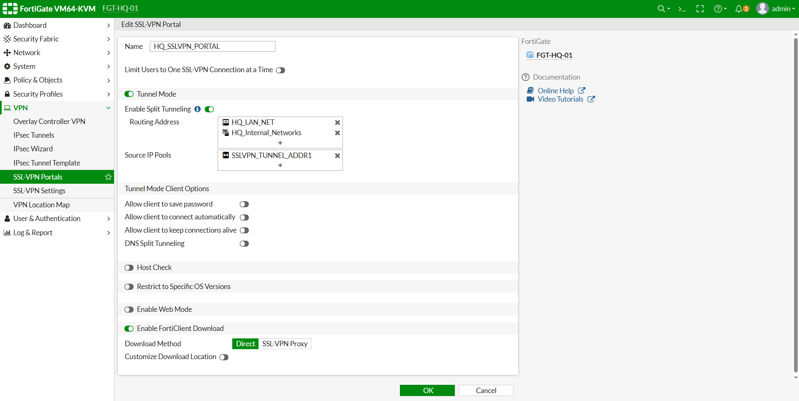
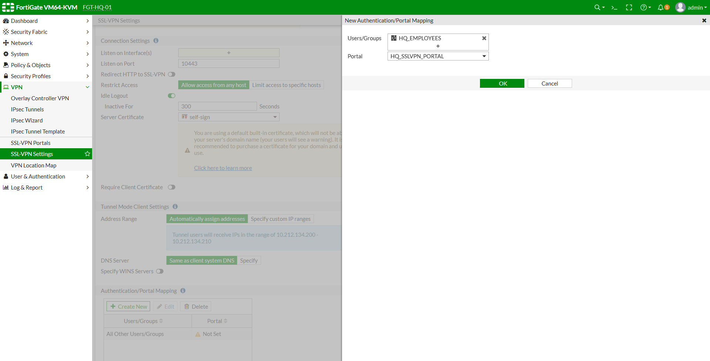

# تسک 1 - Understanding SSL VPN Concepts


# هدف

در این Lab نحوه پیاده‌سازی SSL VPN Remote Access بر روی FortiGate را به صورت کامل بررسی خواهیم کرد.

در Labهای قبلی، کاربران تنها زمانی می‌توانستند به منابع داخلی سازمان دسترسی داشته باشند که به صورت فیزیکی در شبکه داخلی حضور داشتند.

اما در بسیاری از سازمان‌ها، کارکنان از منزل، شعب دیگر یا در حال مأموریت نیاز دارند به صورت امن به شبکه شرکت متصل شوند.

در این شرایط، SSL VPN یکی از محبوب‌ترین و پرکاربردترین راهکارهای FortiGate برای فراهم کردن دسترسی از راه دور است.

در پایان این Lab کاربران قادر خواهند بود با استفاده از FortiClient و حساب کاربری Active Directory به شبکه داخلی سازمان متصل شوند و به منابع مجاز دسترسی داشته باشند.


# سناریوی Lab

فرض کنید کارمند شرکت در منزل مشغول به کار است.

او قصد دارد از لپ‌تاپ شخصی خود به شبکه شرکت متصل شود.

پس از اتصال موفق به SSL VPN باید بتواند

- به Windows Server از طریق RDP متصل شود.
- وب‌سرور داخلی شرکت را مشاهده کند.
- از سرویس‌های مجاز شبکه داخلی استفاده کند.
- بدون حضور فیزیکی در سازمان به منابع مورد نیاز دسترسی داشته باشد.


# توپولوژی

```text

                        Remote Laptop
                            |                            
                        Internet
                            │
                            │
                            │
                            │
                     SSL VPN Tunnel
                            │
                  Public IP Address
                    192.168.253.187
                            │
                     +---------------+
                        FortiGate   
                     +---------------+
                            │
                  Internal Network
                     10.10.10.0/24
             ┌──────────────┴──────────────┐
             │                             │
      Windows Server                 Web Server
      Active Directory
```


# ا SSL VPN چیست؟

ا SSL VPN یا Secure Sockets Layer Virtual Private Network فناوری‌ای است که امکان ایجاد یک ارتباط رمزنگاری‌شده میان کاربر و شبکه سازمان را از طریق اینترنت فراهم می‌کند.

کاربر بدون نیاز به حضور فیزیکی در سازمان می‌تواند به منابع داخلی دسترسی داشته باشد، در حالی که تمام داده‌های تبادل‌شده بین کاربر و FortiGate رمزنگاری می‌شوند.

# ا SSL VPN چگونه کار می‌کند؟

مراحل برقراری ارتباط به صورت زیر است.

```text
Remote User

↓

Internet

↓

FortiGate

↓

SSL Handshake

↓

Authentication

↓

VPN Tunnel

↓

Internal Network
```

پس از احراز هویت موفق، یک تونل امن بین کاربر و FortiGate ایجاد می‌شود و تمام ترافیک از طریق این تونل عبور خواهد کرد.

---

# مزایای SSL VPN

استفاده از SSL VPN مزایای متعددی دارد، از جمله

- عدم نیاز به حضور فیزیکی در سازمان
- ارتباط رمزنگاری‌شده با استفاده از TLS
- امکان استفاده از اینترنت عمومی
- پشتیبانی از احراز هویت کاربران
- قابلیت استفاده از Active Directory و LDAP
- سازگاری با سیستم‌عامل‌های مختلف
- مدیریت متمرکز دسترسی کاربران

---

# اجزای اصلی SSL VPN

برای راه‌اندازی SSL VPN در FortiGate چند مؤلفه اصلی مورد نیاز است.

## SSL VPN Settings

بخش اصلی تنظیمات SSL VPN که شامل انتخاب Interface، پورت، Certificate و Address Pool است.


## SSL VPN Portal

پورتال تعیین می‌کند کاربر پس از اتصال چه سطحی از دسترسی را خواهد داشت.

---

## User Group

کاربران مجاز برای استفاده از SSL VPN در این قسمت مشخص می‌شوند.

در این Lab از گروه HQ_EMPLOYEES که در Active Directory ایجاد شده است استفاده خواهیم کرد.

---

## Address Pool

پس از اتصال موفق، FortiGate یک IP مجازی از این محدوده به کاربر اختصاص می‌دهد.

نمونه

```text
10.212.134.0/24
```


## Firewall Policy

پس از ایجاد تونل VPN، همچنان دسترسی کاربران توسط Firewall Policy کنترل خواهد شد.

وجود Tunnel به معنای دسترسی کامل به شبکه نیست.

---

# Tunnel Mode و Web Mode

ا FortiGate دو روش برای SSL VPN ارائه می‌دهد.

## Tunnel Mode

در این حالت یک تونل VPN کامل میان کاربر و FortiGate ایجاد می‌شود.

کاربر می‌تواند مانند یک سیستم داخل شبکه سازمان به منابع مجاز دسترسی داشته باشد.

ویژگی‌ها

- نیازمند FortiClient
- مناسب برای دسترسی کامل به شبکه
- امکان استفاده از RDP، SSH، SMB و سایر پروتکل‌ها
- مناسب برای محیط‌های Enterprise

---

## Web Mode

در این حالت کاربر از طریق مرورگر وب به منابع منتشرشده دسترسی پیدا می‌کند.

ویژگی‌ها

- بدون نیاز به FortiClient
- دسترسی محدود به برنامه‌های مشخص
- مناسب برای دسترسی سریع و موقت

---

# Split Tunnel

در حالت Split Tunnel تنها ترافیک مربوط به شبکه داخلی از VPN عبور می‌کند.

```text
Internet Traffic

────────────► Internet

Corporate Traffic

────────────► VPN Tunnel
```

مزایا

- کاهش مصرف پهنای باند
- افزایش سرعت اینترنت کاربر
- کاهش بار روی FortiGate

---

# Full Tunnel

در حالت Full Tunnel تمام ترافیک کاربر از VPN عبور می‌کند.

```text
Internet

↓

VPN Tunnel

↓

FortiGate

↓

Internet
```

مزایا

- کنترل کامل ترافیک کاربران
- اعمال سیاست‌های امنیتی روی تمام ارتباطات
- مناسب برای سازمان‌هایی با الزامات امنیتی بالا

---

# احراز هویت کاربران

در این Lab از Active Directory برای احراز هویت کاربران استفاده خواهیم کرد.

فرآیند احراز هویت به صورت زیر خواهد بود.

```text
Remote User

↓

FortiGate

↓

LDAP

↓

Active Directory

↓

HQ_EMPLOYEES

↓

Authentication Successful

↓

SSL VPN Tunnel
```


# آنچه در این Lab پیاده‌سازی خواهیم کرد

در ادامه این Lab موارد زیر به صورت عملی پیاده‌سازی خواهند شد.

- پیکربندی SSL VPN
- ایجاد SSL VPN Portal
- ایجاد Address Pool
- اتصال SSL VPN به Active Directory
- استفاده از گروه HQ_EMPLOYEES
- ایجاد Firewall Policy
- اتصال FortiClient
- دریافت IP مجازی
- دسترسی به Windows Server از طریق RDP
- دسترسی به Web Server داخلی
- پیاده‌سازی Split Tunnel
- بررسی Sessionها و Logها
- عیب‌یابی مشکلات رایج SSL VPN


در این Task با معماری، اجزا و مفاهیم اصلی SSL VPN در FortiGate آشنا شدیم.

در Task بعدی، محیط مورد نیاز برای راه‌اندازی SSL VPN را آماده کرده و پیش‌نیازهای لازم مانند FortiClient، Certificate، Address Pool و تنظیمات اولیه FortiGate را بررسی خواهیم کرد.


<br><br>


# تسک 2 - Preparing the SSL VPN Environment


# هدف

قبل از پیاده‌سازی SSL VPN، باید محیط FortiGate و زیرساخت شبکه برای برقراری ارتباط VPN آماده شود.

اگر پیش‌نیازهای SSL VPN به درستی بررسی نشوند، ممکن است کاربران نتوانند اتصال VPN را برقرار کنند یا پس از اتصال، به منابع داخلی دسترسی نداشته باشند.

در این Task تمامی پیش‌نیازهای مورد نیاز برای راه‌اندازی SSL VPN بررسی خواهند شد.

در پایان این Task:

- وضعیت Interfaceهای FortiGate بررسی خواهد شد.
- ا Public IP مورد استفاده برای SSL VPN مشخص خواهد شد.
- دسترسی کاربران به FortiGate بررسی خواهد شد.
- وضعیت Certificate بررسی خواهد شد.
- تنظیمات DNS و Routing مرور خواهند شد.
- ا  FortiClient برای اتصال کاربران آماده خواهد شد.

---

# سناریوی Lab

کاربر خارج از سازمان قصد دارد از طریق اینترنت به FortiGate متصل شود.

در این مرحله هنوز VPN فعال نشده است.

هدف فقط آماده‌سازی زیرساخت برای پیاده‌سازی SSL VPN در Taskهای بعدی است.

---

# بررسی Interfaceهای FortiGate

ابتدا از مسیر زیر وضعیت Interfaceها را بررسی کنید.

```text
Network

↓

Interfaces
```

اطمینان حاصل کنید Interfaceهای زیر فعال باشند.

| Interface | Role | Status |
|------------|------|--------|
| port1 | WAN | Up |
| port2 | LAN | Up |

---

# بررسی آدرس IP

در این Lab از تنظیمات زیر استفاده خواهیم کرد.

| Interface | IP Address |
|------------|------------|
| port1 | 192.168.253.187/24 |
| port2 | 10.10.10.1/24 |

---

# بررسی دسترسی از سمت WAN

از سیستم Remote Client بررسی کنید که IP مربوط به WAN FortiGate در دسترس باشد.

نمونه:

```text
192.168.253.187
```

در محیط‌های آزمایشگاهی ممکن است این بررسی از طریق Ping انجام شود.

در محیط‌های عملیاتی، بسته به تنظیمات امنیتی، پاسخ Ping ممکن است غیرفعال باشد.

---

# بررسی Certificate

ا SSL VPN برای ایجاد ارتباط رمزنگاری‌شده از Certificate استفاده می‌کند.

از مسیر زیر وارد شوید.

```text
System

↓

Certificates
```

در این Lab از Certificate پیش‌فرض FortiGate استفاده خواهیم کرد.

```text
Fortinet_Factory

یا

self-sign
```

در محیط‌های Enterprise معمولاً از Certificate صادرشده توسط CA معتبر استفاده می‌شود.

---

# بررسی کاربران

در Lab قبلی ارتباط FortiGate با Active Directory برقرار شد.

کاربر زیر عضو گروه Active Directory است.

```text
employee01
```

و عضو گروه امنیتی زیر می‌باشد.

```text
HQ_EMPLOYEES
```

در ادامه همین گروه برای احراز هویت SSL VPN استفاده خواهد شد.

---

# بررسی FortiClient

برای اتصال کاربران به SSL VPN از نرم‌افزار FortiClient استفاده خواهیم کرد.

ا FortiClient را روی سیستم Remote نصب کنید.

در این مرحله نیازی به ایجاد Connection نیست.

تنها کافی است نرم‌افزار نصب شده و آماده استفاده باشد.

---

# بررسی Routing

از مسیر زیر جدول Routing را بررسی کنید.

```text
Network

↓

Static Routes
```

اطمینان حاصل کنید مسیر پیش‌فرض (Default Route) به سمت Interface WAN وجود داشته باشد.

نمونه:

| Destination | Gateway |
|-------------|---------|
| 0.0.0.0/0 | 192.168.253.2 |

---

# بررسی DNS

برای عملکرد صحیح SSL VPN و احراز هویت کاربران، تنظیمات DNS باید به درستی پیکربندی شده باشد.

از مسیر زیر تنظیمات DNS را بررسی کنید.

```text
Network

↓

DNS
```

نمونه:

| Primary DNS | 8.8.8.8 |
| Secondary DNS | 1.1.1.1 |

در صورتی که از Active Directory استفاده می‌کنید، معمولاً DNS داخلی Domain Controller نیز مورد استفاده قرار می‌گیرد.

---

# بررسی سرویس‌های مورد نیاز

اطمینان حاصل کنید سرویس‌های زیر در شبکه داخلی در دسترس باشند.

- Active Directory
- LDAP
- DNS
- Windows Server (RDP)
- Web Server

این سرویس‌ها پس از برقراری SSL VPN مورد استفاده قرار خواهند گرفت.

<br><br>


# تسک 3 - Configuring SSL VPN Settings 


# هدف

در این Task اولین مرحله از پیاده‌سازی SSL VPN را انجام خواهیم داد.

در این مرحله سرویس SSL VPN روی FortiGate فعال شده و تنظیمات اصلی آن پیکربندی می‌شود.

هنوز هیچ کاربری قادر به اتصال نخواهد بود، زیرا Portal، User Group، Address Pool و Firewall Policy در Taskهای بعدی ایجاد خواهند شد.

در پایان این Task:

- ا SSL VPN روی FortiGate فعال خواهد شد.
- ا Interface مربوط به SSL VPN مشخص خواهد شد.
- پورت سرویس SSL VPN تعیین خواهد شد.
- ا Certificate مورد استفاده انتخاب خواهد شد.
- محدوده IP کاربران VPN تعریف خواهد شد.
- ا DNS Server کاربران VPN مشخص خواهد شد.


# مسیر تنظیمات

از مسیر زیر وارد شوید.

```text
VPN

↓

SSL-VPN Settings
```

---

# Listen on Interface(s)

مشخص می‌کند کاربران از کدام Interface اجازه اتصال به SSL VPN را دارند.

در این Lab مقدار زیر را انتخاب کنید.

```text
port1
```

زیرا Interface WAN محسوب می‌شود.

---

# Listen on Port

شماره پورتی که سرویس SSL VPN روی آن اجرا خواهد شد.

در این Lab از مقدار پیش‌فرض استفاده می‌کنیم.

```text
443
```

> اگر قبلاً Web Management را روی پورت 443 قرار داده‌اید، می‌توانید SSL VPN را روی پورت دیگری مانند **10443** تنظیم کنید.


# Server Certificate

ا SSL VPN برای ایجاد ارتباط امن به یک Certificate نیاز دارد.

در این Lab از Certificate پیش‌فرض FortiGate استفاده می‌کنیم.

```text
Fortinet_Factory

یا

self-sign
```

در محیط‌های Enterprise معمولاً از Certificate صادرشده توسط CA معتبر استفاده می‌شود.

---

# Tunnel Mode

گزینه زیر را فعال کنید.

```text
Enable Tunnel Mode
```

در این دوره از Tunnel Mode استفاده خواهیم کرد.

زیرا کاربران باید بتوانند به منابع داخلی مانند RDP و Web Server دسترسی داشته باشند.

---

# Web Mode

در این Lab از Web Mode استفاده نمی‌کنیم.

بنابراین گزینه زیر را غیرفعال نگه دارید.

```text
Disable Web Mode
```

در فصل‌های بعدی Web Mode نیز به صورت جداگانه بررسی خواهد شد.

---

# Tunnel IP Pools

کاربران پس از اتصال به SSL VPN باید یک IP مجازی دریافت کنند.

در قسمت

```text
Tunnel Address
```

یک Address Pool جدید ایجاد کنید.

نمونه:

```text
SSLVPN_TUNNEL_ADDR1
```

با محدوده:

```text
10.212.134.200

تا

10.212.134.210
```

این IPها فقط برای کاربران VPN استفاده خواهند شد.

---

# DNS Server

در قسمت DNS مقدار زیر را تنظیم کنید.

Primary DNS

```text
10.10.10.101
```

(Domain Controller)

Secondary DNS

```text
8.8.8.8
```

این تنظیم باعث می‌شود کاربران VPN بتوانند منابع داخلی Domain را Resolve کنند.

---

# Idle Timeout

برای جلوگیری از باقی ماندن Sessionهای بدون استفاده، مقدار زیر را تنظیم کنید.

```text
300 Seconds
```

(یا مقدار پیش‌فرض FortiGate)

---

# Authentication Timeout

مقدار پیش‌فرض FortiGate مناسب است.

نیازی به تغییر وجود ندارد.

---

# Restrict Access

در این مرحله هیچ محدودیتی اعمال نمی‌کنیم.

در Taskهای بعدی دسترسی کاربران توسط User Group کنترل خواهد شد.

---

# ذخیره تنظیمات

پس از تکمیل تنظیمات روی

```text
Apply
```

کلیک کنید.

در این مرحله سرویس SSL VPN روی FortiGate فعال خواهد شد.

---

# وضعیت فعلی

در پایان این Task وضعیت به شکل زیر خواهد بود.

```text
Internet

↓

FortiGate

↓

SSL VPN Service

✓ Enabled

↓

Users

✗ Not Configured

↓

Portal

✗ Not Configured

↓

Firewall Policy

✗ Not Configured
```

مشاهده می‌شود که سرویس SSL VPN فعال شده است، اما هنوز هیچ کاربری اجازه اتصال ندارد.


# نتیجه

در این Task سرویس SSL VPN روی FortiGate فعال شد و تنظیمات اصلی آن شامل Interface، Port، Certificate، Tunnel Mode، Address Pool و DNS Server پیکربندی گردید.

در Task بعدی، SSL VPN Portal ایجاد خواهد شد و سطح دسترسی کاربران پس از اتصال تعیین می‌شود.


<br><br>


# هدف

در Task قبلی سرویس SSL VPN روی FortiGate فعال شد و تنظیمات اولیه آن شامل Interface، Port، Certificate، Tunnel Address Pool و DNS Server انجام گردید.

در این بخش، نحوه ایجاد و پیکربندی **SSL VPN Portal** را بررسی خواهیم کرد.

ا SSL VPN Portal تعیین می‌کند که کاربران پس از برقراری اتصال VPN به چه منابعی دسترسی داشته باشند و چه تنظیماتی روی ارتباط VPN آن‌ها اعمال شود.

در پایان این Task:

- با مفهوم SSL VPN Portal آشنا خواهید شد.
- یک Portal جدید ایجاد خواهید کرد.
- ا Split Tunnel را پیکربندی خواهید کرد.
- شبکه‌های داخلی قابل دسترس را مشخص خواهید کرد.
- تنظیمات مربوط به دسترسی کاربران را آماده خواهید نمود.


# ا SSL VPN Portal چیست؟

ا Portal مجموعه‌ای از تنظیمات است که پس از احراز هویت به کاربران اختصاص داده می‌شود.

هر Portal می‌تواند سطح دسترسی متفاوتی داشته باشد.

برای مثال:

- کارمندان شرکت
- مدیران شبکه
- پیمانکاران
- کاربران مهمان

همگی می‌توانند Portalهای جداگانه با دسترسی‌های متفاوت داشته باشند.


# مسیر تنظیمات

از مسیر زیر وارد شوید.

```text
VPN

↓

SSL-VPN Portals
```

---

# ایجاد Portal جدید

روی **Create New** کلیک کنید.

تنظیمات زیر را اعمال نمایید.

| گزینه | مقدار |
|--------|--------|
| Name | HQ_SSLVPN_PORTAL |

---

# Tunnel Mode

گزینه زیر را فعال کنید.

```text
Enable Tunnel Mode
```

تمام کاربران این Lab از طریق Tunnel Mode به شبکه داخلی متصل خواهند شد.

---

# Web Mode

در این سناریو از Web Mode استفاده نمی‌کنیم.

بنابراین گزینه زیر را غیرفعال نگه دارید.

```text
Disable Web Mode
```

---

# Enable Split Tunnel

گزینه زیر را فعال کنید.

```text
Enable Split Tunneling
```

---

# چرا Split Tunnel؟

در حالت Split Tunnel تنها ترافیک مربوط به شبکه داخلی از داخل VPN عبور می‌کند.

ترافیک اینترنت همچنان مستقیماً از اینترنت کاربر عبور خواهد کرد.

```text
                Internet

                     │

            Remote Laptop

           ┌────────┴─────────┐

           │                  │

Corporate Traffic      Internet Traffic

           │                  │

      SSL VPN Tunnel     Direct Internet
```

این روش باعث کاهش مصرف پهنای باند FortiGate و افزایش سرعت ارتباط کاربران می‌شود.

---

# Routing Address

در قسمت **Accessible Networks** یا **Routing Address** شبکه‌هایی را مشخص کنید که کاربران VPN مجاز به دسترسی به آن‌ها هستند.

در این Lab شبکه داخلی زیر را اضافه کنید.

```text
10.10.10.0/24
```

برای این منظور می‌توانید از Address Object ساخته‌شده در Labهای قبلی استفاده کنید.

نمونه:

```text
HQ_Internal_Networks
```

---

# Source IP Checks

در این Lab تنظیمات پیش‌فرض کافی است.

نیازی به تغییر وجود ندارد.

---

# Save Password

گزینه زیر را فعال نکنید.

```text
Disable Save Password
```

برای محیط‌های آموزشی نیز بهتر است کاربران هر بار رمز عبور خود را وارد کنند.

---

# Client Options

تنظیمات پیش‌فرض FortiGate برای این Lab مناسب است.

در این مرحله تغییری اعمال نکنید.

---

# Bookmark

در این Lab از Bookmark استفاده نمی‌کنیم.

این قابلیت در Web Mode کاربرد بیشتری دارد.

---

# ذخیره تنظیمات

پس از پایان تنظیمات روی **OK** یا **Apply** کلیک کنید.

ا Portal جدید ایجاد خواهد شد.

📸 Screenshot



# وضعیت فعلی

در پایان این مرحله وضعیت SSL VPN به صورت زیر خواهد بود.

```text
SSL VPN Service

✓ Enabled

↓

SSL VPN Portal

✓ Configured

↓

Authentication

✗ Not Configured

↓

Firewall Policy

✗ Not Configured
```

هنوز هیچ کاربری قادر به اتصال نخواهد بود، زیرا گروه کاربران و Firewall Policy در مراحل بعدی ایجاد خواهند شد.

---

# نتیجه

در این Task یک SSL VPN Portal جدید ایجاد شد و تنظیمات مربوط به Tunnel Mode، Split Tunnel و شبکه‌های قابل دسترس برای کاربران VPN پیکربندی گردید.

در Task بعدی، احراز هویت SSL VPN به Active Directory متصل خواهد شد تا تنها کاربران عضو گروه **HQ_EMPLOYEES** بتوانند به SSL VPN متصل شوند.


<br><br>


در Taskهای قبلی، سرویس SSL VPN روی FortiGate فعال شد و یک SSL VPN Portal نیز ایجاد گردید.

در این بخش، فرآیند احراز هویت کاربران SSL VPN را به Active Directory متصل خواهیم کرد.

از آنجایی که در Lab قبلی ارتباط FortiGate با Active Directory از طریق LDAP پیاده‌سازی شد، در این Lab همان زیرساخت را مجدداً استفاده خواهیم کرد.

در پایان این Task:

- ا LDAP Server قبلی به SSL VPN متصل خواهد شد.
- گروه کاربران Active Directory برای SSL VPN استفاده خواهد شد.
- دسترسی SSL VPN تنها به کاربران مجاز محدود خواهد شد.
- ارتباط بین SSL VPN و Active Directory تکمیل خواهد شد.


# چرا از LDAP استفاده می‌کنیم؟

در بسیاری از سازمان‌ها، کاربران قبلاً در Active Directory ایجاد شده‌اند.

اگر برای SSL VPN نیز Local User ایجاد کنیم:

- مدیریت کاربران سخت‌تر خواهد شد.
- کاربران باید چندین Username و Password داشته باشند.
- حذف یا اضافه کردن کاربران زمان‌بر خواهد بود.

به همین دلیل در محیط‌های Enterprise معمولاً SSL VPN مستقیماً از Active Directory برای احراز هویت استفاده می‌کند.


# پیش‌نیازها

قبل از ادامه، اطمینان حاصل کنید موارد زیر در Lab قبلی پیاده‌سازی شده باشند.

- ا Active Directory نصب شده است.
- ا LDAP روی FortiGate پیکربندی شده است.
- ارتباط LDAP با موفقیت تست شده است.
- کاربر **employee01** در Active Directory ایجاد شده است.
- گروه **HQ_EMPLOYEES** در Active Directory ایجاد شده است.
- کاربر **employee01** عضو گروه **HQ_EMPLOYEES** است.

---

# مسیر تنظیمات

از مسیر زیر وارد شوید.

```text
VPN

↓

SSL-VPN Settings
```

---

# Authentication/Portal Mapping

به قسمت زیر بروید.

```text
Authentication / Portal Mapping
```

این بخش مشخص می‌کند هر گروه کاربری پس از احراز هویت، از کدام Portal استفاده کند.

---

# ایجاد Mapping جدید

روی **Create New** کلیک کنید.

---

# User Group

در قسمت **User Groups**، گروه LDAP که در Lab قبلی ایجاد شده است را انتخاب کنید.

نمونه:

```text
HQ_EMPLOYEES
```

این گروه از طریق LDAP به Active Directory متصل است.

---

# Portal

در قسمت **Portal**، پورتال ایجاد شده در Task قبل را انتخاب کنید.

نمونه:

```text
HQ_SSLVPN_PORTAL
```

از این پس، تمام اعضای گروه **HQ_EMPLOYEES** پس از ورود به SSL VPN از تنظیمات این Portal استفاده خواهند کرد.


📸 Screenshot



# ترتیب بررسی Mapping

هنگام ورود کاربر، FortiGate مراحل زیر را انجام می‌دهد.

```text
User Login

↓

LDAP Authentication

↓

Active Directory

↓

User Group

↓

HQ_EMPLOYEES

↓

Portal Assignment

↓

HQ_SSLVPN_PORTAL

↓

VPN Tunnel
```


# نتیجه Mapping

اگر کاربر عضو گروه **HQ_EMPLOYEES** باشد:

- احراز هویت انجام می‌شود.
- ا Portal به کاربر اختصاص داده می‌شود.
- مراحل بعدی اتصال SSL VPN ادامه پیدا می‌کند.

اگر کاربر عضو این گروه نباشد:

- اتصال SSL VPN رد خواهد شد.
- ا Tunnel ایجاد نمی‌شود.


# بررسی تنظیمات

پس از ذخیره تنظیمات، جدول Authentication Mapping باید مشابه نمونه زیر باشد.

| User Group | Portal |
|------------|---------|
| HQ_EMPLOYEES | HQ_SSLVPN_PORTAL |


# نتیجه

در این تسک SSL VPN به Active Directory متصل شد و گروه **HQ_EMPLOYEES** به عنوان گروه مجاز برای استفاده از SSL VPN تعریف گردید.

از این پس، تنها کاربران عضو این گروه قادر خواهند بود فرآیند احراز هویت SSL VPN را با موفقیت طی کنند.

در Task بعدی، Firewall Policyهای مورد نیاز ایجاد خواهند شد تا کاربران پس از اتصال به SSL VPN بتوانند به منابع داخلی مانند Windows Server و Web Server دسترسی داشته باشند.


<br><br>


# تسک 4 - Creating SSL VPN Firewall Policies 


# هدف

در Taskهای قبلی سرویس SSL VPN روی FortiGate فعال شد، Portal ایجاد گردید و فرآیند احراز هویت کاربران به Active Directory متصل شد.

در این مرحله، Firewall Policyهای مورد نیاز ایجاد خواهند شد تا کاربران پس از اتصال به SSL VPN بتوانند به منابع داخلی شبکه دسترسی داشته باشند.

در پایان این Task:

- اولین Firewall Policy مخصوص SSL VPN ایجاد خواهد شد.
- کاربران VPN به شبکه داخلی دسترسی خواهند داشت.
- دسترسی کاربران بر اساس User Group کنترل خواهد شد.
- ساختار امنیتی SSL VPN تکمیل خواهد شد.

---

# چرا به Firewall Policy نیاز داریم؟

یکی از اشتباهات رایج این است که تصور شود پس از برقراری SSL VPN، کاربر به صورت خودکار به شبکه داخلی دسترسی خواهد داشت.

در FortiGate این‌گونه نیست.

ا SSL VPN تنها یک Tunnel رمزنگاری‌شده ایجاد می‌کند.

اجازه دسترسی به منابع داخلی همچنان توسط Firewall Policy کنترل می‌شود.


# مسیر تنظیمات

از مسیر زیر وارد شوید.

```text
Policy & Objects

↓

Firewall Policy

↓

Create New
```

---

# تنظیمات اصلی Policy

## Name

```text
SSLVPN-to-LAN
```

---

## Incoming Interface

```text
ssl.root
```

این Interface مربوط به کاربران متصل‌شده از طریق SSL VPN است.

---

## Outgoing Interface

```text
port2
```

که شبکه داخلی سازمان می‌باشد.

---

## Source

در قسمت Source گزینه زیر را انتخاب کنید.

```text
all
```

زیرا کاربران SSL VPN از Address Pool اختصاص داده‌شده IP دریافت خواهند کرد.

---

## Destination

شبکه داخلی سازمان را انتخاب کنید.

نمونه:

```text
HQ_Internal_Networks
```

---

## User Groups

در قسمت User Groups گروه LDAP ایجادشده در Task قبل را انتخاب نمایید.

```text
HQ_EMPLOYEES
```

به این ترتیب فقط اعضای این گروه اجازه استفاده از این Policy را خواهند داشت.

---

## Schedule

```text
always
```

---

## Service

برای شروع Lab از گزینه زیر استفاده کنید.

```text
ALL
```

در محیط‌های عملیاتی بهتر است تنها سرویس‌های مورد نیاز مانند RDP، HTTPS یا SSH مجاز شوند.

---

## Action

```text
ACCEPT
```

---

## NAT

در این Policy گزینه NAT را فعال نکنید.

دلیل آن این است که کاربران VPN باید با IP واقعی خود در شبکه داخلی دیده شوند.

---

## Log Allowed Traffic

```text
All Sessions
```

فعال کردن ثبت Log به عیب‌یابی و مانیتورینگ کمک می‌کند.

---

# ساختار Policy

```text
Incoming

ssl.root

↓

HQ_EMPLOYEES

↓

SSLVPN-to-LAN

↓

HQ_Internal_Networks

↓

port2
```

---

# نحوه عملکرد

پس از اتصال موفق کاربر به SSL VPN، مراحل زیر انجام می‌شود.

```text
SSL VPN Login

↓

LDAP Authentication

↓

HQ_EMPLOYEES

↓

SSLVPN-to-LAN Policy

↓

Internal Network
```

اگر کاربر عضو گروه **HQ_EMPLOYEES** نباشد، این Policy هرگز Match نخواهد شد.

---

# بررسی Policy

پس از ذخیره تنظیمات، Firewall Policy باید مشابه جدول زیر باشد.

| گزینه | مقدار |
|--------|--------|
| Name | SSLVPN-to-LAN |
| Incoming Interface | ssl.root |
| Outgoing Interface | port2 |
| Source | all |
| Destination | HQ_Internal_Networks |
| User Group | HQ_EMPLOYEES |
| Service | ALL |
| NAT | Disable |
| Action | ACCEPT |

---

# بررسی از CLI

برای مشاهده Policy ایجادشده دستور زیر را اجرا کنید.

```bash
show firewall policy
```

نمونه خروجی:

```text
config firewall policy
    edit 10
        set name "SSLVPN-to-LAN"
        set srcintf "ssl.root"
        set dstintf "port2"
        set srcaddr "all"
        set dstaddr "HQ_Internal_Networks"
        set action accept
        set schedule "always"
        set service "ALL"
        set groups "HQ_EMPLOYEES"
        set nat disable
    next
end
```

---

# وضعیت فعلی

در پایان این Task وضعیت SSL VPN به صورت زیر خواهد بود.

```text
SSL VPN Service

✓ Enabled

↓

Portal

✓ Configured

↓

LDAP Authentication

✓ Configured

↓

Firewall Policy

✓ Configured

↓

FortiClient

✗ Not Tested
```

تمام زیرساخت مورد نیاز برای برقراری SSL VPN آماده شده است.

تنها مرحله باقی‌مانده، اتصال کاربر از طریق FortiClient و بررسی عملکرد VPN خواهد بود.


# نتیجه

در این Task اولین Firewall Policy مربوط به SSL VPN ایجاد شد.

از این پس، کاربران عضو گروه **HQ_EMPLOYEES** پس از برقراری SSL VPN می‌توانند مطابق سیاست‌های تعریف‌شده به منابع داخلی سازمان دسترسی پیدا کنند.

در Task بعدی، اتصال کاربران با استفاده از FortiClient انجام شده و عملکرد SSL VPN به صورت عملی آزمایش خواهد شد.


# هدف

در بخش قبل اولین Firewall Policy مربوط به SSL VPN ایجاد شد.

در این بخش، نحوه طراحی دسترسی کاربران VPN به منابع داخلی را بررسی خواهیم کرد.

در محیط‌های Enterprise معمولاً تمام کاربران VPN نباید به همه منابع شبکه دسترسی داشته باشند.

هر گروه کاربری تنها باید به سرویس‌هایی که برای انجام وظایف خود نیاز دارد دسترسی داشته باشد.

در پایان این بخش:

- ساختار طراحی Firewall Policy برای SSL VPN را خواهید شناخت.
- دسترسی کاربران به منابع داخلی محدود خواهد شد.
- مفهوم Least Privilege در SSL VPN پیاده‌سازی خواهد شد.


# اصل Least Privilege

یکی از مهم‌ترین اصول امنیت شبکه، **Least Privilege** است.

این اصل بیان می‌کند که هر کاربر باید تنها به منابعی دسترسی داشته باشد که برای انجام وظایف خود به آن‌ها نیاز دارد.

برای مثال، اگر یک کاربر تنها به RDP و وب‌سرور داخلی نیاز دارد، نباید به تمام شبکه داخلی دسترسی داشته باشد.


# سناریوی Lab

در این Lab، کاربران عضو گروه **HQ_EMPLOYEES** تنها به منابع زیر دسترسی خواهند داشت.

- ا Windows Server از طریق RDP
- ا Internal Web Server از طریق HTTP و HTTPS

سایر منابع شبکه از طریق Firewall Policy قابل دسترس نخواهند بود.


# ایجاد Address Object برای Windows Server

اگر در Labهای قبلی این Address Object را ایجاد نکرده‌اید، از مسیر زیر وارد شوید.

```text
Policy & Objects

↓

Addresses

↓

Create New
```

تنظیمات نمونه:

| گزینه | مقدار |
|--------|--------|
| Name | Windows_Server |
| Type | IP/Netmask |
| Address | 10.10.10.10/32 |

---

# ایجاد Address Object برای Web Server

در همان بخش، یک Address Object دیگر ایجاد کنید.

| گزینه | مقدار |
|--------|--------|
| Name | Internal_Web_Server |
| Type | IP/Netmask |
| Address | 10.10.10.20/32 |

---

# ایجاد Service برای RDP

در بیشتر نسخه‌های FortiGate، سرویس **RDP** به صورت پیش‌فرض وجود دارد.

در صورت نیاز می‌توانید آن را از مسیر زیر بررسی کنید.

```text
Policy & Objects

↓

Services
```


# ا Firewall Policy برای RDP

یک Firewall Policy جدید ایجاد کنید.

| گزینه | مقدار |
|--------|--------|
| Name | SSLVPN-to-RDP |
| Incoming Interface | ssl.root |
| Outgoing Interface | port2 |
| Source | all |
| Destination | Windows_Server |
| User Group | HQ_EMPLOYEES |
| Service | RDP |
| Action | ACCEPT |
| NAT | Disable |


# ا Firewall Policy برای Web Server

یک Policy دیگر ایجاد نمایید.

| گزینه | مقدار |
|--------|--------|
| Name | SSLVPN-to-Web |
| Incoming Interface | ssl.root |
| Outgoing Interface | port2 |
| Source | all |
| Destination | Internal_Web_Server |
| User Group | HQ_EMPLOYEES |
| Service | HTTP, HTTPS |
| Action | ACCEPT |
| NAT | Disable |

---

# ترتیب Policyها

ترتیب Firewall Policy اهمیت زیادی دارد.

نمونه:

```text
1

SSLVPN-to-RDP

↓

2

SSLVPN-to-Web

↓

3

SSLVPN-to-LAN (در صورت نیاز)

↓

Implicit Deny
```

FortiGate اولین Policy مطابق با ترافیک را اعمال می‌کند.

---

# معماری نهایی

```text
SSL VPN User

↓

SSL Tunnel

↓

FortiGate

↓

SSLVPN-to-RDP

↓

Windows Server


SSL VPN User

↓

SSL Tunnel

↓

FortiGate

↓

SSLVPN-to-Web

↓

Internal Web Server
```

---

# مزایای این طراحی

- کاهش سطح دسترسی کاربران
- افزایش امنیت شبکه
- کنترل دقیق سرویس‌های قابل استفاده
- ساده‌تر شدن مانیتورینگ و Troubleshooting
- پیاده‌سازی استاندارد Enterprise

---

# بررسی Policyها

پس از ایجاد Policyها، جدول Firewall Policy باید مشابه نمونه زیر باشد.

| Name | Service | Destination |
|------|---------|-------------|
| SSLVPN-to-RDP | RDP | Windows_Server |
| SSLVPN-to-Web | HTTP, HTTPS | Internal_Web_Server |

---

# وضعیت فعلی

تا این مرحله موارد زیر تکمیل شده‌اند.

```text
SSL VPN Service

✓ Configured

↓

SSL VPN Portal

✓ Configured

↓

LDAP Authentication

✓ Configured

↓

SSL VPN Firewall Policies

✓ Configured

↓

FortiClient

✗ Not Tested
```

تمام زیرساخت مورد نیاز برای اتصال کاربران آماده شده است.

---

# نتیجه

در این بخش، Firewall Policyهای اختصاصی برای دسترسی کاربران SSL VPN به Windows Server و Internal Web Server ایجاد شدند.

به جای اعطای دسترسی کامل به شبکه، تنها سرویس‌های مورد نیاز در اختیار کاربران قرار گرفتند که این روش مطابق با اصل **Least Privilege** و استانداردهای امنیتی محیط‌های Enterprise است.


<br><br>


#  Connecting to SSL VPN Using FortiClient 


در Taskهای قبلی، تمامی تنظیمات مورد نیاز برای راه‌اندازی SSL VPN روی FortiGate انجام شد.

در این مرحله، کاربر خارج از سازمان با استفاده از نرم‌افزار **FortiClient** به SSL VPN متصل خواهد شد.

در پایان این Task:

- ا FortiClient نصب خواهد شد.
- یک Connection جدید ایجاد خواهد شد.
- تنظیمات اتصال به FortiGate انجام خواهد شد.
- ا FortiClient برای اتصال به SSL VPN آماده خواهد شد.

---

# سناریوی Lab

فرض کنید کارمند شرکت در منزل مشغول به کار است.

او قصد دارد با لپ‌تاپ شخصی خود به شبکه داخلی شرکت متصل شود.

برای این منظور از نرم‌افزار **FortiClient** استفاده خواهد کرد.


# ایجاد Connection جدید

در پنجره FortiClient وارد بخش زیر شوید.

```text
Remote Access

↓

Configure VPN
```

---

# انتخاب نوع VPN

در قسمت VPN Type گزینه زیر را انتخاب کنید.

```text
SSL-VPN
```

---

# تنظیمات اتصال

مقادیر زیر را وارد نمایید.

| گزینه | مقدار |
|--------|--------|
| Connection Name | HQ SSL VPN |
| Remote Gateway | 192.168.253.187 |
| Port | 10443 *(یا پورتی که برای SSL VPN تنظیم کرده‌اید)* |
| Customize Port | Enable (در صورت استفاده از پورت غیر پیش‌فرض) |

---

# Authentication

در این مرحله نیازی به وارد کردن Username و Password نیست.

این اطلاعات هنگام اتصال از کاربر دریافت خواهند شد.

---

# ذخیره تنظیمات

روی **Save** کلیک کنید.

Connection جدید در FortiClient ایجاد خواهد شد.

---

# بررسی Connection

پس از ذخیره، باید یک Connection مشابه نمونه زیر مشاهده کنید.

```text
HQ SSL VPN
```

در این مرحله هنوز به VPN متصل نشده‌ایم.

<br><br>


# هدف

در Task قبل، FortiClient نصب و Connection مربوط به SSL VPN ایجاد شد.

در این بخش، اولین اتصال واقعی به SSL VPN برقرار خواهد شد.

کاربر با استفاده از حساب Active Directory احراز هویت شده و پس از اتصال موفق، یک IP از Address Pool دریافت خواهد کرد.

در پایان این Task:

- اتصال SSL VPN برقرار خواهد شد.
- کاربر با Active Directory احراز هویت می‌شود.
- ا Tunnel SSL VPN ایجاد خواهد شد.
- کاربر یک IP مجازی دریافت خواهد کرد.
- وضعیت اتصال در FortiClient بررسی خواهد شد.


# سناریوی Lab

فرض کنید کارمند شرکت در منزل مشغول به کار است.

او قصد دارد از طریق اینترنت به شبکه داخلی شرکت متصل شود.

اطلاعات اتصال به صورت زیر است.

| گزینه | مقدار |
|--------|--------|
| SSL VPN Gateway | 192.168.253.187 |
| Port | 443 |
| Authentication | Active Directory (LDAP) |

---

# برقراری اتصال

FortiClient را اجرا کنید.

از بخش

```text
Remote Access
```

Connection ایجاد شده را انتخاب نمایید.

نمونه:

```text
HQ SSL VPN
```

سپس روی

```text
Connect
```

کلیک کنید.

---

# وارد کردن اطلاعات کاربری

پنجره احراز هویت نمایش داده خواهد شد.

اطلاعات Active Directory را وارد کنید.

نمونه:

```text
Username

employee01
```

```text
Password

********
```

سپس روی

```text
Login
```

کلیک کنید.


# ایجاد Tunnel

پس از احراز هویت موفق، FortiGate یک Tunnel رمزنگاری‌شده ایجاد می‌کند.

```text
Remote Laptop

══════════════════════════════

SSL VPN Tunnel (TLS)

══════════════════════════════

FortiGate
```

از این لحظه، ارتباط میان کاربر و FortiGate به صورت رمزنگاری‌شده انجام می‌شود.

---

# دریافت IP مجازی

بعد از برقراری Tunnel، FortiGate یک IP از Address Pool تعریف‌شده به کاربر اختصاص می‌دهد.

نمونه:

```text
10.212.134.201
```

این آدرس فقط در طول Session SSL VPN معتبر است.

---

# بررسی وضعیت اتصال

در FortiClient وضعیت Connection باید مشابه نمونه زیر باشد.

```text
Status

Connected
```

همچنین اطلاعات زیر نیز نمایش داده خواهد شد.

- VPN Gateway
- Assigned IP
- Connection Duration
- Bytes Sent
- Bytes Received

---

# بررسی IP دریافتی

برای مشاهده IP اختصاص‌یافته می‌توانید از داخل FortiClient یا با اجرای دستور زیر در Windows استفاده کنید.

```cmd
ipconfig
```

نمونه خروجی:

```text
PPP adapter Fortinet SSL VPN

IPv4 Address

10.212.134.201
```

این IP از Address Pool تعریف‌شده در FortiGate دریافت شده است.

---

# بررسی از FortiGate

از طریق GUI وارد مسیر زیر شوید.

```text
Dashboard

↓

Network

↓

SSL-VPN Monitor
```

کاربر متصل‌شده باید در این قسمت نمایش داده شود.

نمونه:

| Username | IP Address | Duration |
|----------|------------|----------|
| employee01 | 10.212.134.201 | 00:02:35 |

---

# بررسی از CLI

برای مشاهده کاربران متصل، دستور زیر را اجرا کنید.

```bash
get vpn ssl monitor
```

نمونه خروجی:

```text
SSL VPN Login Users

Username : employee01

Assigned IP : 10.212.134.201

Tunnel Status : Connected

Duration : 00:03:18
```

---

# وضعیت فعلی

```text
Remote Laptop

↓

FortiClient

✓ Connected

↓

LDAP Authentication

✓ Successful

↓

SSL VPN Tunnel

✓ Established

↓

Virtual IP Assigned

✓ Yes

↓

Firewall Policy

✓ Ready
```

تا این مرحله، کاربر با موفقیت به SSL VPN متصل شده است.

اما هنوز عملکرد دسترسی به منابع داخلی بررسی نشده است.


# نتیجه

در این Task، اولین اتصال SSL VPN با استفاده از FortiClient برقرار شد.

کاربر با حساب Active Directory احراز هویت شد، Tunnel رمزنگاری‌شده ایجاد گردید و یک IP مجازی از Address Pool دریافت کرد.

