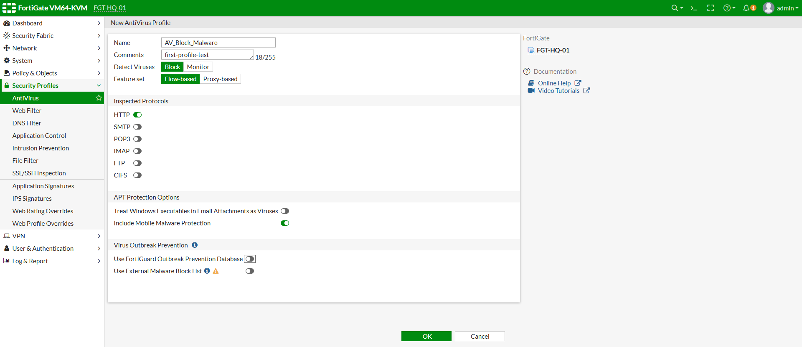
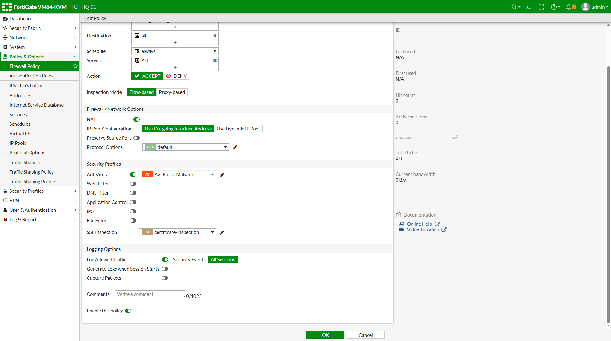
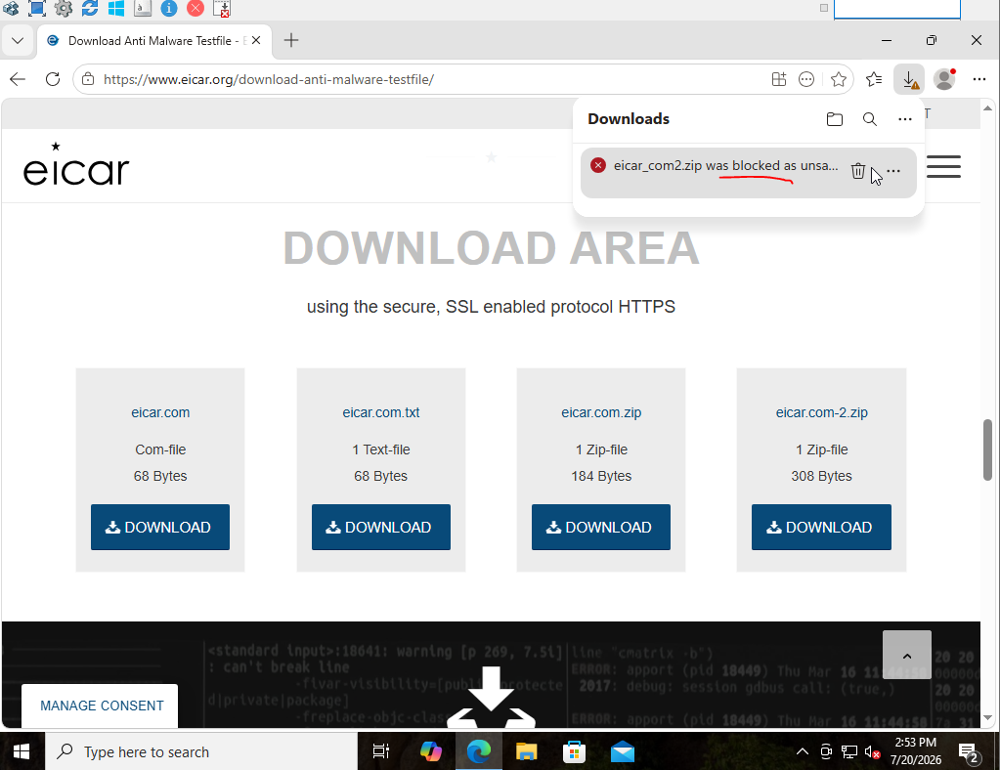

# تسک 1 - Preparing Security Inspection Environment


# هدف

در این Task محیط FortiGate برای پیاده‌سازی قابلیت‌های امنیتی مانند:

- Antivirus
- Intrusion Prevention System (IPS)
- Application Control
- Web Filter
- DNS Filter

آماده خواهد شد.

ا Security Profileها در FortiGate بر روی Firewall Policy اعمال می‌شوند، بنابراین قبل از فعال‌سازی هر سرویس امنیتی باید ساختار Policy، Logging و Inspection Mode بررسی و آماده شود.

در پایان این Task:

- ساختار Firewall Policy بررسی خواهد شد.
- ا Inspection Mode مناسب انتخاب خواهد شد.
- ا Log Traffic فعال خواهد شد.
- وضعیت FortiGuard بررسی خواهد شد.
- ارتباط FortiGate با سرویس‌های امنیتی بررسی خواهد شد.
- ا Policy برای اعمال Security Profileها آماده خواهد شد.


# سناریوی Lab

در این سناریو یک Client داخلی قصد دارد از طریق FortiGate به اینترنت دسترسی داشته باشد.

تمام Traffic عبوری از Firewall بررسی خواهد شد و Security Profileهای مختلف روی آن اعمال خواهند شد.


# توپولوژی

```text
                 Internet

                    │

                    │

              port1 (WAN)

                    │

               FortiGate

                    │

              port2 (LAN)

                    │

                 Client
```


# بررسی Firewall Policy

ابتدا Policy مربوط به خروج کاربران از LAN به اینترنت را بررسی کنید.

از مسیر زیر وارد شوید:

```text
Policy & Objects

↓

Firewall Policy
```

Policy مورد نظر باید مشابه نمونه زیر باشد:

| گزینه | مقدار |
|---|---|
| Name | HQ-LAN-to-WAN-Allow |
| Incoming Interface | port2 |
| Outgoing Interface | port1 |
| Source | HQ_Internal_Networks |
| Destination | all |
| Service | ALL |
| Action | ACCEPT |
| NAT | Enable |

---

# فعال کردن Logging

برای مشاهده رفتار Security Profileها، ثبت Log ضروری است.

در Firewall Policy گزینه زیر را فعال کنید:

```text
Log Allowed Traffic

↓

All Sessions
```

بدون فعال بودن Log، مشاهده حملات و Eventهای امنیتی امکان‌پذیر نخواهد بود.


# بررسی Inspection Mode

ا FortiGate برای بررسی Traffic دو حالت اصلی دارد:

## Flow Based Inspection

در این حالت Traffic هنگام عبور بررسی می‌شود.

مزایا:

- سرعت بالاتر
- مصرف کمتر منابع
- مناسب برای اکثر سناریوها


## Proxy Based Inspection

در این حالت FortiGate مانند Proxy عمل کرده و Traffic را قبل از ارسال بررسی می‌کند.

مزایا:

- قابلیت‌های امنیتی بیشتر
- کنترل دقیق‌تر محتوا

معایب:

- مصرف منابع بیشتر


# انتخاب Inspection Mode

برای این Lab از حالت زیر استفاده می‌کنیم:

```text
Flow Based Inspection
```

در محیط‌های Enterprise می‌توان بسته به نیاز سازمان از Proxy Mode نیز استفاده کرد.

---

# بررسی SSL Inspection

بسیاری از Trafficهای امروزی HTTPS هستند.

بدون SSL Inspection:

```text
HTTPS Traffic

↓

Encrypted

↓

FortiGate Visibility محدود
```

در این Lab ابتدا از حالت زیر استفاده می‌کنیم:

```text
Certificate Inspection
```

در Taskهای بعدی، Deep Inspection به صورت جداگانه بررسی خواهد شد.


# فعال کردن Security Event Logging

برای مشاهده Eventهای امنیتی:

مسیر:

```text
Log & Report

↓

Log Settings
```

بررسی کنید:

```text
Local Logging

Enable
```


# آماده‌سازی Client برای تست

سیستم Client باید:

- ا IP معتبر دریافت کند.
- ا Gateway آن FortiGate باشد.
- اینترنت داشته باشد.


# تست ارتباط اولیه

قبل از فعال کردن Security Profileها، ارتباط پایه را تست کنید.

از Client:

```bash
ping 10.10.10.1
```

سپس:

```bash
ping 8.8.8.8
```

و در نهایت:

```text
Open Browser

↓

Open Internet Website
```

---

# وضعیت فعلی

در پایان این Task وضعیت به شکل زیر است:

```text
Firewall Policy

✓ Ready


Logging

✓ Enabled


FortiGuard

✓ Checked


Inspection Mode

✓ Configured


Security Profiles

✗ Not Applied Yet
```

---

# نتیجه

در این Task محیط FortiGate برای پیاده‌سازی قابلیت‌های Threat Prevention آماده شد.

ا Firewall Policy، Logging، Inspection Mode و ارتباط FortiGuard بررسی شدند.

در Task بعدی، اولین Security Profile یعنی **Antivirus Profile** فعال خواهد شد و رفتار FortiGate در مقابل فایل‌های آلوده بررسی می‌شود.


<br><br>

# تسک 2 - Configuring Antivirus Profile and Malware Detection


# هدف

در این Task قابلیت **Antivirus** در FortiGate فعال خواهد شد.

ا Antivirus یکی از مهم‌ترین Security Profileهای FortiGate است که برای شناسایی و جلوگیری از عبور فایل‌های مخرب استفاده می‌شود.

در این سناریو:

- ا Antivirus Profile ایجاد خواهد شد.
- ا Antivirus روی Firewall Policy اعمال خواهد شد.
- فایل تستی EICAR دانلود خواهد شد.
- رفتار FortiGate در مقابل فایل آلوده بررسی خواهد شد.
- ا Logهای Antivirus بررسی خواهند شد.

در پایان این Task:

- نحوه عملکرد Antivirus Engine را درک خواهید کرد.
- تفاوت Monitor و Block را خواهید شناخت.
- ا Malware Detection را در FortiGate مشاهده خواهید کرد.


# مفهوم Antivirus در FortiGate

ا Antivirus در FortiGate وظیفه بررسی فایل‌هایی را دارد که از داخل Firewall عبور می‌کنند.

ساختار کلی:

```text
Client

↓

Internet

↓

FortiGate Antivirus Engine

↓

File Inspection

↓

Allow / Block

↓

Destination
```


# ا Antivirus چگونه کار می‌کند؟

هنگامی که کاربر فایلی را دانلود می‌کند:

1. ا Traffic وارد FortiGate می‌شود.
2. فایل توسط Antivirus Engine بررسی می‌شود.
3. ا Signatureها و Database بررسی می‌شوند.
4. نتیجه مشخص می‌شود.

نتایج ممکن:

```text
Clean File

↓

Allow
```

یا

```text
Malicious File

↓

Block
```

---

# بررسی FortiGuard Antivirus Database

قبل از فعال کردن Antivirus مطمئن شوید Database موجود است.

از CLI:

```bash
diagnose autoupdate versions
```

بررسی کنید:

```text
AV Engine

AV Database
```

نمونه:

```text
AV Engine Version:
Updated

AV Database:
Available
```

---

# ایجاد Antivirus Profile

از مسیر زیر وارد شوید:

```text
Security Profiles

↓

Antivirus

↓

Create New
```

---

# تنظیمات Profile

## Name

نام Profile:

```text
AV_Block_Malware
```

---

# Inspection Mode

حالت بررسی:

```text
Flow Based
```

---

# HTTP Scan

فعال کنید:

```text
HTTP

Enable
```

---

# HTTPS Scan

برای HTTPS نیاز به SSL Inspection داریم.

در این مرحله:

```text
Certificate Inspection
```

استفاده می‌کنیم.

---

# Malware Action

برای فایل‌های آلوده:

```text
Block
```

انتخاب کنید.

رفتار:

```text
Malware Detected

↓

File Blocked
```

---

# Archive Scan

برای بررسی فایل‌های فشرده:

فعال کنید:

```text
Scan Archives

Enable
```

نمونه:

```text
ZIP

RAR

7z
```

---

# Quarantine

در این Lab:

```text
Disable
```

در محیط‌های Enterprise می‌توان فایل‌ها را برای بررسی بیشتر نگهداری کرد.

---
📸 Screenshot



# ذخیره Antivirus Profile

روی:

```text
OK
```

کلیک کنید.

---

# اعمال Antivirus روی Firewall Policy

حالا باید Profile ساخته‌شده را روی Policy اعمال کنیم.

مسیر:

```text
Policy & Objects

↓

Firewall Policy

↓

HQ-LAN-to-WAN-Allow
```

ویرایش Policy:

---

فعال کنید:

```text
Security Profiles

Enable
```

---

Antivirus را انتخاب کنید:

```text
AV_Block_Malware
```

---

SSL Inspection:

```text
certificate-inspection
```


ذخیره کنید.


📸 Screenshot




# ساختار نهایی Policy

پس از اعمال Antivirus:

```text
Client

↓

Firewall Policy

↓

Antivirus Profile

↓

Internet
```


# تست Antivirus با EICAR

برای تست از فایل واقعی Malware استفاده نمی‌کنیم.

از فایل استاندارد تستی EICAR استفاده می‌شود.

ا EICAR یک فایل آزمایشی است که تمام محصولات Antivirus باید آن را به عنوان تهدید شناسایی کنند.

---

# سناریوی تست

روی Client:

```text
Open Browser

↓

Download EICAR Test File
```

پس از شروع دانلود:

```text
Client

↓

FortiGate

↓

Antivirus Scan

↓

Detection

↓

Block
```

---

# رفتار مورد انتظار FortiGate

در صورت فعال بودن Antivirus:

نتیجه باید مشابه زیر باشد:

```text
Download Failed

Access Denied

File Blocked
```
📸 Screenshot




# مشاهده Log Antivirus

از GUI:

```text
Log & Report

↓

Security Events

↓

Antivirus
```

---

نمونه Event:

```text
Type:

Antivirus


Action:

Blocked


Virus:

EICAR_TEST_FILE


Source:

10.10.10.x
```

---

# بررسی Traffic Log

مسیر:

```text
Log & Report

↓

Forward Traffic
```

بررسی کنید:

- Source IP
- Destination
- Policy ID
- Security Action

---

# تغییر حالت Monitor

برای مقایسه رفتار:

می‌توان Action را موقتاً تغییر داد.

از:

```text
Block
```

به:

```text
Monitor
```

در حالت Monitor:

```text
File Allowed

+

Log Generated
```

---

# مقایسه Block و Monitor

| Mode | رفتار |
|-|-|
| Monitor | اجازه عبور + ثبت Log |
| Block | جلوگیری + ثبت Log |

---

# وضعیت فعلی

در پایان این Task:

```text
Firewall Policy

✓ Configured


Antivirus Profile

✓ Enabled


Malware Detection

✓ Tested


EICAR Test

✓ Detected


IPS

✗ Not Configured


Application Control

✗ Not Configured
```

---

# نتیجه

در این Task قابلیت Antivirus در FortiGate فعال شد.

یک Antivirus Profile ایجاد شد، روی Firewall Policy اعمال گردید و با فایل تستی EICAR عملکرد آن بررسی شد.

مشاهده شد که FortiGate می‌تواند فایل‌های مخرب را قبل از رسیدن به Client شناسایی و Block کند.

در Task بعدی، قابلیت **IPS (Intrusion Prevention System)** فعال خواهد شد و حمله Nmap برای بررسی رفتار FortiGate اجرا می‌شود.

<br><br>


# تسک 3 - Configuring Intrusion Prevention System (IPS) 


# هدف

در این Task قابلیت **Intrusion Prevention System (IPS)** در FortiGate فعال خواهد شد.

ا IPS یکی از مهم‌ترین قابلیت‌های امنیتی FortiGate است که برای شناسایی و جلوگیری از حملات شبکه طراحی شده است.

برخلاف Antivirus که فایل‌ها را بررسی می‌کند، IPS ترافیک شبکه را تحلیل کرده و الگوهای حمله را شناسایی می‌کند.

در پایان این Task:

- با مفهوم IPS آشنا خواهید شد.
- یک IPS Profile ایجاد خواهید کرد.
- ا IPS روی Firewall Policy اعمال خواهد شد.
- نحوه عملکرد Signatureها را خواهید شناخت.
- ا FortiGate برای شناسایی حملات آماده خواهد شد.


# ا  IPS چیست؟

ا Intrusion Prevention System یا **IPS** سیستمی است که ترافیک عبوری از شبکه را به صورت لحظه‌ای بررسی می‌کند.

هدف IPS:

- شناسایی حملات
- جلوگیری از Exploitها
- تشخیص Port Scan
- جلوگیری از Buffer Overflow
- شناسایی SQL Injection
- شناسایی حملات شناخته‌شده

---

# نحوه عملکرد IPS

```text
Attacker

↓

Network Traffic

↓

FortiGate IPS Engine

↓

Signature Matching

↓

Allow / Block / Reset

↓

Destination
```


# ا   Signature چیست؟

ا IPS بر اساس Signature کار می‌کند.

هر Signature معرف یک نوع حمله است.

نمونه‌ها:

- Nmap Scan
- SQL Injection
- SMB Exploit
- HTTP Exploit
- DNS Attack
- FTP Attack

ا FortiGuard به صورت مداوم Signatureهای جدید را منتشر می‌کند.


# بررسی IPS Database

قبل از فعال‌سازی IPS، وضعیت Database را بررسی کنید.

از CLI:

```bash
diagnose autoupdate versions
```

بررسی کنید:

```text
IPS Definitions

IPS Engine
```

---

# ایجاد IPS Profile

از مسیر زیر وارد شوید.

```text
Security Profiles

↓

Intrusion Prevention
```

روی:

```text
Create New
```

کلیک کنید.

---

# تنظیمات Profile

## Name

```text
IPS_Block_Attacks
```

---

# Inspection Mode

برای این Lab:

```text
Flow Based
```

---

# Signature Selection

برای شروع، Signatureهای پیش‌فرض FortiGuard را استفاده می‌کنیم.

در محیط‌های Enterprise می‌توان Signatureهای سفارشی نیز اضافه کرد.

---

# Severity

سطح بررسی را روی همه Severityها قرار دهید.

```text
Critical

High

Medium

Low
```

این کار باعث می‌شود تمام حملات شناخته‌شده بررسی شوند.

---

# Action

برای این Lab:

```text
Block
```

در صورت شناسایی حمله، FortiGate ارتباط را مسدود خواهد کرد.

---

# Logging

فعال کنید:

```text
Log Attacks

Enable
```

تمام حملات شناسایی‌شده در بخش Security Events ثبت خواهند شد.

---

# ذخیره Profile

روی:

```text
OK
```

کلیک کنید.

---

# اعمال IPS روی Firewall Policy

از مسیر زیر وارد شوید.

```text
Policy & Objects

↓

Firewall Policy
```

Policy:

```text
HQ-LAN-to-WAN-Allow
```

را ویرایش کنید.

---

# Security Profiles

در بخش Security Profiles، گزینه زیر را انتخاب نمایید.

```text
Intrusion Prevention

↓

IPS_Block_Attacks
```

در صورتی که قبلاً Antivirus فعال شده است، هر دو Profile باید روی همین Policy اعمال شوند.


# نحوه عملکرد

پس از اعمال IPS:

```text
Traffic

↓

Firewall Policy

↓

IPS Inspection

↓

No Attack

↓

Allow
```

یا

```text
Traffic

↓

Firewall Policy

↓

IPS Inspection

↓

Attack Detected

↓

Block
```

---

# بررسی Policy

پس از ذخیره تنظیمات، Firewall Policy باید شامل موارد زیر باشد.

| Security Profile | Status |
|------------------|--------|
| Antivirus | Enabled |
| IPS | Enabled |

---

# وضعیت فعلی

```text
Firewall Policy

✓ Ready

↓

Antivirus

✓ Enabled

↓

IPS

✓ Enabled

↓

Application Control

✗ Not Configured

↓

Web Filter

✗ Not Configured
```

تا این مرحله FortiGate آماده شناسایی حملات شبکه است، اما هنوز هیچ حمله‌ای اجرا نشده است.

---

# نتیجه

در این Task، قابلیت Intrusion Prevention System روی FortiGate فعال شد و یک IPS Profile روی Firewall Policy اعمال گردید.

از این پس، تمام ترافیک عبوری توسط IPS Engine بررسی شده و در صورت تطابق با Signatureهای شناخته‌شده، حمله شناسایی و بر اساس Policy تعریف‌شده مسدود خواهد شد.

در Task بعدی، حملات عملی شامل **Nmap Port Scan** و **SQL Injection** اجرا شده و نحوه تشخیص و ثبت آن‌ها توسط FortiGate بررسی خواهد شد.


<br><br>


# هدف

در Task قبل، قابلیت IPS روی FortiGate فعال شد و یک IPS Profile روی Firewall Policy اعمال گردید.

در این بخش، عملکرد IPS در یک محیط آزمایشگاهی بررسی خواهد شد.

برای این منظور، دو سناریوی متداول اجرا می‌شود:

- شناسایی Port Scan با Nmap
- شناسایی تلاش برای SQL Injection

در پایان این Task:

- رفتار IPS در برابر حملات شبکه را مشاهده خواهید کرد.
- نحوه ثبت Eventهای امنیتی را بررسی خواهید کرد.
- ا Security Logهای مربوط به حملات را تحلیل خواهید نمود.


# سناریوی اول - Port Scan

هدف این سناریو بررسی واکنش FortiGate در برابر اسکن پورت‌ها است.

ا Attacker تلاش می‌کند پورت‌های سیستم مقصد را شناسایی کند.

ا IPS باید این رفتار را بررسی کرده و در صورت تطابق با Signatureهای فعال، آن را ثبت یا مسدود کند.

---

# اجرای Port Scan

از سیستم آزمایشگاهی، اسکن پورت را روی Web Server یا Windows Server اجرا کنید.

هدف از این مرحله صرفاً تولید ترافیک آزمایشی برای بررسی عملکرد IPS است.

---

# رفتار مورد انتظار FortiGate

در صورت فعال بودن Signature مناسب، IPS یکی از رفتارهای زیر را نشان می‌دهد.

```text
Port Scan

↓

IPS Detection

↓

Log Generated

↓

Action

Monitor / Block
```

در صورتی که Action روی **Block** تنظیم شده باشد، ارتباط اسکن متوقف خواهد شد.

---

# بررسی Security Event

از مسیر زیر وارد شوید.

```text
Log & Report

↓

Security Events

↓

Intrusion Prevention
```

نمونه اطلاعاتی که مشاهده می‌شود:

- زمان وقوع حمله
- آدرس IP مبدأ
- آدرس IP مقصد
- نام Signature
- Severity
- Action

---

# سناریوی دوم - SQL Injection

در این بخش، یک برنامه وب آزمایشگاهی (مانند DVWA یا هر برنامه تستی مشابه) برای بررسی عملکرد IPS استفاده می‌شود.

هدف، مشاهده تشخیص الگوهای شناخته‌شده SQL Injection توسط IPS است.

---

# فرآیند حمله

```text
Attacker

↓

HTTP Request

↓

FortiGate IPS

↓

Signature Matching

↓

Block / Log

↓

Web Server
```

در صورت تطابق درخواست با Signatureهای SQL Injection، IPS آن را شناسایی خواهد کرد.

---

# بررسی Eventهای SQL Injection

در بخش Security Events، اطلاعاتی مشابه موارد زیر نمایش داده می‌شود.

| فیلد | توضیح |
|------|-------|
| Attack Name | نام Signature شناسایی‌شده |
| Severity | سطح تهدید |
| Source IP | آدرس IP مبدأ |
| Destination IP | آدرس IP مقصد |
| Action | Monitor یا Block |

---

# تحلیل Security Log

برای هر حمله، موارد زیر را بررسی کنید.

- زمان وقوع حمله
- نام Signature
- سطح Severity
- پروتکل مورد استفاده
- Policy ID
- Action انجام‌شده توسط FortiGate

---

# مقایسه حالت Monitor و Block

اگر Action روی **Monitor** باشد:

```text
Attack

↓

Detected

↓

Logged

↓

Traffic Allowed
```

اگر Action روی **Block** باشد:

```text
Attack

↓

Detected

↓

Traffic Blocked

↓

Security Log Created
```

---

# بررسی از CLI

برای مشاهده خلاصه رویدادها می‌توانید از Logهای سیستم یا ابزارهای مانیتورینگ FortiGate استفاده کنید.

در محیط‌های عملیاتی، معمولاً این اطلاعات به FortiAnalyzer یا Syslog نیز ارسال می‌شوند.

---

# تحلیل نتایج

پس از اجرای سناریوها، موارد زیر را ارزیابی کنید.

- آیا حمله توسط IPS شناسایی شد؟
- آیا Signature مناسب فعال بود؟
- آیا Action مطابق انتظار انجام شد؟
- آیا Security Event ثبت شد؟
- آیا Policy صحیح روی ترافیک اعمال شده بود؟

---

# وضعیت فعلی

```text
Firewall Policy

✓ Configured

↓

Antivirus

✓ Enabled

↓

IPS

✓ Enabled

↓

Port Scan Detection

✓ Tested

↓

SQL Injection Detection

✓ Tested

↓

Application Control

✗ Not Configured

↓

Web Filter

✗ Not Configured
```

---

# نتیجه

در این Task، عملکرد عملی IPS در یک محیط آزمایشگاهی بررسی شد.

مشاهده شد که FortiGate با استفاده از Signatureهای امنیتی می‌تواند الگوهای شناخته‌شده حملات را شناسایی کرده و بر اساس تنظیمات انجام‌شده، آن‌ها را ثبت یا مسدود کند.

در Task بعدی، قابلیت **Application Control** پیکربندی خواهد شد تا امکان شناسایی و کنترل برنامه‌هایی مانند پیام‌رسان‌ها، شبکه‌های اجتماعی و سایر Applicationهای تحت شبکه فراهم شود.


<br><br>

# تسک  4 - Configuring Application Control


# هدف

در این Task قابلیت **Application Control** در FortiGate پیکربندی خواهد شد.

ا Application Control به مدیر شبکه اجازه می‌دهد برنامه‌ها و سرویس‌های مختلف را شناسایی، کنترل و محدود کند.

برخلاف Firewall Policy که بر اساس:

- IP Address
- Port
- Protocol

عمل می‌کند، Application Control بر اساس نوع واقعی برنامه تصمیم‌گیری می‌کند.

در پایان این Task:

- مفهوم Application Control را درک خواهید کرد.
- یک Application Control Profile ایجاد خواهید کرد.
- ا Profile را روی Firewall Policy اعمال خواهید کرد.
- چند برنامه را Monitor و Block خواهید کرد.
- ا Logهای مربوط به برنامه‌ها را مشاهده خواهید کرد.

# ا Application Control چیست؟

ا FortiGate می‌تواند نوع واقعی ترافیک را تشخیص دهد.

مثال:

```text
TCP Port 443
```

ممکن است مربوط به:

- YouTube
- Telegram
- WhatsApp
- Facebook
- Dropbox
- Teams
- Zoom

باشد.

ا Application Control نوع واقعی برنامه را تشخیص می‌دهد.

---

# نحوه عملکرد

```text
Client

↓

Application Traffic

↓

FortiGate

↓

Application Detection

↓

Allow / Monitor / Block

↓

Internet
```

---

# ایجاد Profile

از مسیر زیر وارد شوید:

```text
Security Profiles

↓

Application Control
```

روی:

```text
Create New
```

کلیک کنید.

---

# تنظیمات Profile

## Name

```text
APP_Control_Profile
```

---

# Log Applications

فعال کنید:

```text
Log Applications

Enable
```

---

# انتخاب Applicationها

برای این Lab موارد زیر را تنظیم می‌کنیم.

---

## BitTorrent

```text
Action:

Block
```

---

## Proxy Applications

```text
Action:

Block
```

---

## Tor

```text
Action:

Block
```

---

## Remote Access Tools

```text
Monitor
```

---

## Social Media

```text
Monitor
```

---

## Streaming Media

```text
Monitor
```

---

# ذخیره Profile

روی:

```text
OK
```

کلیک کنید.

---

# اعمال روی Firewall Policy

مسیر:

```text
Policy & Objects

↓

Firewall Policy

↓

HQ-LAN-to-WAN-Allow
```

---

در بخش:

```text
Security Profiles
```

انتخاب کنید:

```text
Application Control

↓

APP_Control_Profile
```


# تست Application Control

کاربر فعالیت‌های زیر را انجام می‌دهد:

```text
Open YouTube

↓

Open Telegram

↓

Open Facebook

↓

Torrent Client
```

---

# رفتار مورد انتظار

## YouTube

```text
Monitor
```

---

## Facebook

```text
Monitor
```

---

## BitTorrent

```text
Block
```

---

## Tor

```text
Block
```

---

# مشاهده Log

مسیر:

```text
Log & Report

↓

Application Control
```


# مزایای Application Control

- کنترل برنامه‌ها
- جلوگیری از نرم‌افزارهای ناخواسته
- مدیریت پهنای باند
- شناسایی ترافیک پنهان
- افزایش امنیت


# نتیجه

در این Task قابلیت Application Control روی FortiGate فعال شد.

ا FortiGate توانست نوع واقعی برنامه‌ها را تشخیص داده و بر اساس تنظیمات انجام‌شده آن‌ها را Monitor یا Block کند.

در Task بعدی، قابلیت **Web Filter** فعال خواهد شد تا دسترسی کاربران به وب‌سایت‌ها بر اساس Category کنترل شود.


<br><br>


# تسک  5 - Configuring Web Filter


# هدف

در این Task قابلیت **Web Filter** در FortiGate پیکربندی خواهد شد.

ا Web Filter به مدیر شبکه اجازه می‌دهد دسترسی کاربران به وب‌سایت‌ها را بر اساس دسته‌بندی (Category)، آدرس URL یا امتیازدهی FortiGuard کنترل کند.

در پایان این Task:

- با مفهوم Web Filtering آشنا خواهید شد.
- یک Web Filter Profile ایجاد خواهید کرد.
- دسته‌بندی وب‌سایت‌ها را مدیریت خواهید کرد.
- دسترسی به برخی وب‌سایت‌ها را مسدود خواهید نمود.
- ا Logهای Web Filter را بررسی خواهید کرد.


# ا  Web Filter چیست؟

ا Web Filter یکی از Security Profileهای FortiGate است که درخواست‌های HTTP و HTTPS را بررسی کرده و بر اساس سیاست‌های تعریف‌شده، اجازه یا عدم اجازه دسترسی را مشخص می‌کند.

ا FortiGate از سرویس **FortiGuard Web Rating** برای شناسایی دسته‌بندی میلیون‌ها وب‌سایت استفاده می‌کند.


# نحوه عملکرد

```text
Client

↓

HTTP / HTTPS Request

↓

FortiGate

↓

FortiGuard Web Rating

↓

Category Detection

↓

Allow / Monitor / Block

↓

Internet
```


# انواع روش‌های فیلتر کردن

ا FortiGate می‌تواند وب‌سایت‌ها را بر اساس موارد زیر کنترل کند.

- Category Filtering
- Static URL Filter
- FortiGuard Rating
- Safe Search
- YouTube Restriction

---

# ایجاد Web Filter Profile

از مسیر زیر وارد شوید.

```text
Security Profiles

↓

Web Filter
```

روی:

```text
Create New
```

کلیک کنید.

---

# تنظیمات Profile

## Name

```text
WEB_Filter_Profile
```

---

# Inspection Mode

برای این Lab:

```text
Flow Based
```

---

# فعال کردن Logging

```text
Log All URL Visits

Enable
```

---

# Category Filtering

در این Lab تنظیمات زیر پیشنهاد می‌شود.

| Category | Action |
|----------|--------|
| Malware | Block |
| Phishing | Block |
| Botnet | Block |
| Adult | Block |
| Gambling | Block |
| Proxy Avoidance | Block |
| Social Networking | Monitor |
| Streaming Media | Monitor |

---

# ایجاد Static URL Filter

در همان Profile وارد بخش:

```text
Static URL Filter
```

شوید.

یک Rule جدید ایجاد کنید.

نمونه:

| URL | Type | Action |
|-----|------|--------|
| facebook.com | Wildcard | Block |
| *.facebook.com | Wildcard | Block |

در صورت نیاز می‌توانید دامنه‌های دیگری نیز اضافه کنید.

---

# ذخیره Profile

روی:

```text
OK
```

کلیک کنید.

---

# اعمال Web Filter روی Firewall Policy

از مسیر:

```text
Policy & Objects

↓

Firewall Policy

↓

HQ-LAN-to-WAN-Allow
```

در بخش:

```text
Security Profiles
```

گزینه زیر را انتخاب کنید.

```text
Web Filter

↓

WEB_Filter_Profile
```


# تست Web Filter

اکنون از Client چند وب‌سایت را باز کنید.

نمونه:

```text
https://facebook.com
```

```text
https://youtube.com
```

```text
https://example.com
```

---

# رفتار مورد انتظار

## Facebook

```text
Blocked
```

در صورتی که در Static URL Filter یا Category به صورت Block تعریف شده باشد.

---

## YouTube

```text
Allowed

+

Logged
```

در صورتی که Category آن روی Monitor تنظیم شده باشد.

---

## وب‌سایت‌های عادی

```text
Allowed
```


# مزایای Web Filter

- جلوگیری از دسترسی به وب‌سایت‌های مخرب
- کنترل استفاده از اینترنت
- کاهش ریسک آلودگی به Malware
- مدیریت استفاده کاربران از وب
- ثبت کامل فعالیت‌های وب


# نتیجه

در این Task، قابلیت Web Filter روی FortiGate فعال شد.

یک Web Filter Profile ایجاد و روی Firewall Policy اعمال گردید. همچنین با استفاده از Category Filtering و Static URL Filter، دسترسی کاربران به وب‌سایت‌ها کنترل شد و رویدادهای مربوط به آن در بخش Log & Report ثبت گردید.

در Task بعدی، قابلیت **DNS Filter** پیکربندی خواهد شد تا درخواست‌های DNS کاربران قبل از برقراری ارتباط با وب‌سایت‌های مخرب بررسی و در صورت نیاز مسدود شوند.

<br><br>


# تسک 6 - Configuring DNS Filter

# هدف

در این Task قابلیت **DNS Filter** در FortiGate پیکربندی خواهد شد.

ا DNS Filter یکی از Security Profileهای FortiGate است که درخواست‌های DNS کاربران را بررسی کرده و از دسترسی به دامنه‌های مخرب، Botnetها و وب‌سایت‌های آلوده جلوگیری می‌کند.

برخلاف Web Filter که پس از ارسال درخواست HTTP یا HTTPS عمل می‌کند، DNS Filter قبل از برقراری ارتباط با وب‌سایت وارد عمل می‌شود.

در پایان این Task:

- با مفهوم DNS Filter آشنا خواهید شد.
- یک DNS Filter Profile ایجاد خواهید کرد.
- ا Profile را روی Firewall Policy اعمال خواهید کرد.
- عملکرد DNS Filter را بررسی خواهید نمود.
- ا Logهای DNS Filter را مشاهده خواهید کرد.

---

# ا DNS Filter چیست؟

زمانی که کاربر آدرس یک وب‌سایت را وارد می‌کند، ابتدا باید نام دامنه به IP تبدیل شود.

این فرآیند توسط DNS انجام می‌شود.

```text
Client

↓

DNS Query

↓

FortiGate DNS Filter

↓

FortiGuard DNS Rating

↓

Allow / Block

↓

DNS Server
```

اگر دامنه مخرب تشخیص داده شود، FortiGate اجازه ارسال درخواست DNS را نخواهد داد.

---

# تفاوت DNS Filter و Web Filter

| DNS Filter | Web Filter |
|------------|------------|
| بررسی درخواست DNS | بررسی HTTP/HTTPS |
| جلوگیری قبل از برقراری ارتباط | جلوگیری هنگام دسترسی به وب |
| مناسب برای شناسایی دامنه‌های مخرب | مناسب برای کنترل دسته‌بندی وب‌سایت‌ها |

---

# ایجاد DNS Filter Profile

از مسیر زیر وارد شوید.

```text
Security Profiles

↓

DNS Filter
```

روی:

```text
Create New
```

کلیک کنید.

---

# تنظیمات Profile

## Name

```text
DNS_Filter_Profile
```

---

# فعال کردن Logging

گزینه زیر را فعال کنید.

```text
Log DNS Query

Enable
```

---

# تنظیم Categoryها

برای این Lab، تنظیمات زیر پیشنهاد می‌شود.

| Category | Action |
|----------|--------|
| Botnet & C2 | Block |
| Malware | Block |
| Phishing | Block |
| Newly Observed Domains | Monitor |
| Spam URLs | Block |

---

# Domain Filter 

در صورت نیاز می‌توانید دامنه‌های مشخصی را نیز به صورت دستی مسدود کنید.

نمونه:

```text
bad-example.local
```

یا

```text
test-malware.example
```

این قابلیت برای محیط‌های آزمایشگاهی یا سیاست‌های داخلی سازمان مفید است.

---

# ذخیره Profile

روی:

```text
OK
```

کلیک کنید.

---

# اعمال DNS Filter روی Firewall Policy

از مسیر:

```text
Policy & Objects

↓

Firewall Policy

↓

HQ-LAN-to-WAN-Allow
```

در بخش:

```text
Security Profiles
```

گزینه زیر را انتخاب کنید.

```text
DNS Filter

↓

DNS_Filter_Profile
```


# تست عملکرد DNS Filter

از Client چند دامنه مختلف را بررسی کنید.

نمونه:

- دامنه‌های معمولی
- دامنه‌های آزمایشگاهی
- دامنه‌هایی که در Domain Filter تعریف کرده‌اید

رفتار مورد انتظار:

```text
Safe Domain

↓

DNS Resolution

↓

Allowed
```

و برای دامنه‌های مسدود شده:

```text
DNS Query

↓

Blocked

↓

No Resolution
```

---

# بررسی DNS Filter Log

از مسیر:

```text
Log & Report

↓

Security Events

↓

DNS
```

اطلاعات زیر قابل مشاهده خواهد بود.

- Query Domain
- Category
- Source IP
- Username
- Action
- Policy ID
- Time


# مزایای DNS Filter

- جلوگیری از ارتباط با دامنه‌های آلوده
- شناسایی Botnetها
- جلوگیری از ارتباط با سرورهای Command & Control (C2)
- کاهش احتمال آلودگی سیستم‌ها
- ثبت کامل درخواست‌های DNS


# معماری نهایی Threat Prevention

```text
                Internet

                    │

             FortiGuard Services

                    │

                FortiGate

                    │

      ┌────────────────────────────┐

      │ Antivirus                  │

      │ IPS                        │

      │ Application Control        │

      │ Web Filter                 │

      │ DNS Filter                 │

      └────────────────────────────┘

                    │

                 Client
```


# نتیجه

در این Task، قابلیت DNS Filter روی FortiGate فعال شد و روی Firewall Policy اعمال گردید.

ا FortiGate اکنون می‌تواند درخواست‌های DNS را قبل از برقراری ارتباط با وب‌سایت‌ها بررسی کرده و دامنه‌های مخرب، Botnetها و سایر تهدیدهای شناخته‌شده را بر اساس اطلاعات ا ا ا FortiGuard شناسایی و مسدود کند.

با پایان این Task، تمامی Security Profileهای اصلی FortiGate شامل **Antivirus، IPS، Application Control، Web Filter و DNS Filter** در این Lab پیاده‌سازی شدند.