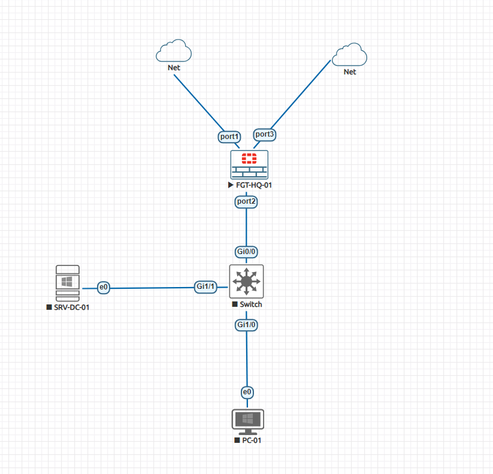
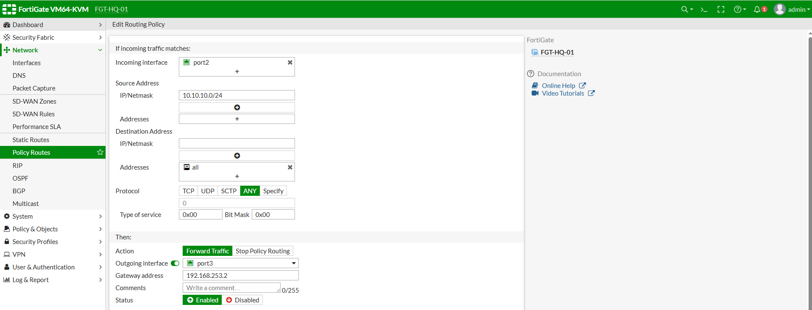
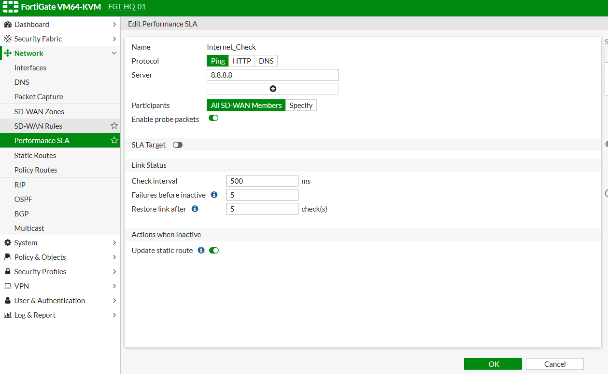
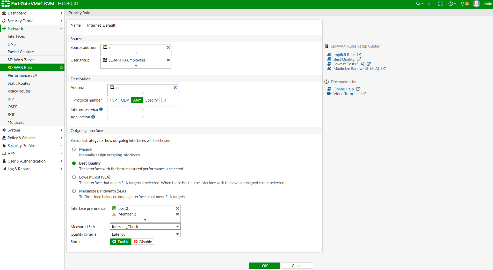

# تسک 1 - Configuring Static Routing


# هدف

در این Task نحوه پیکربندی Static Route در FortiGate بررسی خواهد شد.

ا Static Route یکی از ساده‌ترین و مهم‌ترین روش‌های مسیریابی است که در آن مدیر شبکه به صورت دستی مسیر رسیدن به شبکه‌های مقصد را مشخص می‌کند.

در پایان این Task:

- مفهوم Static Route را درک خواهید کرد.
- ا Default Route را پیکربندی خواهید کرد.
- نحوه مشاهده Routing Table را یاد خواهید گرفت.
- عملکرد Static Route را بررسی خواهید نمود.

# سناریوی Lab

در این سناریو، FortiGate دارای دو اتصال WAN است، اما در این Task فقط از ISP1 استفاده می‌شود.

```text
                ISP1
          192.168.253.187
                 │
                 │
          port1 (WAN1)
                 │
          +---------------+
          |   FortiGate   |
          +---------------+
                 │
          port2 (LAN)
                 │
            10.10.10.0/24
                 │
              Client PC
```

در Taskهای بعدی، اتصال ISP2 نیز اضافه خواهد شد.


# ا Static Route چیست؟

ا Static Route مسیری است که به صورت دستی توسط مدیر شبکه ایجاد می‌شود.

برخلاف Dynamic Routing، FortiGate مسیرها را از سایر Routerها یاد نمی‌گیرد.

نمونه:

```text
Destination

0.0.0.0/0

↓

Gateway

192.168.253.1

↓

Outgoing Interface

port1
```

---

# انواع Static Route

در این Lab با دو نوع Route آشنا می‌شویم.

## Default Route

تمام ترافیکی که مقصد آن در Routing Table وجود ندارد، از این مسیر عبور خواهد کرد.

```text
0.0.0.0/0
```

---

## Network Route

برای دسترسی به یک شبکه مشخص استفاده می‌شود.

نمونه:

```text
172.16.10.0/24
```

---

# بررسی Routing Table

قبل از ایجاد Route، Routing Table را بررسی کنید.

از مسیر:

```text
Network

↓

Static Routes
```

در صورتی که Routeای وجود نداشته باشد، تنها Routeهای متصل (Connected Routes) مشاهده خواهند شد.

---

# ایجاد Default Route از طریق GUI

از مسیر زیر وارد شوید.

```text
Network

↓

Static Routes

↓

Create New
```

---

# تنظیمات Route

## Destination

```text
Subnet

↓

0.0.0.0/0
```

---

## Gateway

آدرس Gateway مربوط به ISP1 را وارد کنید.

```text
192.168.253.1
```

---

## Interface

```text
port1
```

---

## Administrative Distance

```text
10
```

عدد کمتر، اولویت بالاتری دارد.

---

# ذخیره تنظیمات

روی:

```text
OK
```

کلیک کنید.

---

# ایجاد Default Route از طریق CLI

همین تنظیمات را می‌توان از طریق CLI نیز انجام داد.

```bash
config router static
    edit 1
        set dst 0.0.0.0/0
        set gateway 192.168.253.1
        set device "port1"
        set distance 10
    next
end
```

---

# بررسی Routing Table

برای مشاهده Routing Table از CLI دستور زیر را اجرا کنید.

```bash
get router info routing-table all
```


توضیح:

- **S** : Static Route
- **\*** : Default Route
- **10** : Administrative Distance
- **192.168.253.1** : Next Hop
- **port1** : خروجی Route

---

# بررسی Connected Routes

برای مشاهده شبکه‌های متصل:

```bash
get router info routing-table connected
```

نمونه:

```text
C 10.10.10.0/24 is directly connected, port2

C 192.168.100.0/24 is directly connected, port1
```

---

# تست ارتباط

اکنون از Client موارد زیر را بررسی کنید.

ابتدا Gateway:

```bash
ping 10.10.10.1
```

سپس Gateway اینترنت:

```bash
ping 192.168.253.1
```

در نهایت:

```bash
ping 8.8.8.8
```

در صورت وجود اینترنت، ارتباط باید برقرار باشد.


# بررسی Route Lookup

برای اطمینان از انتخاب صحیح مسیر، دستور زیر را اجرا کنید.

```bash
diagnose ip route list
```

این دستور Routeهای موجود را نمایش می‌دهد و برای عیب‌یابی بسیار مفید است.

---

# Administrative Distance

در FortiGate، اگر چند Route برای یک مقصد وجود داشته باشد، Route با کمترین مقدار Administrative Distance انتخاب می‌شود.

نمونه:

| Route | Distance |
|--------|----------|
| ISP1 | 10 |
| ISP2 | 20 |

در این حالت، ترافیک از ISP1 عبور خواهد کرد.

در Taskهای آینده از همین ویژگی برای Failover استفاده خواهیم کرد.


# نتیجه

در این Task، اولین Static Route روی FortiGate ایجاد شد.

همچنین با مفهوم Default Route، Routing Table و Administrative Distance آشنا شدید و نحوه بررسی مسیرهای مسیریابی از طریق GUI و CLI را فرا گرفتید.

در **Task 2**، اتصال دوم (ISP2) اضافه شده و **Policy Routing** برای هدایت هوشمند ترافیک بین دو لینک WAN پیکربندی خواهد شد.

<br><br>

# تسک  2 - Configuring Policy-Based Routing (PBR)

# هدف

در این Task قابلیت **Policy-Based Routing (PBR)** در FortiGate پیکربندی خواهد شد.

در Routing معمولی، FortiGate تنها بر اساس Routing Table تصمیم‌گیری می‌کند.

اما در Policy Route، مدیر شبکه می‌تواند بر اساس شرایط مختلف مانند:

- Source IP
- Destination IP
- Protocol
- Service
- Incoming Interface

مشخص کند که ترافیک از کدام Gateway یا Interface عبور کند.

در پایان این Task:

- مفهوم Policy Route را درک خواهید کرد.
- دومین لینک اینترنت (ISP2) را به FortiGate اضافه خواهید کرد.
- اولین Policy Route را ایجاد خواهید نمود.
- تفاوت Routing Table و Policy Routing را مشاهده خواهید کرد.

---

# سناریوی Lab

در این سناریو، FortiGate به دو ارائه‌دهنده اینترنت متصل است.

```text
                ISP1           ISP2                     
          192.168.253.187     
                 │                   │
                                     │
                 │                   |
             port1 (WAN1)        port3 (WAN2)
                 │                   |          
                   +---------------+
                   |   FortiGate   |
                   +---------------+
                            │
                        port2 (LAN)
                            │
                        10.10.10.0/24
                            │
                        Client PC
                   
```

در Task قبل فقط ISP1 استفاده می‌شد.

اکنون ISP2 نیز اضافه می‌شود.

---

📸 Screenshot




# ا Policy Route چیست؟

در حالت عادی، FortiGate تنها به Routing Table نگاه می‌کند.

```text
Routing Table

↓

Best Route

↓

Forward Packet
```

اما در Policy Routing ابتدا Policyها بررسی می‌شوند.

```text
Packet

↓

Policy Route

↓

Match ؟

↓

Yes

↓

Use Defined Gateway

↓

No

↓

Routing Table
```

بنابراین Policy Route همیشه قبل از Routing Table بررسی می‌شود.


# ایجاد Static Route برای ISP2

از مسیر:

```text
Network

↓

Static Routes
```

یک Route جدید ایجاد کنید.

نمونه:

| Destination | Gateway | Interface | Distance |
|-------------|----------|-----------|----------|
| 0.0.0.0/0 | gatewa-ip | port3 | 20 |

نکته:

ا  Distance این Route بیشتر از ISP1 است.

در نتیجه هنوز ISP1 مسیر اصلی خواهد بود.

---

# ایجاد Policy Route

از مسیر:

```text
Network

↓

Policy Routes

↓

Create New
```

---

# تنظیمات Policy Route

## Incoming Interface

```text
port2
```

---

## Source Address

```text
10.10.10.0/24
```

---

## Destination Address

```text
all
```

---

## Protocol

```text
ALL
```

---

## Outgoing Interface

```text
port3
```

---

## Gateway

```text
gateway-ip 
```

---

Policy را ذخیره کنید.

---

📸 Screenshot




# ترتیب بررسی مسیرها

ا  FortiGate هنگام دریافت Packet به ترتیب زیر عمل می‌کند.

```text
Packet

↓

Policy Route

↓

Matched ؟

↓

Yes

↓

ISP2

↓

No

↓

Routing Table

↓

ISP1
```

---

# تست عملکرد

از Client اینترنت را بررسی کنید.

در صورتی که شرایط Policy Route برقرار باشد، ترافیک باید از ISP2 عبور کند.

در غیر این صورت، ترافیک از مسیر Default Route روی ISP1 ارسال خواهد شد.

---

# بررسی Policy Route

از CLI:

```bash
get router info routing-table all
```

توجه داشته باشید که Policy Route در Routing Table نمایش داده نمی‌شود.

برای مشاهده Policy Routeها از دستور زیر استفاده کنید.

```bash
diagnose firewall proute list
```


# تفاوت Static Route و Policy Route

| Static Route | Policy Route |
|--------------|--------------|
| بر اساس مقصد تصمیم می‌گیرد | بر اساس شرایط مختلف تصمیم می‌گیرد |
| فقط Routing Table بررسی می‌شود | قبل از Routing Table بررسی می‌شود |
| ساده‌تر | انعطاف‌پذیرتر |

---

# کاربردهای Policy Routing

نمونه‌های رایج استفاده:

- ارسال ترافیک VoIP از ISP اختصاصی
- ارسال Backup از لینک دوم
- جداسازی ترافیک کاربران
- هدایت برنامه‌های خاص از مسیر مشخص
- مدیریت چند لینک اینترنت

---

# وضعیت فعلی

```text
WAN1 (ISP1)

✓ Static Route

↓

WAN2 (ISP2)

✓ Static Route

↓

Policy Route

✓ Configured
```

---

# نتیجه

در این Task، قابلیت **Policy-Based Routing** در FortiGate پیاده‌سازی شد.

اکنون FortiGate می‌تواند قبل از مراجعه به Routing Table، بر اساس شرایط تعریف‌شده تصمیم بگیرد که ترافیک از کدام Gateway یا Interface عبور کند.

در **Task 3**، قابلیت **Equal Cost Multi Path (ECMP)** پیکربندی خواهد شد تا هر دو لینک اینترنت به صورت هم‌زمان برای توزیع بار (Load Balancing) مورد استفاده قرار گیرند.


<br><br>

# تسک 3 - Configuring Equal Cost Multi Path (ECMP)

# هدف

در این Task قابلیت **Equal Cost Multi Path (ECMP)** در FortiGate پیکربندی خواهد شد.

ا ECMP یک تکنیک Routing است که اجازه می‌دهد چند مسیر با:

- ا Destination یکسان
- ا Administrative Distance یکسان
- ا Metric یکسان

به صورت هم‌زمان در Routing Table قرار بگیرند.

در پایان این Task:

- مفهوم ECMP را یاد خواهید گرفت.
- دو Default Route با اولویت یکسان ایجاد خواهید کرد.
- ا Load Balancing بین دو ISP را بررسی خواهید کرد.
- رفتار FortiGate در انتخاب مسیر را مشاهده خواهید نمود.

---

# ا ECMP چیست؟

در حالت عادی اگر دو Default Route داشته باشیم:

```text
ISP1
Distance 10

ISP2
Distance 20
```

ا FortiGate فقط ISP1 را انتخاب می‌کند.

اما اگر:

```text
ISP1
Distance 10


ISP2
Distance 10
```

باشد، FortiGate می‌تواند از هر دو مسیر استفاده کند.

این حالت ECMP است.


# پیش‌نیازها

قبل از شروع باید دو Default Route داشته باشیم.

مثال:

## ISP1

```text
Gateway:

192.168.100.1

Interface:

port1
```

---

## ISP2

```text
Gateway:

192.168.200.1

Interface:

port3
```

---

# بررسی Routing Table

ابتدا Routing Table را مشاهده کنید.

```bash
get router info routing-table all
```

حالت معمول:

```text
S* 0.0.0.0/0
via 192.168.100.1 port1
```

در این حالت فقط یک مسیر فعال است.

---

# ایجاد Default Route دوم

از GUI:

```text
Network

↓

Static Routes

↓

Create New
```

---

تنظیمات:

Destination:

```text
0.0.0.0/0
```

Gateway:

```text
192.168.200.1
```

Interface:

```text
port3
```

Administrative Distance:

```text
10
```

---

# نتیجه Routing Table

اکنون باید دو Route مشابه داشته باشیم.

نمونه:

```text
S* 0.0.0.0/0

via 192.168.100.1 port1


S* 0.0.0.0/0

via 192.168.200.1 port3
```

---

# بررسی ECMP

دستور:

```bash
get router info routing-table details 0.0.0.0
```

خروجی مشابه:

```text
Multiple gateways found

192.168.100.1

192.168.200.1
```

---

# الگوریتم Load Balancing

ا FortiGate معمولاً بر اساس Session تصمیم می‌گیرد.

یعنی:

```text
Session 1

↓

ISP1


Session 2

↓

ISP2
```

اما یک Session واحد وسط ارتباط مسیر خود را تغییر نمی‌دهد.

---

# تنظیم روش ECMP

از CLI:

```bash
config system settings

set v4-ecmp-mode source-ip-based

end
```

---

# حالت‌های ECMP

## Source IP Based

تصمیم بر اساس IP مبدا:

```text
Client A

↓

ISP1


Client B

↓

ISP2
```

---

## Weight Based

می‌توان وزن مسیرها را تغییر داد.

مثلاً:

```text
ISP1

Weight 2


ISP2

Weight 1
```

در این حالت ISP1 بیشتر استفاده می‌شود.

---

# تست ECMP

از چند Client یا چند Session مختلف تست انجام دهید.

مثال:

Client 1:

```bash
ping 8.8.8.8
```

Client 2:

```bash
ping 1.1.1.1
```

---

# مشاهده Session ها

CLI:

```bash
diagnose sys session list
```

در خروجی مسیر انتخاب شده قابل مشاهده است.

---

# مشاهده Traffic روی Interfaceها

از CLI:

```bash
diagnose netlink interface list
```

یا از GUI:

```text
FortiView

↓

Interfaces
```

---

# تفاوت ECMP و SD-WAN

| ECMP | SD-WAN |
|---|---|
| Routing Feature | WAN Optimization Feature |
| بر اساس Route | بر اساس Performance |
| فقط مسیرهای برابر | تصمیم هوشمند |
| بدون SLA | دارای Health Check |

---

# کاربردهای ECMP

- استفاده همزمان از چند ISP
- افزایش ظرفیت اینترنت
- توزیع Sessionها
- کاهش مصرف یک لینک

---

# وضعیت فعلی

```text
Static Route

✓ Configured


Policy Route

✓ Configured


ECMP

✓ Configured


SD-WAN

✗ Not Configured
```

---

# نتیجه

در این Task قابلیت ECMP در FortiGate پیاده‌سازی شد.

اکنون FortiGate قادر است چند مسیر با هزینه برابر را همزمان در Routing Table نگه دارد و Sessionهای مختلف را بین چند لینک WAN توزیع کند.

در Task بعدی وارد بخش مهم‌تر **SD-WAN** می‌شویم؛ جایی که FortiGate می‌تواند بر اساس کیفیت لینک، Latency، Packet Loss و Availability بهترین مسیر را انتخاب کند.

<br><br>

# تسک 4 - Configuring SD-WAN

# هدف

در این Task قابلیت **SD-WAN (Software-Defined Wide Area Network)** در FortiGate پیکربندی خواهد شد.

ا SD-WAN به FortiGate اجازه می‌دهد چندین لینک WAN را به صورت یک مجموعه مدیریت کرده و بر اساس قوانین مشخص، بهترین مسیر را برای عبور ترافیک انتخاب کند.

در پایان این Task:

- مفهوم SD-WAN را یاد خواهید گرفت.
- لینک‌های WAN را عضو SD-WAN خواهید کرد.
- ا SD-WAN Zone ایجاد خواهید کرد.
- ا Performance SLA تعریف خواهید کرد.
- ا SD-WAN Rule ایجاد خواهید کرد.

---

# ا SD-WAN چیست؟

در روش‌های سنتی Routing:

```text
Routing Table

↓

Best Route

↓

Forward Traffic
```

اما در SD-WAN:

```text
Traffic

↓

SD-WAN Rule

↓

Link Quality Check

↓

Best WAN Link

↓

Forward Traffic
```

---

# مزایای SD-WAN

SD-WAN می‌تواند بر اساس موارد زیر تصمیم‌گیری کند:

- Latency
- Jitter
- Packet Loss
- Bandwidth
- Link Availability
- Application


# پیش‌نیازها

قبل از شروع:

دو لینک WAN باید فعال باشند.

مثال:

## WAN1

```text
Interface:

port1

IP:

192.168.100.2/24

Gateway:

192.168.100.1
```

---

## WAN2

```text
Interface:

port3

IP:

192.168.200.2/24

Gateway:

192.168.200.1
```

---

# فعال کردن SD-WAN

از GUI:

مسیر:

```text
Network

↓

SD-WAN
```

گزینه:

```text
Enable SD-WAN
```

را فعال کنید.

---

# ایجاد SD-WAN Zone

یک Zone بسازید.

Name:

```text
SD-WAN-ZONE
```

نوع:

```text
Virtual-WAN-Link
```

---

# اضافه کردن Interfaceها

دو عضو اضافه کنید.

## Member 1

```text
Interface:

port1


Gateway:

192.168.100.1
```

---

## Member 2

```text
Interface:

port3


Gateway:

192.168.200.1
```

---

# ساختار جدید

قبل از SD-WAN:

```text
LAN

↓

Routing Table

↓

port1 / port3
```

---

بعد از SD-WAN:

```text
LAN

↓

SD-WAN Zone

↓

port1

or

port3
```

---

# ایجاد Performance SLA

ا  Performance SLA برای بررسی کیفیت لینک استفاده می‌شود.

مسیر:

```text
SD-WAN

↓

Performance SLA

↓

Create New
```

---

تنظیمات:

Name:

```text
Internet_Check
```

---

Server:

```text
8.8.8.8
```

---

Protocol:

```text
Ping
```

---

Interval:

```text
500 ms
```

---

Fail Time:

```text
5
```

---

Recovery Time:

```text
5
```

---

# عملکرد SLA

ا FortiGate به صورت مداوم لینک‌ها را بررسی می‌کند.

مثال:

```text
ISP1

Latency 20ms

Packet Loss 0%

↓

Healthy
```

---

```text
ISP2

Packet Loss 80%

↓

Failed
```


📸 Screenshot




# ایجاد SD-WAN Rule

مسیر:

```text
SD-WAN Rules

↓

Create New
```

---

Name:

```text
Internet_Default
```

---

Source:

```text
all
```

---

Destination:

```text
all
```

---

Strategy:

```text
Best Quality
```

---

SLA:

```text
Internet_Check
```

---

Members:

```text
port1

port3
```

📸 Screenshot




# الگوریتم‌های SD-WAN

## Manual

مدیر مسیر را تعیین می‌کند.

---

## Best Quality

بر اساس کیفیت لینک انتخاب می‌کند.

---

## Lowest Cost

بر اساس هزینه لینک انتخاب می‌کند.

---

## Maximize Bandwidth

بیشترین پهنای باند را انتخاب می‌کند.

---

# تست SD-WAN

از Client:

```bash
ping 8.8.8.8
```

سپس وضعیت SD-WAN را بررسی کنید.

---

CLI:

```bash
diagnose sys virtual-wan-link health-check
```

---

مشاهده وضعیت اعضا:

```bash
diagnose sys virtual-wan-link member
```

---

# بررسی GUI

مسیر:

```text
Dashboard

↓

Network

↓

SD-WAN
```

موارد زیر نمایش داده می‌شود:

- Status لینک‌ها
- Latency
- Packet Loss
- Jitter
- Traffic Distribution

---

# تفاوت ECMP و SD-WAN

| ECMP | SD-WAN |
|-|-|
| Routing Based | Policy Based |
| فقط مسیر مساوی | تصمیم هوشمند |
| بدون بررسی کیفیت | دارای SLA |
| ساده | پیشرفته |

---

# وضعیت فعلی

```text
Static Route

✓


Policy Route

✓


ECMP

✓


SD-WAN

✓


Health Check

Pending
```

---

# نتیجه

در این Task، SD-WAN روی FortiGate فعال شد.

دو لینک WAN به SD-WAN Zone اضافه شدند و FortiGate اکنون می‌تواند بر اساس قوانین و کیفیت لینک‌ها، مسیر مناسب برای ارسال ترافیک را انتخاب کند.


<br><br>


# تسک 5 - Configuring SD-WAN Failover and Link Monitoring


# هدف

در این Task قابلیت **Automatic Failover** با استفاده از SD-WAN در FortiGate پیاده‌سازی خواهد شد.

ا FortiGate به صورت مداوم کیفیت لینک‌های WAN را بررسی کرده و در صورت قطع شدن یا افت کیفیت یک لینک، ترافیک را به لینک دیگر منتقل می‌کند.

در پایان این Task:

- ا Health Check در SD-WAN بررسی خواهد شد.
- قطع شدن یک ISP شبیه‌سازی می‌شود.
- ا Failover خودکار مشاهده خواهد شد.
- ا Recovery لینک اصلی بررسی خواهد شد.


# وضعیت اولیه

قبل از Failover:

```text
ISP1

Status:

Alive


ISP2

Status:

Alive
```

و SD-WAN Rule مسیر اصلی را انتخاب می‌کند.

---

# بررسی وضعیت SD-WAN

از CLI:

```bash
diagnose sys virtual-wan-link health-check
```


# تنظیم Priority در SD-WAN

در SD-WAN Rule:

مسیر:

```text
Network

↓

SD-WAN

↓

SD-WAN Rules
```

Rule:

```text
Internet_Default
```

را باز کنید.

---

# Strategy

انتخاب کنید:

```text
Best Quality
```

یا:

```text
Priority
```

---

# تعیین اولویت لینک‌ها

ترتیب:

```text
1 - port1

2 - port3
```

یعنی:

```text
ISP1

Primary


ISP2

Backup
```

---

# ساختار Failover

حالت عادی:

```text
Client

↓

FortiGate

↓

port1

↓

ISP1

↓

Internet
```

---

زمان قطع ISP1:

```text
Client

↓

FortiGate

↓

port3

↓

ISP2

↓

Internet
```

---

# تست Failover

## مرحله اول

از Client تست Ping بگیرید:

```bash
ping 8.8.8.8
```

باید پاسخ دریافت شود.

---

## مرحله دوم
 لینک ISP1  قطع کنید.


یا Interface مربوط به ISP1 را Shutdown کنید.

---

## مرحله سوم

چند ثانیه صبر کنید.

FortiGate باید متوجه شود:

```text
ISP1

↓

No Response

↓

SLA Failed
```

---

# مشاهده تغییر مسیر

دستور:

```bash
diagnose sys virtual-wan-link member
```

نمونه:

قبل:

```text
port1

Status: alive

Selected
```

بعد:

```text
port1

Status: dead


port3

Status: alive

Selected
```

---

# بررسی Sessionها

برای مشاهده Sessionهای فعال:

```bash
diagnose sys session list
```

---

# نکته مهم

ا Sessionهای موجود ممکن است همچنان روی لینک قبلی باقی بمانند.

برای تست واقعی:

ا Session جدید ایجاد کنید.

مثلاً:

```bash
ping

↓

new session
```

---

# ا Recovery لینک اصلی

اکنون ISP1 را دوباره فعال کنید.

FortiGate:

```text
Detect Link

↓

SLA Success

↓

Return Traffic
```

---

# بررسی Recovery

دستور:

```bash
diagnose sys virtual-wan-link health-check
```

باید نشان دهد:

```text
port1

Status:

alive
```

---

# تنظیمات CLI مرتبط

مشاهده SD-WAN:

```bash
show system virtual-wan-link
```

---

مشاهده SLA:

```bash
show system virtual-wan-link
```

---

# بررسی Log

از GUI:

```text
Log & Report

↓

Events
```

رویدادهایی مانند:

```text
SD-WAN member down

SD-WAN member restored
```

مشاهده خواهد شد.

---

# کاربرد واقعی Failover

در سازمان‌ها:

```text
Primary ISP

Fiber Link


Backup ISP

4G / MPLS / Secondary Fiber
```

در صورت خرابی لینک اصلی:

```text
Automatic Failover

↓

No Manual Action
```

---

# مقایسه Static Route Failover و SD-WAN Failover

| Static Route | SD-WAN |
|-|-|
| فقط بررسی Route | بررسی کیفیت لینک |
| بر اساس Distance | بر اساس SLA |
| ساده | هوشمند |
| بدون Latency Check | دارای Health Check |

---

# وضعیت فعلی Lab

```text
Static Route

✓


Policy Route

✓


ECMP

✓


SD-WAN

✓


Health Check

✓


Automatic Failover

✓
```

---

# نتیجه

در این Task قابلیت SD-WAN Failover در FortiGate پیاده‌سازی شد.

ا FortiGate توانست وضعیت لینک‌های WAN را بررسی کرده و در صورت قطع شدن ISP اصلی، ترافیک را به صورت خودکار به لینک پشتیبان منتقل کند.

این قابلیت یکی از مهم‌ترین کاربردهای SD-WAN در شبکه‌های سازمانی است.


<br><br>

# تسک 6 - Configuring OSPF Dynamic Routing


# هدف

در این Task پروتکل **OSPF (Open Shortest Path First)** روی FortiGate پیکربندی خواهد شد.

ا OSPF یک پروتکل Dynamic Routing از نوع Link-State است که به Routerها اجازه می‌دهد اطلاعات شبکه‌ها و مسیرها را به صورت خودکار با یکدیگر تبادل کنند.

در پایان این Task:

- مفهوم OSPF را یاد خواهید گرفت.
- ا OSPF Process ایجاد خواهید کرد.
- ا Interfaceهای OSPF را فعال خواهید کرد.
- ا Neighbor تشکیل خواهید داد.
- ا Routeهای OSPF را بررسی خواهید کرد.


# ا OSPF چیست؟

ا OSPF یک Interior Gateway Protocol (IGP) است که داخل یک سازمان یا Autonomous System استفاده می‌شود.

برخلاف Static Route:

```text
Administrator

↓

Manual Route
```

در OSPF:

```text
Router

↓

Exchange Information

↓

Learn Routes Automatically
```

---

# ویژگی‌های OSPF

- ا Link-State Routing Protocol
- استفاده از SPF Algorithm
- پشتیبانی از Area
- انتخاب بهترین مسیر بر اساس Cost
- ا Convergence سریع


# Area در OSPF

در OSPF شبکه‌ها به Area تقسیم می‌شوند.

مهم‌ترین Area:

```text
Area 0
```

که Backbone Area نام دارد.

در این Lab از:

```text
Area 0
```

استفاده می‌کنیم.

---

# پیش‌نیاز

ابتدا Static Routeهای قبلی را حذف نمی‌کنیم، اما برای تست بهتر می‌توانیم بعداً بررسی کنیم که OSPF چگونه Route جدید اضافه می‌کند.

---

# فعال کردن OSPF در FortiGate

از GUI:

```text
Network

↓

OSPF
```

یا CLI:

```bash
config router ospf

set router-id 1.1.1.1

end
```

---

# ا Router ID چیست؟

ا Router ID یک شناسه یکتا برای هر OSPF Router است.

مثال:

```text
FortiGate

Router ID:

1.1.1.1
```

---

# تنظیم Networkهای OSPF

CLI:

```bash
config router ospf

config ospf-interface

end
```

ساده‌ترین روش:

```bash
config router ospf

config network

edit 1

set prefix 10.10.20.0 255.255.255.0

set area 0.0.0.0

next

edit 2

set prefix 10.10.10.0 255.255.255.0

set area 0.0.0.0

next

end
```

---

# فعال کردن OSPF روی Interface

ا Interface ارتباطی:

```text
port4
```

است.

تنظیم:

```bash
config router ospf

config ospf-interface

edit port4

set interface port4

next

end
```

---

# ایجاد Neighbor

وقتی دو Router در یک شبکه OSPF باشند، مراحل زیر انجام می‌شود:

```text
Down

↓

Init

↓

2-Way

↓

ExStart

↓

Exchange

↓

Full
```

---

# بررسی Neighbor

دستور:

```bash
get router info ospf neighbor
```

خروجی:

```text
Neighbor ID

2.2.2.2

State:

Full
```

---

# بررسی Routeهای OSPF

دستور:

```bash
get router info routing-table ospf
```

نمونه:

```text
O 172.16.10.0/24

via 10.10.20.1
```

توضیح:

```text
O = OSPF Route
```

---

# بررسی وضعیت OSPF

دستور:

```bash
get router info ospf status
```

نمونه:

```text
OSPF Process

Router ID:

1.1.1.1
```


# مقایسه Static Route و OSPF

| Static Route | OSPF |
|-|-|
| دستی | خودکار |
| مناسب شبکه کوچک | مناسب شبکه متوسط و بزرگ |
| بدون تغییر خودکار | Adapt Dynamic |
| مدیریت سخت در مقیاس بالا | Scalable |

---

# کاربرد OSPF در سازمان

نمونه:

```text
Branch Office

↓

OSPF

↓

HQ Firewall

↓

Internal Networks
```

---

# وضعیت فعلی Lab

```text
Static Routing

✓


Policy Routing

✓


ECMP

✓


SD-WAN

✓


OSPF

✓ Configured
```

---

# نتیجه

در این Task، OSPF روی FortiGate فعال شد.

ا FortiGate اکنون قادر است با Routerهای دیگر همسایه OSPF تشکیل داده و Routeهای شبکه را به صورت Dynamic دریافت کند.
