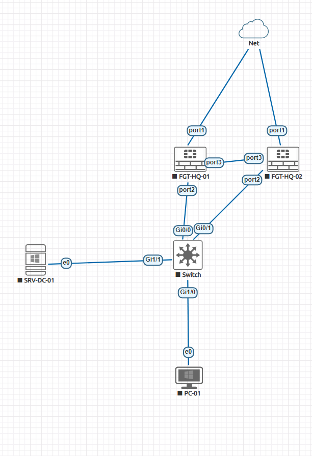

# تسک 1 - HA Concepts and Lab Preparation


# هدف

در این Task با مفهوم **High Availability (HA)** در FortiGate آشنا می‌شویم و محیط آزمایشگاهی را برای ایجاد یک HA Cluster آماده می‌کنیم.

هدف از HA افزایش:

- Availability
- Reliability
- Network Uptime

در شبکه‌های سازمانی است.

در پایان این Task:

- مفهوم HA را در FortiGate درک خواهید کرد.
- تفاوت Active-Passive و Active-Active را خواهید شناخت.
- ا Interface مورد استفاده برای Heartbeat را آماده خواهید کرد.
- دو FortiGate را برای ایجاد Cluster آماده خواهید نمود.

---

#  ا High Availability چیست؟

ا High Availability یا HA تکنیکی است که با استفاده از چند دستگاه مشابه، امکان ادامه سرویس‌دهی در زمان خرابی یک دستگاه را فراهم می‌کند.

در FortiGate، چند دستگاه می‌توانند به صورت یک Cluster کار کنند.

ساختار:

```
Primary FortiGate

        |
        |
   HA Synchronization

        |
        |

Secondary FortiGate
```

---

# مزایای FortiGate HA

استفاده از HA باعث می‌شود:

- قطعی سرویس کاهش پیدا کند.
- تنظیمات بین دستگاه‌ها هماهنگ شود.
- در صورت خرابی یک دستگاه، دستگاه دوم فعال شود.
- ا Sessionهای کاربران حفظ شوند.

---

# انواع HA در FortiGate

ا FortiGate دو حالت اصلی HA دارد.

# 1. Active-Passive HA

در این حالت:

یک FortiGate فعال است.

یک FortiGate آماده جایگزینی است.


ویژگی‌ها:

- فقط یک دستگاه ترافیک عبور می‌دهد.
- دستگاه دوم آماده Failover است.
- رایج‌ترین حالت در سازمان‌ها است.

---

# 2. Active-Active HA

در این حالت:

هر دو FortiGate می‌توانند در پردازش ترافیک مشارکت کنند.

```
          Traffic

             |

     -----------------

     |               |

  FGT-01          FGT-02
 Active          Active
```

---

ویژگی‌ها:

- استفاده از منابع هر دو دستگاه
- پیچیدگی بیشتر
- کمتر از Active-Passive استفاده می‌شود.

---

# HA Components

برای تشکیل HA Cluster چند مورد مهم وجود دارد.

---

# 1. Cluster Members

اعضای Cluster:

```
FGT-HQ-01

FGT-HQ-02
```

هستند.

تمام اعضا باید:

- مدل مشابه داشته باشند.
- ا Firmware یکسان داشته باشند.
- تنظیمات مشابه داشته باشند.

---

# 2. HA Heartbeat

ا Heartbeat کانالی است که FortiGateها از طریق آن با یکدیگر ارتباط برقرار می‌کنند.

وظایف:

- تشخیص وضعیت عضو دیگر
- ارسال اطلاعات HA
- ا Synchronize کردن تنظیمات

---

در Lab ما:

```
port3

        |

HA-LINK

        |

port3
```

به عنوان Heartbeat استفاده می‌شود.

---

# توپولوژی Lab

📸 Screenshot




# نام‌گذاری دستگاه‌ها

دستگاه اول:

```
FGT-HQ-01
```

دستگاه دوم:

```
FGT-HQ-02
```

---

# بررسی Firmware

قبل از ایجاد HA باید Firmware هر دو FortiGate یکسان باشد.

بررسی:

```bash
get system status
```

نمونه:

```
Version:

FortiOS 6.4.x
```

هر دو دستگاه باید Version مشابه داشته باشند.

---

# تنظیم Hostname

## FortiGate اول

```bash
config system global

set hostname FGT-HQ-01

end
```

---

## FortiGate دوم

```bash
config system global

set hostname FGT-HQ-02

end
```

---

# بررسی Interface ها

روی هر دو FortiGate:

```bash
show system interface
```

بررسی کنید:

```
port1

port2
```

وجود داشته باشند.

---

# آماده‌سازی Heartbeat Interface

روی FGT-HQ-01:

```bash
config system interface

edit port2

set allowaccess ping

next

end
```

---

روی FGT-HQ-02:

```bash
config system interface

edit port2

set allowaccess ping

next

end
```

---

# تست ارتباط Heartbeat

از FGT-HQ-01:

```bash
execute ping <FGT-HQ-02-port2-IP>
```

از FGT-HQ-02:

```bash
execute ping <FGT-HQ-01-port2-IP>
```

باید ارتباط برقرار باشد.

---

# ا HA Synchronization چیست؟

بعد از فعال شدن HA:

FortiGate اصلی:

```
Configuration
Policies
Objects
```

را به عضو دوم ارسال می‌کند.

```
Primary

        |

 Configuration Sync

        |

Secondary
```

---

# مواردی که Sync می‌شوند:

- Firewall Policy
- Address Object
- Service Object
- Routing Configuration
- VPN Configuration
- System Settings

---

# موارد مهم قبل از HA

قبل از فعال کردن Cluster:

✓ Firmware یکسان باشد

✓ Hardware مشابه باشد

✓ Interfaceها مشابه باشند

✓ Heartbeat Link فعال باشد

✓ تنظیمات اضافی حذف شود

---

# وضعیت فعلی Lab

```
FGT-HQ-01

✓ Created


FGT-HQ-02

✓ Created


Heartbeat Network

✓ Created


HA Configuration

Pending
```

---

# نتیجه

در این Task محیط آزمایشگاهی برای پیاده‌سازی FortiGate HA آماده شد.

همچنین با مفاهیم:

- HA Cluster
- Active-Passive
- Active-Active
- Heartbeat
- Synchronization

آشنا شدیم.

در Task بعدی، **Active-Passive HA Cluster** را روی دو FortiGate ایجاد خواهیم کرد و Primary و Secondary را مشخص می‌کنیم.

<br><br>


# تسک 2 - Configuring Active-Passive HA Cluster


# هدف

در این Task یک HA Cluster از نوع **Active-Passive** بین دو FortiGate ایجاد می‌کنیم.

در پایان این Task:

- ا HA Mode را فعال می‌کنیم.
- ا Cluster ID تعریف می‌کنیم.
- ا Password برای HA تنظیم می‌کنیم.
- ا Priority دستگاه‌ها را مشخص می‌کنیم.
- ا Primary و Secondary را مشاهده می‌کنیم.

---


# تنظیمات مورد نیاز

## Cluster Name

نام Cluster:

```
HQ-HA-CLUSTER
```

---

## Group ID

شناسه Cluster:

```
10
```

نکته:

تمام اعضای Cluster باید Group ID یکسان داشته باشند.

---

## Password

رمز HA:

```
FortiHA@123
```

---

## Mode

نوع HA:

```
Active-Passive
```

---

# مرحله 1 - تنظیم HA روی FGT-HQ-01

وارد CLI شو.

ابتدا:

```bash
config system ha
```

---

تنظیمات:

```bash
set mode a-p

set group-id 10

set group-name HQ-HA-CLUSTER

set password FortiHA@123

set priority 200

set override enable

end
```

---

# توضیح تنظیمات

## mode

```bash
set mode a-p
```

یعنی:

Active-Passive

---

## group-id

```bash
set group-id 10
```

شناسه Cluster است.

باید در هر دو FortiGate یکی باشد.

---

## group-name

```bash
set group-name HQ-HA-CLUSTER
```

نام Cluster.

---

## password

```bash
set password FortiHA@123
```

برای جلوگیری از Join شدن دستگاه غیرمجاز.

---

## priority

```bash
set priority 200
```

هرچه بیشتر باشد، احتمال Primary شدن بیشتر است.

در این Lab:

```
FGT-HQ-01

Priority 200

↓

Primary
```

---

# مرحله 2 - تنظیم HA روی FGT-HQ-02

روی FortiGate دوم:

```bash
config system ha
```

---

تنظیمات:

```bash
set mode a-p

set group-id 10

set group-name HQ-HA-CLUSTER

set password FortiHA@123

set priority 100

set override enable

end
```

---

# تفاوت Priority

```
FGT-HQ-01

Priority:

200


FGT-HQ-02

Priority:

100
```

بنابراین:

```
FGT-HQ-01

Primary


FGT-HQ-02

Secondary
```

خواهد شد.

---

# مرحله 3 - انتظار برای تشکیل Cluster

بعد از تنظیم HA:

ا FortiGate ری‌استارت HA انجام می‌دهد.

چند لحظه صبر کنید.

---

# بررسی وضعیت HA

روی هر FortiGate:

```bash
get system ha status
```

---

خروجی نمونه:

```
HA Health Status:

OK


Mode:

Active-Passive


Primary:

FGT-HQ-01


Secondary:

FGT-HQ-02
```

---

# بررسی با CLI

دستور:

```bash
diagnose sys ha status
```

نمونه:

```
Master:

FGT-HQ-01


Slave:

FGT-HQ-02
```

---

# بررسی Cluster Memberها

```bash
diagnose sys ha checksum cluster
```

---

# مشاهده اطلاعات کامل HA

```bash
show system ha
```

---

# رفتار بعد از فعال شدن HA

قبل:

```
FGT-HQ-01

Independent


FGT-HQ-02

Independent
```

---

بعد:

```
       HA Cluster


     FGT-HQ-01

       Primary

          |

    Synchronization

          |

     FGT-HQ-02

      Secondary
```

---

# تست Synchronization

روی Primary یک Object بساز:

مثلاً:

```bash
config firewall address

edit TEST-HA

set subnet 10.10.10.0 255.255.255.0

next

end
```

---

حالا روی Secondary بررسی کن:

```bash
show firewall address TEST-HA
```

باید همان Object وجود داشته باشد.

---

# بررسی وضعیت Sync

دستور:

```bash
diagnose sys ha status
```

قسمت:

```
Configuration Sync

OK
```

باید نمایش داده شود.

---

# نکته مهم در HA

بعد از تشکیل Cluster:

تنظیمات فقط باید روی Primary انجام شود.

یعنی:

```
FGT-HQ-01

Configuration

       |

       Sync

       |

FGT-HQ-02
```

---

# وضعیت فعلی Lab

```
HA Mode

✓ Active-Passive


Cluster

✓ Created


Primary

✓ FGT-HQ-01


Secondary

✓ FGT-HQ-02


Synchronization

✓ Enabled
```

---

# نتیجه

در این Task یک HA Cluster از نوع Active-Passive بین دو FortiGate ایجاد شد.

اکنون:

- ا FGT-HQ-01 مسئول عبور ترافیک است.
- ا FGT-HQ-02 در حالت Standby قرار دارد.
- تنظیمات بین دو دستگاه Synchronize می‌شود.

در Task بعدی، **HA Heartbeat و Session Synchronization** را بررسی می‌کنیم تا ببینیم FortiGateها چگونه وضعیت یکدیگر را تشخیص داده و اطلاعات Session را منتقل می‌کنند.


<br><br>


# تسک 3 - HA Heartbeat and Synchronization


# هدف

در این Task نحوه ارتباط اعضای HA Cluster و فرآیند Synchronization بررسی خواهد شد.

در پایان این Task:

- مفهوم HA Heartbeat را درک خواهید کرد.
- وضعیت ارتباط بین اعضای Cluster را بررسی خواهید کرد.
- ا Configuration Synchronization را تست خواهید کرد.
- ا Session Synchronization را فعال و بررسی خواهید کرد.

---

# ا HA Heartbeat چیست؟

ا Heartbeat یک ارتباط اختصاصی بین FortiGateهای عضو Cluster است.

وظایف Heartbeat:

- تشخیص فعال یا خراب بودن عضو دیگر
- انتخاب Primary
- ارسال اطلاعات Cluster
- ا Synchronize کردن تنظیمات


# بررسی Heartbeat Interface

روی Primary:

```bash
show system ha
```

بخش زیر را بررسی کنید:

```
set hbdev
```

نمونه:

```
set hbdev port2 50
```

---

# مفهوم Heartbeat Priority

در HA می‌توان برای Heartbeat Interface وزن تعیین کرد.

مثال:

```
port2 50
```

یعنی:

- ا port2 برای Heartbeat استفاده می‌شود.
- ا Priority آن 50 است.

هرچه عدد بیشتر باشد، اولویت Heartbeat بالاتر است.

---

# بررسی وضعیت HA

روی هر FortiGate:

```bash
get system ha status
```

نمونه:

```
Mode:

Active-Passive


Primary:

FGT-HQ-01


Secondary:

FGT-HQ-02


HA Status:

OK
```

---

# بررسی ارتباط اعضا

دستور:

```bash
diagnose sys ha status
```

نمونه خروجی:

```
HA information

Primary : FGT-HQ-01

Secondary : FGT-HQ-02

Heartbeat:

UP
```

---

# Configuration Synchronization

زمانی که HA فعال است، تنظیمات Primary به Secondary منتقل می‌شود.

مواردی که Sync می‌شوند:

- Firewall Policy
- Address Object
- Service Object
- VIP
- Routing
- VPN Configuration
- System Settings

---

# تست Configuration Sync

روی FGT-HQ-01:

یک Address Object بساز:

```bash
config firewall address

edit HA_TEST_NETWORK

set subnet 10.20.20.0/24

next

end
```

---

حالا روی FGT-HQ-02:

بررسی کن:

```bash
show firewall address HA_TEST_NETWORK
```

اگر Sync درست باشد:

Object باید وجود داشته باشد.

---

# بررسی Checksum

ا FortiGate برای بررسی هماهنگی Configuration از Checksum استفاده می‌کند.

دستور:

```bash
diagnose sys ha checksum cluster
```

خروجی:

```
All checksums are identical
```

یعنی:

تنظیمات برابر هستند.

---

# ا Session Synchronization چیست؟

در حالت عادی:

اگر Primary خراب شود، Sessionهای فعال ممکن است قطع شوند.

برای جلوگیری از این موضوع، FortiGate می‌تواند Session Table را بین اعضا Sync کند.


# فعال کردن Session Pickup

روی Primary:

```bash
config system ha

set session-pickup enable

end
```

---

# فعال کردن Session Pickup Delay

برای کنترل انتقال Session:

```bash
config system ha

set session-pickup-delay enable

end
```

---

# بررسی Session Synchronization

دستور:

```bash
diagnose sys ha status
```

بخش:

```
Session pickup

enabled
```

باید نمایش داده شود.

---

# تست Session Pickup

## مرحله 1

از Client یک Session ایجاد کن:

مثلاً:

```bash
ping 8.8.8.8
```

یا:

باز کردن یک اتصال HTTP

---

## مرحله 2

روی Primary Session را ببین:

```bash
diagnose sys session list
```

---

## مرحله 3

Primary را خاموش کن:

```
FGT-HQ-01

Power Off
```

---

## مرحله 4

بررسی کن:

FGT-HQ-02 باید:

```
Become Primary
```

شود.

---

# بررسی Failover Status

روی FortiGate جدید:

```bash
get system ha status
```

خروجی:

```
Master:

FGT-HQ-02
```

---

# Troubleshooting دستورات مهم

## وضعیت HA:

```bash
get system ha status
```

---

## اطلاعات کامل HA:

```bash
diagnose sys ha status
```

---

## بررسی Sync:

```bash
diagnose sys ha checksum cluster
```

---

## بررسی Session:

```bash
diagnose sys session list
```

---

# مشکلات رایج Heartbeat

## مشکل 1

Heartbeat Down

علت‌ها:

- کابل مجازی وصل نیست.
- Interface اشتباه انتخاب شده.
- VLAN مشکل دارد.
- تنظیم HA یکسان نیست.

---

## مشکل 2

Configuration Not Sync

علت‌ها:

- Firmware متفاوت
- HA Password متفاوت
- تنظیمات مستقل روی Secondary


# نتیجه

در این Task یاد گرفتیم:

- ا Heartbeat چگونه اعضای HA را به هم متصل می‌کند.
- ا FortiGate چگونه Configuration را Synchronize می‌کند.
- ا Session Synchronization چگونه باعث کاهش قطعی کاربران می‌شود.

