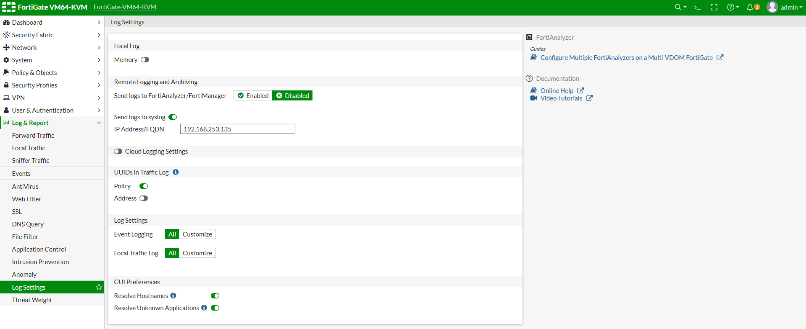
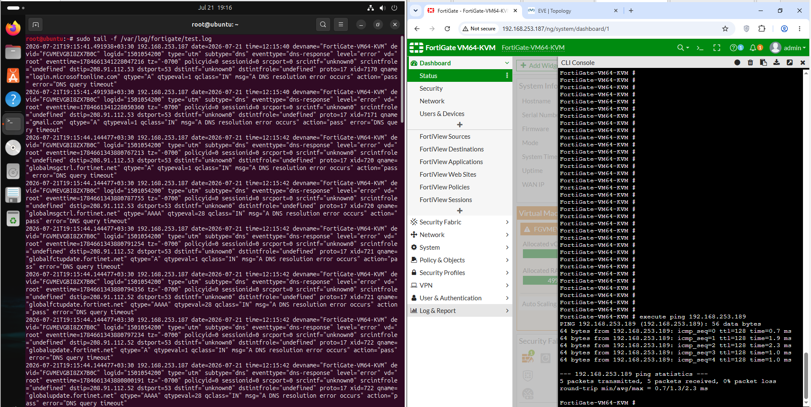

# تسک 1 - Understanding FortiGate Logging Architecture


# هدف

در این Task با ساختار Log در FortiGate آشنا می‌شویم و وضعیت Logging دستگاه را بررسی می‌کنیم.

در پایان این Task:

- انواع Log در FortiGate را می‌شناسیم.
- محل ذخیره Logها را بررسی می‌کنیم.
- وضعیت Disk Logging را بررسی می‌کنیم.
- قابلیت‌های Logging دستگاه را مشخص می‌کنیم.

---

# ا FortiGate Logging چیست؟

ا FortiGate برای ثبت اتفاقات شبکه از Logging استفاده می‌کند.

هر اتفاق مهم در سیستم می‌تواند یک Log تولید کند.

مثال:

- عبور یک Packet از Firewall Policy
- ا Login شدن یک User
- قطع شدن VPN
- تشخیص حمله توسط IPS
- ا Block شدن یک فایل توسط Antivirus
- تغییر تنظیمات Admin

---

# انواع Log در FortiGate

ا FortiGate چند نوع اصلی Log دارد.

---

## 1 - Traffic Log

مربوط به عبور ترافیک شبکه است.

مثال:

```
Client 192.168.10.20

↓

Firewall Policy 1

↓

Internet
```

در Traffic Log مشاهده می‌کنیم:

- Source IP
- Destination IP
- Port
- Policy ID
- Action
- Bytes
- Time

---

## 2 - Event Log

رویدادهای سیستم را ثبت می‌کند.

مثال:

- Login Admin
- chang Configuration
- Interface Down
- Restart شدن دستگاه

---

## 3 - Security Log

مربوط به Security Profileها است.

مانند:

- IPS
- Antivirus
- Web Filter
- Application Control

---

## 4 - VPN Log

مربوط به VPNها است.

مثال:

- SSL VPN Login
- IPsec Tunnel Status
- Authentication Failure

---

## 5 - Authentication Log

مربوط به User Authentication است.

مثال:

```
User:

employee01


Result:

Success
```

---

# محل ذخیره Log در FortiGate

ا FortiGate می‌تواند Logها را در چند محل ذخیره کند.

---

# 1 - Memory Logging

در RAM دستگاه ذخیره می‌شود.

مزایا:

- بدون نیاز به Disk
- مناسب برای Lab

معایب:

- بعد از Restart پاک می‌شود.

---

# 2 - Disk Logging

روی Hard Disk ذخیره می‌شود.

مزایا:

- ماندگاری Log
- امکان Search بهتر

معایب:

- نیاز به Disk دارد.

---

# 3 - FortiAnalyzer

راهکار حرفه‌ای Logging است.

مزایا:

- ذخیره طولانی مدت
- گزارش‌گیری
- تحلیل امنیتی

---

# بررسی وضعیت Logging

ابتدا وضعیت دستگاه را بررسی می‌کنیم.

از CLI:

```bash
get system status
```

---

اطلاعات مهم:

```
Version
Hostname
VM License
Storage
```

بررسی می‌شود.

---

# بررسی Disk Logging

دستور:

```bash
diagnose log device
```

---

اگر Disk موجود باشد:

نمونه:

```
Disk logging:

Available
```

---

اگر مثل Lab ما باشد:

```
Log hard disk:

Not available
```

یعنی:

ا FortiGate فضای ذخیره‌سازی برای Disk Log ندارد.

---

# بررسی تنظیمات Log

دستور:

```bash
show log setting
```

---

نمونه:

```
config log setting

set fwpolicy-implicit-log enable

end
```

---

# بررسی Logهای موجود

از GUI:

مسیر:

```
Log & Report

↓

Forward Traffic
```

---

در این قسمت Traffic Logها نمایش داده می‌شوند.

---

# بررسی Event Log

مسیر:

```
Log & Report

↓

System Events
```

---

در این قسمت:

- Login
- Configuration Change
- System Event

نمایش داده می‌شود.

---

# فعال بودن Logging در Firewall Policy

برای اینکه Traffic Log تولید شود، باید در Policy فعال باشد.

مسیر:

```
Policy & Objects

↓

Firewall Policy

↓

Edit Policy
```

گزینه:

```
Log Allowed Traffic
```

را فعال کنید.

---

گزینه مناسب:

```
All Sessions
```

---

# توضیح گزینه Log Allowed Traffic

دو حالت دارد:

---

## Security Events

فقط Eventهای امنیتی ثبت می‌شوند.

---

## All Sessions

تمام Sessionها ثبت می‌شوند.

برای Lab و Troubleshooting بهتر است:

```
All Sessions
```

انتخاب شود.

---

# فعال‌سازی Log از CLI

نمونه:

```bash
config firewall policy

edit 1

set logtraffic all

next

end
```

---

# بررسی Policy Logging

دستور:

```bash
show firewall policy
```

باید مشاهده شود:

```
set logtraffic all
```

---

# تست تولید Log

یک Traffic ایجاد کنید.

مثلاً:

```bash
execute ping 8.8.8.8
```

یا از Client:

```
Open Website
```

---

سپس:

GUI:

```
Log & Report

↓

Forward Traffic
```

را بررسی کنید.

---

# Troubleshooting اولیه

اگر Log مشاهده نمی‌شود:

بررسی کنید:

---

## 1

Policy Logging فعال باشد.

```bash
show firewall policy
```

---

## 2

Logging Setting فعال باشد.

```bash
show log setting
```

---

## 3

دستگاه Storage داشته باشد یا Memory Logging فعال باشد.

---

# نتیجه

در این Task یاد گرفتیم:

- ا  FortiGate چه Logهایی تولید می‌کند.
- ا Logها کجا ذخیره می‌شوند.
- تفاوت Memory، Disk و FortiAnalyzer چیست.
- چرا در FortiGate VM داخل EVE-NG ممکن است Disk Log نداشته باشیم.
- چگونه Logging را برای Firewall Policy فعال کنیم.


<br><br>

# تسک 2 - Enabling Local Logging and Viewing Traffic Logs


# هدف

در این Task، Local Logging روی FortiGate فعال می‌شود و Traffic Logهای مربوط به Firewall Policy بررسی خواهند شد.

در پایان این Task:

- ا Memory Logging فعال خواهد شد.
- ا Traffic Log در Firewall Policy فعال می‌شود.
- ا Logهای عبور ترافیک مشاهده خواهند شد.
- اطلاعات داخل Traffic Log تحلیل می‌شود.

---

# مرحله 1 - بررسی وضعیت Logging

ابتدا از CLI وضعیت Log را بررسی کنید.

```bash
show log setting
```

---

اگر خروجی مشابه زیر باشد:

```
config log setting
end
```

یعنی تنظیم خاصی فعال نشده است.

---

# مرحله 2 - فعال کردن Local Logging

از GUI وارد شوید:

```
System

↓

Settings
```

قسمت:

```
View Settings
```

یا در بعضی نسخه‌ها:

```
Log & Report

↓

Log Settings
```

---

گزینه:

```
Local Log
```

را فعال کنید.

---

# توضیح

ا Local Logging یعنی FortiGate خودش Logها را نگهداری کند.

در VMهایی که Disk ندارند، معمولاً Logها در Memory ذخیره می‌شوند.

---

# مرحله 3 - فعال کردن Memory Logging از CLI

در CLI:

```bash
config log memory setting

set status enable

end
```

---

بررسی:

```bash
show log memory setting
```

باید مشاهده شود:

```
set status enable
```

---

# مرحله 4 - فعال کردن Traffic Logging روی Firewall Policy

از GUI:

مسیر:

```
Policy & Objects

↓

Firewall Policy
```

Policy مورد نظر را Edit کنید.

مثلاً:

```
HQ-LAN-to-WAN-Allow
```

---

قسمت:

```
Log Allowed Traffic
```

را فعال کنید.

انتخاب:

```
All Sessions
```

---

# توضیح

این گزینه باعث می‌شود FortiGate تمام Sessionهایی که از این Policy عبور می‌کنند را ثبت کند.

مثلاً:

- Ping
- HTTP
- HTTPS
- DNS

---

# فعال‌سازی از CLI

```bash
config firewall policy

edit 1

set logtraffic all

next

end
```

---

# مرحله 5 - تولید Traffic

برای ایجاد Log باید ترافیک تولید کنیم.

از Client داخل LAN:

مثلاً:

```bash
ping 8.8.8.8
```

یا:

باز کردن یک سایت:

```
https://google.com
```

---

اگر Client ندارید، از FortiGate:

```bash
execute ping 8.8.8.8
```

---

# مرحله 6 - مشاهده Traffic Log

از GUI:

مسیر:

```
Log & Report

↓

Forward Traffic
```

---

باید رکوردهای جدید مشاهده شوند.

---

# تحلیل Traffic Log

هر Log شامل اطلاعات زیر است:

---

## Source

مبدأ ترافیک:

مثال:

```
192.168.10.50
```

---

## Destination

مقصد:

مثال:

```
8.8.8.8
```

---

## Action

نتیجه Policy:

```
Accept
```

یا:

```
Deny
```

---

## Policy ID

شماره Policy که Traffic را پردازش کرده است.

مثال:

```
Policy ID: 1
```

---

## Service

نوع سرویس:

مثلاً:

```
HTTPS
DNS
PING
```

---

## Bytes

مقدار داده ارسال و دریافت شده.

---

# مشاهده Log از CLI

برای مشاهده Logهای موجود:

```bash
execute log filter category 0
```

سپس:

```bash
execute log display
```

---

# بررسی Real-Time Traffic

برای دیدن Traffic لحظه‌ای:

```bash
diagnose sniffer packet any 'host 8.8.8.8' 4
```

---

نمونه:

```
192.168.10.50 -> 8.8.8.8

ICMP Echo Request
```

---

# تست Drop شدن Traffic

برای تست Logهای Deny:

یک Policy ایجاد کنید که Traffic را Block کند.

مثلاً:

```
Action:

Deny
```

سپس Traffic ایجاد کنید.

در Log مشاهده می‌کنید:

```
Action:

Deny
```

---

# بررسی Implicit Deny Log

برای ثبت Trafficهایی که هیچ Policy ندارند:

CLI:

```bash
config log setting

set fwpolicy-implicit-log enable

end
```

---

# بررسی تنظیمات

```bash
show log setting
```

باید مشاهده شود:

```
set fwpolicy-implicit-log enable
```


# نتیجه

در این Task:

✓ Local Logging فعال شد.

✓ Memory Logging برای VM فعال شد.

✓ Traffic Log تولید شد.

✓ اطلاعات داخل Traffic Log بررسی شد.

✓ مفهوم Policy Log و Implicit Deny Log یاد گرفته شد.

در Task بعدی:

<br><br>


# تسک 3  - Configuring Syslog Server Integration


# هدف

در این بخش یک Syslog Server ایجاد می‌کنیم تا Logهای FortiGate را دریافت و ذخیره کند.

در پایان این Task:

- یک Linux Syslog Server آماده خواهد شد.
- سرویس rsyslog فعال می‌شود.
- ا Remote Log Receiving فعال خواهد شد.
- ا Server آماده دریافت Log از FortiGate می‌شود.


# مشخصات Syslog Server

Operating System:

```
Ubuntu Server 22
```

IP Address:

```
192.168.253.135/24
```

Gateway:

```
192.168.253.2
```

Syslog Protocol:

```
UDP
```

Port:

```
514
```

---

# مرحله 1 - Update کردن Ubuntu

ابتدا سیستم را به‌روزرسانی کنید.

```bash
sudo apt update
```

---

سپس:

```bash
sudo apt upgrade -y
```

---

# مرحله 2 - بررسی نصب بودن rsyslog

در Ubuntu معمولاً rsyslog به صورت پیش‌فرض نصب است.

بررسی:

```bash
rsyslogd -v
```

---

نمونه خروجی:

```
rsyslogd 8.x.x
```

---

اگر نصب نبود:

```bash
sudo apt install rsyslog -y
```

---

# مرحله 3 - بررسی وضعیت سرویس rsyslog

دستور:

```bash
systemctl status rsyslog
```

---

اگر فعال نبود:

```bash
sudo systemctl start rsyslog
```

---

فعال کردن اجرای خودکار:

```bash
sudo systemctl enable rsyslog
```

---

# مرحله 4 - فعال کردن دریافت Remote Syslog

فایل تنظیمات rsyslog را باز کنید:

```bash
sudo nano /etc/rsyslog.conf
```

---

قسمت زیر را پیدا کنید:

```
#module(load="imudp")
#input(type="imudp" port="514")
```

---

علامت # را حذف کنید.

نتیجه:

```
module(load="imudp")

input(type="imudp" port="514")
```

---

# توضیح

این تنظیم باعث می‌شود Ubuntu روی UDP Port 514 گوش دهد.

یعنی:

```
FortiGate

UDP 514

↓

Ubuntu rsyslog
```

---

# مرحله 5 - ایجاد مسیر ذخیره Logهای FortiGate

یک فایل جدا برای FortiGate ایجاد می‌کنیم.

دایرکتوری:

```bash
sudo mkdir /var/log/fortigate
```

---

یک فایل تنظیمات جدید بسازید:

```bash
sudo nano /etc/rsyslog.d/fortigate.conf
```

---

محتوا:

```
if $fromhost-ip == '192.168.253.187' then /var/log/fortigate/test.log
& stop
```

---

# توضیح Configuration

قسمت:

```
192.168.253.187
```

آدرس FortiGate است.

هر Log که از FortiGate برسد در:

```
/var/log/fortigate/test.log
```

ذخیره خواهد شد.

---

# مرحله 6 - Restart کردن rsyslog

بعد از تغییرات:

```bash
sudo systemctl restart rsyslog
```

---

بررسی:

```bash
systemctl status rsyslog
```

---

# مرحله 7 - باز کردن Firewall Ubuntu

اگر UFW فعال است:

بررسی:

```bash
sudo ufw status
```

---

اجازه UDP 514:

```bash
sudo ufw allow 514/udp
```

---

# مرحله 8 - بررسی Listening Port

بررسی کنیم Ubuntu روی UDP 514 گوش می‌دهد.

دستور:

```bash
sudo ss -ulnp | grep 514
```

---

خروجی مورد انتظار:

```
udp

0.0.0.0:514

rsyslogd
```

---

# مرحله 9 - تست ارتباط شبکه

از Ubuntu:

```bash
ping 192.168.253.187
```

---

از FortiGate:

```bash
execute ping 192.168.253.135
```

---

اگر Ping موفق بود:

ارتباط شبکه آماده است.

---

# Troubleshooting

## مشکل 1

ا Port 514 باز نیست.
بررسی:

```bash
sudo ss -ulnp | grep 514
```

---

## مشکل 2

ا rsyslog اجرا نیست.

بررسی:

```bash
systemctl status rsyslog
```

---

## مشکل 3

ا Log ذخیره نمی‌شود.

بررسی:

```bash
sudo tail -f /var/log/syslog
```

---

# نتیجه

در این بخش:

✓ ا Ubuntu Syslog Server ساخته شد.

✓ ا rsyslog نصب و فعال شد.

✓ ا UDP 514 فعال شد.

✓ دریافت Remote Syslog آماده شد.

✓ مسیر ذخیره Logهای FortiGate ایجاد شد.

در Part بعدی:


<br><br>


# Part 2 - Configuring FortiGate Remote Syslog

# هدف

در این بخش، FortiGate برای ارسال Log به Remote Syslog Server تنظیم می‌شود.

در پایان این Task:

- ا Syslog Server به FortiGate معرفی می‌شود.
- نوع Logهای ارسالی مشخص می‌شود.
- ا Traffic Log ارسال خواهد شد.
- ا Event Log ارسال خواهد شد.
- ارتباط FortiGate و Syslog Server تست می‌شود.


# اطلاعات Syslog Server

Syslog Server:

```
Ubuntu Server
```

IP:

```
192.168.253.135
```

Protocol:

```
UDP
```

Port:

```
514
```

---

# مرحله 1 - تنظیم Syslog از طریق GUI

از FortiGate وارد شوید:

```
log & report 

↓

log Settings
```

---

قسمت:

```
Remote Logging and Archiving
```

را پیدا کنید.

---

گزینه:

```
Send Logs to Syslog
```

را فعال کنید.

📸 Screenshot



# Syslog Server

در قسمت:

```
Server
```

وارد کنید:

```
192.168.253.135
```

---

# Mode

انتخاب:

```
UDP
```

---

# Port

مقدار:

```
514
```

---

# Facility

مقدار پیش‌فرض:

```
Local7
```

را می‌توان نگه داشت.

---

# Log Type

موارد زیر را فعال کنید:

```
Traffic Logs

Event Logs

System Logs

VPN Logs

Security Logs
```

---

# ذخیره تنظیمات

روی:

```
Apply
```

کلیک کنید.

---

# مرحله 2 - تنظیم Syslog از طریق CLI

در FortiGate CLI:

```bash
config log syslogd setting

set status enable

set server 192.168.253.135

set mode udp

set port 514

end
```

---

# توضیح دستورات

## فعال کردن Syslog

```
set status enable
```

باعث فعال شدن ارسال Log می‌شود.

---

## تعیین مقصد

```
set server 192.168.253.135
```

آدرس Syslog Server است.

---

## پروتکل

```
set mode udp
```

ارسال با UDP انجام می‌شود.

---

## Port

```
set port 514
```

پورت استاندارد Syslog است.

---

# مرحله 3 - فعال کردن انواع Log

برای Traffic Log:

```bash
config log syslogd filter

set severity information

set forward-traffic enable

end
```

---

# توضیح

با این تنظیم:

ا Traffic Logهای Firewall Policy ارسال می‌شوند.

---

# ارسال Event Log

```bash
config log syslogd filter

set event enable

end
```

---

# ارسال VPN Log

```bash
config log syslogd filter

set vpn enable

end
```

---

# ارسال Security Log

برای Security Profileها:

```bash
config log syslogd filter

set anomaly enable

set virus enable

set web enable

set ips enable

end
```

---

# مرحله 4 - بررسی تنظیمات Syslog

دستور:

```bash
show log syslogd setting
```


# مرحله 5 - تست ارسال Log

ابتدا روی Ubuntu اجرا کنید:

```bash
sudo tail -f /var/log/fortigate/test.log
```

---

حالا روی FortiGate Traffic ایجاد کنید.

مثال:

```bash
execute ping 8.8.8.8
```

---

یا از Client:

```
Open Website
```


📸 Screenshot




# مرحله 6 - تست Syslog با CLI

برای تولید Event:

یک Login انجام دهید.

مثلاً:

- Logout
- Login دوباره

سپس Ubuntu را بررسی کنید.

---

# مرحله 7 - بررسی Packetهای Syslog

اگر Log دریافت نشد:

روی Ubuntu اجرا کنید:

```bash
sudo tcpdump -i eth0 port 514
```

---

باید Packetهای UDP از FortiGate دیده شوند.


# Troubleshooting

---

## مشکل 1

Ubuntu هیچ Logی نمی‌گیرد.

بررسی:

```bash
execute ping 192.168.10.100
```

از FortiGate.

---

## مشکل 2

Syslog فعال است ولی Traffic Log نمی‌آید.

بررسی:

Firewall Policy:

```
Log Allowed Traffic

↓

All Sessions
```

---

## مشکل 3

ا Packet به Ubuntu می‌رسد ولی فایل ساخته نمی‌شود.

بررسی:

```bash
sudo tail -f /var/log/syslog
```


اگر فایل test.log ساخته نشد  بصورت دستی ان را بساز و پرمیژن بهش بده 


```bash
sudo touch /var/log/fortigate/test.log

sudo chown syslog:adm /var/log/fortigate/test.log
```

---

# نتیجه

در این Part:

✓ ا Syslog Server به FortiGate معرفی شد.

✓ ارسال Remote Log فعال شد.

✓ ا Traffic/Event/VPN/Security Log فعال شدند.

✓ ارتباط FortiGate و Ubuntu Syslog Server تست شد.

