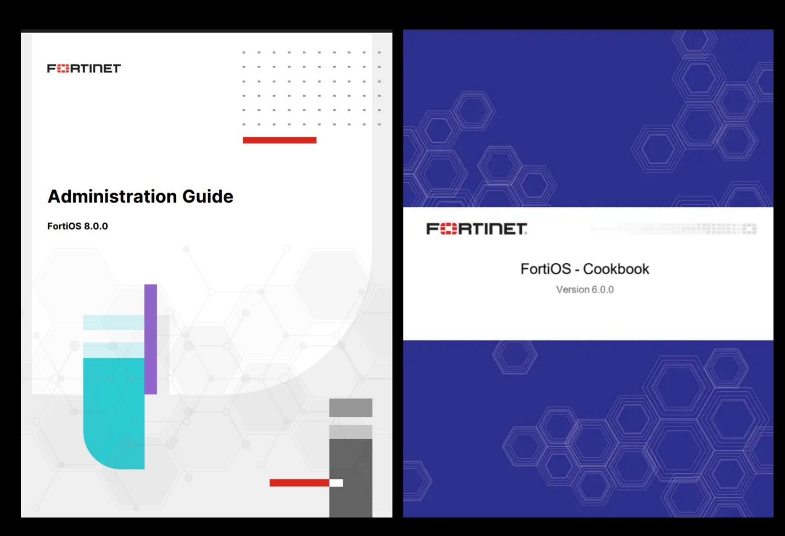

# FortiGate NSE4 Practical Lab & Documentation

A complete hands-on FortiGate learning repository based on FortiOS concepts, NSE4 topics, and real-world enterprise scenarios.

# About This Project

این پروژه یک مرجع جامع آموزشی و عملی برای یادگیری **FortiGate** و **FortiOS** است که با هدف ایجاد یک مسیر کامل از یادگیری مفاهیم پایه تا پیاده‌سازی سناریوهای واقعی شبکه و امنیت طراحی شده است.

برخلاف منابعی که فقط بر روی مباحث تئوری یا آمادگی آزمون تمرکز دارند، این Repository تلاش می‌کند ارتباط بین **دانش مفهومی، طراحی شبکه، پیاده‌سازی عملی و عیب‌یابی در محیط واقعی** را برقرار کند.

در این پروژه ابتدا معماری داخلی FortiGate، نحوه عملکرد FortiOS، ساختار پردازش Traffic، مفاهیم Firewall، Routing، NAT، VPN، Security Profileها و سایر قابلیت‌های اصلی بررسی می‌شوند.

پس از یادگیری مفاهیم، همان موضوعات در قالب سناریوهای عملی در محیط Lab پیاده‌سازی می‌شوند تا کاربر بتواند فرآیند واقعی طراحی، تنظیم، تست و Troubleshooting یک FortiGate را تجربه کند.

# Project Philosophy

هدف اصلی این پروژه فقط آمادگی برای آزمون **NSE4** نیست؛ بلکه ایجاد یک مسیر یادگیری کاربردی برای افرادی است که قصد دارند مهارت‌های لازم برای کار با تجهیزات امنیت شبکه Fortinet را در محیط‌های سازمانی به دست آورند.

ساختار پروژه بر اساس یک روش یادگیری مرحله‌ای طراحی شده است:

1. ابتدا مفاهیم پایه و معماری FortiGate یاد گرفته می‌شوند.
2. سپس قابلیت‌های مختلف FortiOS به‌صورت تئوری بررسی می‌شوند.
3. در ادامه هر مفهوم در قالب یک سناریوی عملی پیاده‌سازی می‌شود.
4. در نهایت فرآیند Monitoring و Troubleshooting برای تحلیل مشکلات بررسی می‌شود.

این روش باعث می‌شود کاربر فقط با نحوه تنظیم یک قابلیت آشنا نشود، بلکه دلیل استفاده، نحوه عملکرد و جایگاه آن در معماری شبکه را نیز درک کند.

---

# Project Contents

این Repository شامل دو بخش اصلی است:

1. **Theory & Documentation**
   
   شامل مستندات آموزشی و مفهومی FortiGate که تمام قابلیت‌های اصلی FortiOS را پوشش می‌دهد.

2. **Hands-on Labs**
   
   شامل سناریوهای عملی که در محیط آزمایشگاهی پیاده‌سازی، تست و مستندسازی شده‌اند.

ارتباط بین این دو بخش باعث می‌شود هر مفهوم تئوری بلافاصله در یک محیط عملی بررسی شود و دانش ایجاد شده به مهارت قابل استفاده در محیط کاری تبدیل شود.

  
---

<b>📖 Theory & Documentation (00-Review-Concept)</b>
 

🔽 برای مشاهده جزئیات کلیک کنید

 

این بخش شامل مستندات آموزشی و مفهومی FortiGate است.

در این قسمت معماری، قابلیت‌ها و مفاهیم اصلی FortiOS قبل از ورود به سناریوهای عملی بررسی می‌شوند.

هدف این بخش:

- درک معماری داخلی FortiGate
- شناخت نحوه پردازش Packet و Traffic
- یادگیری مفاهیم Firewall
- آشنایی با Routing و NAT
- شناخت Security Profileها
- درک VPN، HA، SD-WAN و سایر قابلیت‌های FortiGate

محتوای این بخش شامل ۲۰ فصل اصلی است:

- Fortinet & FortiGate Fundamentals
- Deployment & Initial Setup
- Routing
- Firewall
- NAT
- Authentication
- VPN
- SD-WAN
- Security Profiles
- High Availability
- Logging & Monitoring
- Security Fabric
- Switching
- Wireless
- Web Proxy
- Certificates
- VDOM
- Traffic Shaping & QoS
- Automation
- Troubleshooting

➡️ [مشاهده Documentation](./Lab00-Review-Concept/README.md)

 

 

<b>🧪 Hands-on Labs (Practical Scenarios)</b>
 

🔽 برای مشاهده سناریوهای عملی کلیک کنید

 

این بخش شامل سناریوهای عملی پیاده‌سازی شده در محیط Lab است.

تمامی سناریوهای این بخش توسط پیاده‌سازی واقعی در محیط آزمایشگاهی انجام شده‌اند و هدف آن‌ها تبدیل دانش تئوری به تجربه عملی است.

هر سناریو شامل:

- طراحی توپولوژی
- معرفی تجهیزات مورد نیاز
- آدرس‌دهی شبکه
- تنظیمات FortiGate
- مراحل اجرای سناریو
- بررسی نتیجه
- تست عملکرد
- مستندسازی کامل مراحل

سناریوهای عملی پروژه:

| شماره | سناریو |
|---|---|
| [Lab01](./Lab01-Initial-Setup/) | Initial Setup |
| [Lab02](./Lab02-Firewall-Policy/) | Firewall Policy |
| [Lab03](./Lab03-Routing/) | Routing |
| [Lab04](./Lab04-NAT-and-VIP/) | NAT and VIP |
| [Lab05](./Lab05-User-Authentication/) | User Authentication |
| [Lab06](./Lab06-VPN-Remote%20Accesc/) | VPN Remote Access |
| [Lab07](./Lab07-IPS,%20Antivirus,%20Application%20Control%20and%20Web%20Filtering/) | IPS, Antivirus, Application Control and Web Filtering |
| [Lab08](./Lab08-Routing,SD-WAN%20and%20Dynamic%20Routing/) | Routing, SD-WAN and Dynamic Routing |
| [Lab09](./Lab09-FortiGate%20High%20Availability/) | FortiGate High Availability |
| [Lab10](./Lab10-IPsec%20Site-to-Site%20VPN/) | IPsec Site-to-Site VPN |
| [Lab11](./Lab11-%20Logging,Monitoring/) | Logging & Monitoring |

➡️ [مشاهده Hands-on Labs](./Lab01-Initial-Setup/README.md)

 

---

# Environment

سناریوهای این پروژه در محیط Lab پیاده‌سازی شده‌اند.

محیط مورد استفاده:

- EVE-NG
- VMware
- FortiGate VM
- Windows Server
- Windows Client
- Ubuntu Server
- Kali Linux

---

# Goal

هدف نهایی این پروژه ایجاد یک مرجع عملی و آموزشی برای FortiGate است که کاربر بتواند:

- مفاهیم FortiOS را یاد بگیرد.
- معماری FortiGate را درک کند.
- سناریوهای واقعی سازمانی را پیاده‌سازی کند.
- مشکلات شبکه را تحلیل و عیب‌یابی کند.
- برای مسیر شغلی Network Security آماده شود.

    

---

# References & Learning Resources

محتوای این Repository بر اساس مستندات رسمی **Fortinet**، راهنماهای آموزشی، Study Guideهای رسمی و Best Practiceهای منتشرشده توسط Fortinet تهیه شده است.

اگر قصد دارید مفاهیم را عمیق‌تر مطالعه کنید یا به جزئیات بیشتری دسترسی داشته باشید، منابع زیر بهترین نقطه شروع خواهند بود.

## Official Fortinet Documentation

- 📘 FortiOS Administration Guide
  > جامع‌ترین مرجع برای مدیریت، پیکربندی و قابلیت‌های FortiOS.

- 📘 FortiOS CLI Reference
  > مرجع کامل تمامی دستورات CLI در FortiOS.

- 📘 FortiOS New Features Guide
  > معرفی قابلیت‌های جدید هر نسخه از FortiOS.

- 📘 FortiOS Release Notes
  > تغییرات، رفع اشکال‌ها، محدودیت‌ها و نکات مربوط به هر نسخه.

---

## Best Practices & Design Guides

- 📗 FortiGate Best Practices Guide
- 📗 FortiGate Security Rating Guide
- 📗 FortiGate Hardening Guide
- 📗 FortiGate Cookbook
  > مجموعه‌ای از سناریوهای عملی و نمونه پیاده‌سازی‌های FortiGate.

## Official Documentation Portal

تمامی مستندات رسمی، راهنماها، Release Notes و Study Guideهای منتشرشده توسط Fortinet از طریق پورتال مستندات رسمی در دسترس هستند.

➡️ https://docs.fortinet.com

---
